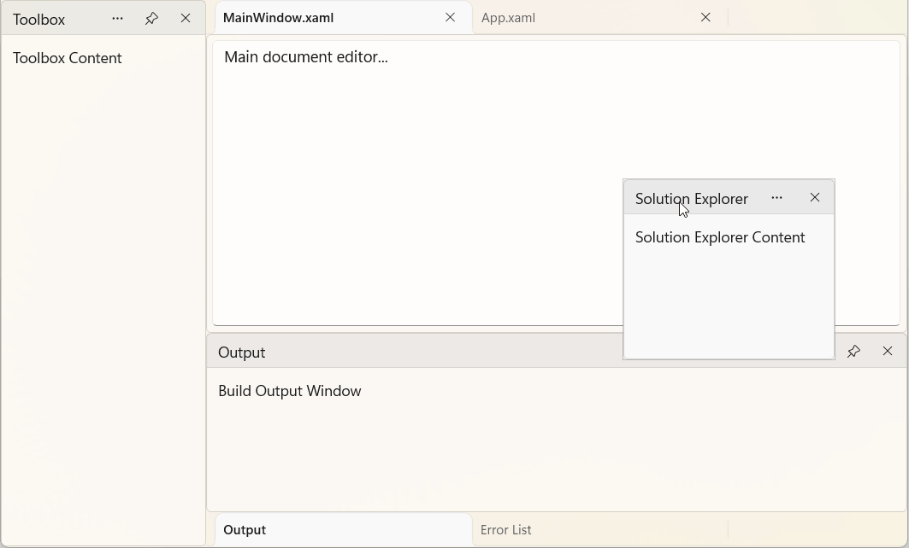
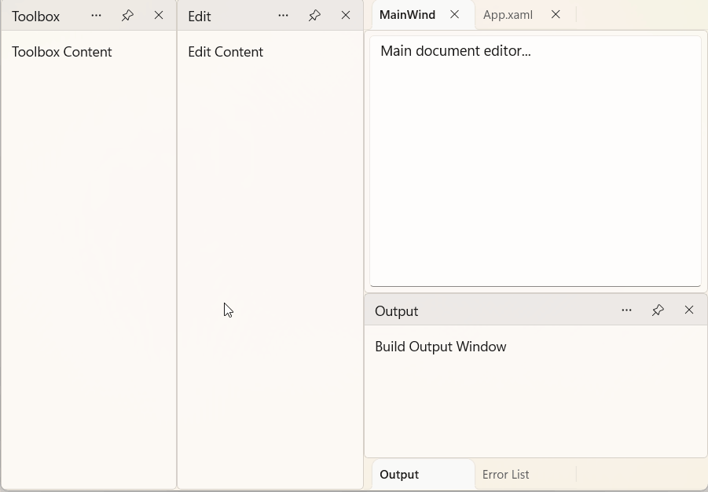
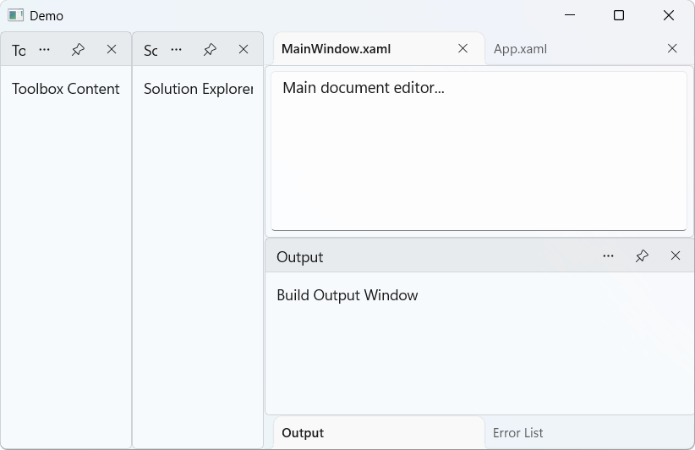
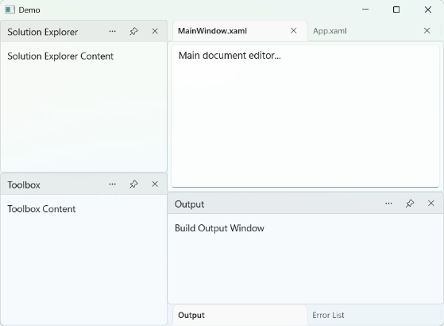

# Layout Management in WinUI DockingManager

The DockingManager control provides several layout management features that help organize application content efficiently. Panes can be positioned declaratively in XAML, arranged programmatically, moved through drag-and-drop interactions, and resized to suit different workflows.

## Place Panes Using XAML

You can define the initial position and state of panes directly in XAML by setting the `DockDirection` and `DockState` properties.



<Grid>
    <docking:SfDockingManager>

        <docking:DockPane Header="Toolbox"
                          DockDirection="Left"
                          DockState="Docked">
            <TextBlock Text="Toolbox Content"/>
        </docking:DockPane>

        <docking:DockPane Header="Solution Explorer"
                          DockDirection="Right"
                          DockState="Docked">
            <TextBlock Text="Solution Explorer Content"/>
        </docking:DockPane>

        <docking:DockPane Header="MainWindow.xaml"
                          DockState="Document">
            <TextBox Text="Main document editor..."
                     AcceptsReturn="True"/>
        </docking:DockPane>

    </docking:SfDockingManager>
</Grid>



## Place Panes Programmatically

You can create and arrange panes dynamically at runtime using the DockingManager APIs.



DockPane toolboxPane = new DockPane()
{
    Header = "Toolbox",
    DockDirection = DockDirection.Left,
    DockState = DockState.Docked
};

DockPane solutionExplorerPane = new DockPane()
{
    Header = "Solution Explorer",
    DockDirection = DockDirection.Right,
    DockState = DockState.Docked
};

DockPane documentPane = new DockPane()
{
    Header = "MainWindow.xaml",
    DockState = DockState.Document
};

dockingManager.Panes.Add(toolboxPane);
dockingManager.Panes.Add(solutionExplorerPane);
dockingManager.Panes.Add(documentPane);



## Drag-and-Drop Docking with Dock Indicators

Users can rearrange panes at runtime through drag-and-drop interactions. Panes can be moved between docking regions, converted into floating windows, or grouped as tabs.

During a drag operation, dock indicators provide visual feedback by displaying valid docking targets around the layout and document area. These indicators help users place panes in the desired region. Dropping a pane onto a docking target docks it to the corresponding position.



<Grid>
    <docking:SfDockingManager x:Name="dockingmanager">
        <!-- Left Docked -->
        <docking:DockPane x:Name="ToolBoxPane"
            Header="Toolbox"
            DockDirection="Left"
            DockState="Docked">
            <TextBlock Text="Toolbox Content" Margin="10"/>
        </docking:DockPane>
        <!-- Right Docked -->
        <docking:DockPane x:Name="SolutionExplorerPane"
            Header="Solution Explorer"
            DockDirection="Right"
            DockState="Docked">
            <TextBlock Text="Solution Explorer Content" Margin="10"/>
        </docking:DockPane>
        <!-- Bottom Docked -->
        <docking:DockPane x:Name="OutputPane"
            Header="Output"
            DockDirection="Bottom"
            DockState="Docked">
            <TextBlock Text="Build Output Window" Margin="10"/>
        </docking:DockPane>
        <!-- Document Window -->
        <docking:DockPane x:Name="Document1"
            Header="MainWindow.xaml"
            DockState="Document">
            <TextBox AcceptsReturn="True"
        Text="Main document editor..."
        Margin="5"/>
        </docking:DockPane>
        <!-- Another Document Window -->
        <docking:DockPane x:Name="Document2"
            Header="App.xaml"
            DockState="Document">
            <TextBox AcceptsReturn="True"
        Text="Another document..."
        Margin="5"/>
        </docking:DockPane>
        <!-- Tabbed with Output -->
        <docking:DockPane x:Name="ErrorListPane"
            Header="Error List" DockState="Tabbed" TargetNameInTabbedState="OutputPane"
            >
            <TextBlock Text="Error List Content" Margin="10"/>
        </docking:DockPane>
    </docking:SfDockingManager>
</Grid>




DockPane toolBoxPane = new DockPane()
{
    Header = "Toolbox",
    DockDirection = DockDirection.Left,
    DockState = DockState.Docked,
    Content = new TextBlock()
    {
        Text = "Toolbox Content"
    }
};
DockPane SolutionExplorerPane = new DockPane()
{
    Header = "Solution Explorer",
    DockDirection = DockDirection.Right,
    DockState = DockState.Docked,
    Content = new TextBlock()
    {
        Text = "Solution Explorer Content"
    }
};
DockPane OutputPane = new DockPane()
{
    Header = "Output",
    DockDirection = DockDirection.Bottom,
    DockState = DockState.Docked,
    Content = new TextBlock()
    {
        Text = "Output Content"
    }
};
DockPane documentPane = new DockPane()
{
    Header = "App.xaml",
    DockDirection = DockDirection.Left,
    DockState = DockState.Docked,
    Content = new TextBlock()
    {
        Text = "App.xaml Content"
    }
};

dockingManager.Panes.Add(toolBoxPane);
dockingManager.Panes.Add(SolutionExplorerPane);
dockingManager.Panes.Add(OutputPane);
dockingManager.Panes.Add(documentPane);




## Layout Resizing

The DockingManager control allows users to resize docked regions interactively at runtime. Splitters are automatically displayed between adjacent docked panes, enabling users to allocate more space to frequently used windows while maintaining access to other panes.

The following example creates multiple docked panes and a document window. Users can resize the docking regions by dragging the splitters between adjacent panes.




<Grid>
    <docking:SfDockingManager>

        <docking:DockPane Header="Toolbox"
                          DockDirection="Left"
                          DockState="Docked">
            <TextBlock Text="Toolbox Content"/>
        </docking:DockPane>

        <docking:DockPane Header="Edit"
                          DockDirection="Left"
                          DockState="Docked">
            <TextBlock Text="Edit Content"/>
        </docking:DockPane>

        <docking:DockPane Header="MainWindow.xaml"
                          DockState="Document">
            <TextBox Text="Main document editor..."
                     AcceptsReturn="True"/>
        </docking:DockPane>

        <docking:DockPane Header="App.xaml"
                          DockState="Document">
            <TextBox Text="Another document editor..."
                     AcceptsReturn="True"/>
        </docking:DockPane>

        <docking:DockPane x:Name="OutputPane" Header="Output"
                          DockDirection="Bottom"
                          DockState="Docked">
            <TextBlock Text="Build Output Window"/>
        </docking:DockPane>

        <docking:DockPane Header="ErrorList"
                          DockDirection="Right"
                          DockState="Docked" TargetNameInTabbedState="OutputPane">
            <TextBlock Text="ErrorList Window"/>
        </docking:DockPane>

    </docking:SfDockingManager>
</Grid>





DockPane toolboxPane = new DockPane()
{
    Header = "Toolbox",
    DockDirection = DockDirection.Left,
    DockState = DockState.Docked
};

DockPane editPane = new DockPane()
{
    Header = "Edit",
    DockDirection = DockDirection.Right,
    DockState = DockState.Docked
};

DockPane documentPane1 = new DockPane()
{
    Header = "MainWindow.xaml",
    DockState = DockState.Document
};
DockPane documentPane2 = new DockPane()
{
    Header = "App.xaml",
    DockState = DockState.Document
};

DockPane outputPane = new DockPane()
{
    Header = "Output",
    DockDirection = DockDirection.Bottom,
    DockState = DockState.Docked
};
DockPane errorListPane = new DockPane()
{
    Header = "ErrorList",
    DockDirection = DockDirection.Bottom,
    DockState = DockState.Docked,
    DockDirection = DockDirection.Right,
    TargetNameInTabbedState="outputPane"
};
dockingManager.Panes.Add(toolboxPane);
dockingManager.Panes.Add(editPane);
dockingManager.Panes.Add(documentPane1);
dockingManager.Panes.Add(documentPane2);
dockingManager.Panes.Add(outputPane);
dockingManager.Panes.Add(errorListPane);




## Create Split Layouts

Tool windows can be arranged in a split layout, allowing multiple panes to remain visible simultaneously within the same docking region. This helps users view and interact with related content side by side.

Use the `TargetNameInDockedState` property to specify the pane relative to which the current pane should be docked. The position of the pane is determined by the `DockDirection` property, which supports docking to the left, right, top, or bottom of the target pane.

The following example docks the **SolutionExplorer** pane to the **right side** of the **ToolBox** pane.




<Grid>
    <docking:SfDockingManager>

        <docking:DockPane x:Name="ToolBoxPane"
                          Header="ToolBox"
                          DockDirection="Left"
                          DockState="Docked">
            <TextBlock Text="ToolBox Content"/>
        </docking:DockPane>

        <docking:DockPane Header="SolutionExplorer"
                          DockDirection="Right"
                          DockState="Docked"
                          TargetNameInDockedState="ToolBoxPane">
            <TextBlock Text="SolutionExplorer Content"/>
        </docking:DockPane>

    </docking:SfDockingManager>
</Grid>





DockPane ToolBoxPane = new DockPane()
{
    Header = "ToolBox",
    DockDirection = DockDirection.Left,
    DockState = DockState.Docked
};

DockPane SolutionExplorerPane = new DockPane()
{
    Header = "SolutionExplorer",
    DockDirection = DockDirection.Right,
    DockState = DockState.Docked,
    TargetNameInTabbedState = "ToolBoxPane"
};

dockingManager.Panes.Add(ToolBoxPane);
dockingManager.Panes.Add(SolutionExplorerPane);




The following example docks the **SolutionExplorer** pane to the **top side** of the **ToolBox** pane.




<Grid>
    <docking:SfDockingManager>

        <docking:DockPane x:Name="ToolBoxPane"
                          Header="ToolBox"
                          DockDirection="Left"
                          DockState="Docked">
            <TextBlock Text="ToolBox Content"/>
        </docking:DockPane>

        <docking:DockPane Header="SolutionExplorer"
                          DockDirection="Top"
                          DockState="Docked"
                          TargetNameInDockedState="ToolBoxPane">
            <TextBlock Text="SolutionExplorer Content"/>
        </docking:DockPane>

    </docking:SfDockingManager>
</Grid>





DockPane ToolBoxPane = new DockPane()
{
    Header = "ToolBox",
    DockDirection = DockDirection.Left,
    DockState = DockState.Docked
};

DockPane SolutionExplorerPane = new DockPane()
{
    Header = "SolutionExplorer",
    DockDirection = DockDirection.Top,
    DockState = DockState.Docked,
    TargetNameInTabbedState = "ToolBoxPane"
};

dockingManager.Panes.Add(ToolBoxPane);
dockingManager.Panes.Add(SolutionExplorerPane);




