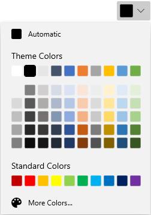
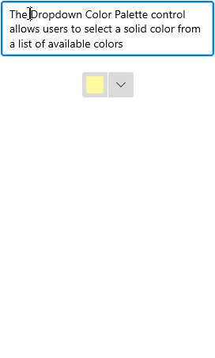
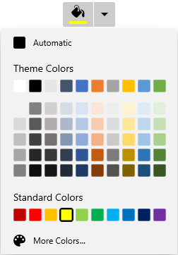

# Dropdown Customization in WinUI DropDown Color Palette

This section describes the various dropdown customization options available in [WinUI DropDown Color Palette](https://www.syncfusion.com/winui-controls/dropdown-color-palette) control.

## Change dropdown alignment

You can change the alignment of the dropdown palette to full, center, left, right, top or bottom relative to the edge of the dropdown header by using the [DropDownPlacement](https://help.syncfusion.com/cr/winUI/Syncfusion.UI.Xaml.Editors.SfDropDownBase.html#Syncfusion_UI_Xaml_Editors_SfDropDownBase_DropDownPlacement) property. The default value of `DropDownPlacement` property is `Auto`. The supported values are the members of the [FlyoutPlacementMode](https://docs.microsoft.com/en-us/uwp/api/windows.ui.xaml.controls.primitives.flyoutplacementmode) enumeration, such as `Top`, `Bottom`, `Left`, `Right`, `TopEdgeAlignedLeft`, `TopEdgeAlignedRight`, `BottomEdgeAlignedLeft`, `BottomEdgeAlignedRight`, `RightEdgeAlignedTop`, `RightEdgeAlignedBottom`, `LeftEdgeAlignedTop`, `LeftEdgeAlignedBottom`, and `Full`.

N> If there is not enough space to open the dropdown in the specific position assigned by the `DropDownPlacement` property, the `DropDown Color Palette` will automatically choose the available position to open the dropdown palette.




<editors:SfDropDownColorPalette DropDownPlacement="BottomEdgeAlignedRight" 
                                Name="sfDropDownColorPalette"/>




sfDropDownColorPalette.DropDownPlacement = FlyoutPlacementMode.BottomEdgeAlignedRight;




N> Download demo application from [GitHub](https://github.com/SyncfusionExamples/syncfusion-winui-colorpalette-examples/blob/master/Samples/DropDown_ColorPalette)

## Color Palette as a command button

By default, the `DropDown Color Palette` acts like a dropdown. It opens a color palette when clicking anywhere on the header. By setting the [DropDownMode](https://help.syncfusion.com/cr/winUI/Syncfusion.UI.Xaml.Editors.SfDropDownBase.html#Syncfusion_UI_Xaml_Editors_SfDropDownBase_DropDownMode) property value to `Split`, it acts like a button and dropdown as explained below.

1. When you click the dropdown arrow button, it acts like a dropdown.

2. When you click the header area, it acts like a button and the [Command](https://help.syncfusion.com/cr/winUI/Syncfusion.UI.Xaml.Editors.SfDropDownColorPalette.html#Syncfusion_UI_Xaml_Editors_SfDropDownColorPalette_Command) will be triggered. Using the `Command`, you can perform an action such as applying the selected color anywhere you want. The value passed to the command handler is the value of the `CommandParameter` property (which is `null` by default).

For example, if you want to apply the last selected color as a background to a `RichEditBox`'s selected text, you can directly click the button instead of opening the dropdown and selecting an already selected color again.

The following example uses the `DelegateCommand<T>` helper. If you do not have a `DelegateCommand` implementation available, you can use any `ICommand` implementation from a library such as `Microsoft.Xaml.Interactivity` or define your own.




using System.Windows.Input;
// Add the appropriate using for the DelegateCommand<T> you are using.

public sealed partial class MainPage : Page
{
    private ICommand selectionChangedCommand;
    public ICommand SelectionChangedCommand {
        get {
            return selectionChangedCommand;
        }
    }
    public void SelectionChangedMethod(object param) {
        if (sfDropDownColorPalette.SelectedBrush is SolidColorBrush solidColorBrush) {
            richTextBox.Document.Selection.CharacterFormat.BackgroundColor = solidColorBrush.Color;
        }
    }
    public MainPage() {
        this.InitializeComponent();
        selectionChangedCommand = new DelegateCommand<object>(SelectionChangedMethod);
    }
}







<StackPanel Orientation="Vertical">

    <RichEditBox  Name="richTextBox" Margin="20"/>
   
    <editors:SfDropDownColorPalette DropDownMode="Split"
                                    Command="{x:Bind SelectionChangedCommand}"
                                    Name="sfDropDownColorPalette" />
</StackPanel>




N> The `Command` handler applies the color to the currently selected text in the `RichEditBox`. If no text is selected, the color is applied to the next text typed at the caret position.

N> Download demo application from [GitHub](https://github.com/SyncfusionExamples/syncfusion-winui-colorpalette-examples/blob/master/Samples/DropDownColorPalette_as_command)

## Custom UI of dropdown header

You can customize the appearance of the `DropDown Color Palette` header in both split mode and dropdown mode. You can customize the selected color button using the [ContentTemplate](https://help.syncfusion.com/cr/winUI/Syncfusion.UI.Xaml.Editors.SfDropDownBase.html#Syncfusion_UI_Xaml_Editors_SfDropDownBase_ContentTemplate) property and customize the dropdown button by using the [DropDownButtonTemplate](https://help.syncfusion.com/cr/winUI/Syncfusion.UI.Xaml.Editors.SfDropDownBase.html#Syncfusion_UI_Xaml_Editors_SfDropDownBase_DropDownButtonTemplate) property. The default `DropDownMode` is `DropDown`.

N> The `DataContext` of the `DropDownButtonTemplate` property and `ContentTemplate` property is `SfDropDownColorPalette`. In the example below, the `{Binding}` in the `ContentTemplate` resolves to the `SelectedBrush` of the control.

N> The `DropDownButtonTemplate` is effective only when the dropdown mode is split mode.




<editors:SfDropDownColorPalette DropDownMode="Split"                   
                                Name="sfDropDownColorPalette">
    
    <!--Custom UI for DropDown button-->
    <editors:SfDropDownColorPalette.DropDownButtonTemplate>
        <DataTemplate>
            <Grid>
                <StackPanel Width="30">
                    <Grid VerticalAlignment="Center"
                          HorizontalAlignment="Center">
                        <Path Fill="Black" 
                              Data="M 0 0 L 5 5 L 10 0 Z"/>
                    </Grid>
                </StackPanel>
            </Grid>
        </DataTemplate>
    </editors:SfDropDownColorPalette.DropDownButtonTemplate>

    <!--Custom UI for Selected color button-->
    <editors:SfDropDownColorPalette.ContentTemplate>
        <DataTemplate>
            <StackPanel Height="30" 
                        Orientation="Vertical">
                <Path Data="M22.078048,10.524087C22.078048,10.524087,31.99999,12.1271,31.99999,19.644161L31.99999,27.061223C31.99999,33.475275 25.987026,29.266241 25.987026,25.55721 25.987026,20.64617 30.397001,18.842155 28.392012,16.838139z M12.757101,0C17.367075,0,20.073059,6.5150537,20.174059,11.325093L20.174059,11.626096 20.374058,11.826097C22.178047,13.631112 24.483034,15.936131 25.28503,16.737138 26.588022,18.040148 25.686028,19.544161 25.18503,20.045165 24.583034,20.64617 14.160093,31.070255 14.160093,31.070255 12.9571,32.272265 8.9481231,30.067247 5.1401448,26.259216 1.3311667,22.450185 -0.8738203,18.341151 0.32917213,17.239142L11.354109,6.2140512C11.354109,6.2140512 12.055105,5.5120449 13.0581,5.5120449 13.559097,5.5120449 14.160093,5.713047 14.76109,6.3140526L15.964083,7.6170626C16.666079,9.8220806 16.165082,11.626096 15.864083,12.528103 15.263087,12.929107 14.862089,13.631112 14.862089,14.332118 14.862089,15.535128 15.864083,16.537136 17.067077,16.537136 18.26907,16.537136 19.272064,15.535128 19.272064,14.332118 19.272064,13.530111 18.871066,12.929107 18.26907,12.528103 18.37007,12.027099 18.37007,11.025091 18.16907,9.7220802 18.16907,9.7220802 18.37007,9.9220819 18.770067,10.323085L18.770067,10.123083C18.26907,6.0130501 15.964083,1.3030109 12.657102,1.3030109 8.6481248,1.3030109 7.7461299,5.4120445 7.74613,6.9150572L6.5431371,6.9150572C6.5431368,4.2090359,8.2471271,0,12.757101,0z" 
                      Stretch="Uniform"
                      Fill="Black" 
                      Width="20" Height="20" 
                      RenderTransformOrigin="0.5,0.5"/>
                <Border Margin="5" 
                        Background="{Binding}"
                        Grid.Row="1"
                        Width="25"
                        Height="7">
                </Border>
            </StackPanel>
        </DataTemplate>
    </editors:SfDropDownColorPalette.ContentTemplate> 
</editors:SfDropDownColorPalette>




N> Download demo application from [GitHub](https://github.com/SyncfusionExamples/syncfusion-winui-colorpalette-examples/blob/master/Samples/DropDownColorPalette_as_command)

## Dropdown Color Palette open and close notifications

You will be notified when the dropdown is opened and closed by using the `DropDownOpened` and `DropDownClosed` events.




<editors:SfDropDownColorPalette DropDownOpened="sfDropDownColorPalette_DropDownOpened"
                                DropDownClosed="sfDropDownColorPalette_DropDownClosed"
                                Name="sfDropDownColorPalette" />




sfDropDownColorPalette.DropDownOpened += sfDropDownColorPalette_DropDownOpened;
sfDropDownColorPalette.DropDownClosed += sfDropDownColorPalette_DropDownClosed;




You can handle the events as follows,




//Invoked when the drop down is opened
private void sfDropDownColorPalette_DropDownOpened(object sender, EventArgs e) {
}

//Invoked when the dropdown is closed
private void sfDropDownColorPalette_DropDownClosed(object sender, EventArgs e) {
}



