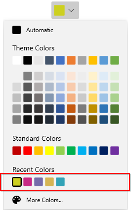

# More Colors Dialog in WinUI DropDown Color Palette

This section describes how to pick additional colors from the More Colors dialog in the [WinUI DropDown Color Palette](https://www.syncfusion.com/winui-controls/dropdown-color-palette) control.

## Choosing a Color from More Colors dialog

The **More Colors...** button is visible by default at the bottom of the dropdown palette. If you want to choose a color that is not available in the theme and standard palette, click the **More Colors...** button and select the color from the color spectrum, then click the **OK** button. The chosen color is applied to the `SelectedBrush` property. Click the **Cancel** button to discard the selection and close the dialog.

The visibility of the **More Colors...** button can be controlled using the `ShowMoreColorsButton` property.




<editors:SfDropDownColorPalette Name="sfDropDownColorPalette"/>




SfDropDownColorPalette sfDropDownColorPalette = new SfDropDownColorPalette();




N> Download demo application from [GitHub](https://github.com/SyncfusionExamples/syncfusion-winui-colorpalette-examples/blob/master/Samples/DropDown_ColorPalette)

## Recently used Colors

If you want to choose a brush that was recently selected from the `More Colors` dialog, use the `Recent Colors` panel.

N> Colors selected from the theme and standard palettes are not added to the recent colors. Only colors picked from the More Colors dialog populate the `Recent Colors` panel.




<editors:SfDropDownColorPalette Name="sfDropDownColorPalette"/>




SfDropDownColorPalette sfDropDownColorPalette = new SfDropDownColorPalette();




