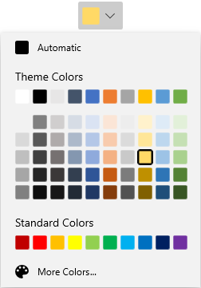

# WinUI DropDown Color Palette Overview

The [WinUI DropDown Color Palette](https://www.syncfusion.com/winui-controls/dropdown-color-palette) control provides a rich visual interface for color selection. The structure of the `DropDown Color Palette` control represents a palette which is displayed as a dropdown with the selected color highlighted at the top. It provides standard colors and various theme colors to choose from. The control also has `ToolTip` support that shows the name of the color. Additional color options are embedded with the control, providing a wide range of color choices through the [More Colors dialog](https://help.syncfusion.com/winui/dropdown-color-palette/more-colors-dialog).

## Key features

* Theme colors and their variants support.
* Standard colors and their variants support.
* Automatic color support.
* Dropdown button split mode option.
* More color selection support.
* [Color palette customization](https://help.syncfusion.com/winui/dropdown-color-palette/customization-of-color-palette) support.
* [Dropdown customization](https://help.syncfusion.com/winui/dropdown-color-palette/dropdown-customization) support.
* `ToolTip` support that shows the color name while hovering over a color item.

## See also

* [Getting Started](https://help.syncfusion.com/winui/dropdown-color-palette/getting-started)
* [More Colors Dialog](https://help.syncfusion.com/winui/dropdown-color-palette/more-colors-dialog)
* [Color Palette customization](https://help.syncfusion.com/winui/dropdown-color-palette/customization-of-color-palette)
* [Dropdown customization](https://help.syncfusion.com/winui/dropdown-color-palette/dropdown-customization)