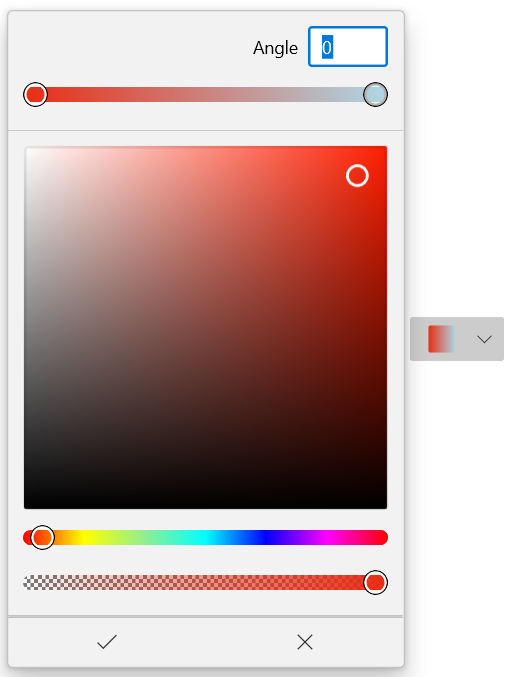

# Customization of Color Picker in WinUI DropDown Color Picker

This section describes about how to customization Color Picker in [WinUI DropDown Color Picker](https://www.syncfusion.com/winui-controls/dropdown-color-picker) control.

## Customize the Color Picker

You can customize the color picker by replacing the default [Color Picker](https://help.syncfusion.com/cr/winUI/Syncfusion.UI.Xaml.Editors.SfColorPicker.html) with your own instance using [DropDownContentTemplate](https://help.syncfusion.com/cr/winUI/Syncfusion.UI.Xaml.Editors.SfDropDownBase.html#Syncfusion_UI_Xaml_Editors_SfDropDownBase_DropDownContentTemplate) property. You can load color picker with solid, linear gradient or gradient brush editors.

N> The `DataContext` of `DropDownContentTemplate` property is [SfDropDownColorPicker.DropDownContent](https://help.syncfusion.com/cr/winUI/Syncfusion.UI.Xaml.Editors.SfDropDownBase.html#Syncfusion_UI_Xaml_Editors_SfDropDownBase_DropDownContent).

N> You can refer the [Color Picker](https://help.syncfusion.com/winui/color-picker/overview) documentation page to know more about all customization available in the `Color Picker` control.




<editors:SfDropDownColorPicker Name="sfDropDownColorPicker">
    <editors:SfDropDownColorPicker.DropDownContentTemplate>
        <DataTemplate>
            <editors:SfColorPicker BrushTypeOptions="LinearGradientBrush"
                                   Width="250" />
        </DataTemplate>
    </editors:SfDropDownColorPicker.DropDownContentTemplate> 
</editors:SfDropDownColorPicker>




N> Download demo application from [GitHub](https://github.com/SyncfusionExamples/syncfusion-winui-colorpicker-examples/tree/master/Samples/DropDownColorPicker_as_command)

## Customizing control in drop down

You can customize the control displayed in drop down of `DropDown Color Picker` by using [AttachedFlyout](https://docs.microsoft.com/en-us/uwp/api/windows.ui.xaml.controls.primitives.flyoutbase.attachedflyout?view=winrt-19041) and [DropDownFlyout](https://help.syncfusion.com/cr/winui/Syncfusion.UI.Xaml.Editors.DropDownFlyout.html#properties) properties. 




<editors:SfDropDownColorPicker Height="35" Width="75">
    <FlyoutBase.AttachedFlyout>
        <editors:DropDownFlyout>
            <editors:SfColorPicker BrushTypeOptions="LinearGradientBrush" BorderThickness="0" >
            </editors:SfColorPicker>
        </editors:DropDownFlyout>
    </FlyoutBase.AttachedFlyout>
</editors:SfDropDownColorPicker>




