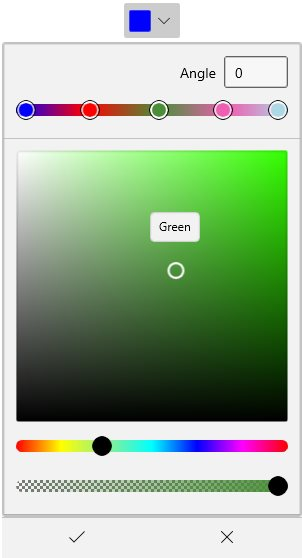

# Customization of Color Picker in WinUI DropDown Color Picker

This section describes how to customize the Color Picker embedded in the [WinUI DropDown Color Picker](https://www.syncfusion.com/winui-controls/dropdown-color-picker) control.

Add the following namespace declaration to your XAML page:




xmlns:editors="using:Syncfusion.UI.Xaml.Editors"




## Customizing the Color Picker inside the DropDown

You can customize the control displayed in the drop-down of the DropDown Color Picker by using the [AttachedFlyout](https://learn.microsoft.com/en-us/windows/windows-app-sdk/api/winrt/microsoft.ui.xaml.controls.primitives.flyoutbase.attachedflyout) and [DropDownFlyout](https://help.syncfusion.com/cr/winui/Syncfusion.UI.Xaml.Editors.DropDownFlyout.html#properties) properties. `AttachedFlyout` lets you attach any flyout to the control, while `DropDownFlyout` is the default flyout used by the DropDown Color Picker.

N> You can refer to the [Color Picker](https://help.syncfusion.com/winui/color-picker/getting-started) documentation page to learn about all the customization options available in the `SfColorPicker` control.




<editors:SfDropDownColorPicker Name="sfDropDownColorPicker">
    <FlyoutBase.AttachedFlyout>
        <editors:DropDownFlyout>
            <editors:SfColorPicker BrushTypeOptions="LinearGradientBrush"
                                   Width="250" />
        </editors:DropDownFlyout>
    </FlyoutBase.AttachedFlyout>        
</editors:SfDropDownColorPicker>




The `BrushTypeOptions` property accepts a bitwise combination of `SolidColorBrush` and `LinearGradientBrush` values; the default is `SolidColorBrush | LinearGradientBrush`.

