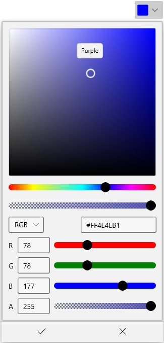

# Dropdown Customization in WinUI DropDown Color Picker

This section describes about various dropdown customization options available in [WinUI DropDown Color Picker](https://www.syncfusion.com/winui-controls/dropdown-color-picker) control.

## Change Dropdown alignment

You can change alignment of the drop down picker as full, center, left, right, top or bottom with edge of the dropdown header by using the [DropDownPlacement](https://help.syncfusion.com/cr/winUI/Syncfusion.UI.Xaml.Editors.SfDropDownBase.html#Syncfusion_UI_Xaml_Editors_SfDropDownBase_DropDownPlacement) property. The default value of `DropDownPlacement` property is `Auto`.

N> If there is no enough space to open a drop down in a specific position that is assigned by `DropDownPlacement` property, then `DropDown Color Picker` will automatically choose the available position to open the drop down picker.




<editors:SfDropDownColorPicker DropDownPlacement="BottomEdgeAlignedRight" 
                               Name="sfDropDownColorPicker"/>




sfDropDownColorPicker.DropDownPlacement = FlyoutPlacementMode.BottomEdgeAlignedRight;;




N> Download demo application from [GitHub](https://github.com/SyncfusionExamples/syncfusion-winui-colorpicker-examples/tree/master/Samples/DropDown_ColorPicker)

## Color Picker as a command button

By default, `DropDown Color Picker` acts like a dropdown. It opening a color picker when clicking anywhere on the header. By setting the [DropDownMode](https://help.syncfusion.com/cr/winUI/Syncfusion.UI.Xaml.Editors.SfDropDownBase.html#Syncfusion_UI_Xaml_Editors_SfDropDownBase_DropDownMode) property value as `Split`, it acts like a button and dropdown as explained below.

1. When clicking on the dropdown arrow button, It acts like a dropdown.

2. When you click on the header area, it acts like a button and [Command](https://help.syncfusion.com/cr/winUI/Syncfusion.UI.Xaml.Editors.SfDropDownColorPicker.html#Syncfusion_UI_Xaml_Editors_SfDropDownColorPicker_Command) will be triggered. Using the `Command`, you can do some action like applying the selected color anywhere you want.

For example, if you want to apply a last selected color as a background to a TextEditor’s selected text. You can direct click the button instead of opening the dropdown and selecting an already selected color again.




public sealed partial class MainPage : Page
{
    private ICommand selectionChangedCommand;
    public ICommand SelectionChangedCommand {
        get {
            return selectionChangedCommand;
        }
    }
    public void SelectionChangedMethod(object param) {
        richTextBox.Document.Selection.CharacterFormat.BackgroundColor
            = (sfDropDownColorPicker.SelectedBrush as SolidColorBrush).Color;

    }
    public MainPage() {
        this.InitializeComponent();
        selectionChangedCommand = new DelegateCommand<object>(SelectionChangedMethod);
    }
}







<StackPanel Orientation="Vertical">

    <RichEditBox  Name="richTextBox" Margin="20"/>
   
    <editors:SfDropDownColorPicker DropDownMode="Split"
                                   Command="{x:Bind SelectionChangedCommand}"
                                   Name="sfDropDownColorPicker" />
</StackPanel>




N> Download demo application from [GitHub](https://github.com/SyncfusionExamples/syncfusion-winui-colorpicker-examples/tree/master/Samples/DropDownColorPicker_as_command)

## Custom UI of Dropdown Header

You can customize the appearance of the `DropDown Color Picker` header in both split mode and dropdown mode. You can customize the selected color button using [ContentTemplate](https://help.syncfusion.com/cr/winUI/Syncfusion.UI.Xaml.Editors.SfDropDownBase.html#Syncfusion_UI_Xaml_Editors_SfDropDownBase_ContentTemplate) property and customize the dropdown button by using the [DropDownButtonTemplate](https://help.syncfusion.com/cr/winUI/Syncfusion.UI.Xaml.Editors.SfDropDownBase.html#Syncfusion_UI_Xaml_Editors_SfDropDownBase_DropDownButtonTemplate) property.

N> The `DataContext` of `DropDownButtonTemplate` property and `ContentTemplate` property is `SfDropDownColorPicker`.

N> The `DropDownButtonTemplate` is effective only on when drop down mode is split mode.




<editors:SfDropDownColorPicker DropDownMode="Split"                   
                               Name="sfDropDownColorPicker">
    
    <!--Custom UI for DropDown button-->
    <editors:SfDropDownColorPicker.DropDownButtonTemplate>
        <DataTemplate>
            <Grid>
                <StackPanel Width="30">
                    <Grid VerticalAlignment="Center"
                          HorizontalAlignment="Center">
                        <Path Fill="Black" 
                              Data="M 0 0 L 5 5 L 10 0 Z"/>
                    </Grid>
                </StackPanel>
            </Grid>
        </DataTemplate>
    </editors:SfDropDownColorPicker.DropDownButtonTemplate>

    <!--Custom UI for Selected color button-->
    <editors:SfDropDownColorPicker.ContentTemplate>
        <DataTemplate>
            <StackPanel Height="30" 
                        Orientation="Vertical">
                <Path Data="M22.078048,10.524087C22.078048,10.524087,31.99999,12.1271,31.99999,19.644161L31.99999,27.061223C31.99999,33.475275 25.987026,29.266241 25.987026,25.55721 25.987026,20.64617 30.397001,18.842155 28.392012,16.838139z M12.757101,0C17.367075,0,20.073059,6.5150537,20.174059,11.325093L20.174059,11.626096 20.374058,11.826097C22.178047,13.631112 24.483034,15.936131 25.28503,16.737138 26.588022,18.040148 25.686028,19.544161 25.18503,20.045165 24.583034,20.64617 14.160093,31.070255 14.160093,31.070255 12.9571,32.272265 8.9481231,30.067247 5.1401448,26.259216 1.3311667,22.450185 -0.8738203,18.341151 0.32917213,17.239142L11.354109,6.2140512C11.354109,6.2140512 12.055105,5.5120449 13.0581,5.5120449 13.559097,5.5120449 14.160093,5.713047 14.76109,6.3140526L15.964083,7.6170626C16.666079,9.8220806 16.165082,11.626096 15.864083,12.528103 15.263087,12.929107 14.862089,13.631112 14.862089,14.332118 14.862089,15.535128 15.864083,16.537136 17.067077,16.537136 18.26907,16.537136 19.272064,15.535128 19.272064,14.332118 19.272064,13.530111 18.871066,12.929107 18.26907,12.528103 18.37007,12.027099 18.37007,11.025091 18.16907,9.7220802 18.16907,9.7220802 18.37007,9.9220819 18.770067,10.323085L18.770067,10.123083C18.26907,6.0130501 15.964083,1.3030109 12.657102,1.3030109 8.6481248,1.3030109 7.7461299,5.4120445 7.74613,6.9150572L6.5431371,6.9150572C6.5431368,4.2090359,8.2471271,0,12.757101,0z" 
                      Stretch="Uniform"                          
                      Fill="Black" 
                      Width="20" Height="18" 
                      RenderTransformOrigin="0.5,0.5"/>
                <Border Margin="5" 
                        Background="{Binding}"
                        Grid.Row="1"
                        Width="25"
                        Height="8">
                </Border>
            </StackPanel>
        </DataTemplate>
    </editors:SfDropDownColorPicker.ContentTemplate>
</editors:SfDropDownColorPicker>




N> Download demo application from [GitHub](https://github.com/SyncfusionExamples/syncfusion-winui-colorpicker-examples/tree/master/Samples/DropDownColorPicker_as_command)

## Dropdown Color Picker Open and Close notification

You can notified when drop-down opened and closed by using the `DropDownOpened` and `DropDownClosed` events.




<editors:SfDropDownColorPicker DropDownOpened="SfDropDownColorPicker_DropDownOpened"
                               DropDownClosed= "SfDropDownColorPicker_DropDownClosed" 
                               Name="sfDropDownColorPicker" />




sfDropDownColorPicker.DropDownOpened += SfDropDownColorPicker_DropDownOpened;
sfDropDownColorPicker.DropDownClosed += SfDropDownColorPicker_DropDownClosed;




You can handle the events as follows,




//Invoked when the drop down is opened
private void SfDropDownColorPicker_DropDownOpened(object sender, EventArgs e) {
}

//Invoked when the drop down is closed
private void SfDropDownColorPicker_DropDownClosed(object sender, EventArgs e) {
}


