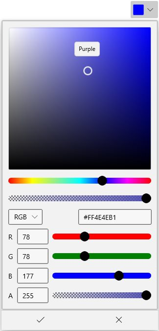
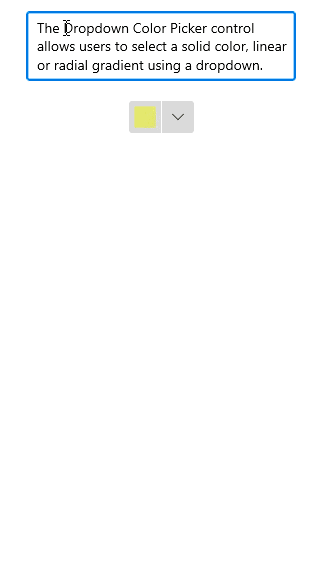
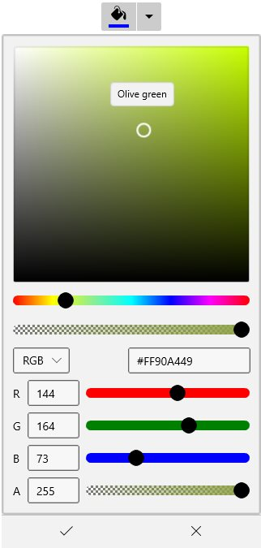

# DropDown Customization in WinUI DropDown Color Picker

This section describes various drop-down customization options available in the [WinUI DropDown Color Picker](https://www.syncfusion.com/winui-controls/dropdown-color-picker) control.

Add the following namespace declaration to your XAML page:




xmlns:editors="using:Syncfusion.UI.Xaml.Editors"




## Change DropDown alignment

You can change the alignment of the drop-down to `Full`, `Center`, `Left`, `Right`, `Top`, or `Bottom` with respect to the edge of the drop-down header by using the [DropDownPlacement](https://help.syncfusion.com/cr/winui/Syncfusion.UI.Xaml.Editors.SfDropDownBase.html#Syncfusion_UI_Xaml_Editors_SfDropDownBase_DropDownPlacement) property. The default value of `DropDownPlacement` is `Auto`.

N> If there is not enough space to open the drop-down in the position specified by `DropDownPlacement`, the DropDown Color Picker automatically chooses an available position.




<editors:SfDropDownColorPicker DropDownPlacement="BottomEdgeAlignedRight"
                               Name="sfDropDownColorPicker"/>




using Windows.UI.Xaml.Controls.Primitives;
using Syncfusion.UI.Xaml.Editors;

sfDropDownColorPicker.DropDownPlacement = FlyoutPlacementMode.BottomEdgeAlignedRight;




N> Download the demo application from [GitHub](https://github.com/SyncfusionExamples/syncfusion-winui-colorpicker-examples/tree/master/Samples/DropDown_ColorPicker) and run it to explore this feature.

## Color Picker as a command button

By default, the DropDown Color Picker acts like a drop-down and opens a color picker when you click anywhere on the header. By setting the [DropDownMode](https://help.syncfusion.com/cr/winui/Syncfusion.UI.Xaml.Editors.SfDropDownBase.html#Syncfusion_UI_Xaml_Editors_SfDropDownBase_DropDownMode) property to `Split`, it acts like both a button and a drop-down:

1. Clicking the drop-down arrow button opens the drop-down.
2. Clicking the header area triggers the [Command](https://help.syncfusion.com/cr/winui/Syncfusion.UI.Xaml.Editors.SfDropDownColorPicker.html#Syncfusion_UI_Xaml_Editors_SfDropDownColorPicker_Command) property. Use the `Command` to perform an action such as applying the currently selected color.

For example, you can apply the last selected color as the background of selected text in a `RichEditBox` by clicking the button instead of opening the drop-down and re-selecting the color. The `DropDownMode` property accepts the values `DropDown` (default) and `Split`.




using System.Windows.Input;
using Microsoft.Practices.Prism.Commands;
using Syncfusion.UI.Xaml.Editors;
using Windows.UI;
using Windows.UI.Xaml.Controls;
using Windows.UI.Xaml.Media;

public sealed partial class MainPage : Page
{
    private ICommand selectionChangedCommand;
    public ICommand SelectionChangedCommand
    {
        get
        {
            return selectionChangedCommand;
        }
    }
    public void SelectionChangedMethod(object param)
    {
        if (richTextBox.Document.Selection.CharacterFormat != null &&
            sfDropDownColorPicker.SelectedBrush is SolidColorBrush solidBrush)
        {
            richTextBox.Document.Selection.CharacterFormat.BackgroundColor = solidBrush.Color;
        }
    }
    public MainPage()
    {
        this.InitializeComponent();
        selectionChangedCommand = new DelegateCommand<object>(SelectionChangedMethod);
    }
}







<StackPanel Orientation="Vertical">

    <RichEditBox Name="richTextBox" Margin="20"/>
   
    <editors:SfDropDownColorPicker DropDownMode="Split"
                                   Command="{x:Bind SelectionChangedCommand}"
                                   Name="sfDropDownColorPicker" />
</StackPanel>




N> Download the demo application from [GitHub](https://github.com/SyncfusionExamples/syncfusion-winui-colorpicker-examples/tree/master/Samples/DropDownColorPicker_as_command) and run it to explore this feature.

## Custom UI of DropDown Header

You can customize the appearance of the DropDown Color Picker header in both split mode and drop-down mode. Customize the selected color button using the [ContentTemplate](https://help.syncfusion.com/cr/winui/Syncfusion.UI.Xaml.Editors.SfDropDownBase.html#Syncfusion_UI_Xaml_Editors_SfDropDownBase_ContentTemplate) property and customize the drop-down button using the [DropDownButtonTemplate](https://help.syncfusion.com/cr/winui/Syncfusion.UI.Xaml.Editors.SfDropDownBase.html#Syncfusion_UI_Xaml_Editors_SfDropDownBase_DropDownButtonTemplate) property.

N> The `DataContext` of both `ContentTemplate` and `DropDownButtonTemplate` is the `SfDropDownColorPicker` instance.

N> `DropDownButtonTemplate` is effective only when `DropDownMode` is `Split`.




<editors:SfDropDownColorPicker DropDownMode="Split"
                               Name="sfDropDownColorPicker">

    <!--Custom UI for DropDown button-->
    <editors:SfDropDownColorPicker.DropDownButtonTemplate>
        <DataTemplate>
            <Grid>
                <StackPanel Width="30">
                    <Grid VerticalAlignment="Center"
                          HorizontalAlignment="Center">
                        <Path Fill="Black"
                              Data="M 0 0 L 5 5 L 10 0 Z"/>
                    </Grid>
                </StackPanel>
            </Grid>
        </DataTemplate>
    </editors:SfDropDownColorPicker.DropDownButtonTemplate>

    <!--Custom UI for Selected color button-->
    <editors:SfDropDownColorPicker.ContentTemplate>
        <DataTemplate>
            <StackPanel Height="30"
                        Orientation="Vertical">
                <Path Data="M22.078048,10.524087C22.078048,10.524087,31.99999,12.1271,31.99999,19.644161L31.99999,27.061223C31.99999,33.475275 25.987026,29.266241 25.987026,25.55721 25.987026,20.64617 30.397001,18.842155 28.392012,16.838139z M12.757101,0C17.367075,0,20.073059,6.5150537,20.174059,11.325093L20.174059,11.626096 20.374058,11.826097C22.178047,13.631112 24.483034,15.936131 25.28503,16.737138 26.588022,18.040148 25.686028,19.544161 25.18503,20.045165 24.583034,20.64617 14.160093,31.070255 14.160093,31.070255 12.9571,32.272265 8.9481231,30.067247 5.1401448,26.259216 1.3311667,22.450185 -0.8738203,18.341151 0.32917213,17.239142L11.354109,6.2140512C11.354109,6.2140512 12.055105,5.5120449 13.0581,5.5120449 13.559097,5.5120449 14.160093,5.713047 14.76109,6.3140526L15.964083,7.6170626C16.666079,9.8220806 16.165082,11.626096 15.864083,12.528103 15.263087,12.929107 14.862089,13.631112 14.862089,14.332118 14.862089,15.535128 15.864083,16.537136 17.067077,16.537136 18.26907,16.537136 19.272064,15.535128 19.272064,14.332118 19.272064,13.530111 18.871066,12.929107 18.26907,12.528103 18.37007,12.027099 18.37007,11.025091 18.16907,9.7220802 18.16907,9.7220802 18.37007,9.9220819 18.770067,10.323085L18.770067,10.123083C18.26907,6.0130501 15.964083,1.3030109 12.657102,1.3030109 8.6481248,1.3030109 7.7461299,5.4120445 7.74613,6.9150572L6.5431371,6.9150572C6.5431368,4.2090359,8.2471271,0,12.757101,0z"
                      Stretch="Uniform"
                      Fill="Black"
                      Width="20" Height="18"
                      RenderTransformOrigin="0.5,0.5"/>
                <Border Margin="5"
                        Background="{Binding}"
                        Grid.Row="1"
                        Width="25"
                        Height="8">
                </Border>
            </StackPanel>
        </DataTemplate>
    </editors:SfDropDownColorPicker.ContentTemplate>
</editors:SfDropDownColorPicker>




N> Download the demo application from [GitHub](https://github.com/SyncfusionExamples/syncfusion-winui-colorpicker-examples/tree/master/Samples/DropDownColorPicker_as_command) and run it to explore this feature.

## DropDown Color Picker Open and Close notification

You can be notified when the drop-down is opened or closed by handling the `DropDownOpened` and `DropDownClosed` events. The event arguments provide a standard `EventArgs` payload.




<editors:SfDropDownColorPicker DropDownOpened="SfDropDownColorPicker_DropDownOpened"
                               DropDownClosed="SfDropDownColorPicker_DropDownClosed"
                               Name="sfDropDownColorPicker" />




using System;
using Syncfusion.UI.Xaml.Editors;

sfDropDownColorPicker.DropDownOpened += SfDropDownColorPicker_DropDownOpened;
sfDropDownColorPicker.DropDownClosed += SfDropDownColorPicker_DropDownClosed;




You can handle the events as follows,




//Invoked when the drop down is opened
private void SfDropDownColorPicker_DropDownOpened(object sender, EventArgs e) {
}

//Invoked when the drop-down is closed
private void SfDropDownColorPicker_DropDownClosed(object sender, EventArgs e)
{
}


