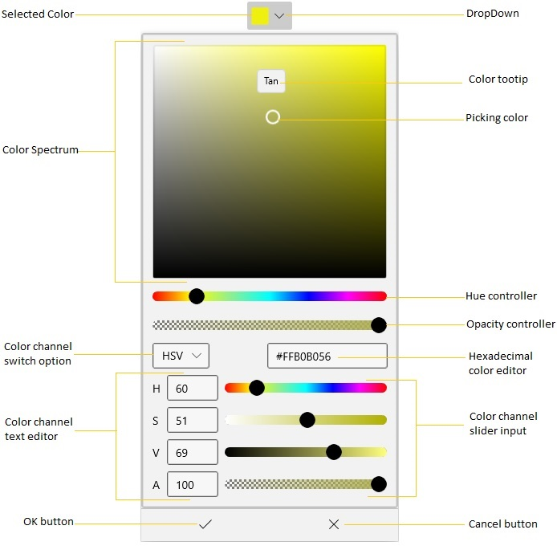

# Getting Started with WinUI DropDown Color Picker

This section explains the steps required to add the [WinUI DropDown Color Picker](https://www.syncfusion.com/winui-controls/dropdown-color-picker) control and its color options such as gradient colors and RGB, HSV , HSL, CMYK and Hexadecimal solid color editors.

## Control Structure

## Creating an application with WinUI DropDown Color Picker

In this walkthrough, you will create a WinUI application that contains the `DropDown Color Picker` control.

## Adding control manually in XAML

To add `DropDown Color Picker` control manually in XAML , follow the below steps.

1. Create a [WinUI 3 desktop app for C# and .NET 5](https://docs.microsoft.com/en-us/windows/apps/winui/winui3/get-started-winui3-for-desktop) or [WinUI 3 app in UWP for C#](https://docs.microsoft.com/en-us/windows/apps/winui/winui3/get-started-winui3-for-uwp).
2. Download and refer the following NuGet in the project.
    * [Syncfusion.Editors.WinUI](https://www.nuget.org/packages/Syncfusion.Editors.WinUI)
3. Import the control namespace `Syncfusion.UI.Xaml.Editors` in XAML or C# code.
4. Initialize the `SfDropDownColorPicker` control.




<Page
    x:Class="GettingStarted.MainPage"
    xmlns="http://schemas.microsoft.com/winfx/2006/xaml/presentation"
    xmlns:x="http://schemas.microsoft.com/winfx/2006/xaml"
    xmlns:local="using:GettingStarted"
    xmlns:d="http://schemas.microsoft.com/expression/blend/2008"
    xmlns:mc="http://schemas.openxmlformats.org/markup-compatibility/2006"
    xmlns:editors="using:Syncfusion.UI.Xaml.Editors"
    mc:Ignorable="d"
    Background="{ThemeResource ApplicationPageBackgroundThemeBrush}">
    <Grid x:Name="grid">
    <editors:SfDropDownColorPicker x:Name="sfDropDownColorPicker" />
    </Grid>
</Page>




## Adding control manually in C#

To add the `DropDown Color Picker` control manually in C#, follow the below steps.

1. Create a [WinUI 3 desktop app for C# and .NET 5](https://docs.microsoft.com/en-us/windows/apps/winui/winui3/get-started-winui3-for-desktop) or [WinUI 3 app in UWP for C#](https://docs.microsoft.com/en-us/windows/apps/winui/winui3/get-started-winui3-for-uwp).
2. Download and refer the following NuGet in the project.
    * [Syncfusion.Editors.WinUI](https://www.nuget.org/packages/Syncfusion.Editors.WinUI)
3. Import the `DropDown Color Picker` namespace `Syncfusion.UI.Xaml.Editors` in C# page.
4. Initialize the `SfDropDownColorPicker` control.




using Syncfusion.UI.Xaml.Editors;

namespace GettingStarted
{
    /// 

    /// An empty page that can be used on its own or navigated to within a Frame.
    /// 

    public sealed partial class MainPage : Page
    {
        public MainPage()
        {
            this.InitializeComponent();
            SfDropDownColorPicker sfDropDownColorPicker = new SfDropDownColorPicker();
            grid.Children.Add(sfDropDownColorPicker);
        }
    }
}



N> Download demo application from [GitHub](https://github.com/SyncfusionExamples/syncfusion-winui-colorpicker-examples/tree/master/Samples/DropDown_ColorPicker)

## Select solid brush programmatically

You can select the solid color brush programmatically by setting the solid color brush value to the [SelectedBrush](https://help.syncfusion.com/cr/winUI/Syncfusion.UI.Xaml.Editors.SfDropDownColorPicker.html#Syncfusion_UI_Xaml_Editors_SfDropDownColorPicker_SelectedBrush) property. The default value of `SelectedBrush` property is `Blue`.




 <editors:SfDropDownColorPicker x:Name="sfDropDownColorPicker"
                                SelectedBrush="Yellow"/>




SfDropDownColorPicker sfDropDownColorPicker = new SfDropDownColorPicker();
colorPicker.SelectedBrush = new SolidColorBrush(Colors.Yellow);




N> Download demo application from [GitHub](https://github.com/SyncfusionExamples/syncfusion-winui-colorpicker-examples/tree/master/Samples/DropDown_ColorPicker)

## Select solid brush interactively

You can select various solid color brush at runtime by selecting the color brush from the color spectrum and clicking `OK` button.




<editors:SfDropDownColorPicker Name="sfDropDownColorPicker"/>




SfDropDownColorPicker sfDropDownColorPicker =  new SfDropDownColorPicker();




N> Download demo application from [GitHub](https://github.com/SyncfusionExamples/syncfusion-winui-colorpicker-examples/tree/master/Samples/DropDown_ColorPicker)

## Switch between solid color channels

You can switch between required RGB, HSV, HSL or CMYK color brush channels by choosing it from the `Combobox` options.




 <editors:SfDropDownColorPicker x:Name="sfDropDownColorPicker"/>




SfDropDownColorPicker sfDropDownColorPicker = new SfDropDownColorPicker();




N> Download demo application from [GitHub](https://github.com/SyncfusionExamples/syncfusion-winui-colorpicker-examples/tree/master/Samples/DropDown_ColorPicker)

## Change opacity of solid brush

You can change opacity of the selected solid color brush by using the A-Alpha value editor or delicate slider in the `DropDown Color Picker`.




<editors:SfDropDownColorPicker Name="SfDropDownColorPicker">




SfDropDownColorPicker sfDropDownColorPicker  new SfDropDownColorPicker();




N> Download demo application from [GitHub](https://github.com/SyncfusionExamples/syncfusion-winui-colorpicker-examples/tree/master/Samples/DropDown_ColorPicker)

## Hexadecimal editor

You can select a solid color brush by entering the hexadecimal color value to the hexadecimal value editor. You can also get the selected color hexadecimal value by using the hexadecimal value editor.




<editors:SfDropDownColorPicker Name="sfDropDownColorPicker">




SfDropDownColorPicker sfDropDownColorPicker  new SfDropDownColorPicker();




N> Download demo application from [GitHub](https://github.com/SyncfusionExamples/syncfusion-winui-colorpicker-examples/tree/master/Samples/DropDown_ColorPicker)

## Selected brush changed notification

The selected brush changed in `DropDown Color Picker` can be examined by using [SelectedBrushChanged](https://help.syncfusion.com/cr/winUI/Syncfusion.UI.Xaml.Editors.SfDropDownColorPicker.html#Syncfusion_UI_Xaml_Editors_SfDropDownColorPicker_SelectedBrushChanged) events. You can get the old and newly selected brush by using the [OldBrush](https://help.syncfusion.com/cr/winUI/Syncfusion.UI.Xaml.Editors.SelectedBrushChangedEventArgs.html) and [NewBrush](https://help.syncfusion.com/cr/winUI/Syncfusion.UI.Xaml.Editors.SelectedBrushChangedEventArgs.html) properties.




<editors:SfDropDownColorPicker SelectedBrushChanged="SfDropDownColorPicker_SelectedBrushChanged"
                               Name="sfDropDownColorPicker">




sfDropDownColorPicker.SelectedBrushChanged += SfDropDownColorPicker_SelectedBrushChanged;




You can handle the event as follows,




private void SfDropDownColorPicker_SelectedBrushChanged(object sender, SelectedBrushChangedEventArgs args) {
    var old_selectedBrush = args.OldBrush;
    var new_selectedBrush = args.NewBrush;
}



