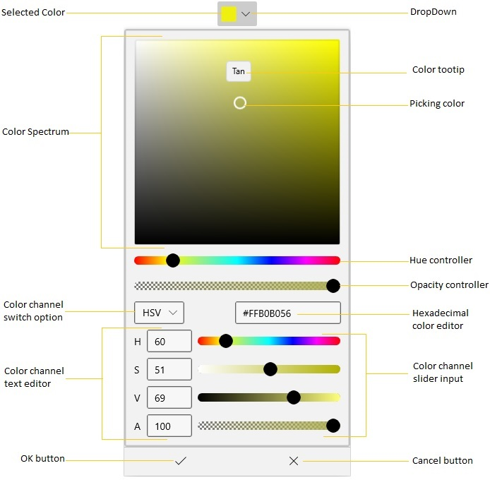
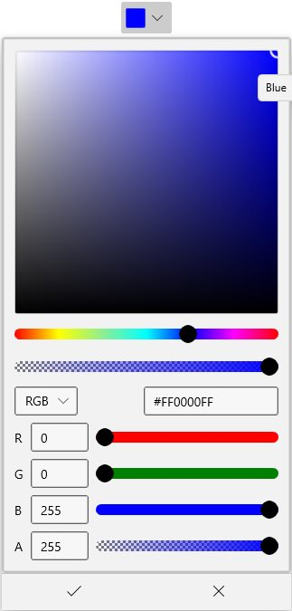
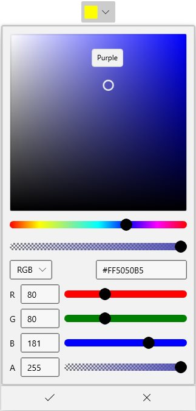
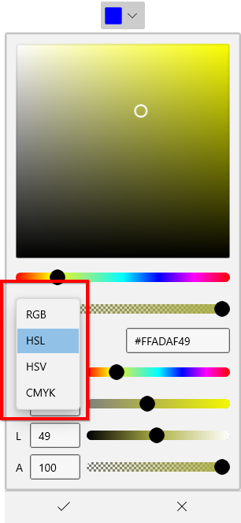
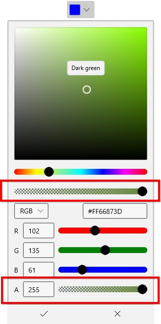
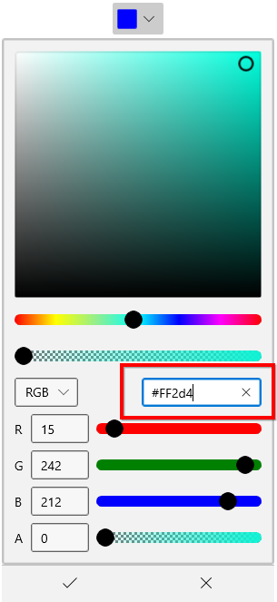

# Getting Started with WinUI DropDown Color Picker

This section explains the steps required to add the [WinUI DropDown Color Picker](https://www.syncfusion.com/winui-controls/dropdown-color-picker) control and use its color options, such as gradient colors and the RGB, HSV, HSL, CMYK, and hexadecimal solid color editors.

## Control Structure

The DropDown Color Picker consists of the following elements:

1. Drop-down header (selected color)
2. Drop-down arrow
3. Color spectrum
4. Hue slider
5. Color channel editors (RGB, HSV, HSL, or CMYK)
6. Hexadecimal value editor
7. Alpha (opacity) editor
8. Color preview and `OK` button

## Creating an application with WinUI DropDown Color Picker

In this walkthrough, you will create a WinUI application that contains the `SfDropDownColorPicker` control.

## Adding the control manually in XAML

To add the DropDown Color Picker control manually in XAML, follow the steps below.

1. Create a [WinUI 3 desktop app for C# and .NET 8](https://learn.microsoft.com/en-us/windows/apps/winui/winui3/create-your-first-winui3-app).
2. Install the following NuGet package in the project:
    * [Syncfusion.Editors.WinUI](https://www.nuget.org/packages/Syncfusion.Editors.WinUI)
3. Import the `Syncfusion.UI.Xaml.Editors` namespace in the XAML page.
4. Initialize the `SfDropDownColorPicker` control.





<Page
    x:Class="GettingStarted.MainPage"
    xmlns="http://schemas.microsoft.com/winfx/2006/xaml/presentation"
    xmlns:x="http://schemas.microsoft.com/winfx/2006/xaml"
    xmlns:local="using:GettingStarted"
    xmlns:d="http://schemas.microsoft.com/expression/blend/2008"
    xmlns:mc="http://schemas.openxmlformats.org/markup-compatibility/2006"
    xmlns:editors="using:Syncfusion.UI.Xaml.Editors"
    mc:Ignorable="d"
    Background="{ThemeResource ApplicationPageBackgroundThemeBrush}">
    <Grid x:Name="grid">
        <editors:SfDropDownColorPicker x:Name="sfDropDownColorPicker" />
    </Grid>
</Page>




{{ codesnippet1 | OrderList_Indent_Level_1 }}

## Adding the control manually in C#

To add the DropDown Color Picker control manually in C#, follow the steps below.

1. Create a [WinUI 3 desktop app for C#](https://learn.microsoft.com/en-us/windows/apps/winui/winui3/create-your-first-winui3-app).
2. Install the following NuGet package in the project:
    * [Syncfusion.Editors.WinUI](https://www.nuget.org/packages/Syncfusion.Editors.WinUI)
3. Import the `Syncfusion.UI.Xaml.Editors` namespace in the C# code file.
4. Initialize the `SfDropDownColorPicker` control.





using Syncfusion.UI.Xaml.Editors;

namespace GettingStarted
{
    /// 

    /// An empty page that can be used on its own or navigated to within a Frame.
    /// 

    public sealed partial class MainPage : Page
    {
        public MainPage()
        {
            this.InitializeComponent();
            SfDropDownColorPicker sfDropDownColorPicker = new SfDropDownColorPicker();
            grid.Children.Add(sfDropDownColorPicker);
        }
    }
}



{{ codesnippet2 | OrderList_Indent_Level_1 }}

N> Download the demo application from [GitHub](https://github.com/SyncfusionExamples/syncfusion-winui-colorpicker-examples/tree/master/Samples/DropDown_ColorPicker) and run it to explore this feature.

## Select solid brush programmatically

You can select a solid color brush programmatically by setting the [SelectedBrush](https://help.syncfusion.com/cr/winui/Syncfusion.UI.Xaml.Editors.SfDropDownColorPicker.html#Syncfusion_UI_Xaml_Editors_SfDropDownColorPicker_SelectedBrush) property. The default value of `SelectedBrush` is a blue `SolidColorBrush`. The `SelectedBrush` property accepts any `Brush`; if a `LinearGradientBrush` is assigned, the gradient editor is opened by default.




<editors:SfDropDownColorPicker x:Name="sfDropDownColorPicker"
                               SelectedBrush="Yellow"/>




using Syncfusion.UI.Xaml.Editors;
using Windows.UI;
using Windows.UI.Xaml.Media;

SfDropDownColorPicker sfDropDownColorPicker = new SfDropDownColorPicker();
sfDropDownColorPicker.SelectedBrush = new SolidColorBrush(Colors.Yellow);




N> Download the demo application from [GitHub](https://github.com/SyncfusionExamples/syncfusion-winui-colorpicker-examples/tree/master/Samples/DropDown_ColorPicker) and run it to explore this feature.

## Select solid brush interactively

You can select various solid color brush at runtime by selecting the color brush from the color spectrum and clicking `OK` button.




<editors:SfDropDownColorPicker Name="sfDropDownColorPicker"/>




SfDropDownColorPicker sfDropDownColorPicker =  new SfDropDownColorPicker();




N> Download the demo application from [GitHub](https://github.com/SyncfusionExamples/syncfusion-winui-colorpicker-examples/tree/master/Samples/DropDown_ColorPicker) and run it to explore this feature.

## Switch between solid color channels

You can switch between the RGB, HSV, HSL, or CMYK color channel modes from the channel combobox in the drop-down. The default channel mode is RGB. Use the `ColorChannelOptions` property to customize the available channel modes or hide the combobox.




<editors:SfDropDownColorPicker x:Name="sfDropDownColorPicker"/>




SfDropDownColorPicker sfDropDownColorPicker = new SfDropDownColorPicker();




N> Download the demo application from [GitHub](https://github.com/SyncfusionExamples/syncfusion-winui-colorpicker-examples/tree/master/Samples/DropDown_ColorPicker) and run it to explore this feature.

## Change opacity of solid brush

You can change the opacity of the selected solid color brush by using the A (alpha) value editor or the dedicated opacity slider in the DropDown Color Picker.




<editors:SfDropDownColorPicker x:Name="sfDropDownColorPicker"/>




SfDropDownColorPicker sfDropDownColorPicker  new SfDropDownColorPicker();




N> Download the demo application from [GitHub](https://github.com/SyncfusionExamples/syncfusion-winui-colorpicker-examples/tree/master/Samples/DropDown_ColorPicker) and run it to explore this feature.

## Hexadecimal editor

You can select a solid color brush by entering the hexadecimal color value to the hexadecimal value editor. You can also get the selected color hexadecimal value by using the hexadecimal value editor.




<editors:SfDropDownColorPicker x:Name="sfDropDownColorPicker"/>




SfDropDownColorPicker sfDropDownColorPicker  new SfDropDownColorPicker();




N> Download the demo application from [GitHub](https://github.com/SyncfusionExamples/syncfusion-winui-colorpicker-examples/tree/master/Samples/DropDown_ColorPicker) and run it to explore this feature.

## Selected brush changed notification

You can be notified when the selected brush changes by handling the [SelectedBrushChanged](https://help.syncfusion.com/cr/winui/Syncfusion.UI.Xaml.Editors.SfDropDownColorPicker.html#Syncfusion_UI_Xaml_Editors_SfDropDownColorPicker_SelectedBrushChanged) event. Get the previously selected and newly selected brush from the [OldBrush](https://help.syncfusion.com/cr/winui/Syncfusion.UI.Xaml.Editors.SelectedBrushChangedEventArgs.html#Syncfusion_UI_Xaml_Editors_SelectedBrushChangedEventArgs_OldBrush) and [NewBrush](https://help.syncfusion.com/cr/winui/Syncfusion.UI.Xaml.Editors.SelectedBrushChangedEventArgs.html#Syncfusion_UI_Xaml_Editors_SelectedBrushChangedEventArgs_NewBrush) properties of `SelectedBrushChangedEventArgs`. Both values are of type `Brush`.




<editors:SfDropDownColorPicker SelectedBrushChanged="SfDropDownColorPicker_SelectedBrushChanged"
                               x:Name="sfDropDownColorPicker"/>




sfDropDownColorPicker.SelectedBrushChanged += SfDropDownColorPicker_SelectedBrushChanged;




You can handle the event as follows,




private void SfDropDownColorPicker_SelectedBrushChanged(object sender, SelectedBrushChangedEventArgs args)
{
    var oldBrush = args.OldBrush;
    var newBrush = args.NewBrush;
}


