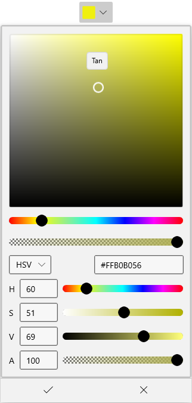

# WinUI DropDown Color Picker Overview

The [WinUI DropDown Color Picker](https://www.syncfusion.com/winui-controls/dropdown-color-picker) control is a user interface to select and adjust color values. The DropDown Color Picker displays a color spectrum in a drop-down with the selected color shown at the top. It supports various color specifications, including RGB, HSV, HSL, CMYK, and a hexadecimal color editor.

## Key features

### Color editing

- Drag the handle inside the color spectrum to pick a color, or enter values manually using the input controls (RGB, HSV, HSL, CMYK, or hexadecimal).
- A dedicated slider lets you choose a hue value across the spectrum.
- Switch between the RGB, HSV, HSL, and CMYK color channel modes from the channel combobox.

### Drop-down behavior

- Configure the drop-down placement using the `DropDownPlacement` property (`Auto`, `Top`, `Bottom`, `Left`, `Right`, `Full`, and edge-aligned variants).
- Use the `Split` mode (`DropDownMode` property) to combine a clickable command button with a drop-down.
- Customize the drop-down button and selected-color button with the `DropDownButtonTemplate` and `ContentTemplate` properties.
- Embed any `SfColorPicker` configuration inside the drop-down through the `AttachedFlyout` and `DropDownFlyout` properties.

### Notifications and UX

- A tooltip displays the currently hovered color while dragging the picker on the color spectrum.
- Be notified when the drop-down opens or closes using the `DropDownOpened` and `DropDownClosed` events.
- Be notified when the selected brush changes using the `SelectedBrushChanged` event, with `OldBrush` and `NewBrush` payload values.
