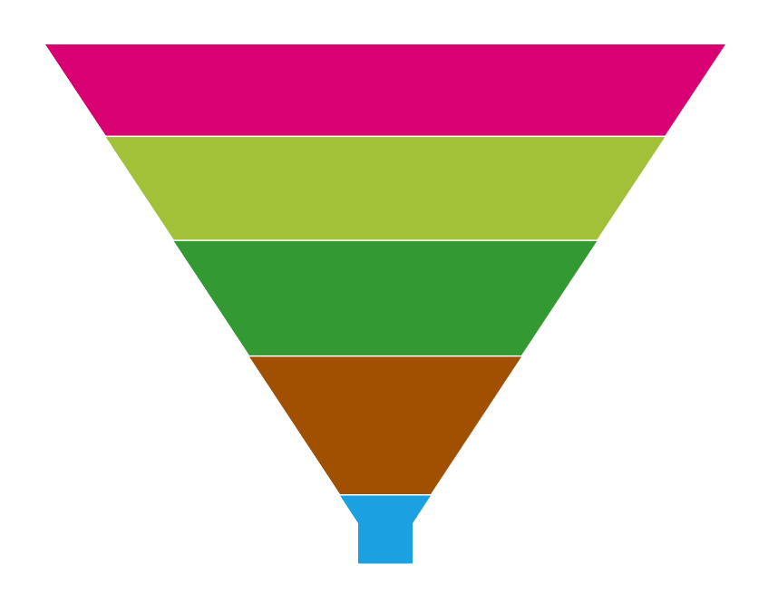
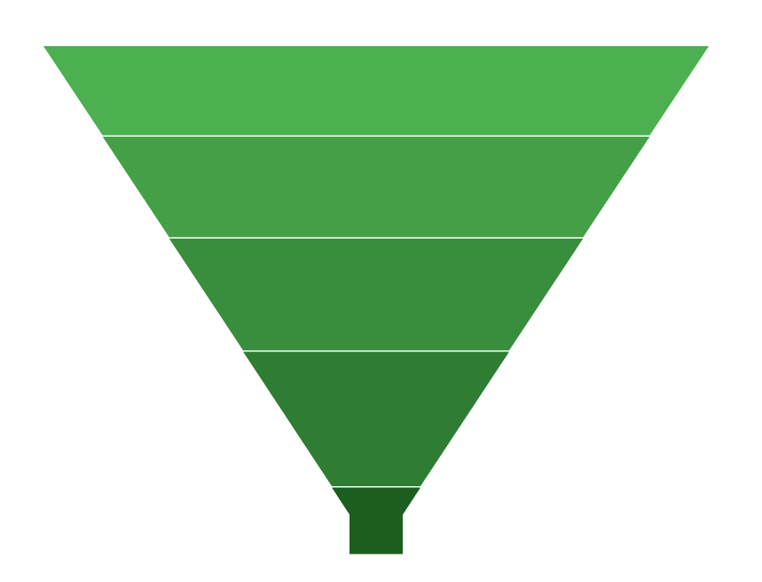
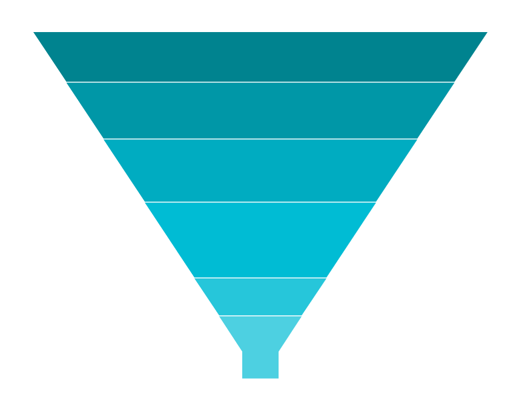
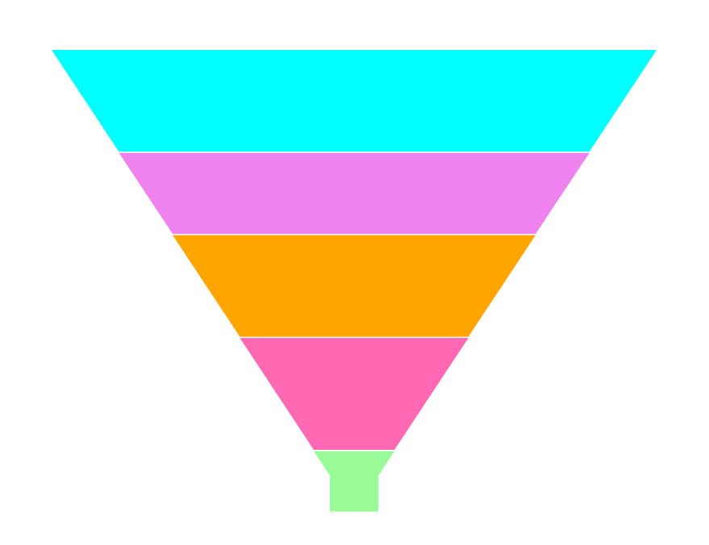

# Appearance in WinUI Funnel Chart (SfFunnelChart)

[SfFunnelChart]() support various customizing and styling options that allows you to enrich the application.

## Palettes

[SfFunnelChart]() provides options to apply different kinds of themes or palettes to your chart. You can define Palette either for the entire chart or for an individual series.

We have some predefined palette such as

* Metro
* AutumnBrights
* FloraHues
* Pineapple
* TomatoSpectrum
* RedChrome
* PurpleChrome
* BlueChrome
* GreenChrome
* Elite
* LightCandy
* SandyBeach

### Applying Palette

Each [palette]() applies a set of predefined brushes to the series in a predefined order. [Metro]() palette is the default palette for both Segment.





<chart:SfFunnelChart x:Name="chart" 
                ItemsSource="{Binding Data}" 
                XBindingPath="Category"
                YBindingPath="Value">

</chart:SfFunnelChart>





SfFunnelChart chart = new SfFunnelChart();
chart.SetBinding(SfFunnelChart.ItemsSourceProperty, new Binding() { Path = new PropertyPath("Data") });
chart.XBindingPath = "Category";
chart.YBindingPath = "Value";
. . .
this.Content = chart;





The following code example defined [`Palette`]() as [`GreenChrome`]().





<chart:SfFunnelChart x:Name="chart" 
                Palette="GreenChrome"
                ItemsSource="{Binding Data}" 
                XBindingPath="Category"
                YBindingPath="Value">

</chart:SfFunnelChart>





SfFunnelChart chart = new SfFunnelChart();
chart.Palette = ChartColorPalette.GreenChrome;
chart.SetBinding(SfFunnelChart.ItemsSourceProperty, new Binding() { Path = new PropertyPath("Data") });
chart.XBindingPath = "Category";
chart.YBindingPath = "Value";
. . .
this.Content = chart;





## Custom Palette

[`SfFunnelChart`]() provides option which enables you to define your own [`CustomBrushes`]() with your preferred order for the Palette, using [`ColorModel`]() as shown in the following code example.





<chart:SfFunnelChart x:Name="chart" 
                Palette="Custom" 
                ItemsSource="{Binding Data}" 
                XBindingPath="Category"
                YBindingPath="Value">

    <chart:SfFunnelChart.ColorModel>
        <chart:ChartColorModel>
            <chart:ChartColorModel.CustomBrushes>
                <SolidColorBrush Color="#4dd0e1"/>
                <SolidColorBrush Color="#26c6da"/>
                <SolidColorBrush Color="#00bcd4"/>
                <SolidColorBrush Color="#00acc1"/>
                <SolidColorBrush Color="#0097a7"/>
                <SolidColorBrush Color="#00838f"/>
            </chart:ChartColorModel.CustomBrushes>
        </chart:ChartColorModel>
    </chart:SfFunnelChart.ColorModel>
. . .
</chart:SfFunnelChart>





SfFunnelChart chart = new SfFunnelChart();
...
ChartColorModel colorModel = new ChartColorModel();
colorModel.CustomBrushes.Add(new SolidColorBrush(Color.FromArgb(255, 77, 208, 225)));
colorModel.CustomBrushes.Add(new SolidColorBrush(Color.FromArgb(255, 38, 198, 218)));
colorModel.CustomBrushes.Add(new SolidColorBrush(Color.FromArgb(255, 0, 188, 212)));
colorModel.CustomBrushes.Add(new SolidColorBrush(Color.FromArgb(255, 0, 172, 193)));
colorModel.CustomBrushes.Add(new SolidColorBrush(Color.FromArgb(255, 0, 151, 167)));
colorModel.CustomBrushes.Add(new SolidColorBrush(Color.FromArgb(255, 0, 131, 143)));

chart.SetBinding(SfFunnelChart.ItemsSourceProperty, new Binding() { Path = new PropertyPath("Data") });
chart.XBindingPath = "Category";
chart.YBindingPath = "Value";
chart.ColorModel = colorModel;
chart.Palette = ChartColorPalette.Custom;
. . .            
this.Content = chart;





## Gradient Colors

Gradient colors for the funnel chart can be set by using the [`ColorModel`]() property of the funnel chart with the help of `LinearGradientBrush` or `RadialGradientBrush`.

The following code sample and screenshot illustrates how to apply the custom gradient colors for chart series using the [`ColorModel`]() property.





<chart:SfFunnelChart x:Name="chart" 
                Palette="Custom" 
                ItemsSource="{Binding Data}" 
                XBindingPath="Category"
                YBindingPath="Value">

    <chart:SfFunnelChart.ColorModel>
        <chart:ChartColorModel>
            <chart:ChartColorModel.CustomBrushes>
                <LinearGradientBrush>
                    <GradientStop Offset="1" Color="#FFE7C7" />
                    <GradientStop Offset="0" Color="#FCB69F" />
                </LinearGradientBrush>
                <LinearGradientBrush>
                    <GradientStop Offset="1" Color="#fadd7d" />
                    <GradientStop Offset="0" Color="#fccc2d" />
                </LinearGradientBrush>
                <LinearGradientBrush>
                    <GradientStop Offset="1" Color="#DCFA97" />
                    <GradientStop Offset="0" Color="#96E6A1" />
                </LinearGradientBrush>
                <LinearGradientBrush>
                    <GradientStop Offset="1" Color="#DDD6F3" />
                    <GradientStop Offset="0" Color="#FAACA8" />
                </LinearGradientBrush>
                <LinearGradientBrush>
                    <GradientStop Offset="1" Color="#A8EAEE" />
                    <GradientStop Offset="0" Color="#7BB0F9" />
                </LinearGradientBrush>
            </chart:ChartColorModel.CustomBrushes>
        </chart:ChartColorModel>
    </chart:SfFunnelChart.ColorModel>
. . .
</chart:SfFunnelChart>





SfFunnelChart chart = new SfFunnelChart();
...
ChartColorModel colorModel = new ChartColorModel();
LinearGradientBrush gradientColor1 = new LinearGradientBrush();
GradientStop stop1 = new GradientStop() { Offset = 1, Color = Color.FromRgb(255, 231, 199) };
GradientStop stop2 = new GradientStop() { Offset = 0, Color = Color.FromRgb(252, 182, 159) };
gradientColor1.GradientStops.Add(stop1);
gradientColor1.GradientStops.Add(stop2);
LinearGradientBrush gradientColor2 = new LinearGradientBrush();
stop1 = new GradientStop() { Offset = 1, Color = Color.FromRgb(250, 221, 125) };
stop2 = new GradientStop() { Offset = 0, Color = Color.FromRgb(252, 204, 45) };
gradientColor2.GradientStops.Add(stop1);
gradientColor2.GradientStops.Add(stop2);
...
colorModel.CustomBrushes.Add(gradientColor1);
colorModel.CustomBrushes.Add(gradientColor2);
...
chart.SetBinding(SfFunnelChart.ItemsSourceProperty, new Binding() { Path = new PropertyPath("Data") });
chart.XBindingPath = "Category";
chart.YBindingPath = "Value";
chart.ColorModel = colorModel;
chart.Palette = ChartColorPalette.Custom;
. . .            
this.Content = chart;





## SegmentColorPath

The color of the chart segments can be updated by binding their corresponding model property from the `ItemsSource` collection to its [`ColorValuePath`]() property of series as follows.





<chart:SfFunnelChart x:Name="chart" 
                ItemsSource="{Binding Data}" 
                XBindingPath="Category"
                YBindingPath="Value"
                ColorValuePath="SegmentColor">
. . .
</chart:SfFunnelChart>





public class ViewModel
{
    public ObservableCollection<Model> Data { get; set; }

    public ViewModel()
    {
        Data = new ObservableCollection<Model>()
        {
            new Model(){Category = "Samsung", Value = 30, SegmentColor = new SolidColorBrush(Color.FromArgb(255, 152, 251, 152))},
            new Model(){Category = "LG", Value = 55, SegmentColor = new SolidColorBrush(Color.FromArgb(255, 255, 105, 180))},
            new Model(){Category = "Sony", Value = 50, SegmentColor = new SolidColorBrush(Color.FromArgb(255, 255, 165, 0))},
            new Model(){Category = "Moto", Value = 40, SegmentColor = new SolidColorBrush(Color.FromArgb(255, 238, 130, 238))},
            new Model(){Category = "HP", Value = 50, SegmentColor = new SolidColorBrush(Color.FromArgb(255, 0, 255, 255))},

        };
    }
}

SfFunnelChart chart = new SfFunnelChart();
. . .
chart.SetBinding(SfFunnelChart.ItemsSourceProperty, new Binding() { Path = new PropertyPath("Data") });
chart.XBindingPath = "Category";
chart.YBindingPath = "Value";
chart.ColorValuePath = "SegmentColor";
. . .            
this.Content = chart;





