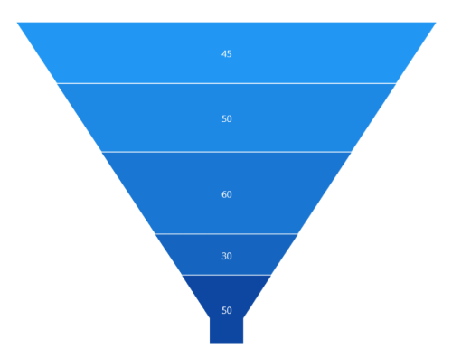
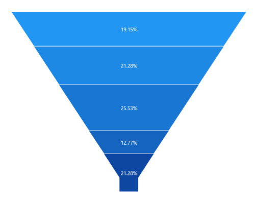
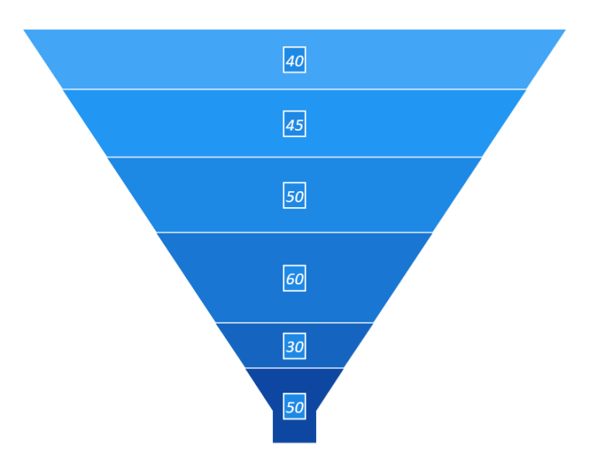
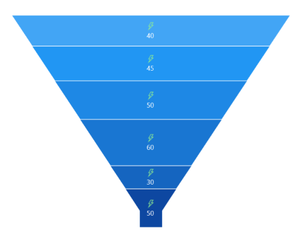
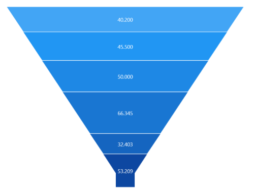
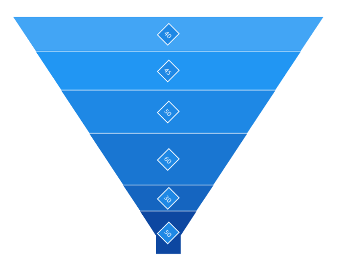

# Data Label in WinUI Chart (SfFunnelChart)

To improve the readability of data in the funnel chart, data points can be easily annotated with data labels.

## Define Data Label 

To define the data label in the chart, set the [ShowDataLabels](https://help.syncfusion.com/cr/winui/Syncfusion.UI.Xaml.Charts.SfFunnelChart.html#Syncfusion_UI_Xaml_Charts_SfFunnelChart_ShowDataLabels) property to true. The default value of [ShowDataLabels](https://help.syncfusion.com/cr/winui/Syncfusion.UI.Xaml.Charts.SfFunnelChart.html#Syncfusion_UI_Xaml_Charts_SfFunnelChart_ShowDataLabels) property is false.





<chart:SfFunnelChart x:Name="chart" 
                ShowDataLabels="True"
                Palette="BlueChrome" 
                ItemsSource="{Binding Data}" 
                XBindingPath="Category"
                YBindingPath="Value">
. . .
 </chart:SfFunnelChart>





SfFunnelChart chart = new SfFunnelChart();
chart.ShowDataLabels = true;
chart.Palette = ChartColorPalette.BlueChrome;
chart.SetBinding(SfFunnelChart.ItemsSourceProperty, new Binding() { Path = new PropertyPath("Data") });
chart.XBindingPath = "Category";
chart.YBindingPath = "Value";
. . . 
this.Content = chart;





## Context

To customize the content of data labels, need to define [DataLabelSettings](https://help.syncfusion.com/cr/winui/Syncfusion.UI.Xaml.Charts.SfFunnelChart.html#Syncfusion_UI_Xaml_Charts_SfFunnelChart_DataLabelSettings) of chart and set [Context](https://help.syncfusion.com/cr/winui/Syncfusion.UI.Xaml.Charts.ChartDataLabelSettings.html#Syncfusion_UI_Xaml_Charts_ChartDataLabelSettings_Context) property of [FunnelDataLabelSettings](https://help.syncfusion.com/cr/winui/Syncfusion.UI.Xaml.Charts.FunnelDataLabelSettings.html) to change the data label content value.





<chart:SfFunnelChart x:Name="chart" 
                ShowDataLabels="True"
                Palette="BlueChrome" 
                ItemsSource="{Binding Data}" 
                XBindingPath="Category"
                YBindingPath="Value">
. . .
    <chart:SfFunnelChart.DataLabelSettings>
        <chart:FunnelDataLabelSettings Context="Percentage" />
    </chart:SfFunnelChart.DataLabelSettings>
. . .
 </chart:SfFunnelChart>




        
SfFunnelChart chart = new SfFunnelChart();
chart.ShowDataLabels = true;
. . . 
chart.DataLabelSettings = new FunnelDataLabelSettings() 
{ 
    Context = LabelContext.Percentage 
};

this.Content = chart;





 

## Customization

The following properties are used to customize the data label:

* [BorderBrush](https://help.syncfusion.com/cr/winui/Syncfusion.UI.Xaml.Charts.ChartDataLabelSettings.html#Syncfusion_UI_Xaml_Charts_ChartDataLabelSettings_BorderBrush)- used to change the border color.
* [BorderThickness](https://help.syncfusion.com/cr/winui/Syncfusion.UI.Xaml.Charts.ChartDataLabelSettings.html#Syncfusion_UI_Xaml_Charts_ChartDataLabelSettings_BorderThickness)- used to change the thickness of the border.
* [Margin](https://help.syncfusion.com/cr/winui/Syncfusion.UI.Xaml.Charts.ChartDataLabelSettings.html#Syncfusion_UI_Xaml_Charts_ChartDataLabelSettings_Margin)- used to change the margin of the label.
* [FontStyle](https://help.syncfusion.com/cr/winui/Syncfusion.UI.Xaml.Charts.ChartDataLabelSettings.html#Syncfusion_UI_Xaml_Charts_ChartDataLabelSettings_FontStyle)-  used to change font style of the label.
* [FontSize](https://help.syncfusion.com/cr/winui/Syncfusion.UI.Xaml.Charts.ChartDataLabelSettings.html#Syncfusion_UI_Xaml_Charts_ChartDataLabelSettings_FontSize)-  used to change font size of the label.
* [Foreground](https://help.syncfusion.com/cr/winui/Syncfusion.UI.Xaml.Charts.ChartDataLabelSettings.html#Syncfusion_UI_Xaml_Charts_ChartDataLabelSettings_Foreground)- used to change the text color of the label.
* [FontFamily](https://help.syncfusion.com/cr/winui/Syncfusion.UI.Xaml.Charts.ChartDataLabelSettings.html#Syncfusion_UI_Xaml_Charts_ChartDataLabelSettings_FontFamily)-  used to change the font family of the label.
* [Background](https://help.syncfusion.com/cr/winui/Syncfusion.UI.Xaml.Charts.ChartDataLabelSettings.html#Syncfusion_UI_Xaml_Charts_ChartDataLabelSettings_Background)- used to change the label background color.





<chart:SfFunnelChart x:Name="chart" 
                ShowDataLabels="True"
                Palette="BlueChrome" 
                ItemsSource="{Binding Data}" 
                XBindingPath="Category"
                YBindingPath="Value">
. . .
    <chart:SfFunnelChart.DataLabelSettings>
        <chart:FunnelDataLabelSettings Foreground="White" FontSize="16" FontFamily="Calibri" BorderBrush="White" BorderThickness="1" Margin="1" FontStyle="Italic" Background="#1E88E5" />
    </chart:SfFunnelChart.DataLabelSettings>
. . .
</chart:SfFunnelChart>





SfFunnelChart chart = new SfFunnelChart();
chart.ShowDataLabels = true;
. . .
chart.DataLabelSettings = new FunnelDataLabelSettings() 
{ 
    Foreground = new SolidColorBrush(Colors.White),
    BorderBrush = new SolidColorBrush(Colors.White),
    Background = "#1E88E5",
    BorderThickness = new Thickness(1),
    Margin = new Thickness(1),
    FontStyle = FontStyles.Italic,
    FontFamily = new FontFamily("Calibri"),
    FontSize = 16
};

this.Content = chart;





## Template

The appearance of the data label can be customized by using the [ContentTemplate](https://help.syncfusion.com/cr/winui/Syncfusion.UI.Xaml.Charts.ChartDataLabelSettings.html#Syncfusion_UI_Xaml_Charts_ChartDataLabelSettings_ContentTemplate) property of [FunnelDataLabelSettings](https://help.syncfusion.com/cr/winui/Syncfusion.UI.Xaml.Charts.FunnelDataLabelSettings.html) as follows.





<Page.Resources>
    <DataTemplate x:Key="dataLabelTemplate">
        <StackPanel Orientation="Vertical">
            <Path Grid.Row="0"  Stretch="Uniform" Fill="LightGreen" Width="15" Height="15" Margin="0,0,0,0" RenderTransformOrigin="0.5,0.5" Data="M11.771002,1.993L5.0080013,14.284 10.752002,14.284 6.6450019,22.804 17.900003,11.921 11.655003,11.921 18.472004,1.993z M10.593002,0L22.256004,0 15.440003,9.9280005 22.827004,9.9280005 0,32 7.5790019,16.277 1.637001,16.277z">
                    <Path.RenderTransform>
                        <TransformGroup>
                            <TransformGroup.Children>
                                <RotateTransform Angle="0" />
                                <ScaleTransform ScaleX="1" ScaleY="1" />
                            </TransformGroup.Children>
                        </TransformGroup>
                    </Path.RenderTransform>
                </Path>
            <TextBlock Grid.Row="1" Text="{Binding}" FontSize="12" Foreground="White"></TextBlock>
        </StackPanel>
    </DataTemplate>
</Page.Resources>
<Grid>
   <chart:SfFunnelChart x:Name="chart" 
                ShowDataLabels="True"
                Palette="BlueChrome" 
                ItemsSource="{Binding Data}" 
                XBindingPath="Category"
                YBindingPath="Value">

        <chart:SfFunnelChart.DataLabelSettings>
            <chart:FunnelDataLabelSettings ContentTemplate="{StaticResource dataLabelTemplate}" />
        </chart:SfFunnelChart.DataLabelSettings>

    </chart:SfFunnelChart>
</Grid>





SfFunnelChart chart = new SfFunnelChart();
chart.ShowDataLabels = true;
. . . 
chart.DataLabelSettings = new FunnelDataLabelSettings() 
{ 
    ContentTemplate = this.Resources["dataLabelTemplate"] as DataTemplate
};

this.Content = chart;





## Format

The [Format](https://help.syncfusion.com/cr/winui/Syncfusion.UI.Xaml.Charts.ChartDataLabelSettings.html#Syncfusion_UI_Xaml_Charts_ChartDataLabelSettings_Format) property can be used to format the data labels. The following code example demonstrates how to format data labels with three decimal digits.





<chart:SfFunnelChart x:Name="chart" 
                ShowDataLabels="True"
                Palette="BlueChrome" 
                ItemsSource="{Binding Data}" 
                XBindingPath="Category"
                YBindingPath="Value">

    <chart:SfFunnelChart.DataLabelSettings>
        <chart:FunnelDataLabelSettings Format="#.000" Foreground="White" />
    </chart:SfFunnelChart.DataLabelSettings>

</chart:SfFunnelChart>





SfFunnelChart chart = new SfFunnelChart();
chart.ShowDataLabels = true;
. . . 
chart.DataLabelSettings = new FunnelDataLabelSettings() 
{  
    Format = "#.000",
    Foreground = new SolidColorBrush(Colors.White)
};

this.Content = chart;





## Rotation

The [Rotation](https://help.syncfusion.com/cr/winui/Syncfusion.UI.Xaml.Charts.ChartDataLabelSettings.html#Syncfusion_UI_Xaml_Charts_ChartDataLabelSettings_Rotation) property is used to rotate the data labels based on the value as angle.





<chart:SfFunnelChart x:Name="chart" 
                ShowDataLabels="True"
                Palette="BlueChrome" 
                ItemsSource="{Binding Data}" 
                XBindingPath="Category"
                YBindingPath="Value">

    <chart:SfFunnelChart.DataLabelSettings>
        <chart:FunnelDataLabelSettings Rotation="45" BorderBrush="White" BorderThickness="1" Background="#1E88E5"/>
    </chart:SfFunnelChart.DataLabelSettings>

</chart:SfFunnelChart>





SfFunnelChart chart = new SfFunnelChart();
chart.ShowDataLabels = true;
. . . 
chart.DataLabelSettings = new FunnelDataLabelSettings() 
{ 
    Rotation = 45,
    BorderBrush = new SolidColorBrush(Colors.White),
    Background = "#1E88E5",
    BorderThickness = new Thickness(1)
};

this.Content = chart;





