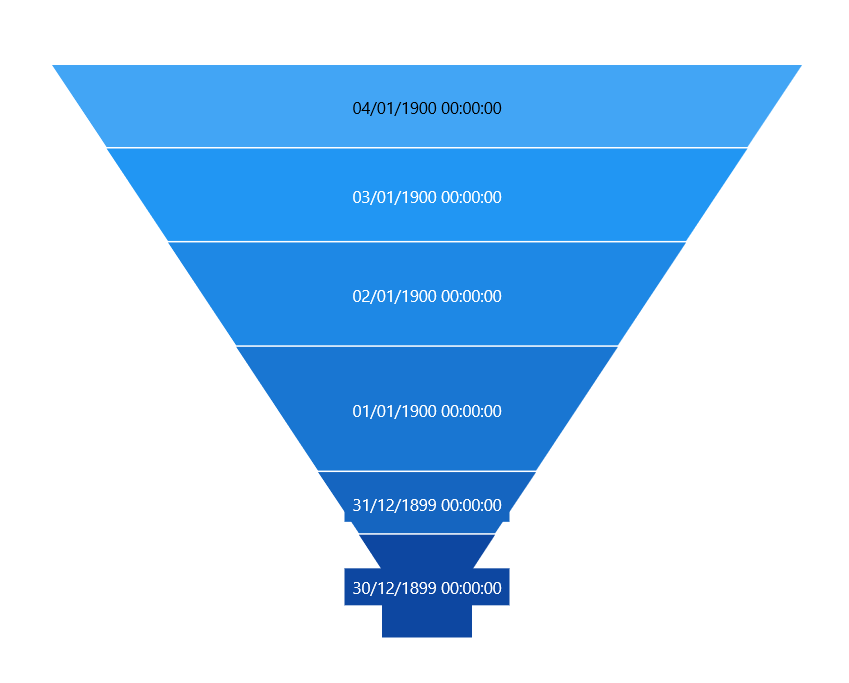
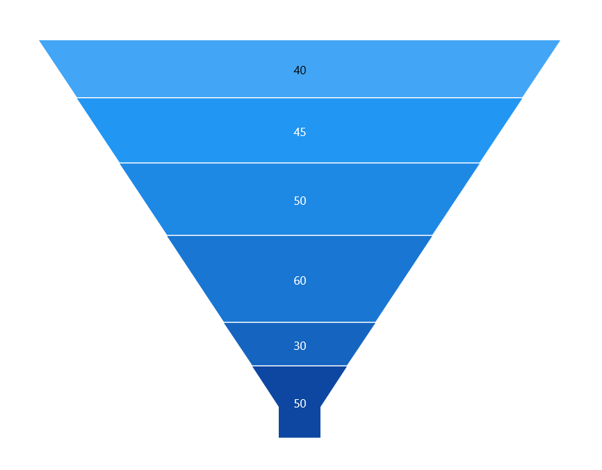
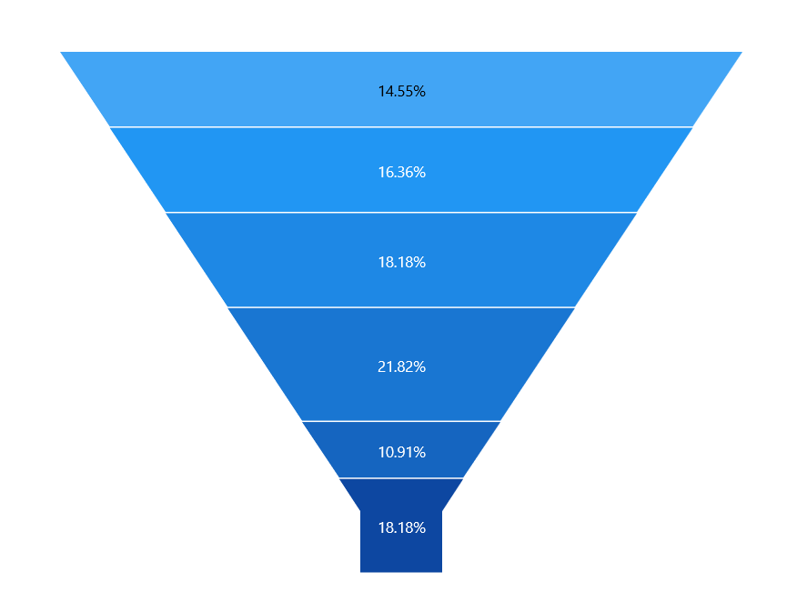
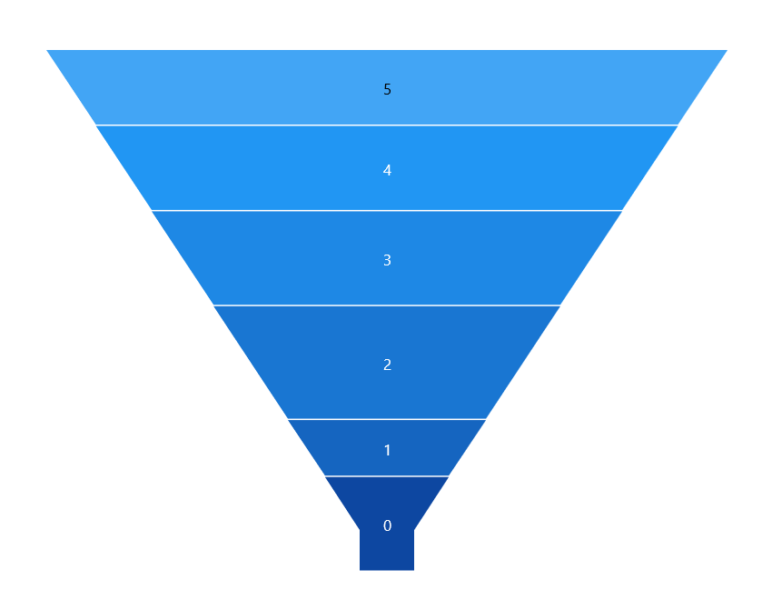
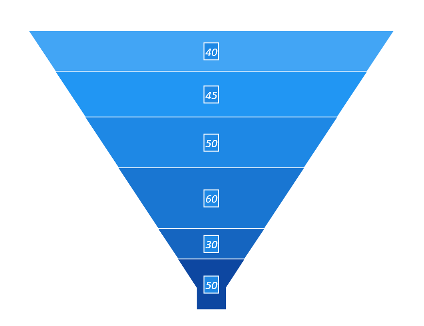
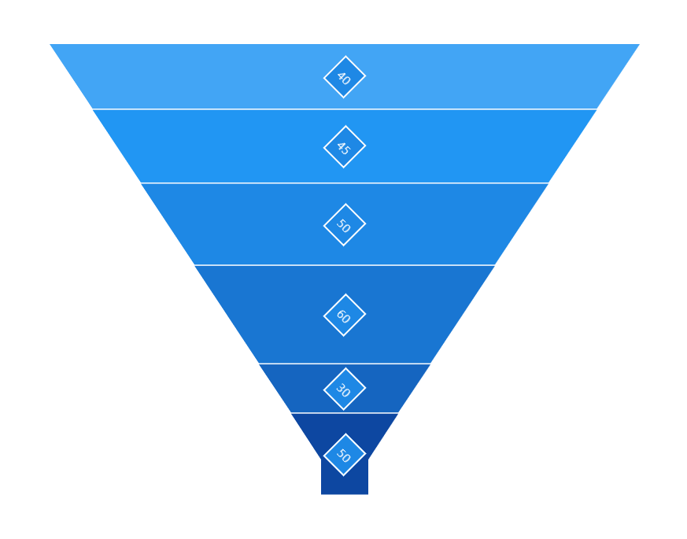

# Data Label in WinUI Funnel Chart (SfFunnelChart)

Data points can be easily annotated with labels to help improve the readability of data. 

## Define Data Label 

To enable the Label in data label you have to set the [`Visible`]() property of [`FunnelDataLabelSettings`](). 

[`Content`]() property allows you to define the value to be displayed as data label.

The following code example demonstrates about define the value to be displayed as data label.





<chart:SfFunnelChart.DataLabelSettings>
    <chart:FunnelDataLabelSettings Visible="True" Context="YValue" />
</chart:SfFunnelChart.DataLabelSettings>




        
SfFunnelChart chart = new SfFunnelChart();
. . . 
chart.DataLabelSettings = new FunnelDataLabelSettings() 
{ 
    Visible = true, 
    Context = LabelContext.YValue 
};

this.Content = chart;





| Content values | Description | Output |
|---|--|---|
| DateTime | Displays LabelContent.DateTime value |  |
|DataLabelItem | Displays the y value||
| Percentage | Displays the percentage value of series point among other points | |
| XValue | Displays the X value of series point| |
| YValue | Displays the Y value of series point|  |

## Customizing Labels

The following properties are used to customize the data label.

* [`BorderBrush`]()- used to change the border color.
* [`BorderThickness`]()- used to change the thickness of the border.
* [`Margin`]()- used to change the margin size for label.
* [`FontStyle`]()-  used to change font style of the label.
* [`FontSize`]()-  used to change font size of the label.
* [`Foreground`]()- used to change the color of the label.
* [`FontFamily`]()-  used to change the font family of the label.
* [`Background`]()- used to change the label background color.

The following code example demonstrates the customization of label using the above properties:





<chart:SfFunnelChart.DataLabelSettings>
    <chart:FunnelDataLabelSettings Visible="True" Foreground="White" FontSize="16" FontFamily="Calibri" BorderBrush="White" BorderThickness="1" Margin="1" FontStyle="Italic" Background="#1E88E5" />
</chart:SfFunnelChart.DataLabelSettings>





SfFunnelChart chart = new SfFunnelChart();
chart.DataLabelSettings = new FunnelDataLabelSettings() 
{ 
    Visible = true, 
    Foreground = new SolidColorBrush(Colors.White),
    BorderBrush = new SolidColorBrush(Colors.White),
    Background = "#1E88E5",
    BorderThickness = new Thickness(1),
    Margin = new Thickness(1),
    FontStyle = FontStyles.Italic,
    FontFamily = new FontFamily("Calibri"),
    FontSize = 16
};

this.Content = chart;





## Label Template

The default appearance of the label can be customized using [`ContentTemplate`]() property as in the below code example:





<Page.Resources>
    <DataTemplate x:Key="dataLabelTemplate">
        <StackPanel Orientation="Vertical">               
            <Path Grid.Row="0"  Stretch="Uniform" Fill="LightGreen"                              
                       Width="15" Height="15" Margin="0,0,0,0"                              
                       RenderTransformOrigin="0.5,0.5"
                       Data="M22.5,15.8899993896484L37.5,                                
                       30.8899993896484 7.5,30.8899993896484 22.5,15.8899993896484z">
                <Path.RenderTransform>
                    <TransformGroup>
                        <TransformGroup.Children>
                            <RotateTransform Angle="0" />
                            <ScaleTransform ScaleX="1" ScaleY="1" />
                        </TransformGroup.Children>
                    </TransformGroup>
                </Path.RenderTransform>
            </Path>
            <TextBlock Grid.Row="1" Text="{Binding}" FontSize="11" Foreground="White"></TextBlock>
        </StackPanel>
    </DataTemplate>
</Page.Resources>

<Grid>
   <chart:SfFunnelChart x:Name="chart" 
                Palette="BlueChrome" 
                ItemsSource="{Binding Data}" 
                XBindingPath="Category"
                YBindingPath="Value">

        <chart:SfFunnelChart.DataLabelSettings>
            <chart:FunnelDataLabelSettings Visible="True" ContentTemplate="{StaticResource dataLabelTemplate}" />
        </chart:SfFunnelChart.DataLabelSettings>

    </chart:SfFunnelChart>
</Grid>





SfFunnelChart chart = new SfFunnelChart();
. . . 
chart.DataLabelSettings = new FunnelDataLabelSettings() 
{ 
    Visible = true, 
    ContentTemplate = this.Resources["dataLabelTemplate"] as DataTemplate
};

this.Content = chart;





## Label Format

[`Format`]() property allows you to provide formatting for the labels.

The following code example demonstrates the y value having three decimal digits.





<chart:SfFunnelChart x:Name="chart" 
                Palette="BlueChrome" 
                ItemsSource="{Binding Data}" 
                XBindingPath="Category"
                YBindingPath="Value">

    <chart:SfFunnelChart.DataLabelSettings>
        <chart:FunnelDataLabelSettings Visible="True" Format="#$" />
    </chart:SfFunnelChart.DataLabelSettings>

</chart:SfFunnelChart>





SfFunnelChart chart = new SfFunnelChart();
. . . 
chart.DataLabelSettings = new FunnelDataLabelSettings() 
{ 
    Visible = true, 
    Format = "#$"
};

this.Content = chart;





## Label Rotation

[`Rotation`]() property is used to define the angle to which the label has to rotate. The following code demonstrates the label rotating angle.





<chart:SfFunnelChart x:Name="chart" 
                Palette="BlueChrome" 
                ItemsSource="{Binding Data}" 
                XBindingPath="Category"
                YBindingPath="Value">

    <chart:SfFunnelChart.DataLabelSettings>
        <chart:FunnelDataLabelSettings Visible="True" Rotation="45" BorderBrush="White" BorderThickness="1" Background="#1E88E5"/>
    </chart:SfFunnelChart.DataLabelSettings>

</chart:SfFunnelChart>





SfFunnelChart chart = new SfFunnelChart();
. . . 
chart.DataLabelSettings = new FunnelDataLabelSettings() 
{ 
    Visible = true, 
    Rotation = 45,
    BorderBrush = new SolidColorBrush(Colors.White),
    Background = "#1E88E5",
    BorderThickness = new Thickness(1)
};

this.Content = chart;





