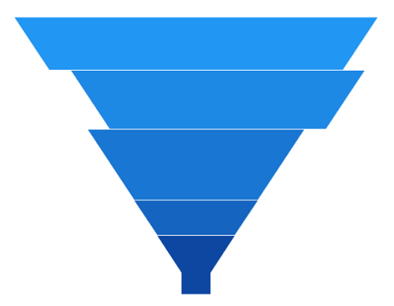

# Explode Segments in WinUI Chart (SfFunnelChart)

Exploding a segment is used to draw attention to a specific area of the funnel. The following properties are used to explode the segments in the funnel chart:

* [ExplodeIndex](https://help.syncfusion.com/cr/winui/Syncfusion.UI.Xaml.Charts.SfFunnelChart.html#Syncfusion_UI_Xaml_Charts_SfFunnelChart_ExplodeIndex) - Used to explode a specific segment.
* [ExplodeOffset](https://help.syncfusion.com/cr/winui/Syncfusion.UI.Xaml.Charts.SfFunnelChart.html#Syncfusion_UI_Xaml_Charts_SfFunnelChart_ExplodeOffset) - Used to define the explode distance of the segment.
* [ExplodeOnTap](https://help.syncfusion.com/cr/winui/Syncfusion.UI.Xaml.Charts.SfFunnelChart.html#Syncfusion_UI_Xaml_Charts_SfFunnelChart_ExplodeOnTap) - Used to explode the segment when it is tapped or clicked.

 



<chart:SfFunnelChart x:Name="chart" 
                ExplodeIndex="3"  
                ExplodeOffset="30" 
                ItemsSource="{Binding Data}" 
                XBindingPath="Category"
                YBindingPath="Value">

</chart:SfFunnelChart>
 




SfFunnelChart chart = new SfFunnelChart();
chart.SetBinding(SfFunnelChart.ItemsSourceProperty, new Binding() { Path = new PropertyPath("Data") });
chart.XBindingPath = "Category";
chart.YBindingPath = "Value";
chart.ExplodeIndex = 3;
chart.ExplodeOffset = 30;
. . . 
this.Content = chart;





