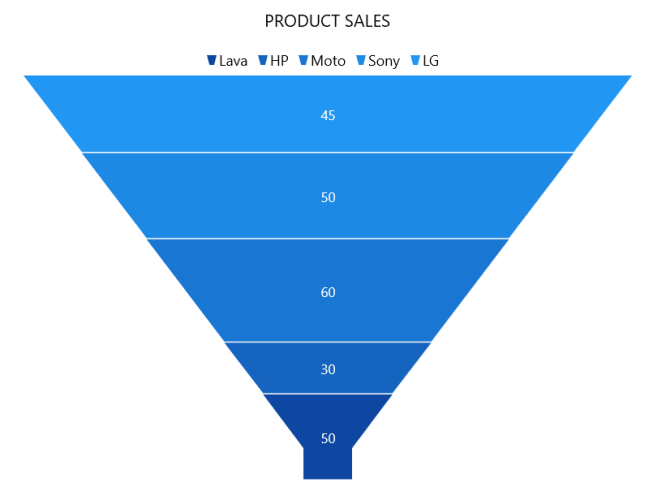

# Getting Started with WinUI Chart

This section explains how to populate the [WinUI Funnel Chart](https://www.syncfusion.com/winui-controls/charts/winui-funnel-chart) with data, a header, data labels, legend, and tooltips, as well as the essential aspects for getting started with the chart.

## Creating an application with WinUI Chart

1. Create a [WinUI 3 desktop app for C# and .NET 5](https://docs.microsoft.com/en-us/windows/apps/winui/winui3/get-started-winui3-for-desktop).
2. Add reference to [Syncfusion.Chart.WinUI](https://www.nuget.org/packages/Syncfusion.Chart.WinUI/) NuGet. 
3. Import the control namespace `Syncfusion.UI.Xaml.Charts` in XAML or C# to initialize the control.
4. Initialize [SfFunnelChart](https://help.syncfusion.com/cr/winui/Syncfusion.UI.Xaml.Charts.SfFunnelChart.html) control.

 



<Window>
    x:Class="ChartDemo.MainWindow"

    . . .
    xmlns:chart="using:Syncfusion.UI.Xaml.Charts">
    <chart:SfFunnelChart/>

</Window>
 




using Syncfusion.UI.Xaml.Charts;

. . .

public sealed partial class MainWindow : Window
{
    
    public MainWindow()
    {
        this.InitializeComponent();
        SfFunnelChart chart = new SfFunnelChart();
        . . .
        this.Content = chart;
    }
}   





## Initialize View Model

Now, let us define a simple data model that represents a data point in the chart.

  



public class Model
{
    public string Category { get; set; }

    public double Value { get; set; }
}

 

 

Next, create a view model class and initialize a list of `Model` objects as follows.

  



public class ChartViewModel
{
    public List<Model> Data { get; set; }

    public ChartViewModel()
    {
        Data = new List<Model>()
        {
            new Model(){Category = "Lava", Value = 50},
            new Model(){Category = "HP", Value = 30},
            new Model(){Category = "Moto", Value = 60},
            new Model(){Category = "Sony", Value = 50},
            new Model(){Category = "LG", Value = 45},
        };
    }
}

 

 

Create a `ViewModel` instance and set it as the chart's `DataContext`. This enables property binding from the `ViewModel` class.

N> If you prefer to set `DataContext` in XAML, add the namespace of the `ViewModel` class to your XAML Page.

 

 

<Window>
    . . .

    xmlns:chart="using:Syncfusion.UI.Xaml.Charts"
    xmlns:model="using:ChartDemo.ViewModel">

    <chart:SfFunnelChart>
        <chart:SfFunnelChart.DataContext>
            <model:ChartViewModel/>
        </chart:SfFunnelChart.DataContext>
    </chart:SfFunnelChart>

</Window>



 

ChartViewModel viewModel = new ChartViewModel();
chart.DataContext = viewModel;



 

## Add Title

The title of the chart provide quick information to the user about the data being plotted in the chart. You can set the title using the [Header](https://help.syncfusion.com/cr/winui/Syncfusion.UI.Xaml.Charts.ChartBase.html#Syncfusion_UI_Xaml_Charts_ChartBase_Header) property of the funnel chart as follows.

 



<chart:SfFunnelChart Header="PRODUCT SALES">
    
. . .

</chart:SfFunnelChart>





SfFunnelChart chart = new SfFunnelChart();

. . .

chart.Header = "PRODUCT SALES";



  

## Enable Data Labels

The [ShowDataLabels](https://help.syncfusion.com/cr/winui/Syncfusion.UI.Xaml.Charts.SfFunnelChart.html#Syncfusion_UI_Xaml_Charts_SfFunnelChart_ShowDataLabels) property of [SfFunnelChart](https://help.syncfusion.com/cr/winui/Syncfusion.UI.Xaml.Charts.SfFunnelChart.html) can be used to enable data labels to improve the readability of the funnel chart. The label visibility is set to `False` by default.

 



<chart:SfFunnelChart ShowDataLabels="True">
. . . 
</chart:SfFunnelChart>





SfFunnelChart chart = new SfFunnelChart();

. . .

chart.ShowDataLabels = true;



  

## Enable Legend

The legend provides information about the data point displayed in the funnel chart. The [Legend](https://help.syncfusion.com/cr/winui/Syncfusion.UI.Xaml.Charts.ChartBase.html#Syncfusion_UI_Xaml_Charts_ChartBase_Legend) property of the chart was used to enable it.

 



<chart:SfFunnelChart>
    . . .
    <chart:SfFunnelChart.Legend>
        <chart:ChartLegend/>
    </chart:SfFunnelChart.Legend>
</chart:SfFunnelChart>





SfFunnelChart chart = new SfFunnelChart();
. . .
chart.Legend = new ChartLegend();



 

## Enable Tooltip

Tooltips are used to display information about a segment, when the mouse is moved over it. Enable tooltip by setting funnel chart [ShowTooltip](https://help.syncfusion.com/cr/winui/Syncfusion.UI.Xaml.Charts.SfFunnelChart.html#Syncfusion_UI_Xaml_Charts_SfFunnelChart_ShowTooltip) property as true.

 



<chart:SfFunnelChart ShowTooltip="True">
    . . . 
</chart:SfFunnelChart>





SfFunnelChart chart = new SfFunnelChart();
. . .
chart.ShowTooltip = true;





The following code example gives you the complete code of above configurations.

N> To plot the chart, the [XBindingPath](https://help.syncfusion.com/cr/winui/Syncfusion.UI.Xaml.Charts.SfFunnelChart.html#Syncfusion_UI_Xaml_Charts_SfFunnelChart_XBindingPath) and [YBindingPath](https://help.syncfusion.com/cr/winui/Syncfusion.UI.Xaml.Charts.SfFunnelChart.html#Syncfusion_UI_Xaml_Charts_SfFunnelChart_YBindingPath) properties must be configured so that the chart may get values from the respective properties in the data model.

 



<chart:SfFunnelChart x:Name="chart" Header="PRODUCT SALES" 
                             ShowTooltip="True"
                             ShowDataLabels="True"
                             Palette="BlueChrome"
                             Height="388" Width="500" 
                             ItemsSource="{Binding Data}" 
                             XBindingPath="Category"
                             YBindingPath="Value">

        <chart:SfFunnelChart.DataContext>
            <model:ChartViewModel />
        </chart:SfFunnelChart.DataContext>

        <chart:SfFunnelChart.Legend>
            <chart:ChartLegend />
        </chart:SfFunnelChart.Legend>
            
</chart:SfFunnelChart>
 




using Syncfusion.UI.Xaml.Charts;

. . .

public sealed partial class MainWindow : Window
{
    public MainWindow()
    {
        SfFunnelChart chart = new SfFunnelChart();
        ChartViewModel viewModel = new ChartViewModel();
        chart.DataContext = viewModel;
        chart.SetBinding(SfFunnelChart.ItemsSourceProperty, new Binding() { Path = new PropertyPath("Data") });
        chart.XBindingPath = "Category";
        chart.YBindingPath = "Value";
        chart.Header = "PRODUCT SALES";
        chart.Height = 388;
        chart.Width = 500;
        chart.Legend = new ChartLegend();
        chart.ShowTooltip = true;
        chart.ShowDataLabels = true;

        this.Content = chart;
    }
}





N> Download demo application from [GitHub](https://github.com/SyncfusionExamples/GettingStartedChartWinUI/tree/main/FunnelChartGettingStarted).

N> You can also explore our [WinUI Funnel Chart example](https://github.com/syncfusion/winui-demos/blob/master/chart/Views/Funnel%20And%20Pyramid%20Charts/FunnelChart.xaml) that shows how to easily configure with built-in support for creating stunning visual effects.