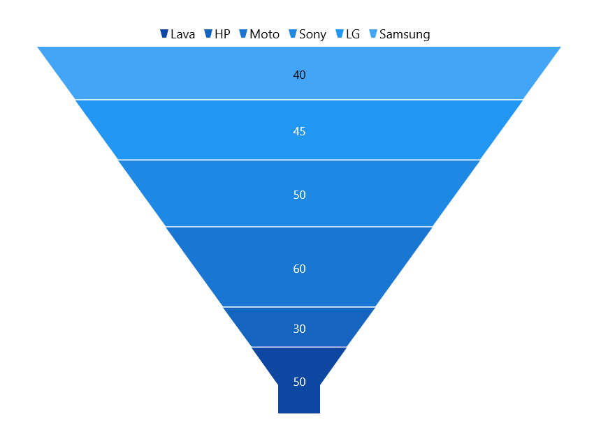
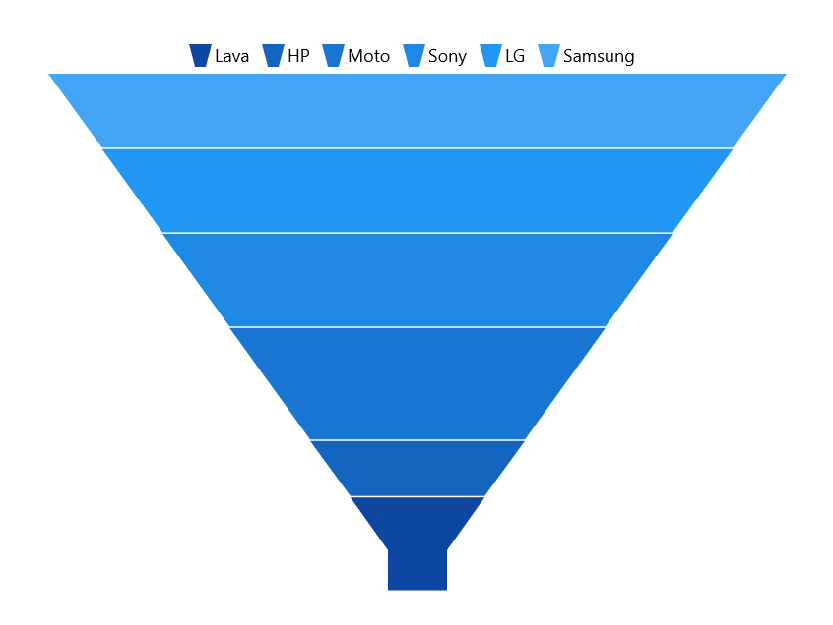
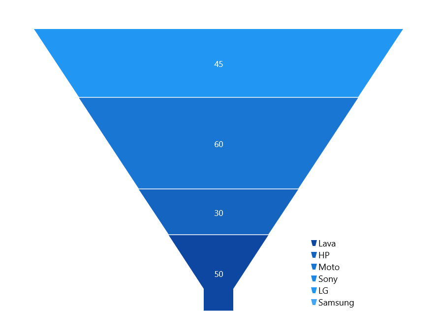

# Legend in WinUI Funnel Chart (SfFunnelChart)

The legend contains list of series data points in the chart. The information provided in each legend item helps to identify the corresponding data series in the chart.

The following code example shows how to enable legend in chart.





<chart:SfFunnelChart.Legend>
    <chart:ChartLegend/>
</chart:SfFunnelChart.Legend>





SfFunnelChart chart = new SfFunnelChart();
chart.Legend = new ChartLegend();





N> Legend items ‘Label’ will be the x-value of data points in the funnel chart.

## Legend title

Funnel chart provides support to add any `UIElement` as a title for legend. [Header]() property of `ChartLegend` is used to define the title for legend as the following code example.





<chart:SfFunnelChart.Legend>
    <chart:ChartLegend>
        <chart:ChartLegend.Header>
            <TextBox Text="Products" 
                HorizontalAlignment="Center"
                FontWeight="Bold"
                Foreground="Blue"/>
        </chart:ChartLegend.Header>
    </chart:ChartLegend>
</chart:SfFunnelChart.Legend>





SfFunnelChart chart = new SfFunnelChart();
ChartLegend legend = new ChartLegend();

TextBlock textBlock = new TextBlock()
{
    Text = "Products",
    HorizontalTextAlignment = TextAlignment.Center,
    Foreground = new SolidColorBrush(Colors.Blue),
    FontWeight = FontWeights.Bold,
};

legend.Header = textBlock;
chart.Legend = legend;





## Legend icon

Legend icon represents a symbol associated with the each legend item. The appearance of the legend icon can be customized using the below properties.

* [IconWidth]() - Gets or sets the double value that represents the legend icon(s) width.
* [IconHeight]() - Gets or sets the double value that represents that legend icon(s) height.
* [IconVisibility]() - Gets or sets the visibility of the legend icon.

The following code example illustrates the customization of legend icon.





<chart:SfFunnelChart.Legend>
    <chart:ChartLegend IconWidth="15" IconHeight="15" 
                       IconVisibility="Visible">
    </chart:ChartLegend>
</chart:SfFunnelChart.Legend>





chart.Legend = new ChartLegend()
{
    IconWidth = 15,
    IconHeight = 15,
    IconVisibility = Visibility.Visible,
};





## Checkbox for legend

Funnel chart provides support to enable the checkbox for each legend item to visbile or collapse the associated data points. By default, the value of [CheckBoxVisibility]() property is `Collapsed`. 





<chart:SfFunnelChart.Legend>
    <chart:ChartLegend CheckBoxVisibility="Visible"/>
</chart:SfFunnelChart.Legend>





chart.Legend = new ChartLegend()
{
   CheckBoxVisibility = Visibility.Visible
};





## Toggle series visibility 

The visibility of the segment can be control by tapping the legend item by enabling the [ToggleSeriesVisibility]() property. By default, the value of [ToggleSeriesVisibility]() property is `False`.





<chart:SfFunnelChart.Legend>
    <chart:ChartLegend ToggleSeriesVisibility="True"/>
</chart:SfFunnelChart.Legend>





chart.Legend = new ChartLegend()
{
   ToggleSeriesVisibility = true
};





## Positioning the legend

The legends can be placed either inside or outside of the chart area (plotting area). By default, it will be displayed outside and positioned at top (using [DockPosition]()) of the chart area.





<chart:SfFunnelChart.Legend>
    <chart:ChartLegend Position="Inside"/>
</chart:SfFunnelChart.Legend>





chart.Legend = new ChartLegend()
{
    Position = LegendPosition.Inside
};





**Docking the legend position**

Legends can be docked left, right, and top or bottom around the chart area using [DockPosition]() property. By default, the chart legend is docked at the top of the chart as mentioned earlier.

To display the legend at the right, you can set the [DockPosition]() as [Right]() as in below code snippet.





<chart:SfFunnelChart.Legend>
    <chart:ChartLegend ItemMargin="10" DockPosition="Right"/>
</chart:SfFunnelChart.Legend>





chart.Legend = new ChartLegend()
{
   DockPosition = ChartDock.Right
};





**Floating legends**

To position the legend at any arbitrary location inside chart, need to set [DockPosition]() as `Floating` and provide its relative position by using [OffsetX]() and [OffsetY]() properties.





 <chart:SfFunnelChart.Legend>
    <chart:ChartLegend DockPosition="Floating" Orientation="Vertical" OffsetX="370" OffsetY="300"/>
</chart:SfFunnelChart.Legend>





chart.Legend = new ChartLegend()
{
    DockPosition = ChartDock.Floating,
    OffsetX = 370,
    OffsetY = 300
};





## Legend Orientation

Orientation of the legend items can aligned vertically or horizontally by setting [`Orientation`]() property of legend. By default, the value of [Orientation]() property is [Horizontal](). 





<chart:SfFunnelChart.Legend>
    <chart:ChartLegend Orientation="Vertical"/>
</chart:SfFunnelChart.Legend>





chart.Legend = new ChartLegend()
{
    Orientation = ChartOrientation.Vertical
};





## Legend template customization

Customize each legend item by using [ItemTemplate]() property in ChartLegend as in below code snippet:





<chart:SfFunnelChart>
    <chart:SfFunnelChart.Resources>
        <DataTemplate x:Key="labelTemplate">
            <StackPanel Margin="10" Orientation="Vertical">
                <Ellipse Height="15" Width="15" Fill="{Binding Interior}" 
                 Stroke="#4a4a4a" StrokeThickness="2"/>
                <TextBlock HorizontalAlignment="Center" FontSize="12"
                           Foreground="Black" 
                           FontWeight="SemiBold" Text="{Binding Label}"/>
            </StackPanel>
        </DataTemplate>
    </chart:SfFunnelChart.Resources>
    . . .
    <chart:SfFunnelChart.Legend>
        <chart:ChartLegend ItemTemplate="{StaticResource labelTemplate}"/>
    </chart:SfFunnelChart.Legend>

</chart:SfFunnelChart>





chart.Legend = new ChartLegend()
{

   ItemTemplate = chart.Resources["itemTemplate"] as DataTemplate
};





