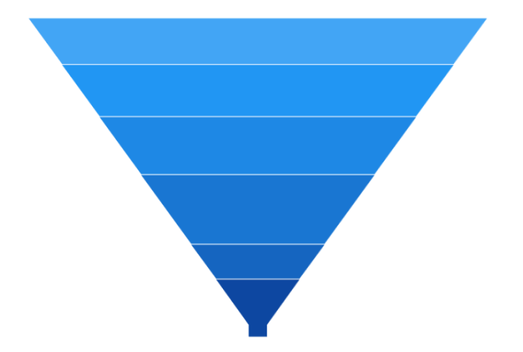

# Neck Width in WinUI Chart (SfFunnelChart)

The neck width of funnel chart can be customized by using the [MinimumWidth](https://help.syncfusion.com/cr/winui/Syncfusion.UI.Xaml.Charts.SfFunnelChart.html#Syncfusion_UI_Xaml_Charts_SfFunnelChart_MinimumWidth) property. The default value of [MinimumWidth](https://help.syncfusion.com/cr/winui/Syncfusion.UI.Xaml.Charts.SfFunnelChart.html#Syncfusion_UI_Xaml_Charts_SfFunnelChart_MinimumWidth) property is 40. The following code example explains how to change the neck width.

 



<chart:SfFunnelChart
        MinimumWidth="20" 
        ItemsSource="{Binding Data}" 
        XBindingPath="Category"
        YBindingPath="Value">
</chart:SfFunnelChart>
 




SfFunnelChart chart = new SfFunnelChart();
chart.SetBinding(SfFunnelChart.ItemsSourceProperty, new Binding() { Path = new PropertyPath("Data") });
chart.XBindingPath = "Category";
chart.YBindingPath = "Value";
chart.MinimumWidth = 20;
. . . 
this.Content = chart;





## Inverted Pyramid

The funnel chart can be customized to the inverted pyramid chart by setting the [MinimumWidth](https://help.syncfusion.com/cr/winui/Syncfusion.UI.Xaml.Charts.SfFunnelChart.html#Syncfusion_UI_Xaml_Charts_SfFunnelChart_MinimumWidth) property to 0.

 



<chart:SfFunnelChart
        MinimumWidth="0" 
        ItemsSource="{Binding Data}" 
        XBindingPath="Category"
        YBindingPath="Value">
</chart:SfFunnelChart>
 




SfFunnelChart chart = new SfFunnelChart();
chart.SetBinding(SfFunnelChart.ItemsSourceProperty, new Binding() { Path = new PropertyPath("Data") });
chart.XBindingPath = "Category";
chart.YBindingPath = "Value";
chart.MinimumWidth = 0;
. . . 
this.Content = chart;





