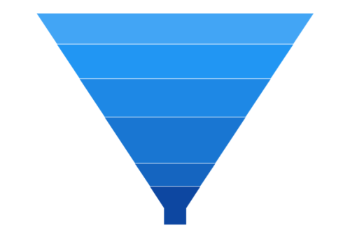
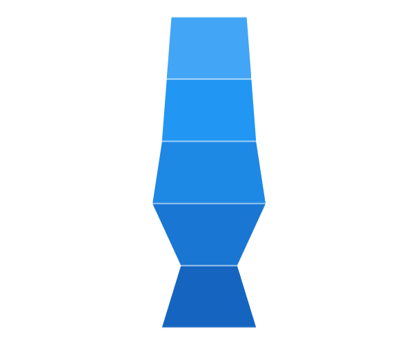

# Rendering Mode in WinUI Chart (SfFunnelChart)

The [Mode](https://help.syncfusion.com/cr/winui/Syncfusion.UI.Xaml.Charts.SfFunnelChart.html#Syncfusion_UI_Xaml_Charts_SfFunnelChart_Mode) property defines the rendering mode of the funnel chart, which define where to bind your values (to height or width).The default value of [Mode](https://help.syncfusion.com/cr/winui/Syncfusion.UI.Xaml.Charts.SfFunnelChart.html#Syncfusion_UI_Xaml_Charts_SfFunnelChart_Mode) property is [ValueIsHeight](https://help.syncfusion.com/cr/winui/Syncfusion.UI.Xaml.Charts.ChartFunnelMode.html#Syncfusion_UI_Xaml_Charts_ChartFunnelMode_ValueIsHeight).  The following example demonstrates [ValueIsHeight](https://help.syncfusion.com/cr/winui/Syncfusion.UI.Xaml.Charts.ChartFunnelMode.html#Syncfusion_UI_Xaml_Charts_ChartFunnelMode_ValueIsHeight) and [ValueIsWidth](https://help.syncfusion.com/cr/winui/Syncfusion.UI.Xaml.Charts.ChartFunnelMode.html#Syncfusion_UI_Xaml_Charts_ChartFunnelMode_ValueIsWidth) of funnel mode.

## Rendering with Height

[ValueIsHeight](https://help.syncfusion.com/cr/winui/Syncfusion.UI.Xaml.Charts.ChartFunnelMode.html#Syncfusion_UI_Xaml_Charts_ChartFunnelMode_ValueIsHeight) is used to render the funnel chart segments based on the height for data point values

 



<chart:SfFunnelChart x:Name="chart"
                Palette="BlueChrome"
                ItemsSource="{Binding Data}" 
                XBindingPath="Category" 
                YBindingPath="Value" 
                Mode="ValueIsHeight">
</chart:SfFunnelChart>
 




SfFunnelChart chart = new SfFunnelChart();
chart.Palette = ChartColorPalette.BlueChrome;
chart.SetBinding(SfFunnelChart.ItemsSourceProperty, new Binding() { Path = new PropertyPath("Data") });
chart.XBindingPath = "Category";
chart.YBindingPath = "Value";
chart.Mode = ChartFunnelMode.ValueIsHeight;
. . . 
this.Content = chart;





## Rendering with Width

[ValueIsWidth](https://help.syncfusion.com/cr/winui/Syncfusion.UI.Xaml.Charts.ChartFunnelMode.html#Syncfusion_UI_Xaml_Charts_ChartFunnelMode_ValueIsWidth) is used to render the funnel chart segments based on the width for data point values.

 



<chart:SfFunnelChart x:Name="chart"
                Palette="BlueChrome"
                ItemsSource="{Binding Data}" 
                XBindingPath="Category" 
                YBindingPath="Value" 
                Mode="ValueIsWidth">
</chart:SfFunnelChart>
 




SfFunnelChart chart = new SfFunnelChart();
chart.Palette = ChartColorPalette.BlueChrome;
chart.SetBinding(SfFunnelChart.ItemsSourceProperty, new Binding() { Path = new PropertyPath("Data") });
chart.XBindingPath = "Category";
chart.YBindingPath = "Value";
chart.Mode = ChartFunnelMode.ValueIsWidth;
. . . 
this.Content = chart;





