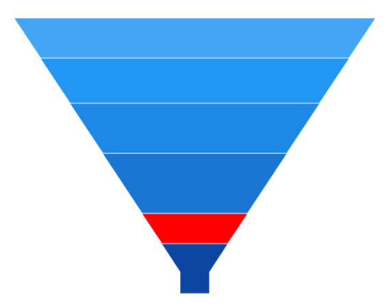
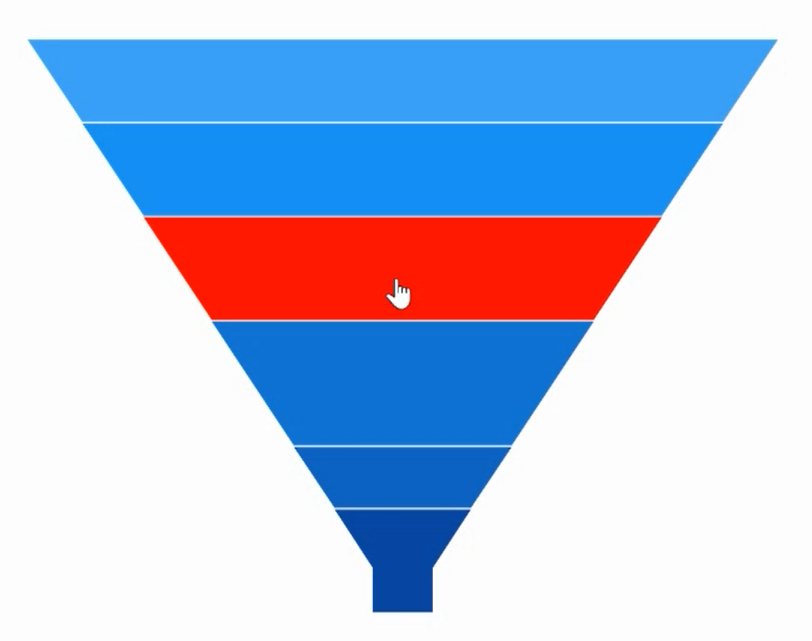

# Selection in WinUI Chart (SfFunnelChart)

Funnel chart supports selection that allows to select a segment in the chart by using [ChartSelectionBehavior](https://help.syncfusion.com/cr/winui/Syncfusion.UI.Xaml.Charts.ChartSelectionBehavior.html). 

## Enable Selection

To enable the selection in chart, create an instance of [ChartSelectionBehavior](https://help.syncfusion.com/cr/winui/Syncfusion.UI.Xaml.Charts.ChartSelectionBehavior.html) and add it to the `Behaviors` collection of funnel chart. And also need to set the [SelectionBrush](https://help.syncfusion.com/cr/winui/Syncfusion.UI.Xaml.Charts.SfFunnelChart.html#Syncfusion_UI_Xaml_Charts_SfFunnelChart_SelectionBrush) property to highlight the segment in the funnel chart.





<chart:SfFunnelChart x:Name="chart" 
                    SelectionBrush="Red"
                    Height="388" Width="500"
                    ItemsSource="{Binding Data}" 
                    XBindingPath="Category"
                    YBindingPath="Value">

    <chart:SfFunnelChart.SelectionBehavior>
        <chart:ChartSelectionBehavior />
    </chart:SfFunnelChart.SelectionBehavior>

</chart:SfFunnelChart>





SfFunnelChart chart = new SfFunnelChart();
chart.SetBinding(SfFunnelChart.ItemsSourceProperty, new Binding() { Path = new PropertyPath("Data") });
chart.XBindingPath = "Category";
chart.YBindingPath = "Value";
chart.SelectionBrush = new SolidColorBrush(Colors.Red);
ChartSelectionBehavior selection = new ChartSelectionBehavior();
chart.SelectionBehavior = selection;
. . .
this.Content = chart;





## Multi-selection

Funnel chart provides support to select multiple segments by using [Type](https://help.syncfusion.com/cr/winui/Syncfusion.UI.Xaml.Charts.ChartSelectionBehavior.html#Syncfusion_UI_Xaml_Charts_ChartSelectionBehavior_Type) property as [MultiPoint](https://help.syncfusion.com/cr/winui/Syncfusion.UI.Xaml.Charts.SelectionType.html#Syncfusion_UI_Xaml_Charts_SelectionType_MultiPoint). By default, the value of [Type](https://help.syncfusion.com/cr/winui/Syncfusion.UI.Xaml.Charts.ChartSelectionBehavior.html#Syncfusion_UI_Xaml_Charts_ChartSelectionBehavior_Type) is [Point](https://help.syncfusion.com/cr/winui/Syncfusion.UI.Xaml.Charts.SelectionType.html#Syncfusion_UI_Xaml_Charts_SelectionType_Point) and it is used for single selection.

N> `Series` and `MultiSeries` selection type is not support for funnel chart.





<chart:SfFunnelChart x:Name="chart"  
                    SelectionBrush="Red"
                    ItemsSource="{Binding Data}" 
                    XBindingPath="Category"
                    YBindingPath="Value">

    <chart:SfFunnelChart.SelectionBehavior>
        <chart:ChartSelectionBehavior Type="MultiPoint"/>
    </chart:SfFunnelChart.SelectionBehavior>
. . .
</chart:SfFunnelChart>





SfFunnelChart chart = new SfFunnelChart();
chart.SetBinding(SfFunnelChart.ItemsSourceProperty, new Binding() { Path = new PropertyPath("Data") });
chart.XBindingPath = "Category";
chart.YBindingPath = "Value";
chart.SelectionBrush = new SolidColorBrush(Colors.Red);
ChartSelectionBehavior selection = new ChartSelectionBehavior();
selection.Type = SelectionType.MultiPoint;
chart.SelectionBehavior = selection;
. . .
this.Content = chart;





## Changing Cursor while Selection

[Cursor](https://help.syncfusion.com/cr/winui/Syncfusion.UI.Xaml.Charts.ChartSelectionBehavior.html#Syncfusion_UI_Xaml_Charts_ChartSelectionBehavior_Cursor) property allows to define the cursor when mouse is hovered over the segment with segment selection enabled.

The following code snippet demonstrates hand cursor in segment selection.





<<chart:SfFunnelChart x:Name="chart"  
                    SelectionBrush="Red"
                    ItemsSource="{Binding Data}" 
                    XBindingPath="Category"
                    YBindingPath="Value">

        <chart:SfFunnelChart.SelectionBehavior>
            <chart:ChartSelectionBehavior Cursor="Hand" />
        </chart:SfFunnelChart.SelectionBehavior>

</chart:SfFunnelChart>





SfFunnelChart chart = new SfFunnelChart();
chart.SetBinding(SfFunnelChart.ItemsSourceProperty, new Binding() { Path = new PropertyPath("Data") });
chart.XBindingPath = "Category";
chart.YBindingPath = "Value";
chart.SelectionBrush = new SolidColorBrush(Colors.Red);
ChartSelectionBehavior selection = new ChartSelectionBehavior();
selection.Cursor = Windows.UI.Core.CoreCursorType.Hand;
chart.SelectionBehavior = selection;
. . .
this.Content = chart;





## Events

The following selection events are available in [SfFunnelChart](https://help.syncfusion.com/cr/winui/Syncfusion.UI.Xaml.Charts.SfFunnelChart.html).

### SelectionChanging

The [SelectionChanging](https://help.syncfusion.com/cr/winui/Syncfusion.UI.Xaml.Charts.ChartBase.html#Syncfusion_UI_Xaml_Charts_ChartBase_SelectionChanging) event occurs before the data point is being selected. This is a cancelable event. This argument contains the following information.

* [SelectedSegment](https://help.syncfusion.com/cr/winui/Syncfusion.UI.Xaml.Charts.ChartSelectionChangingEventArgs.html#Syncfusion_UI_Xaml_Charts_ChartSelectionChangingEventArgs_SelectedSegment) - Gets the segment of the selected data point.
* [SelectedIndex](https://help.syncfusion.com/cr/winui/Syncfusion.UI.Xaml.Charts.ChartSelectionChangingEventArgs.html#Syncfusion_UI_Xaml_Charts_ChartSelectionChangingEventArgs_SelectedIndex) - Gets the selected data point index.
* [PreviousSelectedIndex](https://help.syncfusion.com/cr/winui/Syncfusion.UI.Xaml.Charts.ChartSelectionChangingEventArgs.html#Syncfusion_UI_Xaml_Charts_ChartSelectionChangingEventArgs_PreviousSelectedIndex) - Gets the previous selected data point index.
* [Cancel](https://help.syncfusion.com/cr/winui/Syncfusion.UI.Xaml.Charts.ChartSelectionChangingEventArgs.html#Syncfusion_UI_Xaml_Charts_ChartSelectionChangingEventArgs_Cancel) - Gets or Sets a value that indicates whether the selection should be canceled.

### SelectionChanged

The [SelectionChanged](https://help.syncfusion.com/cr/winui/Syncfusion.UI.Xaml.Charts.ChartBase.html#Syncfusion_UI_Xaml_Charts_ChartBase_SelectionChanged) event occurs after a data point has been selected. This argument contains the following information.

* [SelectedSegment](https://help.syncfusion.com/cr/winui/Syncfusion.UI.Xaml.Charts.ChartSelectionChangedEventArgs.html#Syncfusion_UI_Xaml_Charts_ChartSelectionChangedEventArgs_SelectedSegment) - Gets the segment of the selected data point.
* [SelectedIndex](https://help.syncfusion.com/cr/winui/Syncfusion.UI.Xaml.Charts.ChartSelectionChangedEventArgs.html#Syncfusion_UI_Xaml_Charts_ChartSelectionChangedEventArgs_SelectedIndex) - Gets the selected data point index.
* [PreviousSelectedSegment](https://help.syncfusion.com/cr/winui/Syncfusion.UI.Xaml.Charts.ChartSelectionChangedEventArgs.html#Syncfusion_UI_Xaml_Charts_ChartSelectionChangedEventArgs_PreviousSelectedSegment) - Gets the segment of previous selected data point.
* [PreviousSelectedIndex](https://help.syncfusion.com/cr/winui/Syncfusion.UI.Xaml.Charts.ChartSelectionChangedEventArgs.html#Syncfusion_UI_Xaml_Charts_ChartSelectionChangedEventArgs_PreviousSelectedIndex) - Gets the previous selected data point index.
