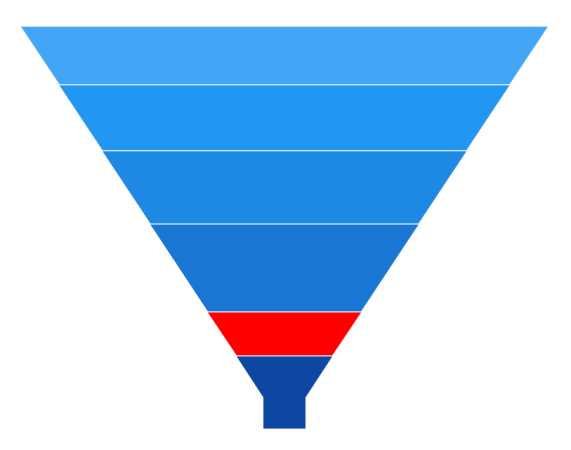
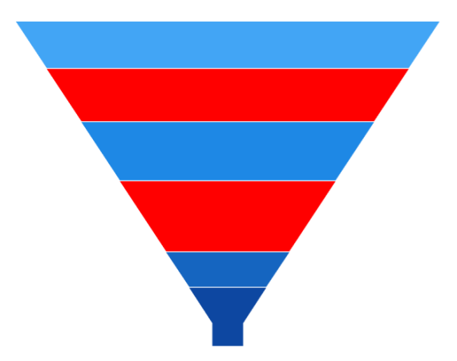

# Selection in WinUI Chart (SfFunnelChart)

The funnel chart supports selecting a segment in the chart using the [SelectionBehavior](https://help.syncfusion.com/cr/winui/Syncfusion.UI.Xaml.Charts.SfFunnelChart.html#Syncfusion_UI_Xaml_Charts_SfFunnelChart_SelectionBehavior).

## Properties

The selection feature can be configured using the following properties:

* [Type](https://help.syncfusion.com/cr/winui/Syncfusion.UI.Xaml.Charts.ChartSelectionBehavior.html#Syncfusion_UI_Xaml_Charts_ChartSelectionBehavior_Type) - Gets or sets the [ChartSelectionType](https://help.syncfusion.com/cr/winui/Syncfusion.UI.Xaml.Charts.ChartSelectionType.html) Enum value for the selection behavior. 

    The following [ChartSelectionType](https://help.syncfusion.com/cr/winui/Syncfusion.UI.Xaml.Charts.ChartSelectionType.html) can be achieved during selection:
    * Single - Allows selecting a single segment.
    * SingleDeselect - Allows selecting and deselecting a single segment.
    * Multiple - Allows selecting multiple segments.
    * None - Restricts the segment selection.

* [SelectionBrush](https://help.syncfusion.com/cr/winui/Syncfusion.UI.Xaml.Charts.ChartSelectionBehavior.html#Syncfusion_UI_Xaml_Charts_ChartSelectionBehavior_SelectionBrush) - Gets or sets the SelectionBrush color value for selection behavior.
* [SelectedIndex](https://help.syncfusion.com/cr/winui/Syncfusion.UI.Xaml.Charts.ChartSelectionBehavior.html#Syncfusion_UI_Xaml_Charts_ChartSelectionBehavior_SelectedIndex) - Gets or sets the index value of the segment that should be selected during the selection.
* [SelectedIndexes](https://help.syncfusion.com/cr/winui/Syncfusion.UI.Xaml.Charts.ChartSelectionBehavior.html#Syncfusion_UI_Xaml_Charts_ChartSelectionBehavior_SelectedIndexes) - Gets or sets the list of indexes of the segments that should be selected during the selection.

## Enable Selection

To enable the selection in the chart, create an instance of the [DataPointSelectionBehavior](https://help.syncfusion.com/cr/winui/Syncfusion.UI.Xaml.Charts.DataPointSelectionBehavior.html) and set it to the [SelectionBehavior](https://help.syncfusion.com/cr/winui/Syncfusion.UI.Xaml.Charts.SfFunnelChart.html#Syncfusion_UI_Xaml_Charts_SfFunnelChart_SelectionBehavior) of the funnel chart. Also, set the [SelectionBrush](https://help.syncfusion.com/cr/winui/Syncfusion.UI.Xaml.Charts.ChartSelectionBehavior.html#Syncfusion_UI_Xaml_Charts_ChartSelectionBehavior_SelectionBrush) property to highlight the segment in the funnel chart.





<chart:SfFunnelChart x:Name="chart" 
                     Height="388"
                     Width="500"
                     ItemsSource="{Binding Data}" 
                     XBindingPath="Category"
                     YBindingPath="Value">

    <chart:SfFunnelChart.SelectionBehavior>
        <chart:DataPointSelectionBehavior SelectionBrush="Red"/>
    </chart:SfFunnelChart.SelectionBehavior>

</chart:SfFunnelChart>





SfFunnelChart chart = new SfFunnelChart();
chart.SetBinding(SfFunnelChart.ItemsSourceProperty, new Binding() { Path = new PropertyPath("Data") });
chart.XBindingPath = "Category";
chart.YBindingPath = "Value";
DataPointSelectionBehavior selection = new DataPointSelectionBehavior()
{
    SelectionBrush = new SolidColorBrush(Colors.Red),
};
chart.SelectionBehavior = selection;
. . .
this.Content = chart;





## Multi-selection

The funnel chart provides support to select multiple segments by using the [Type](https://help.syncfusion.com/cr/winui/Syncfusion.UI.Xaml.Charts.ChartSelectionBehavior.html#Syncfusion_UI_Xaml_Charts_ChartSelectionBehavior_Type) property as [Multiple](https://help.syncfusion.com/cr/winui/Syncfusion.UI.Xaml.Charts.ChartSelectionType.html#Syncfusion_UI_Xaml_Charts_ChartSelectionType_Multiple). By default, the value of [Type](https://help.syncfusion.com/cr/winui/Syncfusion.UI.Xaml.Charts.ChartSelectionBehavior.html#Syncfusion_UI_Xaml_Charts_ChartSelectionBehavior_Type) is [Single](https://help.syncfusion.com/cr/winui/Syncfusion.UI.Xaml.Charts.ChartSelectionType.html#Syncfusion_UI_Xaml_Charts_ChartSelectionType_Single) to allow single selection.

N> The `Series` and `MultiSeries` selection types are not supported for the funnel chart.





<chart:SfFunnelChart x:Name="chart"  
                     ItemsSource="{Binding Data}" 
                     XBindingPath="Category"
                     YBindingPath="Value">

    <chart:SfFunnelChart.SelectionBehavior>
        <chart:DataPointSelectionBehavior SelectionBrush="Red"
										  Type="Multiple"/>
    </chart:SfFunnelChart.SelectionBehavior>
. . .
</chart:SfFunnelChart>





SfFunnelChart chart = new SfFunnelChart();
chart.SetBinding(SfFunnelChart.ItemsSourceProperty, new Binding() { Path = new PropertyPath("Data") });
chart.XBindingPath = "Category";
chart.YBindingPath = "Value";
DataPointSelectionBehavior selection = new DataPointSelectionBehavior()
{
    SelectionBrush = new SolidColorBrush(Colors.Red),
    Type = ChartSelectionType.Multiple,
};
chart.SelectionBehavior = selection;
. . .
this.Content = chart;





## Selection on Initial Rendering

### SelectedIndex

The funnel chart allows selecting a point programmatically on a chart using the [SelectedIndex](https://help.syncfusion.com/cr/winui/Syncfusion.UI.Xaml.Charts.ChartSelectionBehavior.html#Syncfusion_UI_Xaml_Charts_ChartSelectionBehavior_SelectedIndex) property of the [DataPointSelectionBehavior](https://help.syncfusion.com/cr/winui/Syncfusion.UI.Xaml.Charts.DataPointSelectionBehavior.html).





<chart:SfFunnelChart x:Name="chart" 
                     Height="388" Width="500"
                     ItemsSource="{Binding Data}" 
                     XBindingPath="Category"
                     YBindingPath="Value">

    <chart:SfFunnelChart.SelectionBehavior>
        <chart:DataPointSelectionBehavior SelectionBrush="Red"
										  SelectedIndex="2"/>
    </chart:SfFunnelChart.SelectionBehavior>

</chart:SfFunnelChart>





SfFunnelChart chart = new SfFunnelChart();
chart.SetBinding(SfFunnelChart.ItemsSourceProperty, new Binding() { Path = new PropertyPath("Data") });
chart.XBindingPath = "Category";
chart.YBindingPath = "Value";
DataPointSelectionBehavior selection = new DataPointSelectionBehavior()
{
    SelectionBrush = new SolidColorBrush(Colors.Red),
    SelectedIndex= 2
};
chart.SelectionBehavior = selection;
. . .
this.Content = chart;





### SelectedIndexes

The funnel chart allows selecting multiple points programmatically using the [SelectedIndexes](https://help.syncfusion.com/cr/winui/Syncfusion.UI.Xaml.Charts.ChartSelectionBehavior.html#Syncfusion_UI_Xaml_Charts_ChartSelectionBehavior_SelectedIndexes) property of [DataPointSelectionBehavior](https://help.syncfusion.com/cr/winui/Syncfusion.UI.Xaml.Charts.DataPointSelectionBehavior.html).





<chart:SfFunnelChart x:Name="chart"  
                     ItemsSource="{Binding Data}" 
                     XBindingPath="Category"
                     YBindingPath="Value">

    <chart:SfFunnelChart.SelectionBehavior>
        <chart:DataPointSelectionBehavior SelectionBrush="Red" 
										  Type="Multiple"
        SelectedIndexes="{Binding SelectedIndexes}"/>
    </chart:SfFunnelChart.SelectionBehavior>
. . .
</chart:SfFunnelChart>





SfFunnelChart chart = new SfFunnelChart();
chart.SetBinding(SfFunnelChart.ItemsSourceProperty, new Binding() { Path = new PropertyPath("Data") });
chart.XBindingPath = "Category";
chart.YBindingPath = "Value";
DataPointSelectionBehavior selection = new DataPointSelectionBehavior()
{
    SelectionBrush = new SolidColorBrush(Colors.Red),
    Type = ChartSelectionType.Multiple,
    SelectedIndexes = new List<int>() { 2, 3, 4 }
};
chart.SelectionBehavior = selection;
. . .
this.Content = chart;





## Events

The following selection events are available in the [ChartSelectionBehavior](https://help.syncfusion.com/cr/winui/Syncfusion.UI.Xaml.Charts.ChartSelectionBehavior.html).

### SelectionChanging

The [SelectionChanging](https://help.syncfusion.com/cr/winui/Syncfusion.UI.Xaml.Charts.ChartSelectionBehavior.html#Syncfusion_UI_Xaml_Charts_ChartSelectionBehavior_SelectionChanging) event occurs before the data point is selected. This is a cancelable event. The [ChartSelectionChangingEventArgs](https://help.syncfusion.com/cr/winui/Syncfusion.UI.Xaml.Charts.ChartSelectionChangingEventArgs.html) contains the following information:

* [NewIndexes](https://help.syncfusion.com/cr/winui/Syncfusion.UI.Xaml.Charts.ChartSelectionChangingEventArgs.html#Syncfusion_UI_Xaml_Charts_ChartSelectionChangingEventArgs_NewIndexes) - Gets the collection of the selected data point index. Here, NewIndexes[0] is the currently selected index.
* [OldIndexes](https://help.syncfusion.com/cr/winui/Syncfusion.UI.Xaml.Charts.ChartSelectionChangingEventArgs.html#Syncfusion_UI_Xaml_Charts_ChartSelectionChangingEventArgs_OldIndexes) - Gets the collection of the previously selected data point index. Here, OldIndexes[0] is the currently unselected index.
* [Cancel](https://docs.microsoft.com/en-us/dotnet/api/system.componentmodel.canceleventargs.cancel?view=net-6.0) - Gets or sets a value that indicates whether the selection should be canceled.

### SelectionChanged

The [SelectionChanged](https://help.syncfusion.com/cr/winui/Syncfusion.UI.Xaml.Charts.ChartSelectionBehavior.html#Syncfusion_UI_Xaml_Charts_ChartSelectionBehavior_SelectionChanged) event occurs after a data point has been selected. The [ChartSelectionChangedEventArgs](https://help.syncfusion.com/cr/winui/Syncfusion.UI.Xaml.Charts.ChartSelectionChangedEventArgs.html) contains the following information:

* [NewIndexes](https://help.syncfusion.com/cr/winui/Syncfusion.UI.Xaml.Charts.ChartSelectionChangedEventArgs.html#Syncfusion_UI_Xaml_Charts_ChartSelectionChangedEventArgs_NewIndexes) - Gets the collection of the selected data point index. Here, NewIndexes[0] is the currently selected index.
* [OldIndexes](https://help.syncfusion.com/cr/winui/Syncfusion.UI.Xaml.Charts.ChartSelectionChangedEventArgs.html#Syncfusion_UI_Xaml_Charts_ChartSelectionChangedEventArgs_OldIndexes) - Gets the collection of the previously selected data point index. Here, OldIndexes[0] is the currently unselected index.
