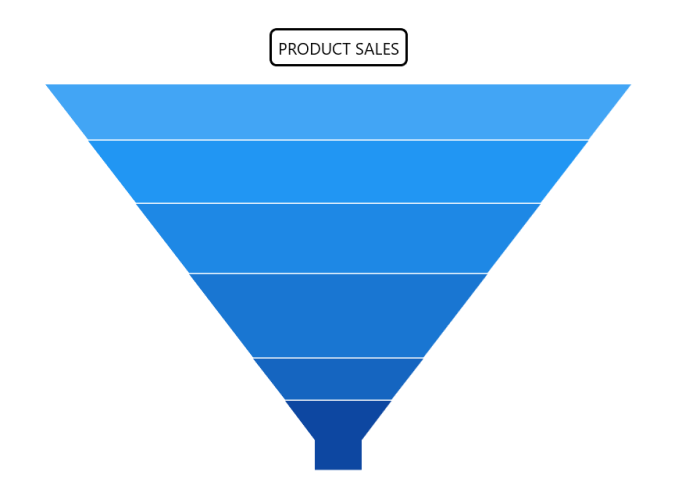
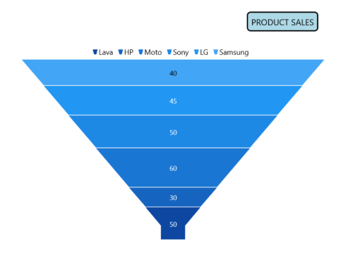

# Chart Title in WinUI Chart (SfFunnelChart)

[Header](https://help.syncfusion.com/cr/winui/Syncfusion.UI.Xaml.Charts.ChartBase.html#Syncfusion_UI_Xaml_Charts_ChartBase_Header) property is used to define the title for the chart.

   



<chart:SfFunnelChart x:Name="chart" Header="PRODUCT SALES">
 . . .           
</chart:SfFunnelChart>





SfFunnelChart chart = new SfFunnelChart();
chart.Header = "PRODUCT SALES";
. . . 
this.Content = chart;



 

## Customization

[Header](https://help.syncfusion.com/cr/winui/Syncfusion.UI.Xaml.Charts.ChartBase.html#Syncfusion_UI_Xaml_Charts_ChartBase_Header) property of [SfFunnelChart](https://help.syncfusion.com/cr/winui/Syncfusion.UI.Xaml.Charts.SfFunnelChart.html) is used to define and customize the chart title. It accepts any object (.Net object) as content for the chart header.

   



 <chart:SfFunnelChart>

    <chart:SfFunnelChart.Header>
        <Border BorderThickness="2" BorderBrush="Black" Margin="10" CornerRadius="5">
            <TextBlock FontSize="14" Text="PRODUCT SALES" Margin="5"/>
        </Border>
    </chart:SfFunnelChart.Header>
            
</chart:SfFunnelChart>





    SfFunnelChart chart = new SfFunnelChart();
    . . .
    Border border = new Border()
    {
        BorderThickness = new Thickness(2),
        BorderBrush = new SolidColorBrush(Colors.Black),
        Margin = new Thickness(10),
        CornerRadius = new CornerRadius(5)
    };

    TextBlock textBlock = new TextBlock()
    {
        Text = "PRODUCT SALES",
        Margin = new Thickness(5),
        FontSize = 14
    };

    border.Child = textBlock;
    chart.Header = border;
    . . . 
    this.Content = chart;



 

## Alignment

The title text content can be aligned horizontally to the left, center or right of the chart using the [HorizontalHeaderAlignment](https://help.syncfusion.com/cr/winui/Syncfusion.UI.Xaml.Charts.ChartBase.html#Syncfusion_UI_Xaml_Charts_ChartBase_HorizontalHeaderAlignment) property of the [SfFunnelChart](https://help.syncfusion.com/cr/winui/Syncfusion.UI.Xaml.Charts.SfFunnelChart.html).

   



 <chart:SfFunnelChart x:Name="chart" 
                HorizontalHeaderAlignment="Right"
                ShowDataLabels="True"
                Height="388" Width="500" 
                ItemsSource="{Binding Data}" 
                XBindingPath="Category"
                YBindingPath="Value">
                
            <chart:SfFunnelChart.Header>
                <Border BorderThickness="2" Background="LightBlue" BorderBrush="Black" Margin="10" CornerRadius="5">
                    <TextBlock FontSize="14" Text="PRODUCT SALES" Margin="5"/>
                </Border>
            </chart:SfFunnelChart.Header>

            <chart:SfFunnelChart.DataContext>
                <model:ChartViewModel />
            </chart:SfFunnelChart.DataContext>

            <chart:SfFunnelChart.Legend>
                <chart:ChartLegend />
            </chart:SfFunnelChart.Legend>
            
</chart:SfFunnelChart>





public sealed partial class MainPage : Page
{
    public MainPage()
    {
        this.InitializeComponent();
            
        SfFunnelChart chart = new SfFunnelChart();
        ChartViewModel viewModel = new ChartViewModel();
        chart.DataContext = viewModel;
        chart.SetBinding(SfFunnelChart.ItemsSourceProperty, new Binding() { Path = new PropertyPath("Data") });
        chart.HorizontalHeaderAlignment = HorizontalAlignment.Right;
        chart.XBindingPath = "Category";
        chart.YBindingPath = "Value";
        chart.Height = 388;
        chart.Width = 500;

        Border border = new Border()
        {
            BorderThickness = new Thickness(2),
            BorderBrush = new SolidColorBrush(Colors.Black),
            Background = new SolidColorBrush(Colors.LightBlue),
            Margin = new Thickness(10),
            CornerRadius = new CornerRadius(5)
        };

        TextBlock textBlock = new TextBlock()
        {
            Text = "PRODUCT SALES",
            Margin = new Thickness(5),
            FontSize = 14
        };

        border.Child = textBlock;
        chart.Header = border;
        chart.Legend = new ChartLegend();
        chart.ShowDataLabels = true;

        this.Content = chart;
    }
}



 

