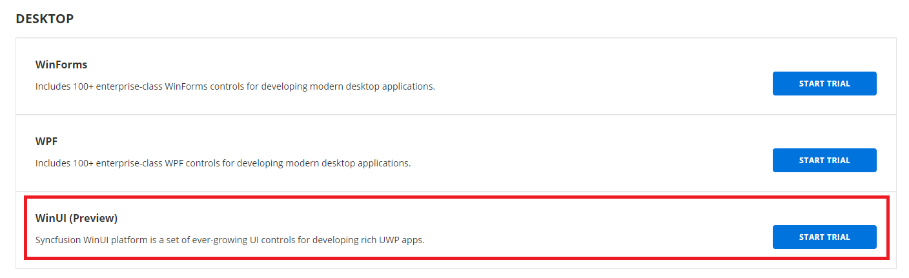

# Download WinUI Installer

The Syncfusion WinUI installer can be downloaded from the [Syncfusion](https://www.syncfusion.com/winui-controls) website. You can either download the licensed installer or try our trial installer depending on your license. 

   -	Trial Installer for evaluation customers,
   -	Licensed Installer for paid customers.

## Download the Trial Version

Our 30-day trial can be downloaded in two ways.

   * Free Trial Page
   * Start Trial Page

### Free Trial Page

1. You can evaluate our 30-day free trial by visiting the [Free Trial](https://www.syncfusion.com/downloads) page.
2. After completing the required form or logging in with your registered Syncfusion account, you can download the trial installer from the confirmation page. 
3. With a trial license, only the latest version's trial installer can be downloaded.
4. After downloading, the Syncfusion WinUI trial installer can be unlocked using either the trial unlock key or the Syncfusion registered login credential.
5. The trial installer can be downloaded at any time from your registered account's [Trials & Downloads](https://www.syncfusion.com/account/manage-trials/downloads) page before the trial expires. (See the screenshot below.)
 
   

### Start Trial Page
1. You can also evaluate our 30-day free trial from the [Start Trial](https://www.syncfusion.com/account/manage-trials/start-trials) page.
   
   
   
2. To access this page, you must log in with your Syncfusion account.
3. Begin your trial by selecting the WinUI product. 

   N> If you've already used the trial products and they haven't expired, you won't be able to start the trial for the same product again.

4. After you've started the trial, go to the [Trials & Downloads](https://www.syncfusion.com/account/manage-trials/downloads) page to get the latest version trial installer. 
5. You can find your current active trial products on the [Trials & Downloads](https://www.syncfusion.com/account/manage-trials/downloads) page. Trials completed on both the Free Trial Page and the Start Trial Page are listed here.
6. Click the Download (element 1 in the screenshot below) button to get the Syncfusion Essential Studio WinUI web installer.

   

7. Click the More Download Options (element 2 in the above screenshot) button to get the Essential Studio WinUI Offline trial installer which is available in EXE and ZIP format.

   

   

## Download the License Version

1. Syncfusion licensed products will be available in the [License & Downloads](https://www.syncfusion.com/account/downloads) page under your registered Syncfusion account.
2. You can view all the licenses (both active and expired) associated with your account.
3. Click the Download (element 1 in the screenshot below) button to download the respective product's installer.
4. The most recent version of the installer will be downloaded from this page.
5. To download older version installers, go to [Downloads Older Versions](https://www.syncfusion.com/account/downloads/studio) (element 2 in the screenshot below).
6. You can download other platform\add-on installers by going to More Downloads Options (element 3 in the screenshot below).
7. For Windows OS, EXE and Zip formats are available for download. They are both Offline Installers.

    
	

You can also refer to the [**Online installer**](https://help.syncfusion.com/winui/installation-and-upgrade/install-using-the-web-installer) and [**Offline installer**](https://help.syncfusion.com/winui/installation-and-upgrade/install-using-the-offline-installer) links for step-by-step installation guidelines.	