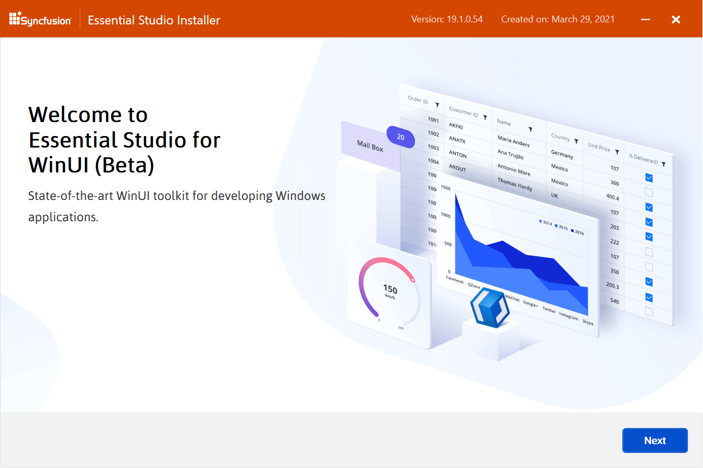
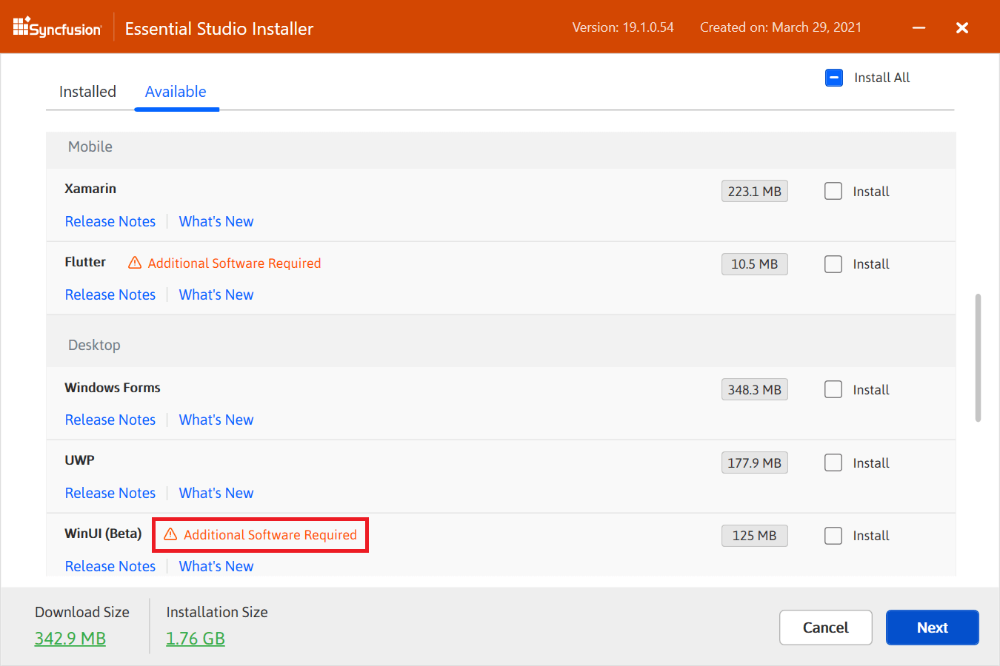
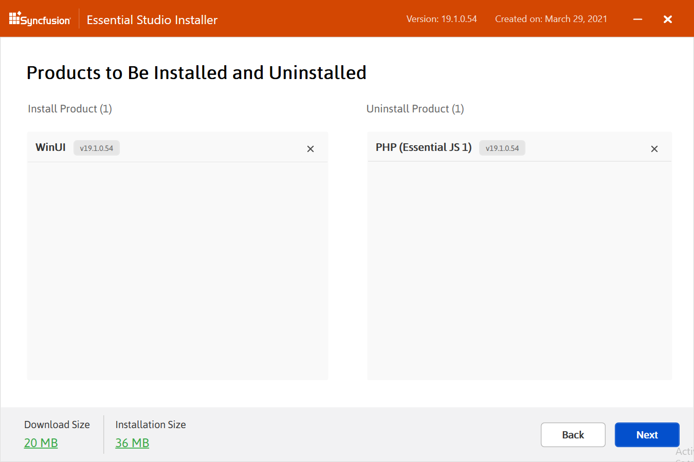
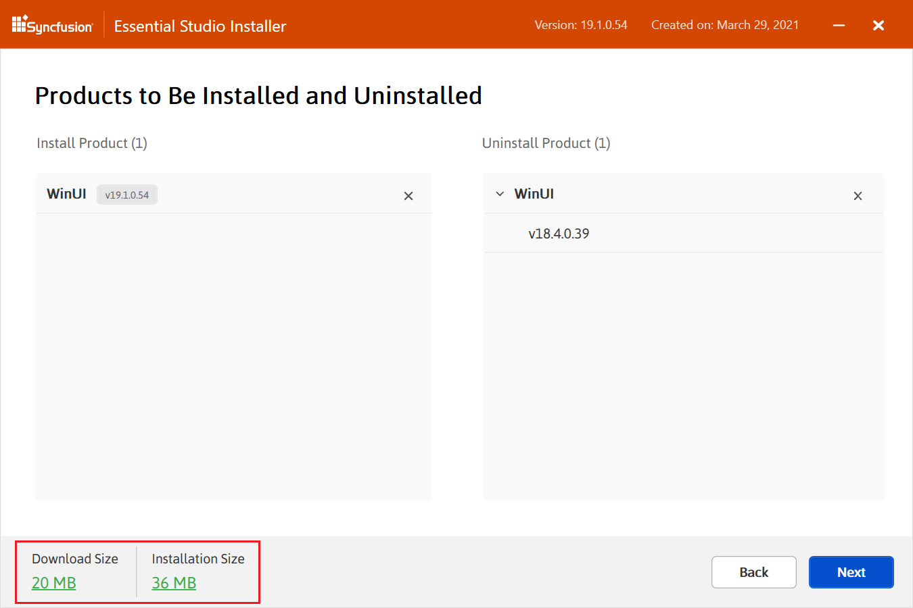
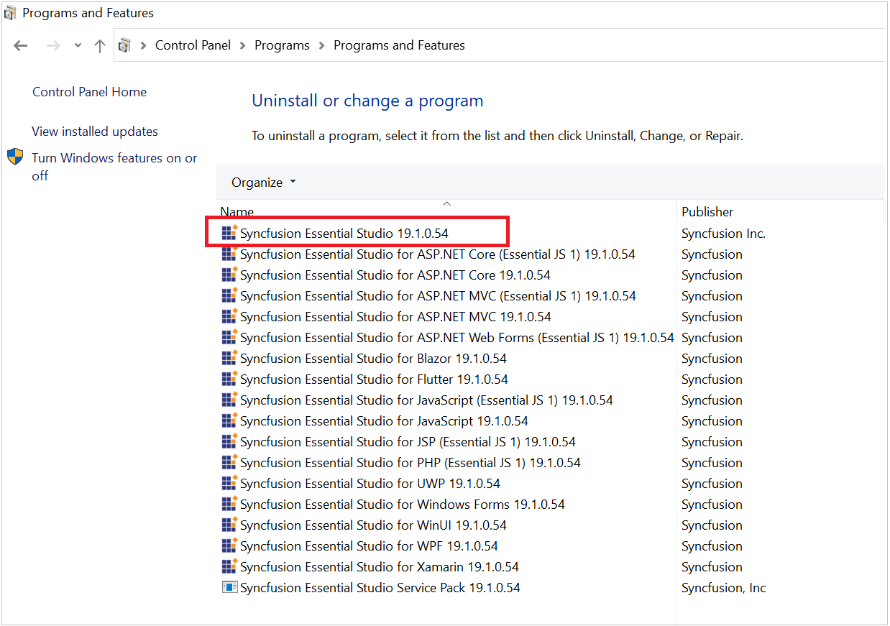
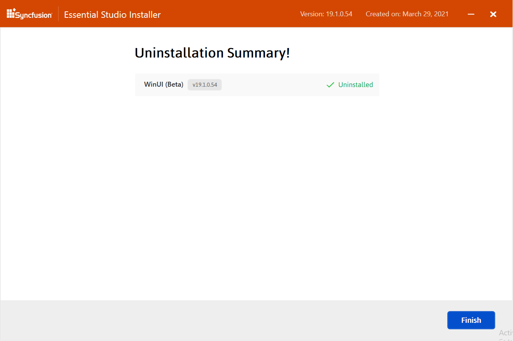

# Installation using Web Installer

## Overview

For the Essential Studio WinUI platform, Syncfusion offers a Web Installer. This installer alleviates the burden of downloading a larger installer. You can simply download and run the online installer, which will be smaller in size and will download and install the Essential Studio products you have chosen. You can get the most recent version of Essential Studio Web Installer [here](https://www.syncfusion.com/downloads/latest-version). The platforms listed below are included in the Essential Studio Web Installer. 

**Web (Essential JS 2)**

* ASP.NET MVC
* ASP.NET Core
* JavaScript

**Mobile**

* Xamarin
* Flutter

**Desktop**

* Windows Forms
* WPF
* Universal Windows Platform
* WinUI(Preview)

**FileFormats**

* Read and Write Excel, Word, PDF and PowerPoint files

**Web (Essential JS 1)**

* ASP.NET Web Forms
* ASP.NET MVC
* ASP.NET Core
* JavaScript
* PHP
* JSP

 
## Installation

The steps below show how to install Essential Studio WinUI Web Installer.

1.  Open the Syncfusion Essential Studio WinUI Web Installer file by double-clicking it. The Installer Wizard automatically opens and extracts the package.

    

    
    N> The installer wizard extracts the syncfusionessentialwinuiwebinstaller_{version}.exe dialog, which displays the package's unzip operation.
    
2. 	The Syncfusion WinUI Web Installer's welcome wizard will be displayed. Click the Next button.

    

  
3.  The Platform Selection Wizard will appear. From the **Available** tab, select the platforms to be installed. Select the **Install All** checkbox to install all platforms. Click the Next button.
    
	
	
	I> If the required software for the selected platform isn't already installed, the **Additional Software Required** alert will appear. You can, however, continue the installation and install the necessary software later.
	
	**Required Software**
	
	
		
	
4.	If previous version(s) installed for the selected platforms, then Uninstall previous version wizard will be displayed. Here you can view the list of installed previous versions for the selected platforms. Select **Uninstall All** checkbox to select all the versions. Click Next.

	
	
	N> From the 2021 Volume 1 release, Syncfusion has provided option to uninstall the previous versions from 18.1 while installing the new version.
	
	
5.	Pop up screen will be displayed to get the confirmation to uninstall selected previous versions.

	
	
	
6. 	The Confirmation Wizard will appear. You can view and modify the list of platforms that will be installed from this page.

    
	
	N> By clicking the **Download Size and Installation** Size links, you can determine the approximate size of the download and installation
	
	

7.  The Configuration Wizard will appear. You can change the Download, Install, and Demos locations from here. You can also change the Additional settings on a platform-by-platform basis. Click Next to install with the default settings.

    
	
	**Additional settings**
	
    * Select the **Install Demos** check box to install Syncfusion samples, or leave the check box unchecked, if you do not want to install Syncfusion samples.
    * Check the **Create Desktop Shortcut** checkbox to add a desktop shortcut for Syncfusion Control Panel.
    * Check the **Create Start Menu Shortcut** checkbox to add a shortcut to the start menu for Syncfusion Control Panel.

8.  After reading the License Terms and Conditions, check the **I agree to the License Terms and Privacy Policy** check box. Click the Next button.

9.  The login wizard will appear. You must enter your Syncfusion email address and password. If you do not already have a Syncfusion account, you can create one by clicking on **Create an Account**. If you have forgotten your password, click **Forgot Password** to create a new one. Click the Install button. 

    
	
	I> The platforms you have chosen will be installed based on your Syncfusion License (Trial or Licensed).

10. The download and installation progress will be shown.

    

11. When the installation is finished, the **Summary** wizard will appear. Here you can see the list of platforms that have been installed successfully and those that have failed. To close the Summary wizard, click Finish. 

    
	
	* To open the Syncfusion Control Panel, click **Launch Control Panel**.

12. You can find the Essential Studio installed information from the windows control panel.

    
	
	N> Starting with the version v18.1 (2020 Volume 1 release), Syncfusion started providing separate entry in windows control panel for Essential Studio. 
	
	
## Uninstallation

Syncfusion provides the option to uninstall platforms of the same version directly from the Web Installer application. Select the platforms to be uninstalled from the list, and Web Installer will uninstall them one by one.

The steps below show how to uninstall Essential Studio Platform using Web Installer.

1.  Open the Syncfusion Essential Studio Platform WinUI Online Installer file by double-clicking it. The Installer Wizard automatically opens and extracts the package

    
	
2.  The Syncfusion WinUI Web Installer's welcome wizard will be displayed. Click the Next button

    
   
3.  The Platform Selection Wizard will appear. From the Installed tab, select the platforms to be uninstalled. To select all platforms, check the **Uninstall All** checkbox. Click the Next button.
    
	
	
4. 	The Confirmation Wizard will appear. You can view and modify the list of platforms that will be uninstalled from this page. Uninstall by clicking the Uninstall button

    
	
5.  The uninstallation progress will be shown.
  
    
	
6.  When the uninstallation is finished, the **Summary** wizard will appear. Here you can see the list of platforms that have been successfully and unsuccessfully uninstalled. To close the Summary wizard, click Finish

    
	
	
## Installation and Uninstallation

From the Web Installer application, Syncfusion allows you to install and uninstall platforms of the same version.

The steps below show how to install and uninstall Essential Studio WinUI and other platforms from Web Installer.

1.  Open the Syncfusion Essential Studio WinUI Web Installer file by double-clicking it. The Installer Wizard automatically opens and extracts the package.

    
	
2.	The Syncfusion WinUI Web Installer's welcome wizard will be displayed. Click the Next button.

    
   
3.	The Platform Selection Wizard will appear. Choose the platforms to install from the **Available** tab and the platforms to uninstall from the **Installed** tab. Click the Next button.

    **Available**
	
    
	
    **Installed**
	
    
	
4.	The Confirmation Wizard will appear. You can view and modify the list of platforms that will be installed/uninstalled from this page.

	
	
	N> By clicking the **Download Size and Installation Size** links, you can determine the approximate size of the download and installation.
	
	
	
5.	Pop up screen will be displayed to get the confirmation to uninstall selected previous versions.

		

6.	The Configuration Wizard will appear. You can change the Download, Install, and Demos locations from here. You can also change the Additional settings on a platform-by-platform basis. Click Next to install with the default settings.

    
	
7.	After reading the License Terms and Conditions, check the **I agree to the License Terms and Privacy Policy** check box. Click the Next button.

8.	The login wizard will appear. You must enter your Syncfusion email address and password. If you do not already have a Syncfusion account, you can create one by clicking on **Create an Account**. If you have forgotten your password, click **Forgot Password** to create a new one. Click the Install button.

    
	
	I> The platforms you have chosen will be installed based on your Syncfusion License (Trial or Licensed).

9.	The download, installation, and uninstallation progresses will be shown.

    

10.	When the installation is finished, the **Summary** wizard will appear. Here you can see the list of platforms that have been successfully and unsuccessfully installed/uninstalled. To close the Summary wizard, click Finish.

    
	
	* To open the Syncfusion Control Panel, click **Launch Control Panel**.

