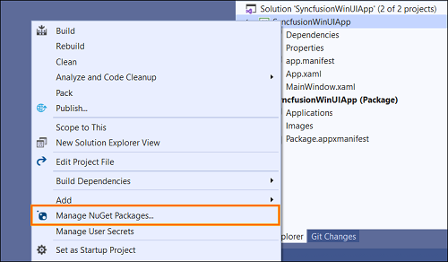
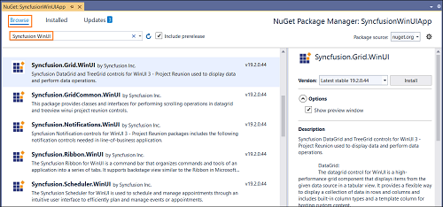
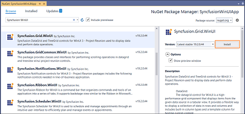
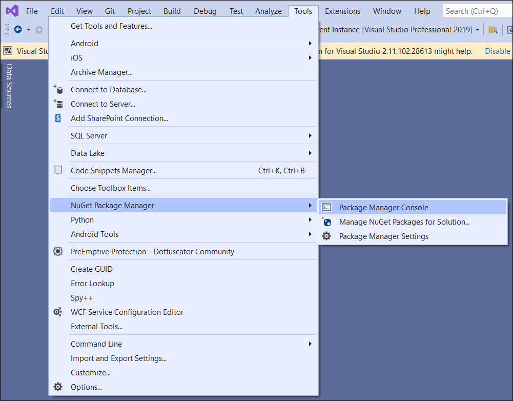
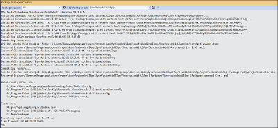
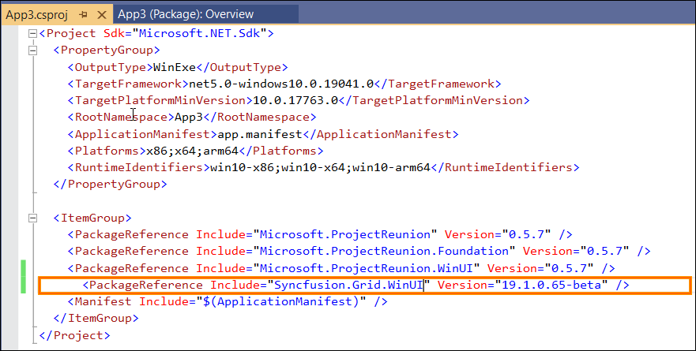

# Install Syncfusion WinUI NuGet packages

## Overview

**NuGet** is a package management system for Visual Studio. It makes it easy to add, update, and remove external libraries in your application. Syncfusion publishes all WinUI NuGet packages to [nuget.org](https://www.nuget.org/packages?q=syncfusion+winui). The Syncfusion WinUI NuGet packages can be used without installing the Syncfusion installer. You can simply consume the Syncfusion WinUI NuGet packages in your WinUI application to develop with the Syncfusion WinUI controls.

N> Syncfusion WinUI NuGet packages are available from v18.3.0.35 (Essential Studio 2020 Volume 3).

## Prerequisites

* Visual Studio 2019 version 16.10 or later, or Visual Studio 2022, with the **Windows App SDK** workload installed.
* A WinUI project that targets `net5.0-windows10.0.19041.0` or later, with the Windows App SDK reference.
* An active internet connection to reach the [nuget.org](https://www.nuget.org/) feed.
* If you plan to use the CLI method, install the [.NET SDK](https://learn.microsoft.com/en-us/dotnet/core/sdk) matching your project target framework.

## Installation using Package Manager UI

The NuGet **Package Manager UI** allows you to search, install, uninstall, and update Syncfusion WinUI NuGet packages in your projects and solutions. You can find and install the Syncfusion WinUI NuGet packages in your Visual Studio WinUI application by following the steps below:

1. Right-click the WinUI project or solution in **Solution Explorer** and choose **Manage NuGet Packages...**

    

    As an alternative, after opening the WinUI application in Visual Studio, go to the **Tools** menu, hover **NuGet Package Manager**, and then select **Manage NuGet Packages for Solution...**

2. The **Manage NuGet Packages** window will open. Navigate to the **Browse** tab, then search for the Syncfusion WinUI NuGet packages using a term like **"Syncfusion WinUI"**, and select the appropriate Syncfusion WinUI NuGet package for your development.

    N> The [nuget.org](https://api.nuget.org/v3/index.json) package source is selected by default in the **Package source** drop-down. If your Visual Studio does not have nuget.org configured, follow the instructions in the [Microsoft documents](https://learn.microsoft.com/en-us/nuget/tools/package-manager-ui#package-sources) to set up the nuget.org feed URL.    

    

    N> Check the **Include prerelease** check box if you want to search and install the Syncfusion WinUI beta NuGet packages.

3. When you select a WinUI package, the right panel will provide more information about it.

4. By default, the package is selected with the latest version. Choose the required version, click the **Install** button, and accept the license terms. The package will be added to your WinUI application.

    

5. Your application now has all the required Syncfusion assemblies, and you are ready to start building a high-performance, responsive app with [Syncfusion WinUI controls](https://www.syncfusion.com/winui-controls). You can also refer to the [WinUI help document](https://help.syncfusion.com/winui/overview) for development.

## Installation using Package Manager Console

The **Package Manager Console** saves NuGet package installation time: you do not have to search for the Syncfusion WinUI NuGet package you want to install, and you can just type the installation command to install the appropriate Syncfusion WinUI NuGet package. Follow the instructions below to use the Package Manager Console to reference the Syncfusion WinUI component as NuGet packages in your WinUI application.

1. To show the Package Manager Console, open your WinUI application in Visual Studio, navigate to **Tools**, hover **NuGet Package Manager**, and then select **Package Manager Console**.

    

2. The **Package Manager Console** will appear at the bottom of the screen. Install the Syncfusion WinUI NuGet packages by entering the following NuGet installation commands.
 
    **Install a specified Syncfusion WinUI NuGet package**

    The command below installs the Syncfusion WinUI NuGet package in the default WinUI project of the application.

    ```powershell
    Install-Package <Package Name>
    ```

    **For example:**

    ```powershell
    Install-Package Syncfusion.Grid.WinUI
    ```

    N> You can find the list of Syncfusion WinUI NuGet packages published to nuget.org [here](https://www.nuget.org/packages?q=Tags%3A%22winui%22+syncfusion).

    **Install a specified Syncfusion WinUI NuGet package in a specified WinUI project**

    The command below installs the Syncfusion WinUI NuGet package in the given WinUI project of the application.

    ```powershell
    Install-Package <Package Name> -ProjectName <Project Name>
    ```

    **For example:**

    ```powershell
    Install-Package Syncfusion.Grid.WinUI -ProjectName SyncfusionWinUIApp
    ```

    N> You must use the **-prerelease** term with the NuGet installation command (`Install-Package Syncfusion.Grid.WinUI -prerelease`) if you want to install the Syncfusion WinUI beta NuGet packages.

3. By default, the package is installed with the latest version. Specify the required version with the `-Version` term to install a particular version, as shown below:

    ```powershell
    Install-Package Syncfusion.Grid.WinUI -Version 19.2.0.44
    ```

    

4. The NuGet Package Manager Console installs the Syncfusion WinUI NuGet package together with its dependencies. When the installation is complete, the console shows that your Syncfusion WinUI package has been successfully added to the project.

5. Your application now has all the required Syncfusion assemblies, and you are ready to start building a high-performance, responsive app with [Syncfusion WinUI controls](https://www.syncfusion.com/winui-controls). You can also refer to the [WinUI help document](https://help.syncfusion.com/winui/overview) for development.

## Installation using Dotnet (.NET) CLI

The [dotnet Command Line Interface (CLI)](https://learn.microsoft.com/en-us/nuget/consume-packages/install-use-packages-dotnet-cli) allows you to add, restore, pack, publish, and manage packages without making any changes to your project files. [dotnet add package](https://learn.microsoft.com/en-us/dotnet/core/tools/dotnet-add-package?tabs=netcore2x) adds a package reference to the project file, then runs [dotnet restore](https://learn.microsoft.com/en-us/dotnet/core/tools/dotnet-restore?tabs=netcore2x) to install the package.

Follow the instructions below to use the `dotnet` CLI to install the Syncfusion WinUI NuGet packages.

1. Open a command prompt and navigate to the directory that contains your WinUI project file.
2. Run the following command to install a NuGet package:

    ```bash
    dotnet add package <Package name>
    ```

    **For example:**

    ```bash
    dotnet add package Syncfusion.Grid.WinUI
    ```

    N> You must use the **--prerelease** term with the NuGet installation command (`dotnet add package Syncfusion.Grid.WinUI --prerelease`) if you want to install the Syncfusion WinUI beta NuGet packages.

    N> If you do not provide a version flag, this command upgrades the package to the latest version by default. To specify a version, add the `-v` parameter: `dotnet add package Syncfusion.Grid.WinUI -v 19.2.0.44`.

3. Examine the WinUI project file after the command has completed to ensure that the Syncfusion WinUI package was installed. To see the added reference, open the `.csproj` file.

    

4. Run [dotnet restore](https://learn.microsoft.com/en-us/dotnet/core/tools/dotnet-restore?tabs=netcore2x) to restore all packages listed in the project file. 

    N> Restore is performed automatically by `dotnet build` and `dotnet run` in .NET Core 2.0 and later.