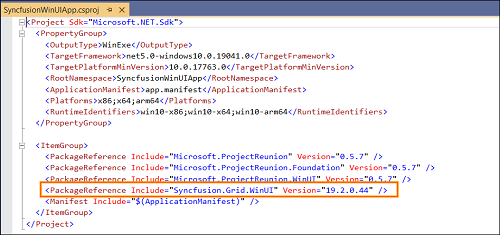

# Install NuGet Packages

### Overview

**NuGet** is a Package management system for Visual Studio. It makes it easy to add, update and remove external libraries in our application. Syncfusion publishing all WinUI NuGet packages in [nuget.org](https://www.nuget.org/packages?q=syncfusion+winui). The Syncfusion WinUI NuGet packages can be used without installing the Syncfusion installation. You can simply exploit the Syncfusion WinUI NuGet packages in your WinUI application to develop with the Syncfusion WinUI controls.

N> Syncfusion NuGet packages are available from v18.3.0.35 (Essential Studio 2020 Volume 3).

## Installation using Package Manager UI

The NuGet **Package Manager UI** in Visual Studio allows you to easily install, uninstall, and update NuGet packages in projects and solutions. You can find and install the Syncfusion WinUI NuGet packages in your Visual Studio WinUI application and this process is easy with the steps below:

1. Right-click on the WinUI project or solution in the Solution Explorer, and choose **Manage NuGet Packages...**

   

   As an alternative, after opening the WinUI application in Visual Studio, go to the **Tools** menu and select **NuGet Package Manager | Manage NuGet Packages for Solution...**

2. The Manage NuGet Packages window will open. Navigate to the Browse tab, then search for the Syncfusion WinUI NuGet packages using a term like **"Syncfusion WinUI"** and select the appropriate Syncfusion WinUI NuGet package for your application.

   N> The [nuget.org](https://api.nuget.org/v3/index.json) package source is selected by default in the Package source drop-down. If your Visual Studio does not have nuget.org configured, follow the instructions in the [Microsoft documents](https://docs.microsoft.com/en-us/nuget/tools/package-manager-ui#package-sources) to set up the nuget.org feed URL.

   N> Please check the **Include prerelease** checkbox before searching because all Syncfusion WinUI NuGet packages are in beta.

   

3. When you select a WinUI package, the right panel will provide more information about it.

4. By default, the package selected with latest version. You can select the required version and click the Install button and accept the license terms. The package will be added to your WinUI application.

   

5. At this point, your application has all the required Syncfusion assemblies, and you will be ready to start building high-performance, responsive app with [Syncfusion WinUI controls](https://www.syncfusion.com/winui-controls). Also, you can refer to the [WinUI help document](https://help.syncfusion.com/winui/overview) for development.

## Installation using Package Manager Console

The **Package Manager Console** saves NuGet packages installation time since you don't have to search for the Syncfusion WinUI package you want to install, and you can just type the installation command to install the appropriate Syncfusion WinUI package. Follow the instructions below to use the Package Manager Console to reference the Syncfusion WinUI component as NuGet packages in your WinUI application.

1. To show the Package Manager Console, open your WinUI application in Visual Studio and navigate to **Tools** in the Visual Studio menu and after hovering **NuGet Package Manager**, select **Package Manager Console**.

   

2. The **Package Manager Console** will be shown at the bottom of the screen. You can install the Syncfusion WinUI NuGet packages by enter the following NuGet installation commands.
 
   ***Install specified Syncfusion WinUI NuGet package.***

   The below command will update the Syncfusion WinUI NuGet package in the default WinUI project of the application.

   ~~~
   Install-Package <Package Name> -prerelease
   ~~~

   **For example:** Install-Package Syncfusion.Grid.WinUI -prerelease

   ***Install specified Syncfusion WinUI NuGet package in specified WinUI project***

   The below command will update the Syncfusion WinUI NuGet package in the given WinUI project of the application.

   ~~~ 
   Install-Package <Package Name> -prerelease - ProjectName <Project Name>
   ~~~

   **For example:** Install-Package Syncfusion.Grid.WinUI -prerelease -ProjectName SyncfusionWinUIApp

   N> We need to use the **-prerelease** term with the NuGet installation command, because all the Syncfusion WinUI NuGet packages are in beta

3. By default, the package will be installed with latest version. You can give the required version with the -Version term like below to install the Syncfusion WinUI NuGet packages in the appropriate version.

   Install-Package Syncfusion.Grid.WinUI -Version 19.1.0.65-beta -prerelease

   

4. The NuGet package manager will install the Syncfusion WinUI NuGet package as well as the dependencies it has. When the installation is complete, the console will show that your Syncfusion WinUI package has been successfully added to the project.

5. At this point, your application has all the required Syncfusion assemblies, and you will be ready to start building high-performance, responsive app with [Syncfusion WinUI controls](https://www.syncfusion.com/winui-controls). Also, you can refer to the [WinUI help document](https://help.syncfusion.com/winui/overview) for development.

## Installation using Dotnet (.NET) CLI

The [dotnet Command Line Interface (CLI)](https://docs.microsoft.com/en-us/nuget/consume-packages/install-use-packages-dotnet-cli), allows you to add, restore, pack, publish, and manage packages without making any changes to your project files. [Dotnet add package](https://docs.microsoft.com/en-us/dotnet/core/tools/dotnet-add-package?tabs=netcore2x) adds a package reference to the project file, then runs [dotnet restore](https://docs.microsoft.com/en-us/dotnet/core/tools/dotnet-restore?tabs=netcore2x) to install the package.

Follow the below instructions to use the dotnet CLI command to install the Syncfusion WinUI NuGet packages.

1. Open a command prompt and navigate to the directory where your WinUI project file is located.
2. To install a NuGet package, run the following command.

   ~~~
   dotnet add package <Package name> --prerelease
   ~~~

   **For Example:**
   dotnet add package Syncfusion.Grid.WinUI --prerelease

   N> If you don’t provide a version flag, this command will be upgrading to the latest version by default. To specify a version, add the -v parameter: dotnet add package Syncfusion.Grid.WinUI –prerelease -v 19.1.0.65-beta

3. Examine the WinUI project file after the command has completed to ensure that the Syncfusion WinUI package was installed. To see the added reference, open the .csproj file.

   

4. Then run  [dotnet restore](https://docs.microsoft.com/en-us/dotnet/core/tools/dotnet-restore?tabs=netcore2x) command to restores all the packages listed in the project file. 

   N> Restoring is done automatically with **dotnet build** and **dotnet run** in.NET Core 2.0 and later.

5. At this point, your application has all the required Syncfusion assemblies, and you will be ready to start building high-performance, responsive app with [Syncfusion WinUI controls](https://www.syncfusion.com/winui-controls). Also, you can refer to the [WinUI help document](https://help.syncfusion.com/winui/overview) for development.