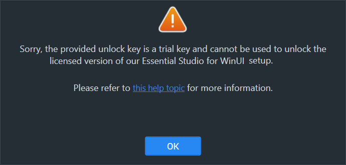
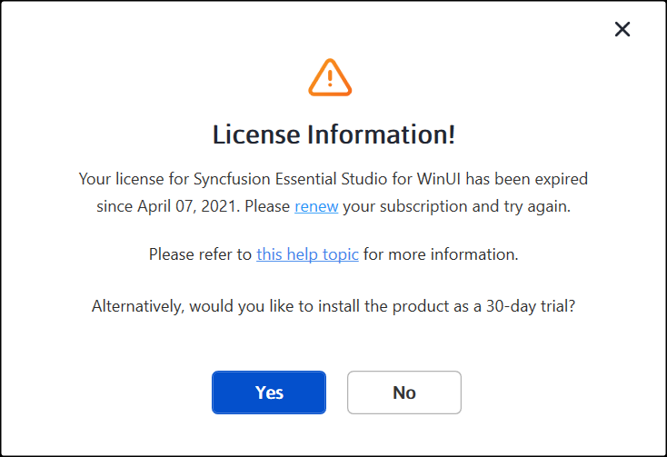
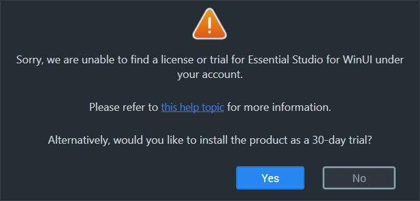
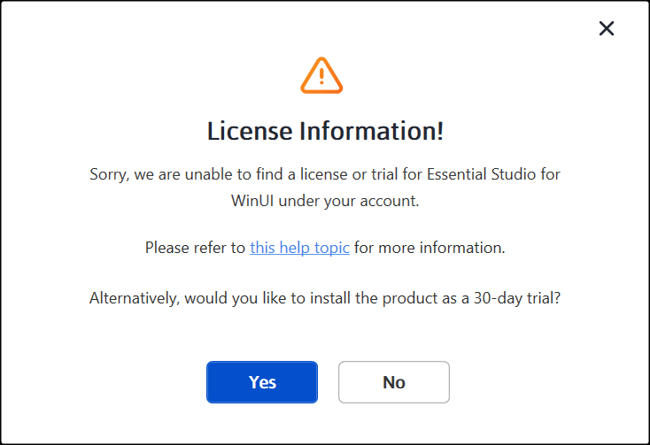
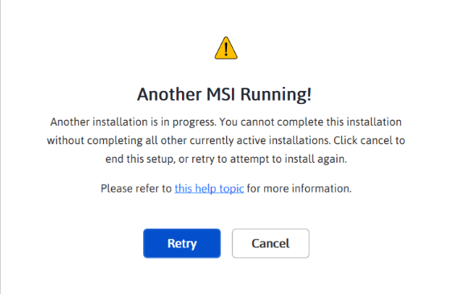
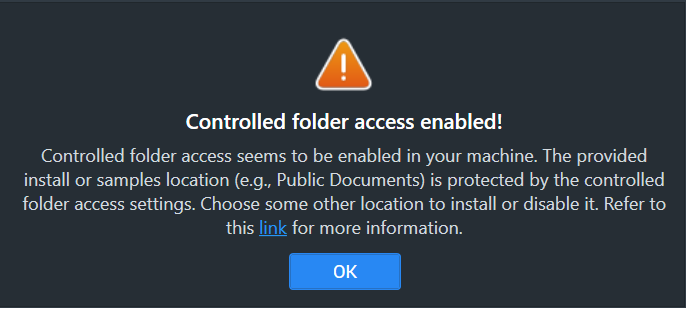

# Common Installation Errors

This article describes the most common installation errors, as well as the causes and solutions to those errors.

* [Prerequisites](https://help.syncfusion.com/winui/installation/installation-errors#prerequisites)
* [Unlocking the license installer using the trial key](https://help.syncfusion.com/winui/installation/installation-errors#unlocking-the-license-installer-using-the-trial-key)
* [License has expired](https://help.syncfusion.com/winui/installation/installation-errors#license-has-expired)
* [Unable to find a valid license or trial](https://help.syncfusion.com/winui/installation/installation-errors#unable-to-find-a-valid-license-or-trial)
* [Unable to install because of another installation](https://help.syncfusion.com/winui/installation/installation-errors#unable-to-install-because-of-another-installation)
* [Unable to install due to controlled folder access](https://help.syncfusion.com/winui/installation/installation-errors#unable-to-install-due-to-controlled-folder-access)

## Prerequisites

* A valid licensed unlock key (obtained from your Syncfusion account) is required to install the licensed edition; trial keys cannot unlock the licensed installer.
* Ensure no other MSI-based installations are running before starting the Syncfusion installer.

## Unlocking the license installer using the trial key

### Problem

**Error Message:** Sorry, the provided unlock key is a trial unlock key and cannot be used to unlock the licensed version of our Essential Studio for WinUI installer.

### Reason

You are attempting to use a Trial unlock key to unlock the licensed installer.

### Suggested solution

Only a licensed unlock key can unlock a licensed installer. So, to unlock the licensed installer, use the licensed unlock key. To generate the licensed unlock key, refer to [this](https://syncfusion.com/kb/2326) article.

## License has expired

### Problem

**Error Message:** Your license for Syncfusion Essential Studio for WinUI has been expired since *{date}*. Please renew your subscription and try again.

> **Note:** In the actual dialog, *{date}* is replaced with the exact expiration date of your license.

**Online Installer**

### Reason

This error message will appear if your license has expired.

### Suggested solution

You can choose from the options listed below. 

1. Renew your subscription [here](https://www.syncfusion.com/account/my-renewals). 
2. Get a new license [here](https://www.syncfusion.com/sales/products). 
3. Reach out to our sales team by emailing <sales@syncfusion.com>. 
4. Extend the 30-day trial period after your trial license has expired (if eligible).

After renewing, refer to the [license key generation instructions](https://help.syncfusion.com/winui/licensing/how-to-generate) to apply the renewed key.

## Unable to find a valid license or trial

### Problem

**Error Message:** Sorry, we are unable to find a valid license or trial for Essential Studio for WinUI under your account.

**Offline installer**

**Online installer**

### Reason

The following are possible causes of this error:

* When your trial period has expired
* When you don't have a license or an active trial
* You are not the license holder
* Your account administrator has not yet assigned you a license.

### Suggested solution

You can choose from the options listed below. 

1. Get a new license [here](https://www.syncfusion.com/sales/products). 
2. Contact your account administrator to request an assigned license.
3. Send an email to <clientrelations@syncfusion.com> to request a license. 
4. Reach out to our sales team by emailing <sales@syncfusion.com>.

To view your current license and trial status, sign in to your [Syncfusion account](https://www.syncfusion.com/account).

## Unable to install because of another installation

### Problem

**Error Message:** Another installation is in progress. You cannot start this installation without completing all other currently active installations. Click cancel to end this installer or retry to attempt after currently active installation completed to install again.

### Reason

You are trying to install when another MSI-based installation (for example, a Windows Update, Visual Studio installer, or another Syncfusion installer) is already running on your machine.

### Suggested solution

End the conflicting `msiexec.exe` process in Task Manager, then run the Syncfusion installer again. If the problem persists, restart the computer and try the Syncfusion installer.

1. Open the Windows Task Manager.

2. Switch to the **Details** tab.

3. Select `msiexec.exe` and click **End task**.

For installation steps, see the [web installer](https://help.syncfusion.com/winui/installation/web-installer/how-to-install) or [offline installer](https://help.syncfusion.com/winui/installation/offline-installer/how-to-install) guide.

## Unable to install due to controlled folder access

### Problem

**Offline**

**Error Message:** Controlled folder access seems to be enabled in your machine. The provided install or samples location (e.g., Public Documents) is protected by the controlled folder access settings.

**Online**

**Error Message:** Controlled folder access seems to be enabled in your machine. The provided install, samples, or download location (e.g., Public Documents) is protected by the controlled folder access settings.

### Reason

Controlled folder access is enabled on your computer.

### Suggested solution

**Solution 1:** Disable controlled folder access, then install to the default Documents folder.

1. Verify that controlled folder access is currently enabled: open **Windows Security > Virus & threat protection > Manage ransomware protection**.
2. Follow the steps in [Allow an app to access controlled folders](https://support.microsoft.com/en-us/windows/allow-an-app-to-access-controlled-folders-b5b6627a-b008-2ca2-7931-7e51e912b034) and disable controlled folder access.
3. Run the Syncfusion installer. Our demos are installed to the public Documents folder by default.
4. After installation is complete, re-enable controlled folder access from the same Windows Security panel.

**Solution 2:** Install to a different directory without disabling controlled folder access.

1. If you do not want to disable controlled folder access, choose a custom install location outside the protected Documents folder (for example, `C:\Syncfusion`) when running the installer.

