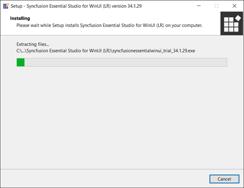
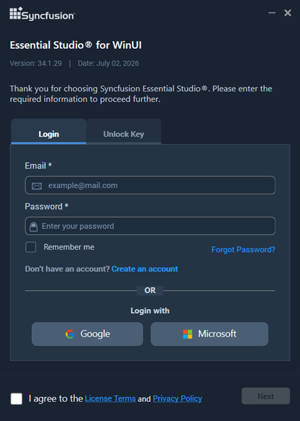
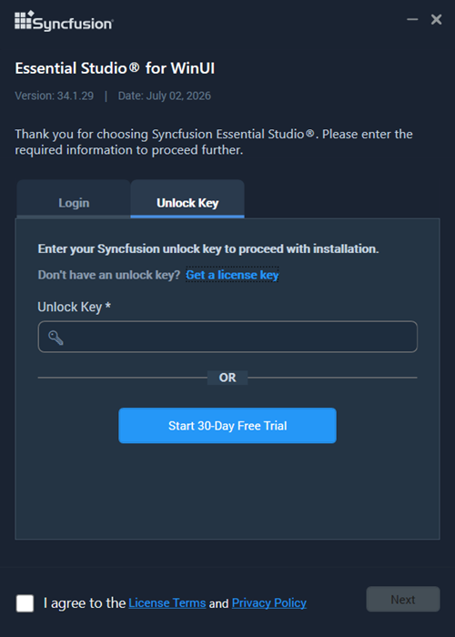
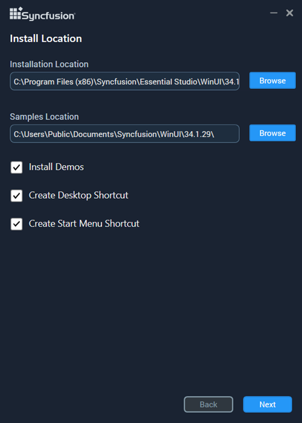
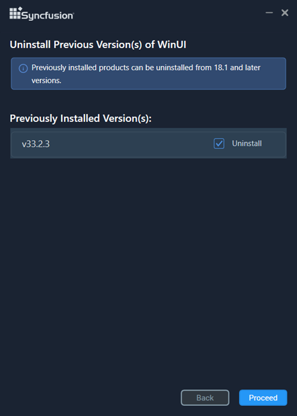
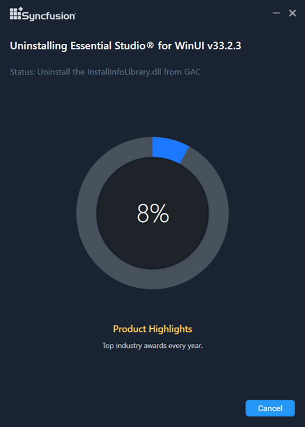
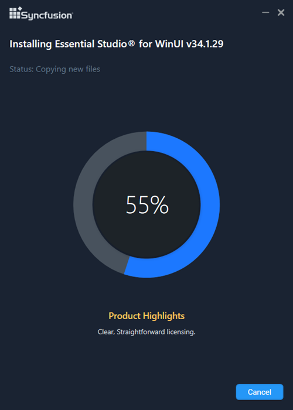
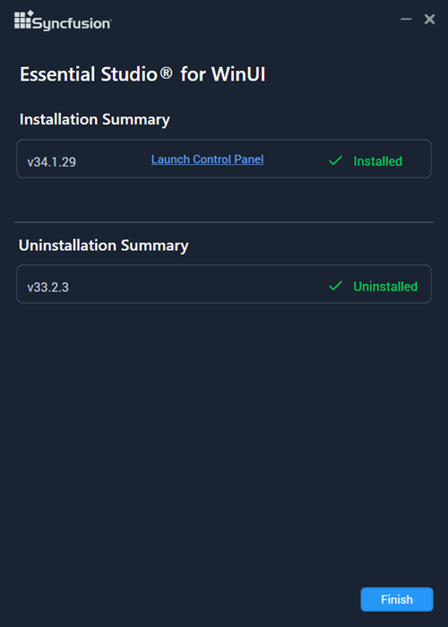

# Installing Syncfusion WinUI offline installer

## Prerequisites

* You must have a valid licensed or trial unlock key. See [How to generate the unlock key](https://www.syncfusion.com/kb/2326).
* Close all running Visual Studio instances before starting the installation.
* The WinUI platform requires Windows 10 version 1809 (build 17763) or later, and the appropriate Windows App SDK on the target machine.

## Installing with UI

The steps below show how to install the Essential Studio WinUI installer.

1. Open the Syncfusion WinUI offline installer file from the downloaded location by double-clicking it. The Installer Wizard automatically opens and extracts the package.

    

    > N> The Installer Wizard extracts the `syncfusionessentialwinui_{version}.exe` dialog, which displays the package's unzip operation.

2. To unlock the Syncfusion offline installer, you have two options:

    * *Login To Install*
    * *Use Unlock Key*

    **Login To Install**

    You must enter your Syncfusion email address and password. If you don't already have a Syncfusion account, you can sign up for one by clicking **"Create an account"**. If you have forgotten your password, click **"Forgot Password"** to create a new one. Once you've entered your Syncfusion email and password, click **Next**.

    

    **Use Unlock Key**

    Unlock keys are used to unlock the Syncfusion offline installer, and they are platform- and version-specific. You should use either a Syncfusion licensed or trial unlock key to unlock the Syncfusion WinUI installer.

    The trial unlock key is only valid for 30 days, and the installer will not accept an expired trial key.

    To learn how to generate an unlock key for both trial and licensed products, see [this](https://www.syncfusion.com/kb/2326) Knowledge Base article.

    

3. After reading the License Terms and Privacy Policy, check the **"I agree to the License Terms and Privacy Policy"** check box. Click the **Next** button.

4. Change the install and sample locations here. You can also change the additional settings. Click **Next** or **Install** to install with the default settings.

    

    **Additional Settings**

    * Select the **Install Demos** check box to install Syncfusion samples, or leave the check box unchecked if you do not want to install Syncfusion samples.
    * Check the **Create Desktop Shortcut** check box to add a desktop shortcut for the Syncfusion Control Panel.
    * Check the **Create Start Menu Shortcut** check box to add a shortcut to the start menu for the Syncfusion Control Panel.

5. If any previous versions of the current product are installed, the **Uninstall Previous Version(s)** wizard will open. Select the **Uninstall** check box to uninstall the previous versions, then click the **Proceed** button.

    

    > N> From the 2021 Volume 1 release, Syncfusion has added the option to uninstall previous versions from 18.1 while installing the new version.

    > N> If any version is selected to uninstall, a confirmation screen will appear. If **Continue** is selected, the **Progress** screen will display the uninstall and install progress, respectively. If none of the versions are chosen to be uninstalled, only the installation progress will be displayed.

    **Confirmation Alert**

    

    **Uninstall Progress:**

    

    **Install Progress**

    

    > N> The **Completed** screen is displayed once the WinUI product is installed. If any version is selected to uninstall, the **Completed** screen will display both install and uninstall status.

    

6. After installation, click the **Launch Control Panel** link to open the Syncfusion Control Panel.

7. Click the **Finish** button. Your system has now been installed with the Syncfusion Essential Studio WinUI product.

## Installing in silent mode

The Syncfusion Essential Studio WinUI Installer supports installation and uninstallation via the command line.

### Command Line Installation

To install through the Command Line in Silent mode, follow the steps below.

1. Run the Syncfusion WinUI installer by double-clicking it. The Installer Wizard automatically opens and extracts the package.
2. The file `syncfusionessentialwinui_{version}.exe` will be extracted into the Temp directory.
3. Run `%temp%`. The Temp folder will open. The `syncfusionessentialwinui_{version}.exe` file will be located in one of the folders.
4. Copy the extracted `syncfusionessentialwinui_{version}.exe` file to a local drive.
5. Exit the Wizard.
6. Run Command Prompt in administrator mode and enter the following arguments.

    **Arguments:** `"installer file path\SyncfusionEssentialStudio(product)_{version}.exe" /Install silent /PIDKEY:"(product unlock key)" [/log "{Log file path}"] [/InstallPath:{Location to install}] [/InstallSamples:{true/false}] [/CreateShortcut:{true/false}] [/CreateStartMenuShortcut:{true/false}]`

    > N> Arguments inside square brackets are optional.

    **Example:** `"D:\Temp\syncfusionessentialwinui_x.x.x.x.exe" /Install silent /PIDKEY:"product unlock key" /log "C:\Temp\EssentialStudio_Product.log" /InstallPath:C:\Syncfusion\x.x.x.x /InstallSamples:true /CreateShortcut:true /CreateStartMenuShortcut:true`

7. Essential Studio for WinUI is installed.

    > N> `x.x.x.x` should be replaced with the Essential Studio version, and the Product Unlock Key should be replaced with the Unlock Key for that version.

### Command Line Uninstallation

Syncfusion Essential WinUI can be uninstalled silently using the Command Line.

1. Run the Syncfusion WinUI installer by double-clicking it. The Installer Wizard automatically opens and extracts the package.
2. The file `syncfusionessentialwinui_{version}.exe` will be extracted into the Temp directory.
3. Run `%temp%`. The Temp folder will open. The `syncfusionessentialwinui_{version}.exe` file will be located in one of the folders.
4. Copy the extracted `syncfusionessentialwinui_{version}.exe` file to a local drive.
5. Exit the Wizard.
6. Run Command Prompt in administrator mode and enter the following arguments.

    **Arguments:** `"Copied installer file path\syncfusionessentialwinui_{version}.exe" /uninstall silent`

    **Example:** `"D:\Temp\syncfusionessentialwinui_x.x.x.x.exe" /uninstall silent`

7. Essential Studio for WinUI is uninstalled.

   
   
