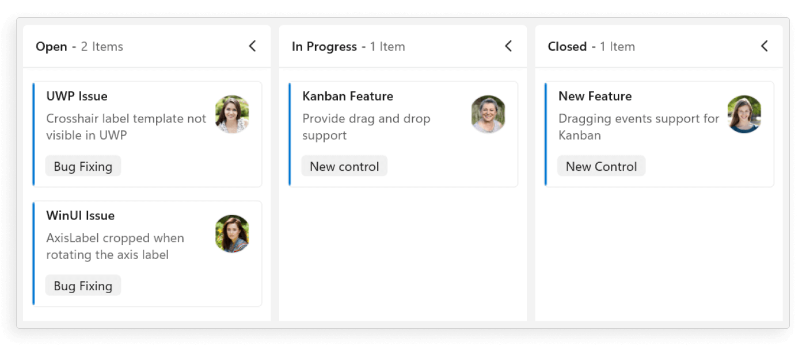
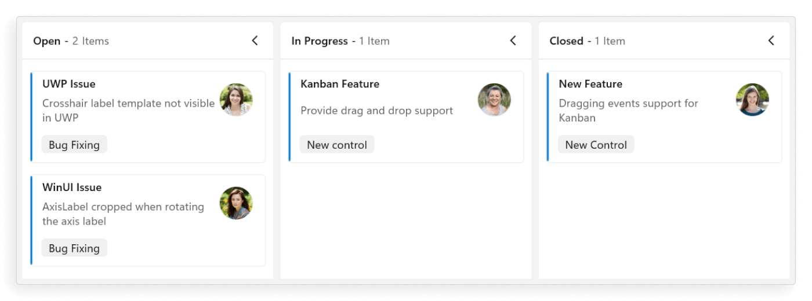
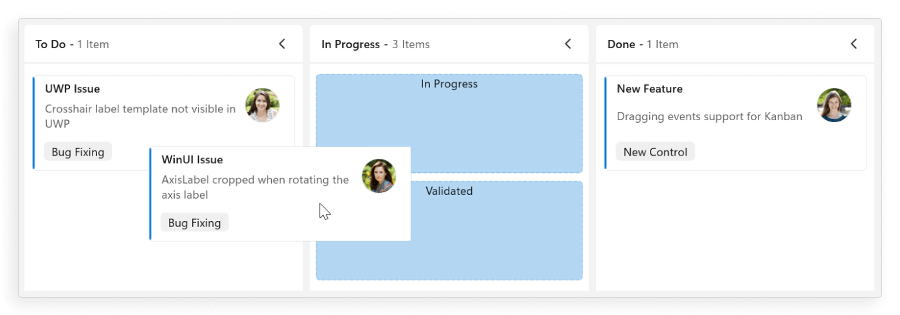
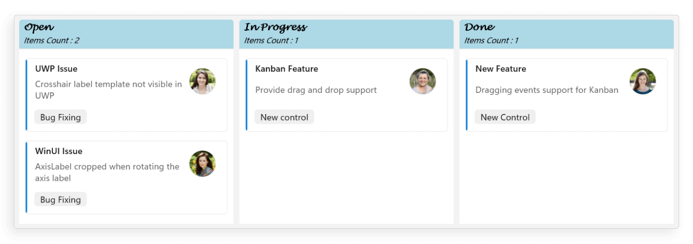
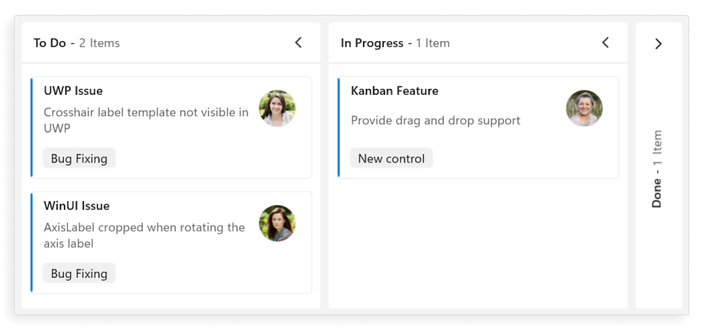
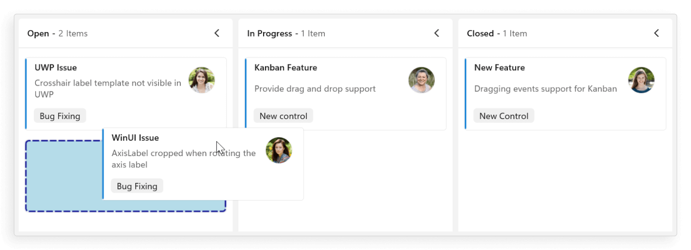
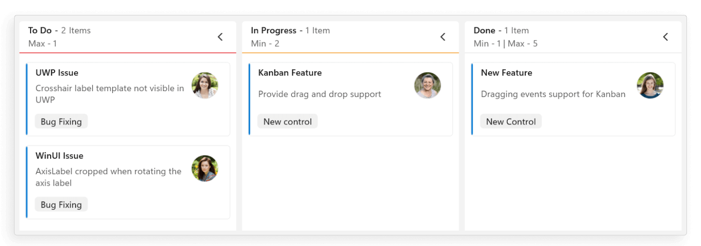

# Columns in WinUI Kanban (SfKanban) control

The WinUI Kanban control organizes its layout into columns, each representing a distinct stage of a workflow, such as to-do, in-progress, testing, validation, and completed. It supports various operations, including drag-and-drop, swim lane, and column toggling, all based on the defined columns.

## Change column width

By default, the columns are sized smartly to arrange the default UI of the cards with better readability. You can also define the minimum and maximum widths for the columns in [SfKanban](https://help.syncfusion.com/cr/winui/Syncfusion.UI.Xaml.Kanban.SfKanban.html) using the [MinimumColumnWidth](https://help.syncfusion.com/cr/winui/Syncfusion.UI.Xaml.Kanban.SfKanban.html#Syncfusion_UI_Xaml_Kanban_SfKanban_MinimumColumnWidth) and [MaximumColumnWidth](https://help.syncfusion.com/cr/winui/Syncfusion.UI.Xaml.Kanban.SfKanban.html#Syncfusion_UI_Xaml_Kanban_SfKanban_MaximumColumnWidth) properties, respectively.




<kanban:SfKanban x:Name="kanban"
                 ItemsSource="{Binding TaskDetails}"
                 MinimumColumnWidth="300"
                 MaximumColumnWidth="350">
    <kanban:SfKanban.DataContext>
        <local:ViewModel/>
    </kanban:SfKanban.DataContext>
</kanban:SfKanban>





this.kanban.ItemsSource = new ViewModel().TaskDetails;
this.kanban.MinimumColumnWidth = 300;
this.kanban.MaximumColumnWidth = 350;





public class ViewModel
{
    #region Properties

    /// 

    /// Gets or sets the collection of <see cref="KanbanModel"/> objects representing tasks in various stages.
    /// 

    public ObservableCollection<KanbanModel> TaskDetails { get; set; }

    #endregion

    #region Constructor

    /// 

    /// Initializes a new instance of the <see cref="ViewModel"/> class.
    /// 

    public ViewModel()
    {
        this.TaskDetails = this.GetTaskDetails();
    }

    #endregion

    #region Private methods

    /// 

    /// Method to get the kanban model collections.
    /// 

    /// <returns>The kanban model collections.</returns>
    private ObservableCollection<KanbanModel> GetTaskDetails()
    {
        var taskDetails = new ObservableCollection<KanbanModel>();
        string path = @"ms-appx:///";

        KanbanModel taskDetail = new KanbanModel();
        taskDetail.Title = "UWP Issue";
        taskDetail.Id = "651";
        taskDetail.Description = "Crosshair label template not visible in UWP";
        taskDetail.Category = "Open";
        taskDetail.IndicatorColorKey = "High";
        taskDetail.Tags = new List<string>() { "Bug Fixing" };
        taskDetail.Image = new Image
        {
            Source = new BitmapImage(new Uri("ms-appx:///Assets/Kanban/People_Circle1.png"))
        };

        taskDetails.Add(taskDetail);

        taskDetail = new KanbanModel();
        taskDetail.Title = "WinUI Issue";
        taskDetail.Id = "646";
        taskDetail.Description = "AxisLabel cropped when rotating the axis label";
        taskDetail.Category = "Open";
        taskDetail.IndicatorColorKey = "Low";
        taskDetail.Tags = new List<string>() { "Bug Fixing" };
        taskDetail.Image = new Image
        {
            Source = new BitmapImage(new Uri(path + "Assets/Kanban/People_Circle2.png"))
        };

        taskDetails.Add(taskDetail);

        taskDetail = new KanbanModel();
        taskDetail.Title = "Kanban Feature";
        taskDetail.Id = "25678";
        taskDetail.Description = "Provide drag and drop support";
        taskDetail.Category = "In Progress";
        taskDetail.IndicatorColorKey = "Low";
        taskDetail.Tags = new List<string>() { "New control" };
        taskDetail.Image = new Image
        {
            Source = new BitmapImage(new Uri(path + "Assets/Kanban/People_Circle3.png"))
        };

        taskDetails.Add(taskDetail);

        taskDetail = new KanbanModel();
        taskDetail.Title = "New Feature";
        taskDetail.Id = "29574";
        taskDetail.Description = "Dragging events support for Kanban";
        taskDetail.Category = "Closed";
        taskDetail.IndicatorColorKey = "Normal";
        taskDetail.Tags = new List<string>() { "New Control" };
        taskDetail.Image = new Image
        {
            Source = new BitmapImage(new Uri(path + "Assets/Kanban/People_Circle4.png"))
        };

        taskDetails.Add(taskDetail);
        return taskDetails;
    }

    #endregion
}





You can also define the exact width for the columns using [ColumnWidth](https://help.syncfusion.com/cr/winui/Syncfusion.UI.Xaml.Kanban.SfKanban.html#Syncfusion_UI_Xaml_Kanban_SfKanban_ColumnWidth) property of [SfKanban](https://help.syncfusion.com/cr/winui/Syncfusion.UI.Xaml.Kanban.SfKanban.html).




<kanban:SfKanban x:Name="kanban"
                 ItemsSource="{Binding TaskDetails}"
                 ColumnWidth="320">
    <kanban:SfKanban.DataContext>
        <local:ViewModel/>
    </kanban:SfKanban.DataContext>
</kanban:SfKanban>





this.kanban.ItemsSource = new ViewModel().TaskDetails;
this.kanban.ColumnWidth = 320;





public class ViewModel
{
    #region Properties

    /// 

    /// Gets or sets the collection of <see cref="KanbanModel"/> objects representing tasks in various stages.
    /// 

    public ObservableCollection<KanbanModel> TaskDetails { get; set; }

    #endregion

    #region Constructor

    /// 

    /// Initializes a new instance of the <see cref="ViewModel"/> class.
    /// 

    public ViewModel()
    {
        this.TaskDetails = this.GetTaskDetails();
    }

    #endregion

    #region Private methods

    /// 

    /// Method to get the kanban model collections.
    /// 

    /// <returns>The kanban model collections.</returns>
    private ObservableCollection<KanbanModel> GetTaskDetails()
    {
        var taskDetails = new ObservableCollection<KanbanModel>();
        string path = @"ms-appx:///";

        KanbanModel taskDetail = new KanbanModel();
        taskDetail.Title = "UWP Issue";
        taskDetail.Id = "651";
        taskDetail.Description = "Crosshair label template not visible in UWP";
        taskDetail.Category = "Open";
        taskDetail.IndicatorColorKey = "High";
        taskDetail.Tags = new List<string>() { "Bug Fixing" };
        taskDetail.Image = new Image
        {
            Source = new BitmapImage(new Uri("ms-appx:///Assets/Kanban/People_Circle1.png"))
        };

        taskDetails.Add(taskDetail);

        taskDetail = new KanbanModel();
        taskDetail.Title = "WinUI Issue";
        taskDetail.Id = "646";
        taskDetail.Description = "AxisLabel cropped when rotating the axis label";
        taskDetail.Category = "Open";
        taskDetail.IndicatorColorKey = "Low";
        taskDetail.Tags = new List<string>() { "Bug Fixing" };
        taskDetail.Image = new Image
        {
            Source = new BitmapImage(new Uri(path + "Assets/Kanban/People_Circle2.png"))
        };

        taskDetails.Add(taskDetail);

        taskDetail = new KanbanModel();
        taskDetail.Title = "Kanban Feature";
        taskDetail.Id = "25678";
        taskDetail.Description = "Provide drag and drop support";
        taskDetail.Category = "In Progress";
        taskDetail.IndicatorColorKey = "Low";
        taskDetail.Tags = new List<string>() { "New control" };
        taskDetail.Image = new Image
        {
            Source = new BitmapImage(new Uri(path + "Assets/Kanban/People_Circle3.png"))
        };

        taskDetails.Add(taskDetail);

        taskDetail = new KanbanModel();
        taskDetail.Title = "New Feature";
        taskDetail.Id = "29574";
        taskDetail.Description = "Dragging events support for Kanban";
        taskDetail.Category = "Closed";
        taskDetail.IndicatorColorKey = "Normal";
        taskDetail.Tags = new List<string>() { "New Control" };
        taskDetail.Image = new Image
        {
            Source = new BitmapImage(new Uri(path + "Assets/Kanban/People_Circle4.png"))
        };

        taskDetails.Add(taskDetail);
        return taskDetails;
    }

    #endregion
}




## Categorizing columns

Columns are automatically generated based on the [Category](https://help.syncfusion.com/cr/winui/Syncfusion.UI.Xaml.Kanban.KanbanModel.html#Syncfusion_UI_Xaml_Kanban_KanbanModel_Category) values in the [KanbanModel](https://help.syncfusion.com/cr/winui/Syncfusion.UI.Xaml.Kanban.KanbanModel.html) from [ItemsSource](https://help.syncfusion.com/cr/winui/Syncfusion.UI.Xaml.Kanban.SfKanban.html#Syncfusion_UI_Xaml_Kanban_SfKanban_ItemsSource). To manually define columns, set [AutoGenerateColumns](https://help.syncfusion.com/cr/winui/Syncfusion.UI.Xaml.Kanban.SfKanban.html#Syncfusion_UI_Xaml_Kanban_SfKanban_AutoGenerateColumns) to `false`, add [KanbanColumn](https://help.syncfusion.com/cr/winui/Syncfusion.UI.Xaml.Kanban.KanbanColumn.html) instances to the [Columns](https://help.syncfusion.com/cr/winui/Syncfusion.UI.Xaml.Kanban.SfKanban.html#Syncfusion_UI_Xaml_Kanban_SfKanban_Columns) property, and use the [Categories](https://help.syncfusion.com/cr/winui/Syncfusion.UI.Xaml.Kanban.KanbanColumn.html#Syncfusion_UI_Xaml_Kanban_KanbanColumn_Categories) property to assign categories to the columns. Cards will then be added accordingly.

The following example code generates the columns automatically based on the [Category](https://help.syncfusion.com/cr/winui/Syncfusion.UI.Xaml.Kanban.KanbanModel.html#Syncfusion_UI_Xaml_Kanban_KanbanModel_Category) values.





<kanban:SfKanban x:Name="kanban"
                 AutoGenerateColumns="True"
                 ItemsSource="{Binding TaskDetails}">
    <kanban:SfKanban.DataContext>
        <local:ViewModel/>
    </kanban:SfKanban.DataContext>
</kanban:SfKanban>





this.kanban.AutoGenerateColumns = true;
this.kanban.ItemsSource = new ViewModel().TaskDetails;





public class ViewModel
{
    #region Properties

    /// 

    /// Gets or sets the collection of <see cref="KanbanModel"/> objects representing tasks in various stages.
    /// 

    public ObservableCollection<KanbanModel> TaskDetails { get; set; }

    #endregion

    #region Constructor

    /// 

    /// Initializes a new instance of the <see cref="ViewModel"/> class.
    /// 

    public ViewModel()
    {
        this.TaskDetails = this.GetTaskDetails();
    }

    #endregion

    #region Private methods

    /// 

    /// Method to get the kanban model collections.
    /// 

    /// <returns>The kanban model collections.</returns>
    private ObservableCollection<KanbanModel> GetTaskDetails()
    {
        var taskDetails = new ObservableCollection<KanbanModel>();
        string path = @"ms-appx:///";

        KanbanModel taskDetail = new KanbanModel();
        taskDetail.Title = "UWP Issue";
        taskDetail.Id = "651";
        taskDetail.Description = "Crosshair label template not visible in UWP";
        taskDetail.Category = "Open";
        taskDetail.IndicatorColorKey = "High";
        taskDetail.Tags = new List<string>() { "Bug Fixing" };
        taskDetail.Image = new Image
        {
            Source = new BitmapImage(new Uri("ms-appx:///Assets/Kanban/People_Circle1.png"))
        };

        taskDetails.Add(taskDetail);

        taskDetail = new KanbanModel();
        taskDetail.Title = "WinUI Issue";
        taskDetail.Id = "646";
        taskDetail.Description = "AxisLabel cropped when rotating the axis label";
        taskDetail.Category = "Open";
        taskDetail.IndicatorColorKey = "Low";
        taskDetail.Tags = new List<string>() { "Bug Fixing" };
        taskDetail.Image = new Image
        {
            Source = new BitmapImage(new Uri(path + "Assets/Kanban/People_Circle2.png"))
        };

        taskDetails.Add(taskDetail);

        taskDetail = new KanbanModel();
        taskDetail.Title = "Kanban Feature";
        taskDetail.Id = "25678";
        taskDetail.Description = "Provide drag and drop support";
        taskDetail.Category = "In Progress";
        taskDetail.IndicatorColorKey = "Low";
        taskDetail.Tags = new List<string>() { "New control" };
        taskDetail.Image = new Image
        {
            Source = new BitmapImage(new Uri(path + "Assets/Kanban/People_Circle3.png"))
        };

        taskDetails.Add(taskDetail);

        taskDetail = new KanbanModel();
        taskDetail.Title = "New Feature";
        taskDetail.Id = "29574";
        taskDetail.Description = "Dragging events support for Kanban";
        taskDetail.Category = "Closed";
        taskDetail.IndicatorColorKey = "Normal";
        taskDetail.Tags = new List<string>() { "New Control" };
        taskDetail.Image = new Image
        {
            Source = new BitmapImage(new Uri(path + "Assets/Kanban/People_Circle4.png"))
        };

        taskDetails.Add(taskDetail);
        return taskDetails;
    }

    #endregion
}




### Populating Multi-Category Columns with Cards

The Kanban board allows user to render a single column by mapping multiple categories using [Categories](https://help.syncfusion.com/cr/winui/Syncfusion.UI.Xaml.Kanban.KanbanColumn.html#Syncfusion_UI_Xaml_Kanban_KanbanColumn_Categories) property of [KanbanColumn](https://help.syncfusion.com/cr/winui/Syncfusion.UI.Xaml.Kanban.KanbanColumn.html) in [SfKanban](https://help.syncfusion.com/cr/winui/Syncfusion.UI.Xaml.Kanban.SfKanban.html). For example, you can map the `In Progress` and `Validated` types under the `In progress` column.




<kanban:SfKanban x:Name="kanban"
                 AutoGenerateColumns="False" 
                 ItemsSource="{Binding TaskDetails}">
    <kanban:KanbanColumn HeaderText="To Do" Categories="Open" />
    <kanban:KanbanColumn HeaderText="In Progress" Categories="In Progress,Validated" />
    <kanban:KanbanColumn HeaderText="Done" Categories="Done" />
    <kanban:SfKanban.DataContext>
        <local:ViewModel/>
    </kanban:SfKanban.DataContext>
</kanban:SfKanban>





this.kanban.AutoGenerateColumns = false;
this.kanban.ItemsSource = new ViewModel().TaskDetails;

this.kanban.Columns.Add(new KanbanColumn() { HeaderText = "To Do", Categories = "Open" });
this.kanban.Columns.Add(new KanbanColumn() { HeaderText = "In Progress", Categories = "In Progress,Validated" });
this.kanban.Columns.Add(new KanbanColumn() { HeaderText = "Done", Categories = "Done" });





public class ViewModel
{
    #region Properties

    /// 

    /// Gets or sets the collection of <see cref="KanbanModel"/> objects representing tasks in various stages.
    /// 

    public ObservableCollection<KanbanModel> TaskDetails { get; set; }

    #endregion

    #region Constructor

    /// 

    /// Initializes a new instance of the <see cref="ViewModel"/> class.
    /// 

    public ViewModel()
    {
        this.TaskDetails = this.GetTaskDetails();
    }

    #endregion

    #region Private methods

    /// 

    /// Method to get the kanban model collections.
    /// 

    /// <returns>The kanban model collections.</returns>
    private ObservableCollection<KanbanModel> GetTaskDetails()
    {
        var taskDetails = new ObservableCollection<KanbanModel>();
        string path = @"ms-appx:///";

        KanbanModel taskDetail = new KanbanModel();
        taskDetail.Title = "UWP Issue";
        taskDetail.Id = "651";
        taskDetail.Description = "Crosshair label template not visible in UWP";
        taskDetail.Category = "Open";
        taskDetail.IndicatorColorKey = "High";
        taskDetail.Tags = new List<string>() { "Bug Fixing" };
        taskDetail.Image = new Image
        {
            Source = new BitmapImage(new Uri("ms-appx:///Assets/Kanban/People_Circle1.png"))
        };

        taskDetails.Add(taskDetail);

        taskDetail = new KanbanModel();
        taskDetail.Title = "WinUI Issue";
        taskDetail.Id = "646";
        taskDetail.Description = "AxisLabel cropped when rotating the axis label";
        taskDetail.Category = "Open";
        taskDetail.IndicatorColorKey = "Low";
        taskDetail.Tags = new List<string>() { "Bug Fixing" };
        taskDetail.Image = new Image
        {
            Source = new BitmapImage(new Uri(path + "Assets/Kanban/People_Circle2.png"))
        };

        taskDetails.Add(taskDetail);

        taskDetail = new KanbanModel();
        taskDetail.Title = "Kanban Feature";
        taskDetail.Id = "25678";
        taskDetail.Description = "Provide drag and drop support";
        taskDetail.Category = "Validated";
        taskDetail.IndicatorColorKey = "Low";
        taskDetail.Tags = new List<string>() { "New control" };
        taskDetail.Image = new Image
        {
            Source = new BitmapImage(new Uri(path + "Assets/Kanban/People_Circle3.png"))
        };

        taskDetails.Add(taskDetail);

        taskDetail = new KanbanModel();
        taskDetail.Title = "WF Issue";
        taskDetail.Id = "1254";
        taskDetail.Description = "HorizontalAlignment for tooltip is not working";
        taskDetail.Category = "In Progress";
        taskDetail.IndicatorColorKey = "High";
        taskDetail.Tags = new List<string>() { "Bug fixing" };
        taskDetail.Image = new Image
        {
            Source = new BitmapImage(new Uri(path + "Assets/Kanban/People_Circle5.png"))
        };

        taskDetails.Add(taskDetail);

        taskDetail = new KanbanModel();
        taskDetail.Title = "New Feature";
        taskDetail.Id = "29574";
        taskDetail.Description = "Dragging events support for Kanban";
        taskDetail.Category = "Done";
        taskDetail.IndicatorColorKey = "Normal";
        taskDetail.Tags = new List<string>() { "New Control" };
        taskDetail.Image = new Image
        {
            Source = new BitmapImage(new Uri(path + "Assets/Kanban/People_Circle4.png"))
        };

        taskDetails.Add(taskDetail);
        return taskDetails;
    }

    #endregion
}




## Customize columns header appearance

The WinUI Kanban control allows you to customize the header text, column header template, and more.

### Customize the header text

You can use the [HeaderText](https://help.syncfusion.com/cr/winui/Syncfusion.UI.Xaml.Kanban.KanbanColumn.html#Syncfusion_UI_Xaml_Kanban_KanbanColumn_HeaderText) property of [KanbanColumn](https://help.syncfusion.com/cr/winui/Syncfusion.UI.Xaml.Kanban.KanbanColumn.html) to customize the header text of a column in the kanban control.




<kanban:SfKanban x:Name="kanban"
                 AutoGenerateColumns="False" 
                 ItemsSource="{Binding TaskDetails}">
        <kanban:KanbanColumn HeaderText="To Do" Categories="Open" />
        <kanban:KanbanColumn HeaderText="In Progress" Categories="In Progress" />
        <kanban:KanbanColumn HeaderText="Done" Categories="Done" />
    <kanban:SfKanban.DataContext>
        <local:ViewModel/>
    </kanban:SfKanban.DataContext>
</kanban:SfKanban>





this.kanban.AutoGenerateColumns = false;
this.kanban.ItemsSource = new ViewModel().TaskDetails;

this.kanban.Columns.Add(new KanbanColumn() { HeaderText = "To Do", Categories = "Open" });
this.kanban.Columns.Add(new KanbanColumn() { HeaderText = "In Progress", Categories = "In Progress" });
this.kanban.Columns.Add(new KanbanColumn() { HeaderText = "Done", Categories = "Done" });





public class ViewModel
{
    #region Properties

    /// 

    /// Gets or sets the collection of <see cref="KanbanModel"/> objects representing tasks in various stages.
    /// 

    public ObservableCollection<KanbanModel> TaskDetails { get; set; }

    #endregion

    #region Constructor

    /// 

    /// Initializes a new instance of the <see cref="ViewModel"/> class.
    /// 

    public ViewModel()
    {
        this.TaskDetails = this.GetTaskDetails();
    }

    #endregion

    #region Private methods

    /// 

    /// Method to get the kanban model collections.
    /// 

    /// <returns>The kanban model collections.</returns>
    private ObservableCollection<KanbanModel> GetTaskDetails()
    {
        var taskDetails = new ObservableCollection<KanbanModel>();
        string path = @"ms-appx:///";

        KanbanModel taskDetail = new KanbanModel();
        taskDetail.Title = "UWP Issue";
        taskDetail.Id = "651";
        taskDetail.Description = "Crosshair label template not visible in UWP";
        taskDetail.Category = "Open";
        taskDetail.IndicatorColorKey = "High";
        taskDetail.Tags = new List<string>() { "Bug Fixing" };
        taskDetail.Image = new Image
        {
            Source = new BitmapImage(new Uri("ms-appx:///Assets/Kanban/People_Circle1.png"))
        };

        taskDetails.Add(taskDetail);

        taskDetail = new KanbanModel();
        taskDetail.Title = "WinUI Issue";
        taskDetail.Id = "646";
        taskDetail.Description = "AxisLabel cropped when rotating the axis label";
        taskDetail.Category = "Open";
        taskDetail.IndicatorColorKey = "Low";
        taskDetail.Tags = new List<string>() { "Bug Fixing" };
        taskDetail.Image = new Image
        {
            Source = new BitmapImage(new Uri(path + "Assets/Kanban/People_Circle2.png"))
        };

        taskDetails.Add(taskDetail);

        taskDetail = new KanbanModel();
        taskDetail.Title = "Kanban Feature";
        taskDetail.Id = "25678";
        taskDetail.Description = "Provide drag and drop support";
        taskDetail.Category = "In Progress";
        taskDetail.IndicatorColorKey = "Low";
        taskDetail.Tags = new List<string>() { "New control" };
        taskDetail.Image = new Image
        {
            Source = new BitmapImage(new Uri(path + "Assets/Kanban/People_Circle3.png"))
        };

        taskDetails.Add(taskDetail);

        taskDetail = new KanbanModel();
        taskDetail.Title = "New Feature";
        taskDetail.Id = "29574";
        taskDetail.Description = "Dragging events support for Kanban";
        taskDetail.Category = "Done";
        taskDetail.IndicatorColorKey = "Normal";
        taskDetail.Tags = new List<string>() { "New Control" };
        taskDetail.Image = new Image
        {
            Source = new BitmapImage(new Uri(path + "Assets/Kanban/People_Circle4.png"))
        };

        taskDetails.Add(taskDetail);

        return taskDetails;
    }

    #endregion
}





### Customize column header appearance using DataTemplate

You can customize the column header appearance by using the [ColumnHeaderTemplate](https://help.syncfusion.com/cr/winui/Syncfusion.UI.Xaml.Kanban.SfKanban.html#Syncfusion_UI_Xaml_Kanban_SfKanban_ColumnHeaderTemplate) property in the [SfKanban](https://help.syncfusion.com/cr/winui/Syncfusion.UI.Xaml.Kanban.SfKanban.html) control. The `DataContext` for the [ColumnHeaderTemplate](https://help.syncfusion.com/cr/winui/Syncfusion.UI.Xaml.Kanban.SfKanban.html#Syncfusion_UI_Xaml_Kanban_SfKanban_ColumnHeaderTemplate) property in [SfKanban](https://help.syncfusion.com/cr/winui/Syncfusion.UI.Xaml.Kanban.SfKanban.html) is set to the [KanbanModel](https://help.syncfusion.com/cr/winui/Syncfusion.UI.Xaml.Kanban.KanbanModel.html).




<kanban:SfKanban x:Name="kanban"
                 ItemsSource="{Binding TaskDetails}">
    <kanban:SfKanban.ColumnHeaderTemplate>
        <DataTemplate>
            <StackPanel Background="LightBlue">
                <TextBlock Margin="10" Text="{Binding  HeaderText}" Foreground="Red" HorizontalAlignment="Center"/>
            </StackPanel>
        </DataTemplate>
    </kanban:SfKanban.ColumnHeaderTemplate>
    <kanban:SfKanban.DataContext>
        <local:ViewModel/>
    </kanban:SfKanban.DataContext>
</kanban:SfKanban>





this.kanban.ItemsSource = new ViewModel().TaskDetails;





public class ViewModel
{
    #region Properties

    /// 

    /// Gets or sets the collection of <see cref="KanbanModel"/> objects representing tasks in various stages.
    /// 

    public ObservableCollection<KanbanModel> TaskDetails { get; set; }

    #endregion

    #region Constructor

    /// 

    /// Initializes a new instance of the <see cref="ViewModel"/> class.
    /// 

    public ViewModel()
    {
        this.TaskDetails = this.GetTaskDetails();
    }

    #endregion

    #region Private methods

    /// 

    /// Method to get the kanban model collections.
    /// 

    /// <returns>The kanban model collections.</returns>
    private ObservableCollection<KanbanModel> GetTaskDetails()
    {
        var taskDetails = new ObservableCollection<KanbanModel>();
        string path = @"ms-appx:///";

        KanbanModel taskDetail = new KanbanModel();
        taskDetail.Title = "UWP Issue";
        taskDetail.Id = "651";
        taskDetail.Description = "Crosshair label template not visible in UWP";
        taskDetail.Category = "Open";
        taskDetail.IndicatorColorKey = "High";
        taskDetail.Tags = new List<string>() { "Bug Fixing" };
        taskDetail.Image = new Image
        {
            Source = new BitmapImage(new Uri("ms-appx:///Assets/Kanban/People_Circle1.png"))
        };

        taskDetails.Add(taskDetail);

        taskDetail = new KanbanModel();
        taskDetail.Title = "WinUI Issue";
        taskDetail.Id = "646";
        taskDetail.Description = "AxisLabel cropped when rotating the axis label";
        taskDetail.Category = "Open";
        taskDetail.IndicatorColorKey = "Low";
        taskDetail.Tags = new List<string>() { "Bug Fixing" };
        taskDetail.Image = new Image
        {
            Source = new BitmapImage(new Uri(path + "Assets/Kanban/People_Circle2.png"))
        };

        taskDetails.Add(taskDetail);

        taskDetail = new KanbanModel();
        taskDetail.Title = "Kanban Feature";
        taskDetail.Id = "25678";
        taskDetail.Description = "Provide drag and drop support";
        taskDetail.Category = "In Progress";
        taskDetail.IndicatorColorKey = "Low";
        taskDetail.Tags = new List<string>() { "New control" };
        taskDetail.Image = new Image
        {
            Source = new BitmapImage(new Uri(path + "Assets/Kanban/People_Circle3.png"))
        };

        taskDetails.Add(taskDetail);

        taskDetail = new KanbanModel();
        taskDetail.Title = "New Feature";
        taskDetail.Id = "29574";
        taskDetail.Description = "Dragging events support for Kanban";
        taskDetail.Category = "Done";
        taskDetail.IndicatorColorKey = "Normal";
        taskDetail.Tags = new List<string>() { "New Control" };
        taskDetail.Image = new Image
        {
            Source = new BitmapImage(new Uri(path + "Assets/Kanban/People_Circle4.png"))
        };

        taskDetails.Add(taskDetail);

        return taskDetails;
    }

    #endregion
}





## Expand/Collapse column

The Kanban allows you to programmatically expand or collapse columns using the [IsExpanded](https://help.syncfusion.com/cr/winui/Syncfusion.UI.Xaml.Kanban.KanbanColumn.html#Syncfusion_UI_Xaml_Kanban_KanbanColumn_IsExpanded) property of [KanbanColumn](https://help.syncfusion.com/cr/winui/Syncfusion.UI.Xaml.Kanban.KanbanColumn.html) in the [SfKanban](https://help.syncfusion.com/cr/winui/Syncfusion.UI.Xaml.Kanban.SfKanban.html) control. By default, columns can be expanded or collapsed by tapping the toggle button placed at the top-right corner of the kanban column header.




<kanban:SfKanban x:Name="kanban"
                 AutoGenerateColumns="False" 
                 ItemsSource="{Binding TaskDetails}">
    <kanban:KanbanColumn HeaderText="To Do" Categories="Open" IsExpanded="False"/>
    <kanban:KanbanColumn HeaderText="In Progress" Categories="In Progress" />
    <kanban:KanbanColumn HeaderText="Done" Categories="Done" />
    <kanban:SfKanban.DataContext>
        <local:ViewModel/>
    </kanban:SfKanban.DataContext>
</kanban:SfKanban>





this.kanban.AutoGenerateColumns = false;
this.kanban.ItemsSource = new ViewModel().TaskDetails;

this.kanban.Columns.Add(new KanbanColumn() { HeaderText = "To Do", Categories = "Open", IsExpanded = false });
this.kanban.Columns.Add(new KanbanColumn() { HeaderText = "In Progress", Categories = "In Progress" });
this.kanban.Columns.Add(new KanbanColumn() { HeaderText = "Done", Categories = "Done" });





public class ViewModel
{
    #region Properties

    /// 

    /// Gets or sets the collection of <see cref="KanbanModel"/> objects representing tasks in various stages.
    /// 

    public ObservableCollection<KanbanModel> TaskDetails { get; set; }

    #endregion

    #region Constructor

    /// 

    /// Initializes a new instance of the <see cref="ViewModel"/> class.
    /// 

    public ViewModel()
    {
        this.TaskDetails = this.GetTaskDetails();
    }

    #endregion

    #region Private methods

    /// 

    /// Method to get the kanban model collections.
    /// 

    /// <returns>The kanban model collections.</returns>
    private ObservableCollection<KanbanModel> GetTaskDetails()
    {
        var taskDetails = new ObservableCollection<KanbanModel>();
        string path = @"ms-appx:///";

        KanbanModel taskDetail = new KanbanModel();
        taskDetail.Title = "UWP Issue";
        taskDetail.Id = "651";
        taskDetail.Description = "Crosshair label template not visible in UWP";
        taskDetail.Category = "Open";
        taskDetail.IndicatorColorKey = "High";
        taskDetail.Tags = new List<string>() { "Bug Fixing" };
        taskDetail.Image = new Image
        {
            Source = new BitmapImage(new Uri("ms-appx:///Assets/Kanban/People_Circle1.png"))
        };

        taskDetails.Add(taskDetail);

        taskDetail = new KanbanModel();
        taskDetail.Title = "WinUI Issue";
        taskDetail.Id = "646";
        taskDetail.Description = "AxisLabel cropped when rotating the axis label";
        taskDetail.Category = "Open";
        taskDetail.IndicatorColorKey = "Low";
        taskDetail.Tags = new List<string>() { "Bug Fixing" };
        taskDetail.Image = new Image
        {
            Source = new BitmapImage(new Uri(path + "Assets/Kanban/People_Circle2.png"))
        };

        taskDetails.Add(taskDetail);

        taskDetail = new KanbanModel();
        taskDetail.Title = "Kanban Feature";
        taskDetail.Id = "25678";
        taskDetail.Description = "Provide drag and drop support";
        taskDetail.Category = "In Progress";
        taskDetail.IndicatorColorKey = "Low";
        taskDetail.Tags = new List<string>() { "New control" };
        taskDetail.Image = new Image
        {
            Source = new BitmapImage(new Uri(path + "Assets/Kanban/People_Circle3.png"))
        };

        taskDetails.Add(taskDetail);

        taskDetail = new KanbanModel();
        taskDetail.Title = "New Feature";
        taskDetail.Id = "29574";
        taskDetail.Description = "Dragging events support for Kanban";
        taskDetail.Category = "Done";
        taskDetail.IndicatorColorKey = "Normal";
        taskDetail.Tags = new List<string>() { "New Control" };
        taskDetail.Image = new Image
        {
            Source = new BitmapImage(new Uri(path + "Assets/Kanban/People_Circle4.png"))
        };

        taskDetails.Add(taskDetail);

        return taskDetails;
    }

    #endregion
}





## Card drag and drop

Cards can be dragged and dropped across columns, within columns, or across swimlane rows to modify the card's status. To enable drag-and-drop functionality within the kanban, set the [AllowDrag](https://help.syncfusion.com/cr/winui/Syncfusion.UI.Xaml.Kanban.KanbanColumn.html#Syncfusion_UI_Xaml_Kanban_KanbanColumn_AllowDrag) property of [KanbanColumn](https://help.syncfusion.com/cr/winui/Syncfusion.UI.Xaml.Kanban.KanbanColumn.html) to `true`. To disable drag-and-drop, set this property to `false`. The default value is `true`.




<kanban:SfKanban x:Name="kanban"
                 AutoGenerateColumns="False" 
                 ItemsSource="{Binding TaskDetails}">
        <kanban:KanbanColumn HeaderText="To Do" Categories="Open" AllowDrag="False" AllowDrop="False"/>
        <kanban:KanbanColumn HeaderText="In Progress" Categories="In Progress" />
        <kanban:KanbanColumn HeaderText="Done" Categories="Done" />
    <kanban:SfKanban.DataContext>
        <local:ViewModel/>
    </kanban:SfKanban.DataContext>
</kanban:SfKanban>





this.kanban.AutoGenerateColumns = false;
this.kanban.ItemsSource = new ViewModel().TaskDetails;

this.kanban.Columns.Add(new KanbanColumn() { HeaderText = "To Do", Categories = "Open", AllowDrag = false, AllowDrop = false });
this.kanban.Columns.Add(new KanbanColumn() { HeaderText = "In Progress", Categories = "In Progress" });
this.kanban.Columns.Add(new KanbanColumn() { HeaderText = "Done", Categories = "Done" });





public class ViewModel
{
    #region Properties

    /// 

    /// Gets or sets the collection of <see cref="KanbanModel"/> objects representing tasks in various stages.
    /// 

    public ObservableCollection<KanbanModel> TaskDetails { get; set; }

    #endregion

    #region Constructor

    /// 

    /// Initializes a new instance of the <see cref="ViewModel"/> class.
    /// 

    public ViewModel()
    {
        this.TaskDetails = this.GetTaskDetails();
    }

    #endregion

    #region Private methods

    /// 

    /// Method to get the kanban model collections.
    /// 

    /// <returns>The kanban model collections.</returns>
    private ObservableCollection<KanbanModel> GetTaskDetails()
    {
        var taskDetails = new ObservableCollection<KanbanModel>();
        string path = @"ms-appx:///";

        KanbanModel taskDetail = new KanbanModel();
        taskDetail.Title = "UWP Issue";
        taskDetail.Id = "651";
        taskDetail.Description = "Crosshair label template not visible in UWP";
        taskDetail.Category = "Open";
        taskDetail.IndicatorColorKey = "High";
        taskDetail.Tags = new List<string>() { "Bug Fixing" };
        taskDetail.Image = new Image
        {
            Source = new BitmapImage(new Uri("ms-appx:///Assets/Kanban/People_Circle1.png"))
        };

        taskDetails.Add(taskDetail);

        taskDetail = new KanbanModel();
        taskDetail.Title = "WinUI Issue";
        taskDetail.Id = "646";
        taskDetail.Description = "AxisLabel cropped when rotating the axis label";
        taskDetail.Category = "Open";
        taskDetail.IndicatorColorKey = "Low";
        taskDetail.Tags = new List<string>() { "Bug Fixing" };
        taskDetail.Image = new Image
        {
            Source = new BitmapImage(new Uri(path + "Assets/Kanban/People_Circle2.png"))
        };

        taskDetails.Add(taskDetail);

        taskDetail = new KanbanModel();
        taskDetail.Title = "Kanban Feature";
        taskDetail.Id = "25678";
        taskDetail.Description = "Provide drag and drop support";
        taskDetail.Category = "In Progress";
        taskDetail.IndicatorColorKey = "Low";
        taskDetail.Tags = new List<string>() { "New control" };
        taskDetail.Image = new Image
        {
            Source = new BitmapImage(new Uri(path + "Assets/Kanban/People_Circle3.png"))
        };

        taskDetails.Add(taskDetail);

        taskDetail = new KanbanModel();
        taskDetail.Title = "New Feature";
        taskDetail.Id = "29574";
        taskDetail.Description = "Dragging events support for Kanban";
        taskDetail.Category = "Closed";
        taskDetail.IndicatorColorKey = "Normal";
        taskDetail.Tags = new List<string>() { "New Control" };
        taskDetail.Image = new Image
        {
            Source = new BitmapImage(new Uri(path + "Assets/Kanban/People_Circle4.png"))
        };

        taskDetails.Add(taskDetail);
        return taskDetails;
    }

    #endregion
}





### Placeholder in WinUI Kanban control

The placeholders in the WinUI Kanban control visually indicate the exact position where a card is dragged and where it will be placed within a Kanban column during a drag-and-drop operation.

The appearance of drag-and-drop placeholders in the WinUI Kanban control can be customized by modifying the values of the predefined theme keys.

#### Drag placeholder theme keys

The following theme keys control the appearance of the drag placeholder:

* `SyncfusionKanbanPlaceholderBackground`
* `SyncfusionKanbanPlaceholderBorderBrush`
* `SyncfusionKanbanPlaceholderBorderThickness`

#### Drop placeholder theme keys

The following theme keys control the appearance of the drop placeholder:

* `SyncfusionKanbanPlaceholderSelectedBackground`
* `SyncfusionKanbanPlaceholderSelectedBorderBrush`
* `SyncfusionKanbanPlaceholderSelectedBorderThickness`




<Grid>
    <Grid.Resources>
            <SolidColorBrush x:Key="SyncfusionKanbanPlaceholderBackground" Color="LightBlue" />
            <SolidColorBrush x:Key="SyncfusionKanbanPlaceholderBorderBrush" Color="DarkBlue" />
            <Thickness x:Key="SyncfusionKanbanPlaceholderBorderThickness">2</Thickness>
            <SolidColorBrush x:Key="SyncfusionKanbanPlaceholderSelectedBackground" Color="OrangeRed" />
            <SolidColorBrush x:Key="SyncfusionKanbanPlaceholderSelectedBorderBrush" Color="DarkRed" />
            <Thickness x:Key="SyncfusionKanbanPlaceholderSelectedBorderThickness">3</Thickness>
    </Grid.Resources>

    <kanban:SfKanban x:Name="kanban"
                     ItemsSource="{Binding TaskDetails}">
        <kanban:SfKanban.DataContext>
            <local:ViewModel/>
        </kanban:SfKanban.DataContext>
    </kanban:SfKanban>
</Grid>





this.kanban.ItemsSource = new ViewModel().TaskDetails;





public class ViewModel
{
    #region Properties

    /// 

    /// Gets or sets the collection of <see cref="KanbanModel"/> objects representing tasks in various stages.
    /// 

    public ObservableCollection<KanbanModel> TaskDetails { get; set; }

    #endregion

    #region Constructor

    /// 

    /// Initializes a new instance of the <see cref="ViewModel"/> class.
    /// 

    public ViewModel()
    {
        this.TaskDetails = this.GetTaskDetails();
    }

    #endregion

    #region Private methods

    /// 

    /// Method to get the kanban model collections.
    /// 

    /// <returns>The kanban model collections.</returns>
    private ObservableCollection<KanbanModel> GetTaskDetails()
    {
        var taskDetails = new ObservableCollection<KanbanModel>();
        string path = @"ms-appx:///";

        KanbanModel taskDetail = new KanbanModel();
        taskDetail.Title = "UWP Issue";
        taskDetail.Id = "651";
        taskDetail.Description = "Crosshair label template not visible in UWP";
        taskDetail.Category = "Open";
        taskDetail.IndicatorColorKey = "High";
        taskDetail.Tags = new List<string>() { "Bug Fixing" };
        taskDetail.Image = new Image
        {
            Source = new BitmapImage(new Uri("ms-appx:///Assets/Kanban/People_Circle1.png"))
        };

        taskDetails.Add(taskDetail);

        taskDetail = new KanbanModel();
        taskDetail.Title = "WinUI Issue";
        taskDetail.Id = "646";
        taskDetail.Description = "AxisLabel cropped when rotating the axis label";
        taskDetail.Category = "Open";
        taskDetail.IndicatorColorKey = "Low";
        taskDetail.Tags = new List<string>() { "Bug Fixing" };
        taskDetail.Image = new Image
        {
            Source = new BitmapImage(new Uri(path + "Assets/Kanban/People_Circle2.png"))
        };

        taskDetails.Add(taskDetail);

        taskDetail = new KanbanModel();
        taskDetail.Title = "Kanban Feature";
        taskDetail.Id = "25678";
        taskDetail.Description = "Provide drag and drop support";
        taskDetail.Category = "In Progress";
        taskDetail.IndicatorColorKey = "Low";
        taskDetail.Tags = new List<string>() { "New control" };
        taskDetail.Image = new Image
        {
            Source = new BitmapImage(new Uri(path + "Assets/Kanban/People_Circle3.png"))
        };

        taskDetails.Add(taskDetail);

        taskDetail = new KanbanModel();
        taskDetail.Title = "New Feature";
        taskDetail.Id = "29574";
        taskDetail.Description = "Dragging events support for Kanban";
        taskDetail.Category = "Closed";
        taskDetail.IndicatorColorKey = "Normal";
        taskDetail.Tags = new List<string>() { "New Control" };
        taskDetail.Image = new Image
        {
            Source = new BitmapImage(new Uri(path + "Assets/Kanban/People_Circle4.png"))
        };

        taskDetails.Add(taskDetail);
        return taskDetails;
    }

    #endregion
}





## Work-in-Progress (WIP) limit and indications

The WinUI Kanban control allows users to set limits on the number of tasks in each column at every stage of the workflow, helping to prevent overload. The minimum and maximum number of items allowed in a column can be customized using the [MinimumCount](https://help.syncfusion.com/cr/winui/Syncfusion.UI.Xaml.Kanban.KanbanColumn.html#Syncfusion_UI_Xaml_Kanban_KanbanColumn_MinimumCount) and [MaximumCount](https://help.syncfusion.com/cr/winui/Syncfusion.UI.Xaml.Kanban.KanbanColumn.html#Syncfusion_UI_Xaml_Kanban_KanbanColumn_MaximumCount) properties in [KanbanColumn](https://help.syncfusion.com/cr/winui/Syncfusion.UI.Xaml.Kanban.KanbanColumn.html).

The Kanban control also supports built-in error bars that change color when the WIP limit is exceeded or when a task fails validation, making it easier to quickly identify bottlenecks in the process.




<kanban:SfKanban x:Name="kanban"
                 AutoGenerateColumns="False" 
                 ItemsSource="{Binding TaskDetails}">
        <kanban:KanbanColumn HeaderText="To Do" Categories="Open" MaximumCount="1" />
        <kanban:KanbanColumn HeaderText="In Progress" Categories="In Progress" MinimumCount="2" />
        <kanban:KanbanColumn HeaderText="Done" Categories="Done" MinimumCount="1" MaximumCount="5" />
    <kanban:SfKanban.DataContext>
        <local:ViewModel/>
    </kanban:SfKanban.DataContext>
</kanban:SfKanban>





this.kanban.AutoGenerateColumns = false;
this.kanban.ItemsSource = new ViewModel().TaskDetails;

this.kanban.Columns.Add(new KanbanColumn() { HeaderText = "To Do", Categories = "Open", MaximumCount = 1 });
this.kanban.Columns.Add(new KanbanColumn() { HeaderText = "In Progress", Categories = "In Progress", MinimumCount = 2 });
this.kanban.Columns.Add(new KanbanColumn() { HeaderText = "Done", Categories = "Done", MinimumCount = 1, MaximumCount = 5 });





public class ViewModel
{
    #region Properties

    /// 

    /// Gets or sets the collection of <see cref="KanbanModel"/> objects representing tasks in various stages.
    /// 

    public ObservableCollection<KanbanModel> TaskDetails { get; set; }

    #endregion

    #region Constructor

    /// 

    /// Initializes a new instance of the <see cref="ViewModel"/> class.
    /// 

    public ViewModel()
    {
        this.TaskDetails = this.GetTaskDetails();
    }

    #endregion

    #region Private methods

    /// 

    /// Method to get the kanban model collections.
    /// 

    /// <returns>The kanban model collections.</returns>
    private ObservableCollection<KanbanModel> GetTaskDetails()
    {
        var taskDetails = new ObservableCollection<KanbanModel>();
        string path = @"ms-appx:///";

        KanbanModel taskDetail = new KanbanModel();
        taskDetail.Title = "UWP Issue";
        taskDetail.Id = "651";
        taskDetail.Description = "Crosshair label template not visible in UWP";
        taskDetail.Category = "Open";
        taskDetail.IndicatorColorKey = "High";
        taskDetail.Tags = new List<string>() { "Bug Fixing" };
        taskDetail.Image = new Image
        {
            Source = new BitmapImage(new Uri("ms-appx:///Assets/Kanban/People_Circle1.png"))
        };

        taskDetails.Add(taskDetail);

        taskDetail = new KanbanModel();
        taskDetail.Title = "WinUI Issue";
        taskDetail.Id = "646";
        taskDetail.Description = "AxisLabel cropped when rotating the axis label";
        taskDetail.Category = "Open";
        taskDetail.IndicatorColorKey = "Low";
        taskDetail.Tags = new List<string>() { "Bug Fixing" };
        taskDetail.Image = new Image
        {
            Source = new BitmapImage(new Uri(path + "Assets/Kanban/People_Circle2.png"))
        };

        taskDetails.Add(taskDetail);

        taskDetail = new KanbanModel();
        taskDetail.Title = "Kanban Feature";
        taskDetail.Id = "25678";
        taskDetail.Description = "Provide drag and drop support";
        taskDetail.Category = "In Progress";
        taskDetail.IndicatorColorKey = "Low";
        taskDetail.Tags = new List<string>() { "New control" };
        taskDetail.Image = new Image
        {
            Source = new BitmapImage(new Uri(path + "Assets/Kanban/People_Circle3.png"))
        };

        taskDetails.Add(taskDetail);

        taskDetail = new KanbanModel();
        taskDetail.Title = "New Feature";
        taskDetail.Id = "29574";
        taskDetail.Description = "Dragging events support for Kanban";
        taskDetail.Category = "Closed";
        taskDetail.IndicatorColorKey = "Normal";
        taskDetail.Tags = new List<string>() { "New Control" };
        taskDetail.Image = new Image
        {
            Source = new BitmapImage(new Uri(path + "Assets/Kanban/People_Circle4.png"))
        };

        taskDetails.Add(taskDetail);
        return taskDetails;
    }

    #endregion
}




