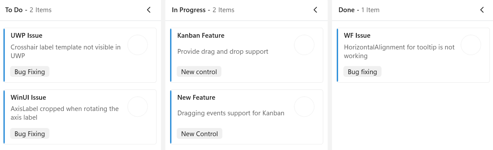
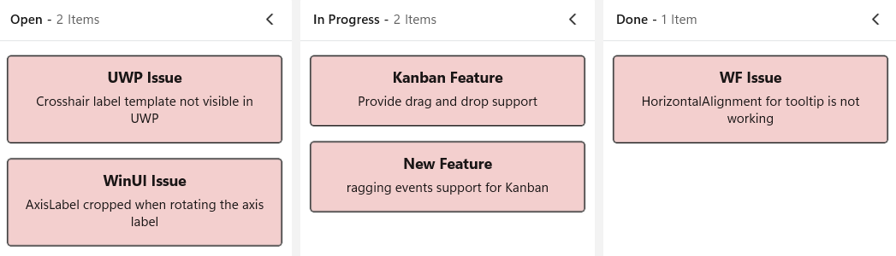
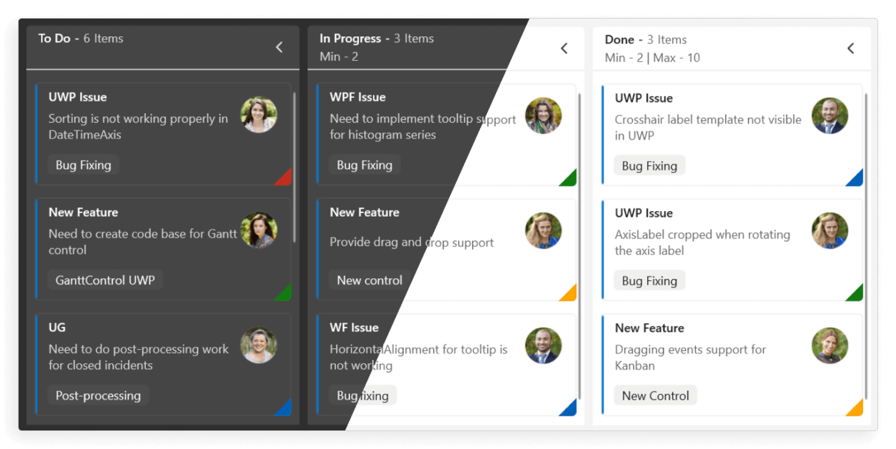
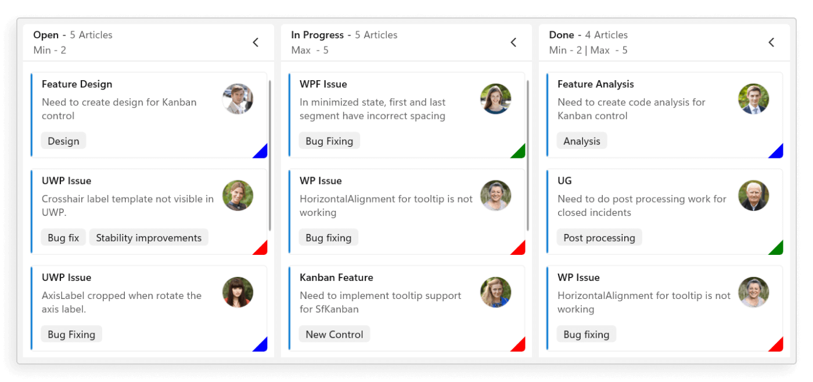
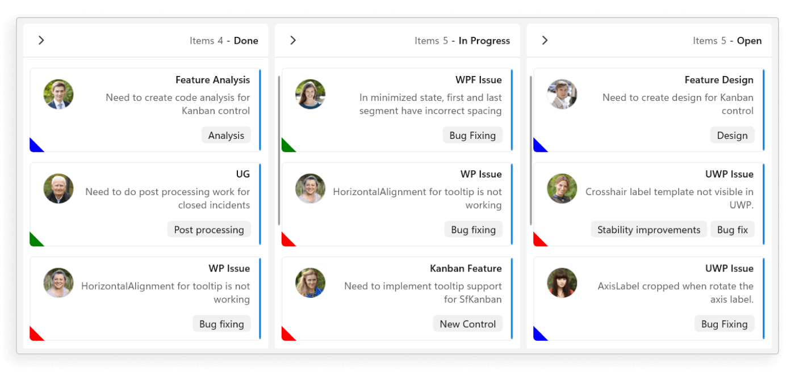

# Getting Started with WinUI Kanban Control

This section provides a quick overview of how to get started with the WinUI Kanban control (SfKanban) for WinUI and a walk-through to configure the WinUI Kanban control in a real-time scenario. Follow the steps below to add WinUI Kanban control to your project.

## Creating an application with WinUI Kanban

1. Create a [WinUI 3 desktop app for C# and .NET 6](https://learn.microsoft.com/en-us/windows/apps/winui/winui3/create-your-first-winui3-app).

2. Add reference to the [Syncfusion.Kanban.WinUI](https://www.nuget.org/packages/Syncfusion.Kanban.WinUI) NuGet.

3. Import the control namespace `Syncfusion.UI.Xaml.Kanban` in XAML or C# code.

4. Initialize the WinUI Kanban control.






<Window
    ...
    xmlns:kanban="using:Syncfusion.UI.Xaml.Kanban">

    <kanban:SfKanban x:Name="kanban"/>
</Window>





using Syncfusion.UI.Xaml.Kanban;
. . .

public sealed partial class MainWindow : Window
{
    public MainWindow()
    {
        this.InitializeComponent();
        SfKanban kanban = new SfKanban();
        this.Content = kanban;
    }
}




{{ codesnippet1 | OrderList_Indent_Level_1 }}

## Populate WinUI Kanban item source

This section explains how to populate the WinUI Kanban control's `ItemsSource` by creating and binding both default and custom task data models.

### Creating the default model tasks

* **Define the View Model:** Create a view model class to set values for the properties listed in the [`KanbanModel`](https://help.syncfusion.com/cr/winui/Syncfusion.UI.Xaml.Kanban.KanbanModel.html) class as shown in the following example code. Each [`KanbanModel`](https://help.syncfusion.com/cr/winui/Syncfusion.UI.Xaml.Kanban.KanbanModel.html) instance represent a card in Kanban control.

* **Bind item source for Kanban:** To populate the Kanban card items, utilize the [`ItemsSource`](https://help.syncfusion.com/cr/winui/Syncfusion.UI.Xaml.Kanban.SfKanban.html#Syncfusion_UI_Xaml_Kanban_SfKanban_ItemsSource) property of [`SfKanban`](https://help.syncfusion.com/cr/winui/Syncfusion.UI.Xaml.Kanban.SfKanban.html).

* **Defining columns in the Kanban Board:** The columns are generated automatically based on the different values of the [`Category`](https://help.syncfusion.com/cr/winui/Syncfusion.UI.Xaml.Kanban.KanbanModel.html#Syncfusion_UI_Xaml_Kanban_KanbanModel_Category) in the [`KanbanModel`](https://help.syncfusion.com/cr/winui/Syncfusion.UI.Xaml.Kanban.KanbanModel.html) class from the [`ItemsSource`](https://help.syncfusion.com/cr/winui/Syncfusion.UI.Xaml.Kanban.SfKanban.html#Syncfusion_UI_Xaml_Kanban_SfKanban_ItemsSource). However, you can manually define the columns by setting the [`AutoGenerateColumns`](https://help.syncfusion.com/cr/winui/Syncfusion.UI.Xaml.Kanban.SfKanban.html#Syncfusion_UI_Xaml_Kanban_SfKanban_AutoGenerateColumns) property to `false` and adding [`KanbanColumn`](https://help.syncfusion.com/cr/winui/Syncfusion.UI.Xaml.Kanban.KanbanColumn.html) instances to the [`Columns`](https://help.syncfusion.com/cr/winui/Syncfusion.UI.Xaml.Kanban.SfKanban.html#Syncfusion_UI_Xaml_Kanban_SfKanban_Columns) property of [`SfKanban`](https://help.syncfusion.com/cr/winui/Syncfusion.UI.Xaml.Kanban.SfKanban.html). You can define the column categories using the [`Categories`](https://help.syncfusion.com/cr/winui/Syncfusion.UI.Xaml.Kanban.KanbanColumn.html#Syncfusion_UI_Xaml_Kanban_KanbanColumn_Categories) property of [`KanbanColumn`](https://help.syncfusion.com/cr/winui/Syncfusion.UI.Xaml.Kanban.KanbanColumn.html), and the cards will be added to their respective columns.

The following sample code demonstrates this process in action:




<kanban:SfKanban x:Name="kanban"
                 AutoGenerateColumns="False" 
                 ItemsSource="{Binding TaskDetails}">
        <kanban:KanbanColumn HeaderText="To Do" Categories="Open" />
        <kanban:KanbanColumn HeaderText="In Progress" Categories="In Progress" />
        <kanban:KanbanColumn HeaderText="Done" Categories="Done" />
    <kanban:SfKanban.DataContext>
        <local:ViewModel/>
    </kanban:SfKanban.DataContext>
</kanban:SfKanban>




this.kanban.AutoGenerateColumns = false;
this.kanban.ItemsSource = new ViewModel().TaskDetails;
this.kanban.Columns.Add(new KanbanColumn() { HeaderText = "To Do", Categories = "Open" });
this.kanban.Columns.Add(new KanbanColumn() { HeaderText = "In Progress", Categories = "In Progress" });
this.kanban.Columns.Add(new KanbanColumn() { HeaderText = "Done", Categories = "Done" });



   
using Syncfusion.UI.Xaml.Kanban;

public class ViewModel
{
    /// 

    /// Gets or sets the collection of <see cref="KanbanModel"/> objects representing tasks in various stages.
    /// 

    public ObservableCollection<KanbanModel> TaskDetails { get; set; }

    /// 

    /// Initializes a new instance of the <see cref="ViewModel"/> class.
    /// 

    public ViewModel()
    {
        this.TaskDetails = this.GetTaskDetails();
    }

    /// 

    /// Method to get the kanban model collections.
    /// 

    /// <returns>The kanban model collections.</returns>
    private ObservableCollection<KanbanModel> GetTaskDetails()
    {
        var taskDetails = new ObservableCollection<KanbanModel>();

        KanbanModel taskDetail = new KanbanModel();
        taskDetail.Title = "UWP Issue";
        taskDetail.Id = "651";
        taskDetail.Description = "Crosshair label template not visible in UWP";
        taskDetail.Category = "Open";
        taskDetail.IndicatorColorKey = "High";
        taskDetail.Tags = new List<string>() { "Bug Fixing" };
        taskDetails.Add(taskDetail);

        taskDetail = new KanbanModel();
        taskDetail.Title = "WinUI Issue";
        taskDetail.Id = "646";
        taskDetail.Description = "AxisLabel cropped when rotating the axis label";
        taskDetail.Category = "Open";
        taskDetail.IndicatorColorKey = "Low";
        taskDetail.Tags = new List<string>() { "Bug Fixing" };
        taskDetails.Add(taskDetail);

        taskDetail = new KanbanModel();
        taskDetail.Title = "Kanban Feature";
        taskDetail.Id = "25678";
        taskDetail.Description = "Provide drag and drop support";
        taskDetail.Category = "In Progress";
        taskDetail.IndicatorColorKey = "Low";
        taskDetail.Tags = new List<string>() { "New control" };
        taskDetails.Add(taskDetail);

        taskDetail = new KanbanModel();
        taskDetail.Title = "New Feature";
        taskDetail.Id = "29574";
        taskDetail.Description = "Dragging events support for Kanban";
        taskDetail.Category = "In Progress";
        taskDetail.IndicatorColorKey = "Normal";
        taskDetail.Tags = new List<string>() { "New Control" };
        taskDetails.Add(taskDetail);

        taskDetail = new KanbanModel();
        taskDetail.Title = "WF Issue";
        taskDetail.Id = "1254";
        taskDetail.Description = "HorizontalAlignment for tooltip is not working";
        taskDetail.Category = "Done";
        taskDetail.IndicatorColorKey = "High";
        taskDetail.Tags = new List<string>() { "Bug fixing" };
        taskDetails.Add(taskDetail);

        return taskDetails;
    }
}




### Creating the custom model tasks with data mapping

You can also map custom data model to our Kanban control. The following steps demonstrate how to render tasks using the [WinUI Kanban](https://help.syncfusion.com/cr/winui/Syncfusion.UI.Xaml.Kanban.SfKanban.html) control with respective custom data properties.

* **Create a data model for kanban:** Create a simple data model in a new class file as shown in the following example code.

* **Create view model:** Create a view model class to set values for the properties listed in the model class as shown in the following example code.

* **Bind item source for Kanban:** To populate the Kanban card items, utilize the [`ItemsSource`](https://help.syncfusion.com/cr/winui/Syncfusion.UI.Xaml.Kanban.SfKanban.html#Syncfusion_UI_Xaml_Kanban_SfKanban_ItemsSource) property of [`SfKanban`](https://help.syncfusion.com/cr/winui/Syncfusion.UI.Xaml.Kanban.SfKanban.html) control. Additionally, ensure that the following properties of `SfKanban` are mapped from corresponding properties in the `ItemsSource` while initializing the kanban control.

The [`ColumnMappingPath`](https://help.syncfusion.com/cr/winui/Syncfusion.UI.Xaml.Kanban.SfKanban.html#Syncfusion_UI_Xaml_Kanban_SfKanban_ColumnMappingPath) specifies the name of the property within the data object that is used to generate columns in the Kanban control when [`AutoGenerateColumns`](https://help.syncfusion.com/cr/winui/Syncfusion.UI.Xaml.Kanban.SfKanban.html#Syncfusion_UI_Xaml_Kanban_SfKanban_AutoGenerateColumns) is set to `true`.

* **Defining columns in the Kanban Board:** The [`Columns`](https://help.syncfusion.com/cr/winui/Syncfusion.UI.Xaml.Kanban.SfKanban.html#Syncfusion_UI_Xaml_Kanban_SfKanban_Columns) in the Kanban board are mapped based on the values of a specified property (e.g., "Status") from your custom data model. The [`ColumnMappingPath`](https://help.syncfusion.com/cr/winui/Syncfusion.UI.Xaml.Kanban.SfKanban.html#Syncfusion_UI_Xaml_Kanban_SfKanban_ColumnMappingPath) specifies the name of the property within the data object that is used to generate columns in the Kanban control when [`AutoGenerateColumns`](https://help.syncfusion.com/cr/winui/Syncfusion.UI.Xaml.Kanban.SfKanban.html#Syncfusion_UI_Xaml_Kanban_SfKanban_AutoGenerateColumns)  is set to `true`. 

Alternatively, you can manually define columns by setting [`AutoGenerateColumns`](https://help.syncfusion.com/cr/winui/Syncfusion.UI.Xaml.Kanban.SfKanban.html#Syncfusion_UI_Xaml_Kanban_SfKanban_AutoGenerateColumns) to `false` and adding instances of [`KanbanColumn`](https://help.syncfusion.com/cr/maui/Syncfusion.Maui.Kanban.KanbanColumn.html) to the [`Columns`](https://help.syncfusion.com/cr/winui/Syncfusion.UI.Xaml.Kanban.SfKanban.html#Syncfusion_UI_Xaml_Kanban_SfKanban_Columns) collection of the [`SfKanban`](https://help.syncfusion.com/cr/winui/Syncfusion.UI.Xaml.Kanban.SfKanban.html) control. Based on the property specified in [`ColumnMappingPath`](https://help.syncfusion.com/cr/winui/Syncfusion.UI.Xaml.Kanban.SfKanban.html#Syncfusion_UI_Xaml_Kanban_SfKanban_ColumnMappingPath), the Kanban control will generate the columns and render the corresponding cards accordingly.

Let’s look at the practical code example:




<kanban:SfKanban x:Name="kanban"
                 ItemsSource="{Binding TaskDetails}"
                 ColumnMappingPath="Status">
    <kanban:SfKanban.CardTemplate>
        <DataTemplate>
            <Border BorderBrush="Black"
                    BorderThickness="1"
                    CornerRadius="3"
                    Background="#F3CFCE">
                <StackPanel Margin="10">
                    <TextBlock Text="{Binding Title}"
                               TextAlignment="Center"
                               FontWeight="Bold"
                               FontSize="14" />
                    <TextBlock Text="{Binding Description}"
                               TextAlignment="Center"
                               FontSize="12"
                               TextWrapping="Wrap"
                               Margin="5" />
                </StackPanel>
            </Border>
        </DataTemplate>
    </kanban:SfKanban.CardTemplate>
    <kanban:SfKanban.DataContext>
        <local:ViewModel />
    </kanban:SfKanban.DataContext>
</kanban:SfKanban>




this.kanban.ItemsSource = new ViewModel().TaskDetails;
this.kanban.ColumnMappingPath = "Status";




public class TaskDetails
{
    public string Title { get; set; }
    public string Description { get; set; }
    public object Status { get; set; }
}




public class ViewModel
{
    public ObservableCollection<TaskDetails> TaskDetails { get; set; }
    public ViewModel()
    {
        this.TaskDetails = this.GetTaskDetails();
    }

    private ObservableCollection<TaskDetails> GetTaskDetails()
    {
        var taskDetails = new ObservableCollection<TaskDetails>();

        TaskDetails taskDetail = new TaskDetails();
        taskDetail.Title = "UWP Issue";
        taskDetail.Description = "Crosshair label template not visible in UWP";
        taskDetail.Status = "Open";

        taskDetails.Add(taskDetail);

        taskDetail = new TaskDetails();
        taskDetail.Title = "WinUI Issue";
        taskDetail.Description = "AxisLabel cropped when rotating the axis label";
        taskDetail.Status = "Open";

        taskDetails.Add(taskDetail);

        taskDetail = new TaskDetails();
        taskDetail.Title = "Kanban Feature";
        taskDetail.Description = "Provide drag and drop support";
        taskDetail.Status = "In Progress";

        taskDetails.Add(taskDetail);

        taskDetail = new TaskDetails();
        taskDetail.Title = "New Feature";
        taskDetail.Description = "ragging events support for Kanban";
        taskDetail.Status = "In Progress";

        taskDetails.Add(taskDetail);

        taskDetail = new TaskDetails();
        taskDetail.Title = "WF Issue";
        taskDetail.Description = "HorizontalAlignment for tooltip is not working";
        taskDetail.Status = "Done";

        taskDetails.Add(taskDetail);

        return taskDetails;
    }
}




N> 
* When manually defining columns, ensure the [AutoGenerateColumns](https://help.syncfusion.com/cr/winui/Syncfusion.UI.Xaml.Kanban.SfKanban.html#Syncfusion_UI_Xaml_Kanban_SfKanban_AutoGenerateColumns) property of [SfKanban](https://help.syncfusion.com/cr/winui/Syncfusion.UI.Xaml.Kanban.SfKanban.html) is set to `false`.
* When using a custom data model, the default card UI is not applicable. You must define a custom `DataTemplate` using the [CardTemplate](https://help.syncfusion.com/cr/winui/Syncfusion.UI.Xaml.Kanban.SfKanban.html#Syncfusion_UI_Xaml_Kanban_SfKanban_CardTemplate) property to render the card content appropriately.

## Theme

The WinUI Kanban supports light and dark themes, automatically adjusting to the system's theme settings for a consistent and visually appealing experience in any environment.

Refer to the following link for guidance on applying themes: [Themes for Syncfusion WinUI controls](https://help.syncfusion.com/winui/common/themes)

You can find the kanban keys for all themes in this [theme resource file](https://github.com/syncfusion/winui-controls-theme-resource-files/tree/master/Syncfusion.Kanban.WinUI).

## Localization

The WinUI Kanban control supports the localization of all static default strings, allowing you to translate them into any supported language. For detailed instructions on how to localize the default strings, refer to the following link: [Localization in WinUI controls](https://help.syncfusion.com/winui/common/localization).

## Right to Left (RTL)

The WinUI Kanban control supports RTL (Right-to-Left) rendering, allowing both text and the control's layout to be displayed from right to left. For more information on how to enable RTL rendering, please refer to the following link: [Right to left in WinUI controls](https://help.syncfusion.com/winui/common/right-to-left).

N> You can refer to our [WinUI Kanban](https://www.syncfusion.com/winui-controls/kanban) feature tour page for its groundbreaking feature representations. You can also explore our [WinUI Kanban Examples](https://github.com/SyncfusionExamples/winui-kanban-examples) that shows you how to render the Kanban in WinUI.