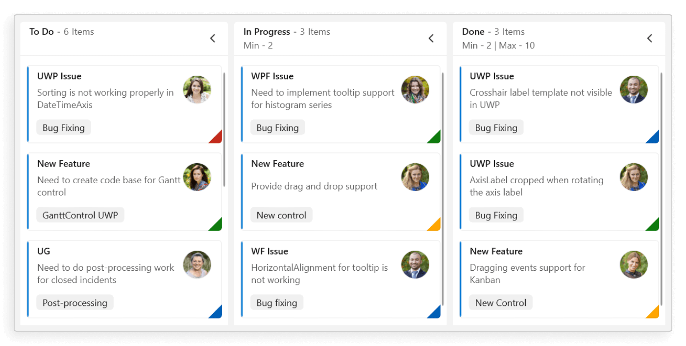
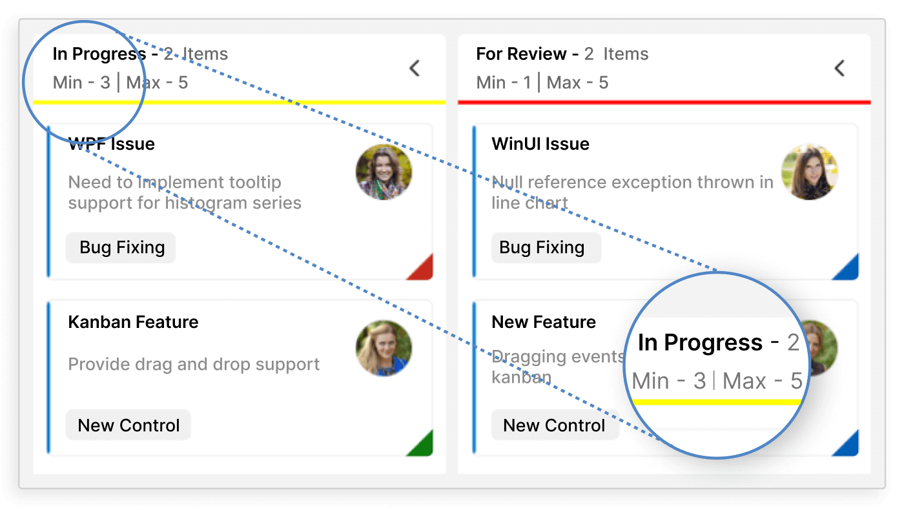
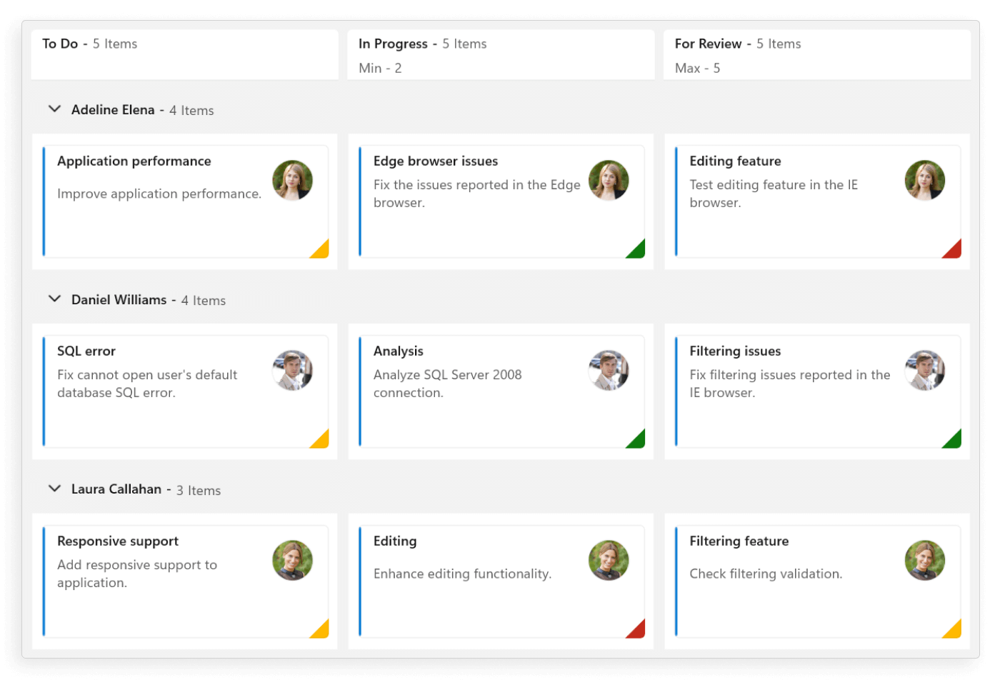
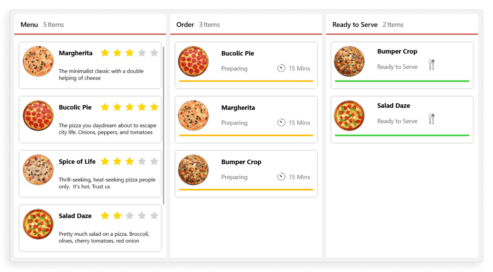
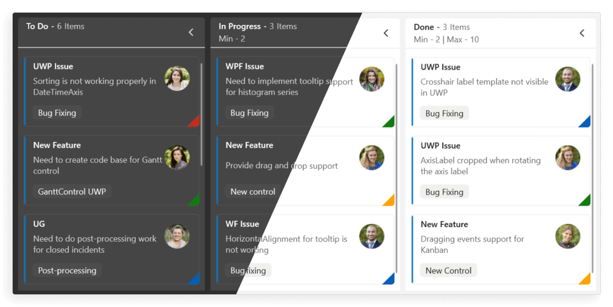

# Overview of WinUI Kanban (SfKanban)

The Syncfusion WinUI Kanban control provides an efficient way to visualize workflows at each stage of completion. It enables clear planning and offers a transparent view of work progress. With a range of essential features, SfKanban is ideal for monitoring tasks throughout the software development cycle.

## Key features

* **Work-in-progress (WIP) limit**: Users can set task limits per stage, preventing overload and improving efficiency.

* **Cards**: Display tasks, progress, and priority.
* **Columns**: Organize work into columns for stages like to-do, in-progress, and completed.

* **Swim lanes**: Organize tasks based on projects, teams, or custom criteria.

* **Interaction**: Includes card tapping, column expansion/collapse, and drag-and-drop.
* **Events**: Triggered when cards are dragged, repositioned, or tapped.
* **Appearance customization**: Customize each element using templates, e.g., column headers, cards, and swim lane headers.

* **Localization and RTL**: Easily adapt the control to any supported language or culture. Render the board right-to-left (RTL) to suit RTL languages.
* **Themes**: Built-in light and dark themes automatically adjust to system settings.

