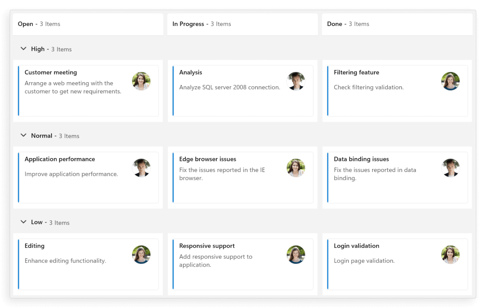
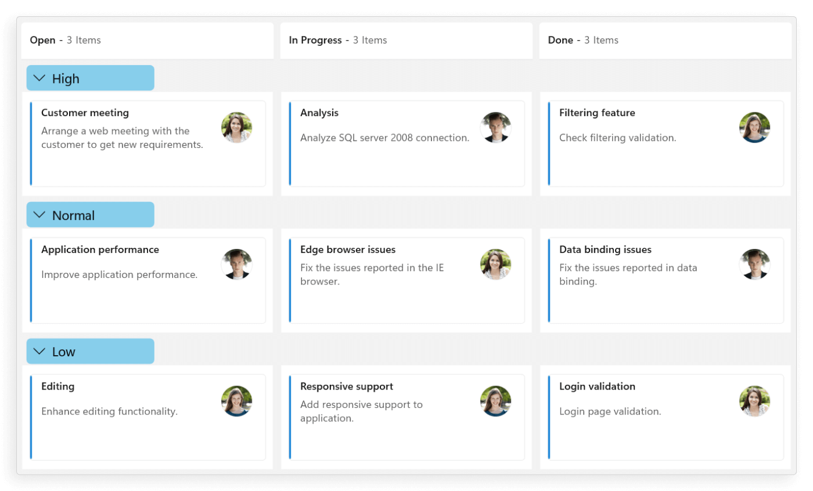

# Swimlane in WinUI Kanban (SfKanban) control

Swimlanes are horizontal categorizations of cards on the WinUI Kanban Board. It is used for grouping of cards, which brings transparency to the workflow process. They allow you to categorize your workflow by projects, teams, users, or any other criteria you need.

By default, swimlanes are categorized based on the [Assignee](https://help.syncfusion.com/cr/winui/Syncfusion.UI.Xaml.Kanban.KanbanModel.html#Syncfusion_UI_Xaml_Kanban_KanbanModel_Assignee) values in the [KanbanModel](https://help.syncfusion.com/cr/winui/Syncfusion.UI.Xaml.Kanban.KanbanModel.html) class. You can also define a category by mapping [SwimlaneKey](https://help.syncfusion.com/cr/winui/Syncfusion.UI.Xaml.Kanban.SfKanban.html#Syncfusion_UI_Xaml_Kanban_SfKanban_SwimlaneKey) to the appropriate property name in the defined [KanbanModel](https://help.syncfusion.com/cr/winui/Syncfusion.UI.Xaml.Kanban.KanbanModel.html).

The following example code demonstrates, how to group the underlying data collection using the [SwimlaneKey](https://help.syncfusion.com/cr/winui/Syncfusion.UI.Xaml.Kanban.SfKanban.html#Syncfusion_UI_Xaml_Kanban_SfKanban_SwimlaneKey) property in the Kanban control.




<kanban:SfKanban x:Name="kanban"
                 SwimlaneKey="IndicatorColorKey"
                 ItemsSource="{Binding TaskDetails}">
    <kanban:SfKanban.DataContext>
        <local:ViewModel/>
    </kanban:SfKanban.DataContext>
</kanban:SfKanban>





this.kanban.SwimlaneKey = "IndicatorColorKey";
this.kanban.ItemsSource = new ViewModel().TaskDetails;





public class ViewModel
{
    #region Properties

    /// 

    /// Gets or sets the collection of <see cref="KanbanModel"/> objects representing tasks in various stages.
    /// 

    public ObservableCollection<KanbanModel> TaskDetails { get; set; }

    #endregion

    #region Constructor

    /// 

    /// Initializes a new instance of the <see cref="ViewModel"/> class.
    /// 

    public ViewModel()
    {
        this.TaskDetails = this.GetTaskDetails();
    }

    #endregion

    #region Private methods

    /// 

    /// Method to get the kanban model collections.
    /// 

    /// <returns>The kanban model collections.</returns>
    private ObservableCollection<KanbanModel> GetTaskDetails()
    {
        var taskDetails = new ObservableCollection<KanbanModel>();
        string path = @"ms-appx:///";

        KanbanModel taskDetail = new KanbanModel();
        taskDetail.Title = "Customer meeting";
        taskDetail.Id = "3";
        taskDetail.Assignee = "Janet Leverling";
        taskDetail.Description = "Arrange a web meeting with the customer to get new requirements.";
        taskDetail.Category = "Backlog";
        taskDetail.IndicatorColorKey = "High";
        taskDetail.Image = new Image
        {
            Source = new BitmapImage(new Uri(path + "Assets/Kanban/People_Circle1.png"))
        };

        taskDetails.Add(taskDetail);

        taskDetail = new KanbanModel();
        taskDetail.Title = "Edge browser issues";
        taskDetail.Id = "4";
        taskDetail.Assignee = "Janet Leverling";
        taskDetail.Description = "Fix the issues reported in the IE browser.";
        taskDetail.Category = "Review";
        taskDetail.IndicatorColorKey = "Normal";
        taskDetail.Image = new Image
        {
            Source = new BitmapImage(new Uri(path + "Assets/Kanban/People_Circle1.png"))
        };

        taskDetails.Add(taskDetail);

        taskDetail = new KanbanModel();
        taskDetail.Title = "Application performance";
        taskDetail.Id = "2";
        taskDetail.Assignee = "Andrew Fuller";
        taskDetail.Description = "Improve application performance.";
        taskDetail.Category = "Backlog";
        taskDetail.IndicatorColorKey = "Normal";
        taskDetail.Image = new Image
        {
            Source = new BitmapImage(new Uri(path + "Assets/Kanban/People_Circle2.png"))
        };

        taskDetails.Add(taskDetail);

        taskDetail = new KanbanModel();
        taskDetail.Title = "Analysis";
        taskDetail.Id = "18";
        taskDetail.Assignee = "Andrew Fuller";
        taskDetail.Description = "Analyze SQL server 2008 connection.";
        taskDetail.Category = "In Progress";
        taskDetail.IndicatorColorKey = "Low";
        taskDetail.Image = new Image
        {
            Source = new BitmapImage(new Uri(path + "Assets/Kanban/People_Circle2.png"))
        };

        taskDetails.Add(taskDetail);

        taskDetail = new KanbanModel();
        taskDetail.Title = "Responsive support";
        taskDetail.Id = "14";
        taskDetail.Assignee = "Laura Callahan";
        taskDetail.Description = "Add responsive support to application.";
        taskDetail.Category = "In Progress";
        taskDetail.IndicatorColorKey = "High";
        taskDetail.Image = new Image
        {
            Source = new BitmapImage(new Uri(path + "Assets/Kanban/People_Circle4.png"))
        };

        taskDetails.Add(taskDetail);

        taskDetail = new KanbanModel();
        taskDetail.Title = "Filtering feature";
        taskDetail.Id = "48";
        taskDetail.Assignee = "Laura Callahan";
        taskDetail.Description = "Check filtering validation.";
        taskDetail.Category = "Testing";
        taskDetail.IndicatorColorKey = "Normal";
        taskDetail.Image = new Image
        {
            Source = new BitmapImage(new Uri(path + "Assets/Kanban/People_Circle4.png"))
        };

        taskDetails.Add(taskDetail);
        return taskDetails;
    }

    #endregion
}




## Customize swimlane header

The WinUI Kanban control allows you to customize the appearance of swimlane headers using the [SwimlaneHeaderTemplate](https://help.syncfusion.com/cr/winui/Syncfusion.UI.Xaml.Kanban.SfKanban.html#Syncfusion_UI_Xaml_Kanban_SfKanban_SwimlaneHeaderTemplate) property. This enables you to create a unique design for the header displayed at the beginning of each swimlane group.

The following example code demonstrates, how to customize a swimlane header in the WinUI Kanban control.




<kanban:SfKanban x:Name="kanban"
                 SwimlaneKey="IndicatorColorKey"
                 ItemsSource="{Binding TaskDetails}">
    <kanban:SfKanban.SwimlaneHeaderTemplate>
        <DataTemplate x:Name="swimlaneHeaderTemplate">
            <Grid>
                <Border BorderBrush="Black"
                        CornerRadius="5,5,5,5"
                        Width="150"
                        Margin="10,2,10,0"
                        HorizontalAlignment="Left">
                    <StackPanel Background="LightGray"
                                x:Name="SwimlaneHeaderPanel"
                                Orientation="Horizontal">
                        <Grid x:Name="CollapsedIcon"
                              Background="Transparent"
                              Height="30"
                              Width="30">
                            <Path x:Name="ExpandedPath"
                                  IsHitTestVisible="False"
                                  Data="M30.587915,0L31.995998,1.4199842 15.949964,17.351 0,1.4979873 1.4099131,0.078979151 15.949964,14.53102z"
                                  Stretch="Uniform"
                                  Fill="#FF000000"
                                  Width="14"
                                  Height="14"
                                  Margin="0,0,0,0"
                                  RenderTransformOrigin="0.5,0.5">
                                <Path.RenderTransform>
                                    <TransformGroup>
                                        <TransformGroup.Children>
                                            <RotateTransform Angle="0" />
                                            <ScaleTransform ScaleX="1"
                                                            ScaleY="1" />
                                        </TransformGroup.Children>
                                    </TransformGroup>
                                </Path.RenderTransform>
                            </Path>
                            <Path x:Name="CollapsedPath"
                                  Visibility="Collapsed"
                                  IsHitTestVisible="False"
                                  Data="M1.4200482,0L17.351001,16.046996 1.4980513,31.996001 0.078979631,30.585997 14.531046,16.046019 0,1.4089964z"
                                  Stretch="Uniform"
                                  Fill="#FF000000"
                                  Width="14"
                                  Height="14"
                                  Margin="0,0,0,0"
                                  RenderTransformOrigin="0.5,0.5">
                                <Path.RenderTransform>
                                    <TransformGroup>
                                        <TransformGroup.Children>
                                            <RotateTransform Angle="0" />
                                            <ScaleTransform ScaleX="1"
                                                            ScaleY="1" />
                                        </TransformGroup.Children>
                                    </TransformGroup>
                                </Path.RenderTransform>
                            </Path>
                        </Grid>
                        <TextBlock FontWeight="Medium"
                                   IsHitTestVisible="False"
                                   FontSize="15"
                                   FontStretch="Expanded"
                                   TextWrapping="NoWrap"
                                   VerticalAlignment="Center"
                                   Text="{Binding Title}" />
                    </StackPanel>
                </Border>
            </Grid>
        </DataTemplate>
    </kanban:SfKanban.SwimlaneHeaderTemplate>
    <kanban:SfKanban.DataContext>
        <local:ViewModel />
    </kanban:SfKanban.DataContext>
</kanban:SfKanban>





this.kanban.SwimlaneKey = "IndicatorColorKey";
this.kanban.ItemsSource = new ViewModel().TaskDetails;





public class ViewModel
{
    #region Properties

    /// 

    /// Gets or sets the collection of <see cref="KanbanModel"/> objects representing tasks in various stages.
    /// 

    public ObservableCollection<KanbanModel> TaskDetails { get; set; }

    #endregion

    #region Constructor

    /// 

    /// Initializes a new instance of the <see cref="ViewModel"/> class.
    /// 

    public ViewModel()
    {
        this.TaskDetails = this.GetTaskDetails();
    }

    #endregion

    #region Private methods

    /// 

    /// Method to get the kanban model collections.
    /// 

    /// <returns>The kanban model collections.</returns>
    private ObservableCollection<KanbanModel> GetTaskDetails()
    {
        var taskDetails = new ObservableCollection<KanbanModel>();
        string path = @"ms-appx:///";

        KanbanModel taskDetail = new KanbanModel();
        taskDetail.Title = "Customer meeting";
        taskDetail.Id = "3";
        taskDetail.Assignee = "Janet Leverling";
        taskDetail.Description = "Arrange a web meeting with the customer to get new requirements.";
        taskDetail.Category = "Backlog";
        taskDetail.IndicatorColorKey = "High";
        taskDetail.Image = new Image
        {
            Source = new BitmapImage(new Uri(path + "Assets/Kanban/People_Circle1.png"))
        };

        taskDetails.Add(taskDetail);

        taskDetail = new KanbanModel();
        taskDetail.Title = "Edge browser issues";
        taskDetail.Id = "4";
        taskDetail.Assignee = "Janet Leverling";
        taskDetail.Description = "Fix the issues reported in the IE browser.";
        taskDetail.Category = "Review";
        taskDetail.IndicatorColorKey = "Normal";
        taskDetail.Image = new Image
        {
            Source = new BitmapImage(new Uri(path + "Assets/Kanban/People_Circle1.png"))
        };

        taskDetails.Add(taskDetail);

        taskDetail = new KanbanModel();
        taskDetail.Title = "Application performance";
        taskDetail.Id = "2";
        taskDetail.Assignee = "Andrew Fuller";
        taskDetail.Description = "Improve application performance.";
        taskDetail.Category = "Backlog";
        taskDetail.IndicatorColorKey = "Normal";
        taskDetail.Image = new Image
        {
            Source = new BitmapImage(new Uri(path + "Assets/Kanban/People_Circle2.png"))
        };

        taskDetails.Add(taskDetail);

        taskDetail = new KanbanModel();
        taskDetail.Title = "Analysis";
        taskDetail.Id = "18";
        taskDetail.Assignee = "Andrew Fuller";
        taskDetail.Description = "Analyze SQL server 2008 connection.";
        taskDetail.Category = "In Progress";
        taskDetail.IndicatorColorKey = "Low";
        taskDetail.Image = new Image
        {
            Source = new BitmapImage(new Uri(path + "Assets/Kanban/People_Circle2.png"))
        };

        taskDetails.Add(taskDetail);

        taskDetail = new KanbanModel();
        taskDetail.Title = "Responsive support";
        taskDetail.Id = "14";
        taskDetail.Assignee = "Laura Callahan";
        taskDetail.Description = "Add responsive support to application.";
        taskDetail.Category = "In Progress";
        taskDetail.IndicatorColorKey = "High";
        taskDetail.Image = new Image
        {
            Source = new BitmapImage(new Uri(path + "Assets/Kanban/People_Circle4.png"))
        };

        taskDetails.Add(taskDetail);

        taskDetail = new KanbanModel();
        taskDetail.Title = "Filtering feature";
        taskDetail.Id = "48";
        taskDetail.Assignee = "Laura Callahan";
        taskDetail.Description = "Check filtering validation.";
        taskDetail.Category = "Testing";
        taskDetail.IndicatorColorKey = "Normal";
        taskDetail.Image = new Image
        {
            Source = new BitmapImage(new Uri(path + "Assets/Kanban/People_Circle4.png"))
        };

        taskDetails.Add(taskDetail);
        return taskDetails;
    }

    #endregion
}




N> The `DataContext` for the [SwimlaneHeaderTemplate](https://help.syncfusion.com/cr/winui/Syncfusion.UI.Xaml.Kanban.SfKanban.html#Syncfusion_UI_Xaml_Kanban_SfKanban_SwimlaneHeaderTemplate) property in [SfKanban](https://help.syncfusion.com/cr/winui/Syncfusion.UI.Xaml.Kanban.SfKanban.html) is set to the [KanbanModel](https://help.syncfusion.com/cr/winui/Syncfusion.UI.Xaml.Kanban.KanbanModel.html).

