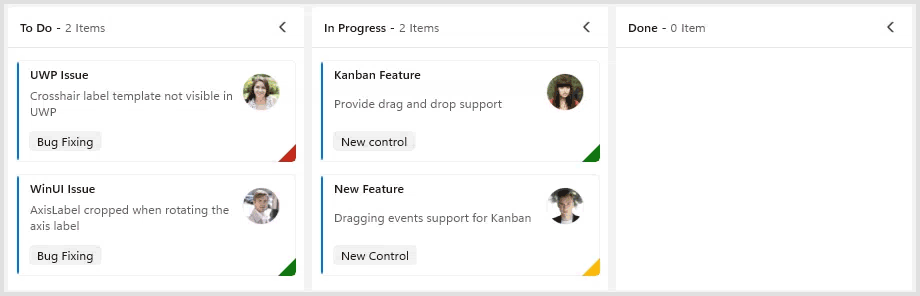

# Workflows in WinUI Kanban (SfKanban) control

The `WinUI Kanban` workflow allows to define the flow of cards between columns, offering restrictions when moving cards from one column to another. It also supports preventing drag-and-drop actions on specific columns.

To define the flow of card transitions between different states, create an instance of the `KanbanWorkflow` class and add it to the `Workflows` property of the `SfKanban` to define the workflow for each column. The `KanbanWorkflow` class contains the following properties to specify the source and target categories.

* `Category` – Used to define the source category or state.
* `AllowedTransitions` – Used to define the list of categories or states to which a card can be moved from the current category.
 


     
<kanban:SfKanban x:Name="kanban"
                 AutoGenerateColumns="False"
                 ItemsSource="{Binding TaskDetails}">
    <kanban:SfKanban.DataContext>
        <local:ViewModel/>
    </kanban:SfKanban.DataContext>
        <kanban:SfKanban.Workflows>
            <kanban:KanbanWorkflow Category="Open">
                <kanban:KanbanWorkflow.AllowedTransitions>
                    <x:String>In Progress</x:String>
                </kanban:KanbanWorkflow.AllowedTransitions>
            </kanban:KanbanWorkflow>
            <kanban:KanbanWorkflow Category="In Progress">
                <kanban:KanbanWorkflow.AllowedTransitions>
                    <x:String>Closed</x:String>
                    <x:String>Won't Fix</x:String>
                </kanban:KanbanWorkflow.AllowedTransitions>
            </kanban:KanbanWorkflow>
        </kanban:SfKanban.Workflows>
    <kanban:SfKanban.IndicatorColorPalette>
        <kanban:KanbanColorMapping Key="Low" Color="#0F7B0F"/>
        <kanban:KanbanColorMapping Key="Normal" Color="#FFB900"/>
        <kanban:KanbanColorMapping Key="High" Color="#C42B1C"/>
    </kanban:SfKanban.IndicatorColorPalette>
    <kanban:KanbanColumn HeaderText="To Do" 
                         Categories="Open,Postponed" />
    <kanban:KanbanColumn HeaderText="In Progress"
                         Categories="In Progress"/>
    <kanban:KanbanColumn HeaderText="Done"
                         Categories="Closed,Won't Fix"/>
 </kanban:SfKanban>



           
this.kanban.Workflows = new List<KanbanWorkflow>()
{
    new KanbanWorkflow() { Category = "Open", AllowedTransitions ={ "In Progress" } },
    new KanbanWorkflow() { Category = "In Progress", AllowedTransitions ={ "Closed", "Won't Fix" } },
};


 

public class ViewModel
{
    #region Properties

    /// 

    /// Gets or sets the collection of <see cref="KanbanModel"/> objects representing tasks in various stages.
    /// 

    public ObservableCollection<KanbanModel> TaskDetails { get; set; }

    #endregion

    #region Constructor

    /// 

    /// Initializes a new instance of the <see cref="ViewModel"/> class.
    /// 

    public ViewModel()
    {
        this.TaskDetails = this.GetTaskDetails();
    }

    #endregion

    #region Private methods

    /// 

    /// Method to get the kanban model collections.
    /// 

    /// <returns>The kanban model collections.</returns>
    private ObservableCollection<KanbanModel> GetTaskDetails()
    {
        var taskDetails = new ObservableCollection<KanbanModel>();
        string path = @"ms-appx:///";

        KanbanModel taskDetail = new KanbanModel();
        taskDetail.Title = "UWP Issue";
        taskDetail.Id = "651";
        taskDetail.Description = "Crosshair label template not visible in UWP";
        taskDetail.Category = "Open";
        taskDetail.IndicatorColorKey = "High";
        taskDetail.Tags = new List<string>() { "Bug Fixing" };
        taskDetail.Image = new Image
        {
            Source = new BitmapImage(new Uri("ms-appx:///Assets/Kanban/People_Circle1.png"))
        };

        taskDetails.Add(taskDetail);

        taskDetail = new KanbanModel();
        taskDetail.Title = "WinUI Issue";
        taskDetail.Id = "646";
        taskDetail.Description = "AxisLabel cropped when rotating the axis label";
        taskDetail.Category = "Open";
        taskDetail.IndicatorColorKey = "Low";
        taskDetail.Tags = new List<string>() { "Bug Fixing" };
        taskDetail.Image = new Image
        {
            Source = new BitmapImage(new Uri(path + "Assets/Kanban/People_Circle2.png"))
        };

        taskDetails.Add(taskDetail);

        taskDetail = new KanbanModel();
        taskDetail.Title = "Kanban Feature";
        taskDetail.Id = "25678";
        taskDetail.Description = "Provide drag and drop support";
        taskDetail.Category = "In Progress";
        taskDetail.IndicatorColorKey = "Low";
        taskDetail.Tags = new List<string>() { "New control" };
        taskDetail.Image = new Image
        {
            Source = new BitmapImage(new Uri(path + "Assets/Kanban/People_Circle3.png"))
        };

        taskDetails.Add(taskDetail);

        taskDetail = new KanbanModel();
        taskDetail.Title = "New Feature";
        taskDetail.Id = "29574";
        taskDetail.Description = "Dragging events support for Kanban";
        taskDetail.Category = "In Progress";
        taskDetail.IndicatorColorKey = "Normal";
        taskDetail.Tags = new List<string>() { "New Control" };
        taskDetail.Image = new Image
        {
            Source = new BitmapImage(new Uri(path + "Assets/Kanban/People_Circle4.png"))
        };

        taskDetails.Add(taskDetail);
        return taskDetails;
    }

    #endregion
}  




By following the code snippet, you will notice that a card picked from the `In Progress` state cannot be dropped into the `Open` state. This is because we have defined that the card can only transition from the `In Progress` state to the `Closed`, and `Won't Fix` states, and not to any other states.