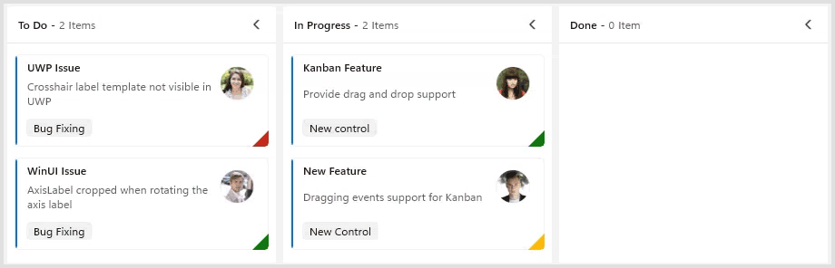

# Workflows in WinUI Kanban (SfKanban) control

The [WinUI Kanban](https://www.syncfusion.com/winui-controls/kanban) workflow allows you to define the flow of cards between columns, offering restrictions when moving cards from one column to another. It also supports preventing drag-and-drop actions on specific columns.

To define the flow of card transitions between different states, create an instance of the [KanbanWorkflow](https://help.syncfusion.com/cr/winui/Syncfusion.UI.Xaml.Kanban.KanbanWorkflow.html) class and add it to the [Workflows](https://help.syncfusion.com/cr/winui/Syncfusion.UI.Xaml.Kanban.SfKanban.html#Syncfusion_UI_Xaml_Kanban_SfKanban_Workflows) property of the [SfKanban](https://help.syncfusion.com/cr/winui/Syncfusion.UI.Xaml.Kanban.SfKanban.html) to define the workflow for each column. The [Workflows](https://help.syncfusion.com/cr/winui/Syncfusion.UI.Xaml.Kanban.SfKanban.html#Syncfusion_UI_Xaml_Kanban_SfKanban_Workflows) property accepts a collection of [KanbanWorkflow](https://help.syncfusion.com/cr/winui/Syncfusion.UI.Xaml.Kanban.KanbanWorkflow.html) objects. The [KanbanWorkflow](https://help.syncfusion.com/cr/winui/Syncfusion.UI.Xaml.Kanban.KanbanWorkflow.html) class contains the following properties to specify the source and target categories.

* The [AllowDrag](https://help.syncfusion.com/cr/winui/Syncfusion.UI.Xaml.Kanban.KanbanColumn.html#Syncfusion_UI_Xaml_Kanban_KanbanColumn_AllowDrag) and [AllowDrop](https://learn.microsoft.com/en-us/uwp/api/windows.ui.xaml.uielement.allowdrop) properties of [KanbanColumn](https://help.syncfusion.com/cr/winui/Syncfusion.UI.Xaml.Kanban.KanbanColumn.html) restrict drag-and-drop at the column level, independent of the workflow. A drag blocked by these properties takes precedence over any workflow rule.

* [Category](https://help.syncfusion.com/cr/winui/Syncfusion.UI.Xaml.Kanban.KanbanWorkflow.html#Syncfusion_UI_Xaml_Kanban_KanbanWorkflow_Category) – Used to define the source category or state.
* [AllowedTransitions](https://help.syncfusion.com/cr/winui/Syncfusion.UI.Xaml.Kanban.KanbanWorkflow.html#Syncfusion_UI_Xaml_Kanban_KanbanWorkflow_AllowedTransitions) – Used to define the list of categories or states to which a card can be moved from the current category.
 


     
<kanban:SfKanban x:Name="kanban"
                 AutoGenerateColumns="False"
                 ItemsSource="{Binding TaskDetails}">
    <kanban:SfKanban.DataContext>
        <local:ViewModel/>
    </kanban:SfKanban.DataContext>
        <kanban:SfKanban.Workflows>
            <kanban:KanbanWorkflow Category="Open">
                <kanban:KanbanWorkflow.AllowedTransitions>
                    <x:String>In Progress</x:String>
                </kanban:KanbanWorkflow.AllowedTransitions>
            </kanban:KanbanWorkflow>
            <kanban:KanbanWorkflow Category="In Progress">
                <kanban:KanbanWorkflow.AllowedTransitions>
                    <x:String>Closed</x:String>
                    <x:String>Won't Fix</x:String>
                </kanban:KanbanWorkflow.AllowedTransitions>
            </kanban:KanbanWorkflow>
        </kanban:SfKanban.Workflows>
    <kanban:SfKanban.IndicatorColorPalette>
        <kanban:KanbanColorMapping Key="Low" Color="#0F7B0F"/>
        <kanban:KanbanColorMapping Key="Normal" Color="#FFB900"/>
        <kanban:KanbanColorMapping Key="High" Color="#C42B1C"/>
    </kanban:SfKanban.IndicatorColorPalette>
    <kanban:KanbanColumn HeaderText="To Do" 
                         Categories="Open,Postponed" />
    <kanban:KanbanColumn HeaderText="In Progress"
                         Categories="In Progress"/>
    <kanban:KanbanColumn HeaderText="Done"
                         Categories="Closed,Won't Fix"/>
 </kanban:SfKanban>



           
this.kanban.Workflows = new List<KanbanWorkflow>()
{
    new KanbanWorkflow() { Category = "Open", AllowedTransitions = new List<string> { "In Progress" } },
    new KanbanWorkflow() { Category = "In Progress", AllowedTransitions = new List<string> { "Closed", "Won't Fix" } },
};



N> In XAML, the strings added directly inside `kanban:KanbanWorkflow.AllowedTransitions` are automatically wrapped as `List<string>` items. In C#, assign a `List<string>` explicitly to the [AllowedTransitions](https://help.syncfusion.com/cr/winui/Syncfusion.UI.Xaml.Kanban.KanbanWorkflow.html#Syncfusion_UI_Xaml_Kanban_KanbanWorkflow_AllowedTransitions) property.

 

public class ViewModel
{
    #region Properties

    /// 

    /// Gets or sets the collection of <see cref="KanbanModel"/> objects representing tasks in various stages.
    /// 

    public ObservableCollection<KanbanModel> TaskDetails { get; set; }

    #endregion

    #region Constructor

    /// 

    /// Initializes a new instance of the <see cref="ViewModel"/> class.
    /// 

    public ViewModel()
    {
        this.TaskDetails = this.GetTaskDetails();
    }

    #endregion

    #region Private methods

    /// 

    /// Method to get the kanban model collections.
    /// 

    /// <returns>The kanban model collections.</returns>
    private ObservableCollection<KanbanModel> GetTaskDetails()
    {
        var taskDetails = new ObservableCollection<KanbanModel>();
        string path = @"ms-appx:///";

        KanbanModel taskDetail = new KanbanModel();
        taskDetail.Title = "UWP Issue";
        taskDetail.Id = "651";
        taskDetail.Description = "Crosshair label template not visible in UWP";
        taskDetail.Category = "Open";
        taskDetail.IndicatorColorKey = "High";
        taskDetail.Tags = new List<string>() { "Bug Fixing" };
        taskDetail.Image = new Image
        {
            Source = new BitmapImage(new Uri("ms-appx:///Assets/Kanban/People_Circle1.png"))
        };

        taskDetails.Add(taskDetail);

        taskDetail = new KanbanModel();
        taskDetail.Title = "WinUI Issue";
        taskDetail.Id = "646";
        taskDetail.Description = "AxisLabel cropped when rotating the axis label";
        taskDetail.Category = "Open";
        taskDetail.IndicatorColorKey = "Low";
        taskDetail.Tags = new List<string>() { "Bug Fixing" };
        taskDetail.Image = new Image
        {
            Source = new BitmapImage(new Uri(path + "Assets/Kanban/People_Circle2.png"))
        };

        taskDetails.Add(taskDetail);

        taskDetail = new KanbanModel();
        taskDetail.Title = "Kanban Feature";
        taskDetail.Id = "25678";
        taskDetail.Description = "Provide drag and drop support";
        taskDetail.Category = "In Progress";
        taskDetail.IndicatorColorKey = "Low";
        taskDetail.Tags = new List<string>() { "New control" };
        taskDetail.Image = new Image
        {
            Source = new BitmapImage(new Uri(path + "Assets/Kanban/People_Circle3.png"))
        };

        taskDetails.Add(taskDetail);

        taskDetail = new KanbanModel();
        taskDetail.Title = "New Feature";
        taskDetail.Id = "29574";
        taskDetail.Description = "Dragging events support for Kanban";
        taskDetail.Category = "In Progress";
        taskDetail.IndicatorColorKey = "Normal";
        taskDetail.Tags = new List<string>() { "New Control" };
        taskDetail.Image = new Image
        {
            Source = new BitmapImage(new Uri(path + "Assets/Kanban/People_Circle4.png"))
        };

        taskDetails.Add(taskDetail);
        return taskDetails;
    }

    #endregion
}  




By following the code snippet, you will notice that a card picked from the `In Progress` state cannot be dropped into the `Open` state, because the workflow only allows transitions from the `In Progress` state to the `Closed` and `Won't Fix` states.