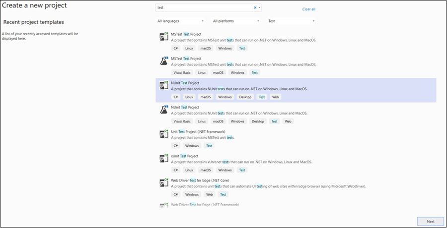
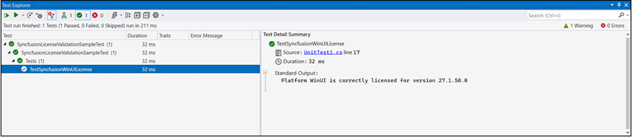
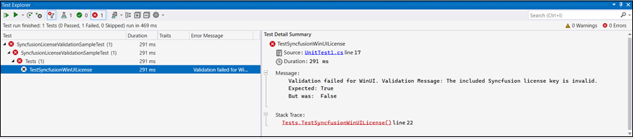

# Syncfusion license key validation in CI services

Syncfusion license key validation in CI services ensures that Syncfusion Essential Studio components are properly licensed during CI processes. Validating the license key at the CI level can prevent licensing errors during deployment. Set up the continuous integration process to fail in case the license key validation fails. Validate the passed parameters and the registered license key again to resolve the issue.

The following section shows how to validate the Syncfusion license key in CI services.

* Download and extract the LicenseKeyValidator.zip utility from the following link: [LicenseKeyValidator](https://s3.amazonaws.com/files2.syncfusion.com/Installs/LicenseKeyValidation/LicenseKeyValidator.zip).
* Extract the zip to a known folder (e.g., `D:\LicenseKeyValidator`).
* Open the LicenseKeyValidation.ps1 PowerShell script in a text or code editor as shown in the example below.



# Replace the parameters with the desired platform, version, and actual license key.

$result = & $PSScriptRoot"\LicenseKeyValidatorConsole.exe" /platform:"UIComponent" /version:"34.1.29" /licensekey:"Your License Key"

Write-Host $result



# Replace the parameters with the desired platform, version, and actual license key.

$result = & $PSScriptRoot"\LicenseKeyValidatorConsole.exe" /platform:"WinUI" /version:"26.2.4" /licensekey:"Your License Key"

Write-Host $result



* Update the parameters in the script:
  
  **Platform:** Set /platform:"**UIComponent**" for v34.1.29 and later, or /platform:"**WinUI**" for earlier versions (use the relevant Syncfusion platform as needed).
  
  **Version:**  Change the value for /version: to the required version (e.g., "26.2.4").
  
  **License Key:** Replace the value for /licensekey: with your actual license key (e.g., "Your License Key"). 

## Azure Pipelines (YAML)

* Create a new [User-defined Variable](https://learn.microsoft.com/en-us/azure/devops/pipelines/process/variables?view=azure-devops&tabs=yaml%2Cbatch#user-defined-variables) named `LICENSE_VALIDATION` in the Azure Pipeline. Use the path of the LicenseKeyValidation.ps1 script file as a value (e.g., `D:\LicenseKeyValidator\LicenseKeyValidation.ps1`). Mark it as a secret if your organization requires.

* Add the PowerShell task to the pipeline to execute the script and validate the license key.

The following example shows the syntax for Windows build agents.



pool:
  vmImage: 'windows-latest'

steps:

- task: PowerShell@2
  inputs:
    targetType: filePath
    filePath: $(LICENSE_VALIDATION) #Or the actual path to the LicenseKeyValidation.ps1 script.
  
  displayName: Syncfusion License Validation 



## Azure Pipelines (Classic)

* Create a new [User-defined Variable](https://learn.microsoft.com/en-us/azure/devops/pipelines/process/variables?view=azure-devops&tabs=yaml%2Cbatch#user-defined-variables) named `LICENSE_VALIDATION` in the Azure Pipeline. Use the path of the LicenseKeyValidation.ps1 script file as a value (e.g., `D:\LicenseKeyValidator\LicenseKeyValidation.ps1`).

* Add the PowerShell task in the pipeline and execute the script to validate the license key.

## GitHub Actions

* To execute the script in PowerShell as part of a GitHub Actions workflow, include a step in the configuration file and update the path of the LicenseKeyValidation.ps1 script file (e.g., D:\LicenseKeyValidator\LicenseKeyValidation.ps1).

The following example shows the syntax for validating the Syncfusion license key in GitHub Actions.



steps:
  - name: Syncfusion License Validation
    shell: pwsh
    run: |
	  ./path/LicenseKeyValidator/LicenseKeyValidation.ps1



## Jenkins

* Create an [Environment Variable](https://www.jenkins.io/doc/pipeline/tour/environment) named 'LICENSE_VALIDATION'. Use the path of the LicenseKeyValidation.ps1 script file as a value (e.g., D:\LicenseKeyValidator\LicenseKeyValidation.ps1).

* Include a stage in Jenkins to execute the LicenseKeyValidation.ps1 script in PowerShell. 

The following example shows the syntax for validating the Syncfusion license key in the Jenkins pipeline.



pipeline {
	agent any
	environment {
		LICENSE_VALIDATION = 'path\\to\\LicenseKeyValidator\\LicenseKeyValidation.ps1'
	}
	stages {
		stage('Syncfusion License Validation') {
			steps {
				sh 'pwsh ${LICENSE_VALIDATION}'
			}
		}
	}
}



## Validate the License Key by Using the ValidateLicense() Method

* Register the license key properly by calling RegisterLicense("License Key") method with the license key. 

* Once the license key is registered, it can be validated by using the ValidateLicense("Platform.WinUI") method. This ensures that the license key is valid for the platform and version you are using. For reference, please check the following example.



using Syncfusion.Licensing;

// Register the Syncfusion license key
SyncfusionLicenseProvider.RegisterLicense("YOUR LICENSE KEY");

//Validate the registered license key.
// The array overload allows validating against multiple platforms in a single call.
bool isValid = SyncfusionLicenseProvider.ValidateLicense(new[] { Platform.UIComponent });



using Syncfusion.Licensing;

// Register the Syncfusion license key
SyncfusionLicenseProvider.RegisterLicense("YOUR LICENSE KEY");

// Validate the registered license key
bool isValid = SyncfusionLicenseProvider.ValidateLicense(Platform.WinUI);



N> Use `Platform.UIComponent` for UI component license validation in v34.1.29 and later. `Platform.WinUI` is not supported from v34.1.29 onwards.

* If the ValidateLicense() method returns true, registered license key is valid and can proceed with deployment.

* If the ValidateLicense() method returns false, there will be invalid license errors in deployment due to either an invalid license key or an incorrect assembly or package version that is referenced in the project. Please ensure that all the referenced Syncfusion assemblies or NuGet packages are all on the same version as the license key’s version before deployment. 

## Validate the License Key Using a Unit Test Project

* In Visual Studio, create a unit test project via **File -> New -> Project**, then filter by **Test**. Choose MSTest, NUnit, or xUnit. The sample below uses NUnit.

* For more details, refer to the [Getting Started with Unit Testing guide](https://learn.microsoft.com/en-us/visualstudio/test/getting-started-with-unit-testing?view=vs-2022&tabs=dotnet%2Cmstest#create-unit-tests).
* Install the required Syncfusion NuGet packages (matching the version of your license key) in the test project.
* Register the license key by calling `SyncfusionLicenseProvider.RegisterLicense("YOUR LICENSE KEY")` in the test method.
* Validate the registered license key by calling `SyncfusionLicenseProvider.ValidateLicense(Platform.WinUI, out string validationMessage)`.

> Place the license key between double quotes and ensure that `Syncfusion.Licensing.dll` is referenced in your test project.

The following example demonstrates how to register and validate the license key in the unit test project.



public void TestSyncfusionWinUILicense()
{
	var platform = Platform.WinUI;
	// Register the Syncfusion license key
	SyncfusionLicenseProvider.RegisterLicense("Your License Key");

	bool isValidLicense = SyncfusionLicenseProvider.ValidateLicense(platform, out var validationMessage);
	Assert.That(isValidLicense, Is.True, $"Validation failed for {platform}." + $" Validation Message: {validationMessage}");

	// Log validation messages to TestContext output
	if (isValidLicense)
	{
		TestContext.Out.WriteLine($"Platform {platform} is correctly licensed for version " + $"{typeof(SyncfusionLicenseProvider).Assembly.GetName().Version}");
	}
}



* When the unit test passes, output similar to the following appears in the Test Explorer window.

* When the unit test fails, output similar to the following appears in the Test Explorer window.

* License validation fails due to either an invalid license key or an incorrect assembly or package version that is referenced in the project. In such cases, verify that you are using the valid license key for the platform, and ensure the assembly or package versions referenced in the project match the version of the license key.