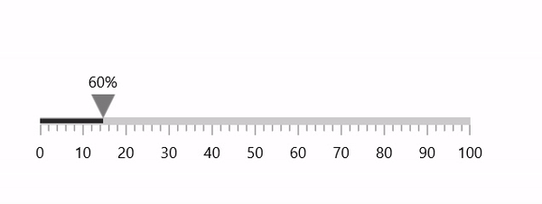
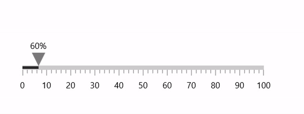

# Animation Support in WinUI Linear Gauge (SfLinearGauge)

## Pointer animation

The `EnableAnimation` property of pointer allows to enable or disable animation for pointer.





<gauge:SfLinearGauge>
    <gauge:SfLinearGauge.Axis>
        <gauge:LinearAxis Interval="10"
                          MinorTicksPerInterval="4">

            <gauge:LinearAxis.BarPointers>
                <gauge:BarPointer Value="60" 
                                  EnableAnimation="True" />
            </gauge:LinearAxis.BarPointers>

            <gauge:LinearAxis.MarkerPointers>
                <gauge:ShapePointer Value="60"
                                    VerticalAnchor="End"
                                    OffsetPoint="0,-3"
                                    EnableAnimation="True" />

                <gauge:ContentPointer Value="60"
                                      VerticalAnchor="End"
                                      OffsetPoint="0,-23"
                                      EnableAnimation="True">
                    <gauge:ContentPointer.Content>
                        <TextBlock Text="60%" />
                    </gauge:ContentPointer.Content>
                </gauge:ContentPointer>

            </gauge:LinearAxis.MarkerPointers>
        </gauge:LinearAxis>
    </gauge:SfLinearGauge.Axis>
</gauge:SfLinearGauge>





SfLinearGauge sfLinearGauge = new SfLinearGauge();
sfLinearGauge.Axis.Interval = 10;
sfLinearGauge.Axis.MinorTicksPerInterval = 4;

BarPointer barPointer1 = new BarPointer();
barPointer1.Value = 60;
barPointer1.EnableAnimation = true;
sfLinearGauge.Axis.BarPointers.Add(barPointer1);

ShapePointer shapePointer1 = new ShapePointer();
shapePointer1.Value = 60;
shapePointer1.VerticalAnchor = GaugeAnchor.End;
shapePointer1.OffsetPoint = new Point(0, -3);
shapePointer1.EnableAnimation = true;
sfLinearGauge.Axis.MarkerPointers.Add(shapePointer1);

ContentPointer contentPointer1 = new ContentPointer();
contentPointer1.Value = 60;
contentPointer1.VerticalAnchor = GaugeAnchor.End;
contentPointer1.OffsetPoint = new Point(0, -23);
contentPointer1.Content = new TextBlock { Text = "60%" };
contentPointer1.EnableAnimation = true;
sfLinearGauge.Axis.MarkerPointers.Add(contentPointer1);

this.Content = sfLinearGauge;





## Animation duration

The `AnimationDuration` property of pointer allows to control the animation duration (in milliseconds). The default value of animation duration is 1500ms.





<gauge:SfLinearGauge>
    <gauge:SfLinearGauge.Axis>
        <gauge:LinearAxis Interval="10"
                          MinorTicksPerInterval="4">

            <gauge:LinearAxis.BarPointers>
                <gauge:BarPointer Value="60" 
                                  EnableAnimation="True"
                                  AnimationDuration="3000" />
            </gauge:LinearAxis.BarPointers>

            <gauge:LinearAxis.MarkerPointers>
                <gauge:ShapePointer Value="60"
                                    VerticalAnchor="End"
                                    OffsetPoint="0,-3"
                                    EnableAnimation="True"
                                    AnimationDuration="3000" />

                <gauge:ContentPointer Value="60"
                                      VerticalAnchor="End"
                                      OffsetPoint="0,-23"
                                      EnableAnimation="True"
                                      AnimationDuration="3000">
                    <gauge:ContentPointer.Content>
                        <TextBlock Text="60%" />
                    </gauge:ContentPointer.Content>
                </gauge:ContentPointer>

            </gauge:LinearAxis.MarkerPointers>
        </gauge:LinearAxis>
    </gauge:SfLinearGauge.Axis>
</gauge:SfLinearGauge>





SfLinearGauge sfLinearGauge = new SfLinearGauge();
sfLinearGauge.Axis.Interval = 10;
sfLinearGauge.Axis.MinorTicksPerInterval = 4;

BarPointer barPointer1 = new BarPointer();
barPointer1.Value = 60;
barPointer1.EnableAnimation = true;
barPointer1.AnimationDuration = 3000;
sfLinearGauge.Axis.BarPointers.Add(barPointer1);

ShapePointer shapePointer1 = new ShapePointer();
shapePointer1.Value = 60;
shapePointer1.VerticalAnchor = GaugeAnchor.End;
shapePointer1.OffsetPoint = new Point(0, -3);
shapePointer1.EnableAnimation = true;
shapePointer1.AnimationDuration = 3000;
sfLinearGauge.Axis.MarkerPointers.Add(shapePointer1);

ContentPointer contentPointer1 = new ContentPointer();
contentPointer1.Value = 60;
contentPointer1.VerticalAnchor = GaugeAnchor.End;
contentPointer1.OffsetPoint = new Point(0, -23);
contentPointer1.Content = new TextBlock { Text = "60%" };
contentPointer1.EnableAnimation = true;
contentPointer1.AnimationDuration = 3000;
sfLinearGauge.Axis.MarkerPointers.Add(contentPointer1);

this.Content = sfLinearGauge;





## Animation Easing Function

The `AnimationEasingFunction` property of pointer allows you to change the easing function. The default value `AnimationEasingFunction` property is null.





<gauge:SfLinearGauge>
    <gauge:SfLinearGauge.Axis>
        <gauge:LinearAxis Interval="10"
                          MinorTicksPerInterval="4">

            <gauge:LinearAxis.BarPointers>
                <gauge:BarPointer Value="70"
                                  EnableAnimation="True"
                                  AnimationDuration="3000">
                    <gauge:BarPointer.AnimationEasingFunction>
                        <CircleEase EasingMode="EaseIn" />
                    </gauge:BarPointer.AnimationEasingFunction>
                </gauge:BarPointer>
            </gauge:LinearAxis.BarPointers>

            <gauge:LinearAxis.MarkerPointers>
                <gauge:ShapePointer Value="70"
                                    VerticalAnchor="End"
                                    OffsetPoint="0,-3"
                                    EnableAnimation="True"
                                    AnimationDuration="3000">
                    <gauge:ShapePointer.AnimationEasingFunction>
                        <CircleEase EasingMode="EaseIn" />
                    </gauge:ShapePointer.AnimationEasingFunction>
                </gauge:ShapePointer>

                <gauge:ContentPointer Value="70"
                                      VerticalAnchor="End"
                                      OffsetPoint="0,-23"
                                      EnableAnimation="True"
                                      AnimationDuration="3000">
                    <gauge:ContentPointer.AnimationEasingFunction>
                        <CircleEase EasingMode="EaseIn" />
                    </gauge:ContentPointer.AnimationEasingFunction>
                    <gauge:ContentPointer.Content>
                        <TextBlock Text="70%" />
                    </gauge:ContentPointer.Content>
                </gauge:ContentPointer>

            </gauge:LinearAxis.MarkerPointers>
        </gauge:LinearAxis>
    </gauge:SfLinearGauge.Axis>
</gauge:SfLinearGauge>





SfLinearGauge sfLinearGauge = new SfLinearGauge();
sfLinearGauge.Axis.Interval = 10;
sfLinearGauge.Axis.MinorTicksPerInterval = 4;

BarPointer barPointer1 = new BarPointer();
barPointer1.Value = 70;
barPointer1.EnableAnimation = true;
barPointer1.AnimationDuration = 3000;
barPointer1.AnimationEasingFunction = new CircleEase { EasingMode = EasingMode.EaseIn };
sfLinearGauge.Axis.BarPointers.Add(barPointer1);

ShapePointer shapePointer1 = new ShapePointer();
shapePointer1.Value = 70;
shapePointer1.VerticalAnchor = GaugeAnchor.End;
shapePointer1.OffsetPoint = new Point(0, -3);
shapePointer1.EnableAnimation = true;
shapePointer1.AnimationDuration = 3000;
shapePointer1.AnimationEasingFunction = new CircleEase { EasingMode = EasingMode.EaseIn };
sfLinearGauge.Axis.MarkerPointers.Add(shapePointer1);

ContentPointer contentPointer1 = new ContentPointer();
contentPointer1.Value = 70;
contentPointer1.VerticalAnchor = GaugeAnchor.End;
contentPointer1.OffsetPoint = new Point(0, -23);
contentPointer1.Content = new TextBlock { Text = "70%" };
contentPointer1.EnableAnimation = true;
contentPointer1.AnimationDuration = 3000;
contentPointer1.AnimationEasingFunction = new CircleEase { EasingMode = EasingMode.EaseIn };
sfLinearGauge.Axis.MarkerPointers.Add(contentPointer1);

this.Content = sfLinearGauge;





N> Refer to the [EasingFunctionBase](https://docs.microsoft.com/en-us/uwp/api/windows.ui.xaml.media.animation.easingfunctionbase), to learn about available easing functions in WinUI.