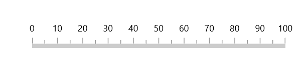
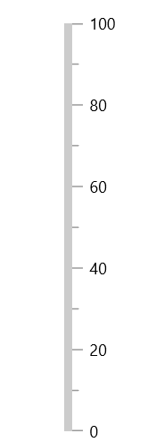

# Axis in WinUI Linear Gauge

The [`Linear axis`](https://help.syncfusion.com/cr/winui/Syncfusion.UI.Xaml.Gauges.LinearAxis.html?tabs=tabid-1) is a linear scale, where a set of values can be plotted along with a linear or custom scale, based on the design requirements. Axis elements such as labels, ticks, and axis line can be easily customized with built-in properties.

## Axis customization

### Setting axis minimum and maximum value

The [`Minimum`](https://help.syncfusion.com/cr/winui/Syncfusion.UI.Xaml.Gauges.LinearAxis.html?tabs=tabid-1#Syncfusion_UI_Xaml_Gauges_LinearAxis_Minimum) and [`Maximum`](https://help.syncfusion.com/cr/winui/Syncfusion.UI.Xaml.Gauges.LinearAxis.html#Syncfusion_UI_Xaml_Gauges_LinearAxis_Maximum) properties of an axis can be used to customize the axis value range. The default value of [`Minimum`](https://help.syncfusion.com/cr/winui/Syncfusion.UI.Xaml.Gauges.LinearAxis.html?tabs=tabid-1#Syncfusion_UI_Xaml_Gauges_LinearAxis_Minimum) is 0 and  [`Maximum`](https://help.syncfusion.com/cr/winui/Syncfusion.UI.Xaml.Gauges.LinearAxis.html#Syncfusion_UI_Xaml_Gauges_LinearAxis_Maximum) is 100.





<gauge:SfLinearGauge>
    <gauge:SfLinearGauge.Axis>
        <gauge:LinearAxis Minimum="-60"
                          Maximum="60" />
    </gauge:SfLinearGauge.Axis>
</gauge:SfLinearGauge>





SfLinearGauge sfLinearGauge = new SfLinearGauge();
sfLinearGauge.Axis.Minimum = -60;
sfLinearGauge.Axis.Maximum = 60;
this.Content = sfLinearGauge;





### Interval

The interval between labels can be customized using the [`Interval`](https://help.syncfusion.com/cr/winui/Syncfusion.UI.Xaml.Gauges.LinearAxis.html#Syncfusion_UI_Xaml_Gauges_LinearAxis_Interval) property of axis.





<gauge:SfLinearGauge>
    <gauge:SfLinearGauge.Axis>
        <gauge:LinearAxis Interval="20" />
    </gauge:SfLinearGauge.Axis>
</gauge:SfLinearGauge>





SfLinearGauge sfLinearGauge = new SfLinearGauge();
sfLinearGauge.Axis.Interval = 20;
this.Content = sfLinearGauge;





### Axis direction customization

The direction of [`Linear axis`](https://help.syncfusion.com/cr/winui/Syncfusion.UI.Xaml.Gauges.LinearAxis.html?tabs=tabid-1) can be customized by the [`IsInversed`](https://help.syncfusion.com/cr/winui/Syncfusion.UI.Xaml.Gauges.SfLinearGauge.html#Syncfusion_UI_Xaml_Gauges_SfLinearGauge_IsInversed) property of [`Linear gauge`](https://help.syncfusion.com/cr/winui/Syncfusion.UI.Xaml.Gauges.SfLinearGauge.html). 

When the [`IsInversed`](https://help.syncfusion.com/cr/winui/Syncfusion.UI.Xaml.Gauges.SfLinearGauge.html#Syncfusion_UI_Xaml_Gauges_SfLinearGauge_IsInversed) property is true, the axis can be placed in right-to-left direction. When the  [`IsInversed`](https://help.syncfusion.com/cr/winui/Syncfusion.UI.Xaml.Gauges.SfLinearGauge.html#Syncfusion_UI_Xaml_Gauges_SfLinearGauge_IsInversed) property is set to false, the axis will be positioned in left-to-right direction.





<gauge:SfLinearGauge IsInversed="True" />





this.Content = new SfLinearGauge { IsInversed = true };





### Mirrored axis support

[`Linear axis`](https://help.syncfusion.com/cr/winui/Syncfusion.UI.Xaml.Gauges.LinearAxis.html?tabs=tabid-1) can be displayed as mirrored by using the [`IsMirrored`](https://help.syncfusion.com/cr/winui/Syncfusion.UI.Xaml.Gauges.SfLinearGauge.html#Syncfusion_UI_Xaml_Gauges_SfLinearGauge_IsMirrored) property of [`Linear gauge`](https://help.syncfusion.com/cr/winui/Syncfusion.UI.Xaml.Gauges.SfLinearGauge.html).

When the [`IsMirrored`](https://help.syncfusion.com/cr/winui/Syncfusion.UI.Xaml.Gauges.SfLinearGauge.html#Syncfusion_UI_Xaml_Gauges_SfLinearGauge_IsMirrored) property is true, the axis can be rendered in mirrored or opposite direction.





<gauge:SfLinearGauge IsMirrored="True" />





this.Content = new SfLinearGauge { IsMirrored = true };





### Axis orientation support

The orientation of [`Linear axis`](https://help.syncfusion.com/cr/winui/Syncfusion.UI.Xaml.Gauges.LinearAxis.html?tabs=tabid-1) can be customized by using the [`Orientation`](https://help.syncfusion.com/cr/winui/Syncfusion.UI.Xaml.Gauges.SfLinearGauge.html#Syncfusion_UI_Xaml_Gauges_SfLinearGauge_Orientation) property of [`Linear gauge`](https://help.syncfusion.com/cr/winui/Syncfusion.UI.Xaml.Gauges.SfLinearGauge.html). 

When the [`Orientation`](https://help.syncfusion.com/cr/winui/Syncfusion.UI.Xaml.Gauges.SfLinearGauge.html#Syncfusion_UI_Xaml_Gauges_SfLinearGauge_Orientation) property is `Vertical`, the axis will be rendered in bottom-to-top direction.





<gauge:SfLinearGauge Orientation="Vertical" />





this.Content = new SfLinearGauge { Orientation = Orientation.Vertical };





### Maximum number of labels per 100 logical pixels

The maximum number of labels that should be present within 100 logical pixels length can be customized using the [`MaximumLabelsCount`](https://help.syncfusion.com/cr/winui/Syncfusion.UI.Xaml.Gauges.LinearAxis.html#Syncfusion_UI_Xaml_Gauges_LinearAxis_MaximumLabelsCount) property of the axis. This property is applicable only for automatic range calculation and will not work, if you set value for interval property of an axis.





<gauge:SfLinearGauge>
    <gauge:SfLinearGauge.Axis>
        <gauge:LinearAxis MaximumLabelsCount="1" />
    </gauge:SfLinearGauge.Axis>
</gauge:SfLinearGauge>





SfLinearGauge sfLinearGauge = new SfLinearGauge();
sfLinearGauge.Axis.MaximumLabelsCount = 1;
this.Content = sfLinearGauge;





## Axis line customization

The linear axis line can be customized using the following properties:

* [`AxisLineStrokeThickness`](https://help.syncfusion.com/cr/winui/Syncfusion.UI.Xaml.Gauges.LinearAxis.html#Syncfusion_UI_Xaml_Gauges_LinearAxis_AxisLineStrokeThickness) – Customizes the thickness of the axis line.
* [`AxisLineStroke`](https://help.syncfusion.com/cr/winui/Syncfusion.UI.Xaml.Gauges.LinearAxis.html#Syncfusion_UI_Xaml_Gauges_LinearAxis_AxisLineStroke) – Customizes the color of the axis line.
* [`AxisLineStyle`](https://help.syncfusion.com/cr/winui/Syncfusion.UI.Xaml.Gauges.LinearAxis.html#Syncfusion_UI_Xaml_Gauges_LinearAxis_AxisLineStyle) – Customizes the style of the axis line.

### Axis line stroke thickness

The axis line will be rendered based on the pixel value given in [`AxisLineStrokeThickness`](https://help.syncfusion.com/cr/winui/Syncfusion.UI.Xaml.Gauges.LinearAxis.html#Syncfusion_UI_Xaml_Gauges_LinearAxis_AxisLineStrokeThickness).





<gauge:SfLinearGauge>
    <gauge:SfLinearGauge.Axis>
        <gauge:LinearAxis AxisLineStrokeThickness="30" />
    </gauge:SfLinearGauge.Axis>
</gauge:SfLinearGauge>





SfLinearGauge sfLinearGauge = new SfLinearGauge();
sfLinearGauge.Axis.AxisLineWidth = 30;
this.Content = sfLinearGauge;





### Setting axis line stroke color

To apply the color to the axis line using the [`AxisLineStroke`](https://help.syncfusion.com/cr/winui/Syncfusion.UI.Xaml.Gauges.LinearAxis.html#Syncfusion_UI_Xaml_Gauges_LinearAxis_AxisLineStroke) property of linear axis. 





<gauge:SfLinearGauge>
    <gauge:SfLinearGauge.Axis>
        <gauge:LinearAxis AxisLineFill="BlueViolet" />
    </gauge:SfLinearGauge.Axis>
</gauge:SfLinearGauge>





SfLinearGauge sfLinearGauge = new SfLinearGauge();
sfLinearGauge.Axis.AxisLineFill = new SolidColorBrush(Colors.BlueViolet);
this.Content = sfLinearGauge;





### Axis line visibility

The visibility of the axis line can be customized using the [`ShowAxisLine`](https://help.syncfusion.com/cr/winui/Syncfusion.UI.Xaml.Gauges.LinearAxis.html#Syncfusion_UI_Xaml_Gauges_LinearAxis_ShowAxisLine) property of axis. By default, this property is set to true.





<gauge:SfLinearGauge>
    <gauge:SfLinearGauge.Axis>
        <gauge:LinearAxis ShowAxisLine="False" />
    </gauge:SfLinearGauge.Axis>
</gauge:SfLinearGauge>





SfLinearGauge sfLinearGauge = new SfLinearGauge();
sfLinearGauge.Axis.ShowAxisLine = false;
this.Content = sfLinearGauge;





## Axis label customization

The axis labels can be customized using the following properties:

* `Foreground` – Allows to customize the color of the labels.
* `FontFamily` – Allows to specify the font family for labels.
* `FontStyle` – Allows to specify the font style for labels.
* `FontWeight` – Allows to specify the font weight for labels.
* `FontSize` – Allows to specify the font size for labels.





<gauge:SfLinearGauge>
    <gauge:SfLinearGauge.Axis>
        <gauge:LinearAxis FontSize="15"
                          Foreground="Red"
                          FontFamily="Comic Sans MS"
                          FontWeight="Bold"
                          FontStyle="Italic" />
    </gauge:SfLinearGauge.Axis>
</gauge:SfLinearGauge>





SfLinearGauge sfLinearGauge = new SfLinearGauge();
sfLinearGauge.Axis.FontSize = 15;
sfLinearGauge.Axis.Foreground = new SolidColorBrush(Colors.Red);
sfLinearGauge.Axis.FontFamily = new FontFamily("Comic Sans MS");
sfLinearGauge.Axis.FontWeight = FontWeights.SemiBold;
sfLinearGauge.Axis.FontStyle = Windows.UI.Text.FontStyle.Italic;
this.Content = sfLinearGauge;





### Formatting axis label

The [`LabelFormat`](https://help.syncfusion.com/cr/winui/Syncfusion.UI.Xaml.Gauges.LinearAxis.html#Syncfusion_UI_Xaml_Gauges_LinearAxis_LabelFormat) allows to customize the axis label with the globalized label format.





<gauge:SfLinearGauge>
    <gauge:SfLinearGauge.Axis>
        <gauge:LinearAxis LabelFormat="c" />
    </gauge:SfLinearGauge.Axis>
</gauge:SfLinearGauge>





SfLinearGauge sfLinearGauge = new SfLinearGauge();
sfLinearGauge.Axis.LabelFormat = "c";
this.Content = sfLinearGauge;





### Template support for axis label

The [`LabelTemplate`](https://help.syncfusion.com/cr/winui/Syncfusion.UI.Xaml.Gauges.LinearAxis.html#Syncfusion_UI_Xaml_Gauges_LinearAxis_LabelTemplate) property allows you to define the customized style for the axis label as shown in the following code sample.





<Page.Resources>
    <DataTemplate x:Key="labelTemplate">
        <Border Background="Gray"
                CornerRadius="5">
            <TextBlock Text="{Binding Text}"
                       Foreground="White"
                       FontStyle="Normal"
                       FontWeight="Bold"
                       Margin="3" />
        </Border>
    </DataTemplate>
</Page.Resources>

<gauge:SfLinearGauge>
    <gauge:SfLinearGauge.Axis>
        <gauge:LinearAxis LabelTemplate="{StaticResource labelTemplate}" />
    </gauge:SfLinearGauge.Axis>
</gauge:SfLinearGauge>





SfLinearGauge sfLinearGauge = new SfLinearGauge();
sfLinearGauge.Axis.LabelTemplate = this.Resources["labelTemplate"] as DataTemplate;
this.Content = sfLinearGauge;





### Label visibility

The [`ShowLabels`](https://help.syncfusion.com/cr/winui/Syncfusion.UI.Xaml.Gauges.LinearAxis.html#Syncfusion_UI_Xaml_Gauges_LinearAxis_ShowLabels) property of axis allows to enable or disable the visibility of labels. The default value of this property is true.





<gauge:SfLinearGauge>
    <gauge:SfLinearGauge.Axis>
        <gauge:LinearAxis ShowLabels="False" />
    </gauge:SfLinearGauge.Axis>
</gauge:SfLinearGauge>





SfLinearGauge sfLinearGauge = new SfLinearGauge();
sfLinearGauge.Axis.ShowLabels = false;
this.Content = sfLinearGauge;





### Label placement

The linear axis allows to position the labels either inside or outside of the axis line using the [`LabelPosition`](https://help.syncfusion.com/cr/winui/Syncfusion.UI.Xaml.Gauges.LinearAxis.html#Syncfusion_UI_Xaml_Gauges_LinearAxis_LabelPosition) property. By default, labels are positioned inside the axis line.





<gauge:SfLinearGauge>
    <gauge:SfLinearGauge.Axis>
        <gauge:LinearAxis LabelPosition="Outside" />
    </gauge:SfLinearGauge.Axis>
</gauge:SfLinearGauge>





SfLinearGauge sfLinearGauge = new SfLinearGauge();
sfLinearGauge.Axis.LabelPosition = GaugeLabelsPosition.Outside;
this.Content = sfLinearGauge;





### Label position customization

The [`LabelOffset`](https://help.syncfusion.com/cr/winui/Syncfusion.UI.Xaml.Gauges.LinearAxis.html#Syncfusion_UI_Xaml_Gauges_LinearAxis_LabelOffset) property allows to adjust the distance between the axis line and the labels. By default, the value of the label offset is 5.





<gauge:SfLinearGauge>
    <gauge:SfLinearGauge.Axis>
        <gauge:LinearAxis LabelOffset="40" />
    </gauge:SfLinearGauge.Axis>
</gauge:SfLinearGauge>





SfLinearGauge sfLinearGauge = new SfLinearGauge();
sfLinearGauge.Axis.LabelOffset = 40;
this.Content = sfLinearGauge;





## Tick customization

The major and minor tick lines of an axis can be customized using the following properties:

* [`MajorTickLength`](https://help.syncfusion.com/cr/winui/Syncfusion.UI.Xaml.Gauges.LinearAxis.html#Syncfusion_UI_Xaml_Gauges_LinearAxis_MajorTickLength) – Specifics the major length of ticks.

* [`MinorTickLength`](https://help.syncfusion.com/cr/winui/Syncfusion.UI.Xaml.Gauges.LinearAxis.html#Syncfusion_UI_Xaml_Gauges_LinearAxis_MinorTickLength) – Specifics the minor length of ticks.

* [`MajorTickStyle`](https://help.syncfusion.com/cr/winui/Syncfusion.UI.Xaml.Gauges.LinearAxis.html#Syncfusion_UI_Xaml_Gauges_LinearAxis_MajorTickStyle) – Allows to specify the style for major tick line.

* [`MinorTickStyle`](https://help.syncfusion.com/cr/winui/Syncfusion.UI.Xaml.Gauges.LinearAxis.html#Syncfusion_UI_Xaml_Gauges_LinearAxis_MinorTickStyle) – Allows to specify the style for minor tick line.

### Tick length

The major and minor tick lines will be rendered based on the pixel values given in [`MajorTickLength`](https://help.syncfusion.com/cr/winui/Syncfusion.UI.Xaml.Gauges.LinearAxis.html#Syncfusion_UI_Xaml_Gauges_LinearAxis_MajorTickLength) and [`MinorTickLength`](https://help.syncfusion.com/cr/winui/Syncfusion.UI.Xaml.Gauges.LinearAxis.html#Syncfusion_UI_Xaml_Gauges_LinearAxis_MinorTickLength).





<gauge:SfLinearGauge>
    <gauge:SfLinearGauge.Axis>
        <gauge:LinearAxis MajorTickLength="15"
                          MinorTickLength="10" />
    </gauge:SfLinearGauge.Axis>
</gauge:SfLinearGauge>





SfLinearGauge sfLinearGauge = new SfLinearGauge();
sfLinearGauge.Axis.MajorTickLength = 15;
sfLinearGauge.Axis.MinorTickLength = 10;
this.Content = sfLinearGauge;





### Setting style for major ticks

The [`MajorTickStyle`](https://help.syncfusion.com/cr/winui/Syncfusion.UI.Xaml.Gauges.LinearAxis.html#Syncfusion_UI_Xaml_Gauges_LinearAxis_MajorTickStyle) property allows you to define the style for the major tick's as shown in the following code example.





<Page.Resources>
    
</Page.Resources>

<gauge:SfLinearGauge>
    <gauge:SfLinearGauge.Axis>
        <gauge:LinearAxis MajorTickStyle="{StaticResource MajorTickLineStyle}" />
    </gauge:SfLinearGauge.Axis>
</gauge:SfLinearGauge>





SfLinearGauge sfLinearGauge = new SfLinearGauge();
sfLinearGauge.Axis.MajorTickStyle = this.Resources["MajorTickLineStyle"] as Style;
this.Content = sfLinearGauge;





### Setting style for minor ticks

The [`MinorTickStyle`](https://help.syncfusion.com/cr/winui/Syncfusion.UI.Xaml.Gauges.LinearAxis.html#Syncfusion_UI_Xaml_Gauges_LinearAxis_MinorTickStyle) property allows you to define the style for the minor tick's as shown in the following code example.





<Page.Resources>
    
</Page.Resources>

<gauge:SfLinearGauge>
    <gauge:SfLinearGauge.Axis>
        <gauge:LinearAxis MinorTickStyle="{StaticResource MinorTickLineStyle}" />
    </gauge:SfLinearGauge.Axis>
</gauge:SfLinearGauge>





SfLinearGauge sfLinearGauge = new SfLinearGauge();
sfLinearGauge.Axis.MinorTickStyle = this.Resources["MinorTickLineStyle"] as Style;
this.Content = sfLinearGauge;





### Setting dashed tick lines

By defining `StrokeDashArray` property in both the [`MajorTickStyle`](https://help.syncfusion.com/cr/winui/Syncfusion.UI.Xaml.Gauges.LinearAxis.html#Syncfusion_UI_Xaml_Gauges_LinearAxis_MajorTickStyle) and [`MinorTickStyle`](https://help.syncfusion.com/cr/winui/Syncfusion.UI.Xaml.Gauges.LinearAxis.html#Syncfusion_UI_Xaml_Gauges_LinearAxis_MinorTickStyle), you can draw the dashed tick line.





<Page.Resources>
    

    
</Page.Resources>

<gauge:SfLinearGauge>
    <gauge:SfLinearGauge.Axis>
        <gauge:LinearAxis MajorTickLength="15"
                          MinorTickLength="10"
                          MajorTickStyle="{StaticResource MajorTickLineStyle}"
                          MinorTickStyle="{StaticResource MinorTickLineStyle}" />
    </gauge:SfLinearGauge.Axis>
</gauge:SfLinearGauge>





SfLinearGauge sfLinearGauge = new SfLinearGauge();
sfLinearGauge.Axis.MajorTickLength = 15;
sfLinearGauge.Axis.MinorTickLength = 10;
sfLinearGauge.Axis.MajorTickStyle = this.Resources["MajorTickLineStyle"] as Style;
sfLinearGauge.Axis.MinorTickStyle = this.Resources["MinorTickLineStyle"] as Style;
this.Content = sfLinearGauge;





### Setting minor ticks count

The major ticks are generated based on the [`Interval`](https://help.syncfusion.com/cr/winui/Syncfusion.UI.Xaml.Gauges.LinearAxis.html#Syncfusion_UI_Xaml_Gauges_LinearAxis_Interval) property. Similarly, the minor ticks are generated using the [`MinorTicksPerInterval`](https://help.syncfusion.com/cr/winui/Syncfusion.UI.Xaml.Gauges.LinearAxis.html#Syncfusion_UI_Xaml_Gauges_LinearAxis_MinorTicksPerInterval) property of axis. By default, the count value of this property is 1.





<gauge:SfLinearGauge>
    <gauge:SfLinearGauge.Axis>
        <gauge:LinearAxis MinorTicksPerInterval="4" />
    </gauge:SfLinearGauge.Axis>
</gauge:SfLinearGauge>





SfLinearGauge sfLinearGauge = new SfLinearGauge();
sfLinearGauge.Axis.MinorTicksPerInterval = 4;
this.Content = sfLinearGauge;





### Tick line visibility

The [`ShowTicks`](https://help.syncfusion.com/cr/winui/Syncfusion.UI.Xaml.Gauges.LinearAxis.html#Syncfusion_UI_Xaml_Gauges_LinearAxis_ShowTicks) property of the axis can be used to enable or disable the visibility of both the major and the minor ticks of axis.





<gauge:SfLinearGauge>
    <gauge:SfLinearGauge.Axis>
        <gauge:LinearAxis ShowTicks="False" />
    </gauge:SfLinearGauge.Axis>
</gauge:SfLinearGauge>





SfLinearGauge sfLinearGauge = new SfLinearGauge();
sfLinearGauge.Axis.ShowTicks = false;
this.Content = sfLinearGauge;





### Tick placement

The [`Linear axis`](https://help.syncfusion.com/cr/winui/Syncfusion.UI.Xaml.Gauges.LinearAxis.html?tabs=tabid-1) allows to position the ticks either inside or outside or center of the axis line using the [`TickPosition`](https://help.syncfusion.com/cr/winui/Syncfusion.UI.Xaml.Gauges.LinearAxis.html#Syncfusion_UI_Xaml_Gauges_LinearAxis_TickPosition) property. By default, ticks are positioned inside the axis line.





<gauge:SfLinearGauge>
    <gauge:SfLinearGauge.Axis>
        <gauge:LinearAxis TickPosition="Outside" />
    </gauge:SfLinearGauge.Axis>
</gauge:SfLinearGauge>





SfLinearGauge sfLinearGauge = new SfLinearGauge();
sfLinearGauge.Axis.LabelPosition = GaugeLabelsPosition.Outside;
this.Content = sfLinearGauge;





### Tick position customization

The ticks can be moved near or far to the axis line using the [`TickOffset`](https://help.syncfusion.com/cr/winui/Syncfusion.UI.Xaml.Gauges.LinearAxis.html#Syncfusion_UI_Xaml_Gauges_LinearAxis_TickOffset) property. The default value of [`TickOffset`](https://help.syncfusion.com/cr/winui/Syncfusion.UI.Xaml.Gauges.LinearAxis.html#Syncfusion_UI_Xaml_Gauges_LinearAxis_TickOffset) is 0.





<gauge:SfLinearGauge>
    <gauge:SfLinearGauge.Axis>
        <gauge:LinearAxis TickOffset="50" />
    </gauge:SfLinearGauge.Axis>
</gauge:SfLinearGauge>





SfLinearGauge sfLinearGauge = new SfLinearGauge();
sfLinearGauge.Axis.TickOffset = 50;
this.Content = sfLinearGauge;





## Custom scale range

[`Linear gauge`](https://help.syncfusion.com/cr/winui/Syncfusion.UI.Xaml.Gauges.SfLinearGauge.html) allows you to define a custom scale range by extending the axis based on your business logic.





<gauge:SfLinearGauge>
    <gauge:SfLinearGauge.Axis>
        <local:LogarithmicAxis Minimum="1"
                               Maximum="10000" />
    </gauge:SfLinearGauge.Axis>
</gauge:SfLinearGauge>





public class LogarithmicAxis : LinearAxis
{
    int labelsCount;

    public override List<AxisLabelData> GenerateVisibleLabels()
    {
        List<AxisLabelData> labelInfos = new List<AxisLabelData>();
        int minimum = (int)LogBase(this.Minimum, 10);
        int maximum = (int)LogBase(this.Maximum, 10);
        for (int i = minimum; i <= maximum; i++)
        {
            double value = Math.Floor(Math.Pow(10, i)); // logBase  value is 10
            AxisLabelData label = new AxisLabelData()
            {
                Value = value,
                Text = value.ToString()
            };
            labelInfos.Add(label);
        }

        labelsCount = labelInfos.Count;
        return labelInfos;
    }

    private double LogBase(double value, int baseValue)
    {
        return Math.Log(value) / Math.Log(baseValue);
    }

    public override double ValueToFactor(double value)
    {
        return LogBase(value, 10) / (labelsCount - 1);
    }

    public override double FactorToValue(double factor)
    {
        return Math.Pow(Math.E, factor * (labelsCount - 1) * Math.Log(10));
    }
}





