# Linear axis Feature in WinUI Linear Gauge (SfLinearGauge)

The [`Linear axis`]() is a linear scale, where a set of values can be plotted along a linear or custom scale based on the design requirements. Axis elements such as  labels, ticks and axis line can be easily customized with built-in properties.

## Axis customization

**Setting axis minimum and maximum value** 

The [`Minimum`]() and [`Maximum`]() properties of an axis can be used to customize the axis value range. The default value of [`Minimum`]() is 0 and the default value of [`Maximum`]() is 100.





<gauge:SfLinearGauge>
    <gauge:SfLinearGauge.Axis>
        <gauge:LinearAxis Minimum="-60"
                          Maximum="60" />
    </gauge:SfLinearGauge.Axis>
</gauge:SfLinearGauge>





SfLinearGauge sfLinearGauge = new SfLinearGauge();
sfLinearGauge.Axis.Minimum = -60;
sfLinearGauge.Axis.Maximum = 60;
this.Content = sfLinearGauge;





**Interval**

The interval between labels can be customized using the [`Interval`]() property of axis.





<gauge:SfLinearGauge>
    <gauge:SfLinearGauge.Axis>
        <gauge:LinearAxis Interval="20" />
    </gauge:SfLinearGauge.Axis>
</gauge:SfLinearGauge>





SfLinearGauge sfLinearGauge = new SfLinearGauge();
sfLinearGauge.Axis.Interval = 20;
this.Content = sfLinearGauge;





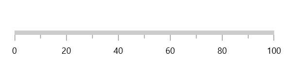

**Axis direction customization**

The direction of [`Linear axis`]() can be customized by its [`IsInversed`]() property. 

When the [`IsInversed`]() property is true, the axis can be placed in right-to-left direction. When the  [`IsInversed`]() property is set to false, the axis will be positioned in left-to-right direction.





<gauge:SfLinearGauge IsInversed="True" />





SfLinearGauge sfLinearGauge = new SfLinearGauge { IsInversed = true };
this.Content = sfLinearGauge;





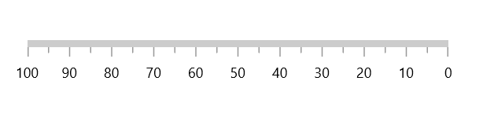

**Maximum number of labels per 100 logical pixels**

By default, a maximum of three labels are displayed for each 100 logical pixels in an axis. The maximum number of labels that should present within 100 logical pixels length can be customized using the [`MaximumLabelsCount`]() property of the axis. This property is applicable only for automatic range calculation and will not work if you set value for interval property of an axis.





<gauge:SfLinearGauge>
    <gauge:SfLinearGauge.Axis>
        <gauge:LinearAxis MaximumLabelsCount="1" />
    </gauge:SfLinearGauge.Axis>
</gauge:SfLinearGauge>





SfLinearGauge sfLinearGauge = new SfLinearGauge();
sfLinearGauge.Axis.MaximumLabelsCount = 1;
this.Content = sfLinearGauge;





## Axis line customization

The linear axis line can be customized using the following properties.

* [`AxisLineStrokeThickness`]() – Customizes the thickness of axis line.
* [`AxisLineStroke`]() – Customizes the color of the axis line.
* [`AxisLineStyle`]() – Customizes the style of the axis line.

**Axis line Stroke Thickness**

The axis line will be rendered based on the pixel value given in [`AxisLineStrokeThickness`]().





<gauge:SfLinearGauge>
    <gauge:SfLinearGauge.Axis>
        <gauge:LinearAxis AxisLineStrokeThickness="30" />
    </gauge:SfLinearGauge.Axis>
</gauge:SfLinearGauge>





SfLinearGauge sfLinearGauge = new SfLinearGauge();
sfLinearGauge.Axis.AxisLineWidth = 30;
this.Content = sfLinearGauge;





**Setting axis line stroke color**

To apply the color to the axis line using the [`AxisLineStroke`]() property of linear axis. 





<gauge:SfLinearGauge>
    <gauge:SfLinearGauge.Axis>
        <gauge:LinearAxis AxisLineFill="BlueViolet" />
    </gauge:SfLinearGauge.Axis>
</gauge:SfLinearGauge>





SfLinearGauge sfLinearGauge = new SfLinearGauge();
sfLinearGauge.Axis.AxisLineFill = new SolidColorBrush(Colors.BlueViolet);
this.Content = sfLinearGauge;





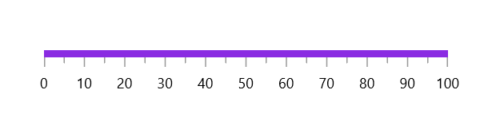

**Axis line visibility**

The visibility of the axis line can be customized using the [`ShowAxis`]() property of axis. By default, this property is set to true.





<gauge:SfLinearGauge>
    <gauge:SfLinearGauge.Axis>
        <gauge:LinearAxis ShowAxisLine="False" />
    </gauge:SfLinearGauge.Axis>
</gauge:SfLinearGauge>





SfLinearGauge sfLinearGauge = new SfLinearGauge();
sfLinearGauge.Axis.ShowAxisLine = false;
this.Content = sfLinearGauge;





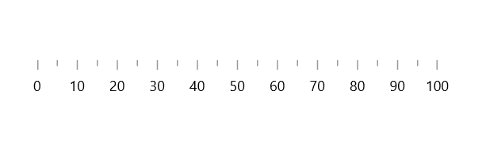

## Axis label customization

The axis labels can be customized using the following properties

* `Foreground` – Allows to customize the color of the labels.
* `FontFamily` – Allows to specify the font family for labels.
* `FontStyle` – Allows to specify the font style for labels.
* `FontWeight` – Allows to specify the font weight for labels.
* `FontSize` – Allows to specify the font size for labels.





<gauge:SfLinearGauge>
    <gauge:SfLinearGauge.Axis>
        <gauge:LinearAxis FontSize="15"
                          Foreground="Red"
                          FontFamily="Comic Sans MS"
                          FontWeight="Bold"
                          FontStyle="Italic" />
    </gauge:SfLinearGauge.Axis>
</gauge:SfLinearGauge>





SfLinearGauge sfLinearGauge = new SfLinearGauge();
sfLinearGauge.Axis.FontSize = 15;
sfLinearGauge.Axis.Foreground = new SolidColorBrush(Colors.Red);
sfLinearGauge.Axis.FontFamily = new FontFamily("Comic Sans MS");
sfLinearGauge.Axis.FontWeight = FontWeights.SemiBold;
sfLinearGauge.Axis.FontStyle = Windows.UI.Text.FontStyle.Italic;
this.Content = sfLinearGauge;





**Formatting axis label**

The following property of the axis allows to customize the axis label text.

* [`LabelFormat`]() - Allows to customize the axis label with the globalized label format.





<gauge:SfLinearGauge>
    <gauge:SfLinearGauge.Axis>
        <gauge:LinearAxis LabelFormat="c" />
    </gauge:SfLinearGauge.Axis>
</gauge:SfLinearGauge>





SfLinearGauge sfLinearGauge = new SfLinearGauge();
sfLinearGauge.Axis.LabelFormat = "c";
this.Content = sfLinearGauge;





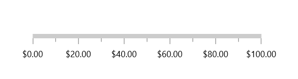

**Template support for axis label**

The [`LabelTemplate`]() property allows you to define the data template for the axis label's like the following code example.





<Page.Resources>
    <DataTemplate x:Key="labelTemplate">
        <Border Background="Gray"
                CornerRadius="5">
            <TextBlock Text="{Binding Text}"
                       Foreground="White"
                       FontStyle="Normal"
                       FontWeight="Bold"
                       Margin="3" />
        </Border>
    </DataTemplate>
</Page.Resources>

<gauge:SfLinearGauge>
    <gauge:SfLinearGauge.Axis>
        <gauge:LinearAxis LabelTemplate="{StaticResource labelTemplate}" />
    </gauge:SfLinearGauge.Axis>
</gauge:SfLinearGauge>





SfLinearGauge sfLinearGauge = new SfLinearGauge();
sfLinearGauge.Axis.LabelTemplate = this.Resources["labelTemplate"] as DataTemplate;
this.Content = sfLinearGauge;





**Label visibility**

The [`ShowLabels`]() property of axis allows to enable or disable the visibility of labels. The default value of the property is true.





<gauge:SfLinearGauge>
    <gauge:SfLinearGauge.Axis>
        <gauge:LinearAxis ShowLabels="False" />
    </gauge:SfLinearGauge.Axis>
</gauge:SfLinearGauge>





SfLinearGauge sfLinearGauge = new SfLinearGauge();
sfLinearGauge.Axis.ShowLabels = false;
this.Content = sfLinearGauge;





**Label placement**

The linear axis allows to position the labels either inside or outside of the axis line using the [`LabelPosition`]() property. By default, labels are positioned inside the axis line.





<gauge:SfLinearGauge>
    <gauge:SfLinearGauge.Axis>
        <gauge:LinearAxis LabelPosition="Outside" />
    </gauge:SfLinearGauge.Axis>
</gauge:SfLinearGauge>





SfLinearGauge sfLinearGauge = new SfLinearGauge();
sfLinearGauge.Axis.LabelPosition = GaugeLabelsPosition.Outside;
this.Content = sfLinearGauge;





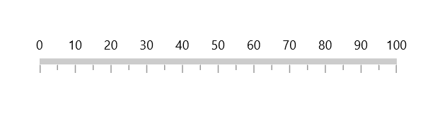

**Label position customization**

The [`LabelOffset`]() property allows to adjust the distance between the axis line and the labels. By default, the value of the label offset is 5.





<gauge:SfLinearGauge>
    <gauge:SfLinearGauge.Axis>
        <gauge:LinearAxis LabelOffset="40" />
    </gauge:SfLinearGauge.Axis>
</gauge:SfLinearGauge>





SfLinearGauge sfLinearGauge = new SfLinearGauge();
sfLinearGauge.Axis.LabelOffset = 40;
this.Content = sfLinearGauge;





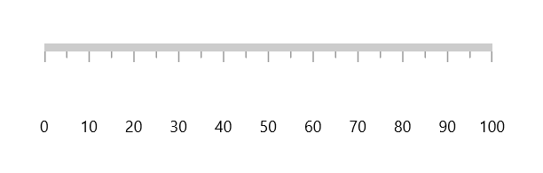

## Tick customization

The major and minor tick lines of an axis can be customized using the below properties.

* [`MajorTickLength`]() – Specifics the major length of ticks.

* [`MinorTickLength`]() – Specifics the minor length of ticks.

* [`MajorTickStyle`]() – Allows to specify the style for major tick line.

* [`MinorTickStyle`]() – Allows to specify the style for minor tick line.

**Tick length**

The major and minor tick lines will be rendered based on the pixel values given in [`MajorTickLength`]() and [`MinorTickLength`]().





<gauge:SfLinearGauge>
    <gauge:SfLinearGauge.Axis>
        <gauge:LinearAxis MajorTickLength="15"
                          MinorTickLength="10" />
    </gauge:SfLinearGauge.Axis>
</gauge:SfLinearGauge>





SfLinearGauge sfLinearGauge = new SfLinearGauge();
sfLinearGauge.Axis.MajorTickLength = 15;
sfLinearGauge.Axis.MinorTickLength = 10;
this.Content = sfLinearGauge;





**Setting style for major ticks**

The [`MajorTickStyle`]() property allows you to define the style for the major tick's as shown in the following code example.





<Page.Resources>
    
</Page.Resources>

<gauge:SfLinearGauge>
    <gauge:SfLinearGauge.Axis>
        <gauge:LinearAxis MajorTickStyle="{StaticResource MajorTickLineStyle}" />
    </gauge:SfLinearGauge.Axis>
</gauge:SfLinearGauge>





SfLinearGauge sfLinearGauge = new SfLinearGauge();
sfLinearGauge.Axis.MajorTickStyle = this.Resources["MajorTickLineStyle"] as Style;
this.Content = sfLinearGauge;





**Setting style for minor ticks**

The [`MinorTickStyle`]() property allows you to define the style for the minor tick's as shown in the following code example.





<Page.Resources>
    
</Page.Resources>

<gauge:SfLinearGauge>
    <gauge:SfLinearGauge.Axis>
        <gauge:LinearAxis MinorTickStyle="{StaticResource MinorTickLineStyle}" />
    </gauge:SfLinearGauge.Axis>
</gauge:SfLinearGauge>





SfLinearGauge sfLinearGauge = new SfLinearGauge();
sfLinearGauge.Axis.MinorTickStyle = this.Resources["MinorTickLineStyle"] as Style;
this.Content = sfLinearGauge;





**Setting dashed tick lines**

By defining `StrokeDashArray` property in both [`MajorTickStyle`](https://help.syncfusion.com/cr/winui/Syncfusion.UI.Xaml.Gauges.GaugeAxis.html#Syncfusion_UI_Xaml_Gauges_GaugeAxis_MajorTickStyle) and [`MinorTickStyle`](https://help.syncfusion.com/cr/winui/Syncfusion.UI.Xaml.Gauges.GaugeAxis.html#Syncfusion_UI_Xaml_Gauges_GaugeAxis_MinorTickStyle) to draw the dashed tick line.





<Page.Resources>
    

    
</Page.Resources>

<gauge:SfLinearGauge>
    <gauge:SfLinearGauge.Axis>
        <gauge:LinearAxis MajorTickLength="15"
                          MinorTickLength="10"
                          MajorTickStyle="{StaticResource MajorTickLineStyle}"
                          MinorTickStyle="{StaticResource MinorTickLineStyle}" />
    </gauge:SfLinearGauge.Axis>
</gauge:SfLinearGauge>





SfLinearGauge sfLinearGauge = new SfLinearGauge();
sfLinearGauge.Axis.MajorTickLength = 15;
sfLinearGauge.Axis.MinorTickLength = 10;
sfLinearGauge.Axis.MajorTickStyle = this.Resources["MajorTickLineStyle"] as Style;
sfLinearGauge.Axis.MinorTickStyle = this.Resources["MinorTickLineStyle"] as Style;
this.Content = sfLinearGauge;





**Setting minor ticks count**

The major ticks are generated based on the [`Interval`]() property. Like major ticks, the minor ticks are generated using the [`MinorTicksPerInterval`]() property of axis. By default, the count value of this property is 1.





<gauge:SfLinearGauge>
    <gauge:SfLinearGauge.Axis>
        <gauge:LinearAxis MinorTicksPerInterval="4" />
    </gauge:SfLinearGauge.Axis>
</gauge:SfLinearGauge>





SfLinearGauge sfLinearGauge = new SfLinearGauge();
sfLinearGauge.Axis.MinorTicksPerInterval = 4;
this.Content = sfLinearGauge;





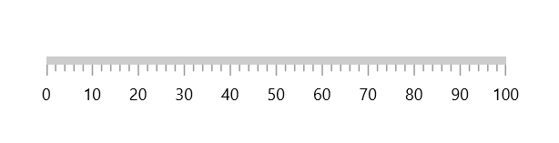

**Tick line visibility**

The [`ShowTicks`]() property of the axis is used to enable or disable the visibility of both the major and the minor ticks of axis. The default value of this property is true.





<gauge:SfLinearGauge>
    <gauge:SfLinearGauge.Axis>
        <gauge:LinearAxis ShowTicks="False" />
    </gauge:SfLinearGauge.Axis>
</gauge:SfLinearGauge>





SfLinearGauge sfLinearGauge = new SfLinearGauge();
sfLinearGauge.Axis.ShowTicks = false;
this.Content = sfLinearGauge;





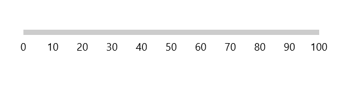

**Tick placement**

The [`Linear axis`]() allows to position the ticks either inside or outside or center of the axis line using the [`TickPosition`]() property. By default, ticks are positioned inside the axis line.





<gauge:SfLinearGauge>
    <gauge:SfLinearGauge.Axis>
        <gauge:LinearAxis TickPosition="Outside" />
    </gauge:SfLinearGauge.Axis>
</gauge:SfLinearGauge>





SfLinearGauge sfLinearGauge = new SfLinearGauge();
sfLinearGauge.Axis.LabelPosition = GaugeLabelsPosition.Outside;
this.Content = sfLinearGauge;





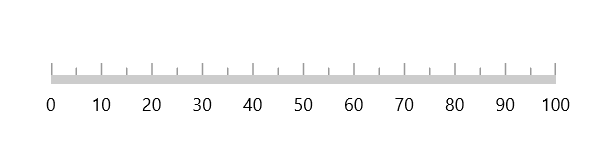

**Tick position customization**

The ticks can be moved near or far to the axis line using the [`TickOffset`]() property. The default value of [`TickOffset`]() is 0.





<gauge:SfLinearGauge>
    <gauge:SfLinearGauge.Axis>
        <gauge:LinearAxis TickOffset="50" />
    </gauge:SfLinearGauge.Axis>
</gauge:SfLinearGauge>





SfLinearGauge sfLinearGauge = new SfLinearGauge();
sfLinearGauge.Axis.TickOffset = 50;
this.Content = sfLinearGauge;





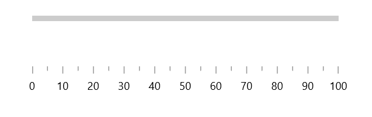

## Custom scale range

[`linear gauge`]() allows you to define a custom scale range by extending the axis based on your business logic.





<gauge:SfLinearGauge>
    <gauge:SfLinearGauge.Axis>
        <local:LogarithmicAxis Minimum="1"
                               Maximum="10000" />
    </gauge:SfLinearGauge.Axis>
</gauge:SfLinearGauge>





public class LogarithmicAxis : LinearAxis
{
    int labelsCount;

    public override List<AxisLabelData> GenerateVisibleLabels()
    {
        List<AxisLabelData> labelInfos = new List<AxisLabelData>();
        int minimum = (int)LogBase(this.Minimum, 10);
        int maximum = (int)LogBase(this.Maximum, 10);
        for (int i = minimum; i <= maximum; i++)
        {
            double value = Math.Floor(Math.Pow(10, i)); // logBase  value is 10
            AxisLabelData label = new AxisLabelData()
            {
                Value = value,
                Text = value.ToString()
            };
            labelInfos.Add(label);
        }

        labelsCount = labelInfos.Count;
        return labelInfos;
    }

    private double LogBase(double value, int baseValue)
    {
        return Math.Log(value) / Math.Log(baseValue);
    }

    public override double ValueToFactor(double value)
    {
        return LogBase(value, 10) / (labelsCount - 1);
    }

    public override double FactorToValue(double factor)
    {
        return Math.Pow(Math.E, factor * (labelsCount - 1) * Math.Log(10));
    }
}





