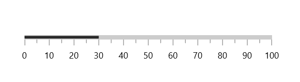
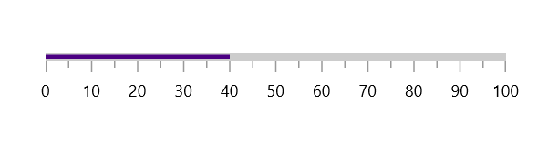
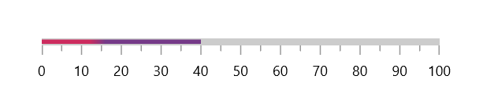
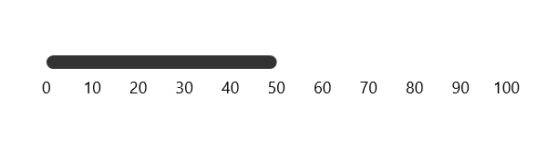
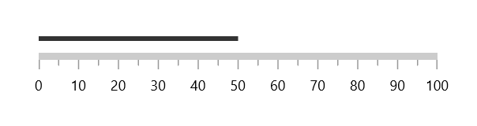
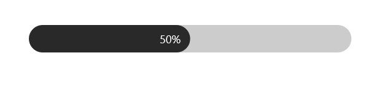

# Bar Pointer in WinUI Linear Gauge (SfLinearGauge)

A bar pointer is an accenting line or shaded background range that can be placed on a gauge to mark the current value.





<gauge:SfLinearGauge>
    <gauge:SfLinearGauge.Axis>
        <gauge:LinearAxis>
            <gauge:LinearAxis.BarPointers>
                <gauge:BarPointer Value="30" />
            </gauge:LinearAxis.BarPointers>
        </gauge:LinearAxis>
    </gauge:SfLinearGauge.Axis>
</gauge:SfLinearGauge>





SfLinearGauge sfLinearGauge = new SfLinearGauge();

BarPointer barPointer = new BarPointer();
barPointer.Value = 30;
sfLinearGauge.Axis.BarPointers.Add(barPointer);

this.Content = sfLinearGauge;





**Pointer size**





<gauge:SfLinearGauge>
    <gauge:SfLinearGauge.Axis>
        <gauge:LinearAxis AxisLineStrokeThickness="30">
            <gauge:LinearAxis.BarPointers>
                <gauge:BarPointer Value="30"
                                  PointerSize="30" />
            </gauge:LinearAxis.BarPointers>
        </gauge:LinearAxis>
    </gauge:SfLinearGauge.Axis>
</gauge:SfLinearGauge>





SfLinearGauge sfLinearGauge = new SfLinearGauge();
sfLinearGauge.Axis.AxisLineStrokeThickness = 30;

BarPointer barPointer = new BarPointer();
barPointer.Value = 30;
barPointer.PointerSize = 30;
sfLinearGauge.Axis.BarPointers.Add(barPointer);

this.Content = sfLinearGauge;





**Setting background brush to the pointer**

By using `Background` property, you can change the color of the bar pointer.





<gauge:SfLinearGauge>
    <gauge:SfLinearGauge.Axis>
        <gauge:LinearAxis>
            <gauge:LinearAxis.BarPointers>
                <gauge:BarPointer Value="30"
                                  Background="Indigo" />
            </gauge:LinearAxis.BarPointers>
        </gauge:LinearAxis>
    </gauge:SfLinearGauge.Axis>
</gauge:SfLinearGauge>





SfLinearGauge sfLinearGauge = new SfLinearGauge();

BarPointer barPointer = new BarPointer();
barPointer.Value = 30;
barPointer.Background = new SolidColorBrush(Colors.Indigo);
sfLinearGauge.Axis.BarPointers.Add(barPointer);

this.Content = sfLinearGauge;





**Setting gradient brush to the pointer**

The [`GradientStops`](https://help.syncfusion.com/cr/winui/Syncfusion.UI.Xaml.Gauges.BarPointer.html#Syncfusion_UI_Xaml_Gauges_BarPointer_GradientStops) property of [`bar pointer`](https://help.syncfusion.com/cr/winui/Syncfusion.UI.Xaml.Gauges.BarPointer.html) allows to specify the smooth color transition to pointer by specifying the different colors based on provided axis value.





<gauge:SfLinearGauge>
    <gauge:SfLinearGauge.Axis>
        <gauge:LinearAxis>
            <gauge:LinearAxis.BarPointers>
                <gauge:BarPointer Value="40">
                    <gauge:BarPointer.GradientStops>
                        <gauge:GaugeGradientStop Value="30"
                                                 Color="#FFCC2B5E" />
                        <gauge:GaugeGradientStop Value="40"
                                                 Color="#FF753A88" />
                    </gauge:BarPointer.GradientStops>
                </gauge:BarPointer>
            </gauge:LinearAxis.BarPointers>
        </gauge:LinearAxis>
    </gauge:SfLinearGauge.Axis>
</gauge:SfLinearGauge>





SfLinearGauge sfLinearGauge = new SfLinearGauge();

BarPointer barPointer = new BarPointer();
barPointer.Value = 40;
barPointer.GradientStops.Add(new GaugeGradientStop { Value = 30, Color = Color.FromArgb(255, 204, 43, 94) });
barPointer.GradientStops.Add(new GaugeGradientStop { Value = 40, Color = Color.FromArgb(255, 117, 58, 136) });
sfLinearGauge.Axis.BarPointers.Add(barPointer);

this.Content = sfLinearGauge;





**Corner style customization**

 The [`CornerStyle`](https://help.syncfusion.com/cr/winui/Syncfusion.UI.Xaml.Gauges.BarPointer.html#Syncfusion_UI_Xaml_Gauges_BarPointer_CornerStyle) property of [`bar pointer`](https://help.syncfusion.com/cr/winui/Syncfusion.UI.Xaml.Gauges.BarPointer.html) specifies the corner type for the pointer. The corners can be customized using the [`BothFlat`](https://help.syncfusion.com/cr/winui/Syncfusion.UI.Xaml.Gauges.CornerStyle.html#Syncfusion_UI_Xaml_Gauges_CornerStyle_BothFlat), [`BothCurve`](https://help.syncfusion.com/cr/winui/Syncfusion.UI.Xaml.Gauges.CornerStyle.html#Syncfusion_UI_Xaml_Gauges_CornerStyle_BothCurve), [`StartCurve`](https://help.syncfusion.com/cr/winui/Syncfusion.UI.Xaml.Gauges.CornerStyle.html#Syncfusion_UI_Xaml_Gauges_CornerStyle_StartCurve) and [`EndCurve`](https://help.syncfusion.com/cr/winui/Syncfusion.UI.Xaml.Gauges.CornerStyle.html#Syncfusion_UI_Xaml_Gauges_CornerStyle_EndCurve) options. The default value of this property is [`BothFlat`](https://help.syncfusion.com/cr/winui/Syncfusion.UI.Xaml.Gauges.CornerStyle.html#Syncfusion_UI_Xaml_Gauges_CornerStyle_BothFlat).





<gauge:SfLinearGauge>
    <gauge:SfLinearGauge.Axis>
        <gauge:LinearAxis AxisLineStrokeThickness="10"
                          AxisLineStroke="Transparent"
                          ShowTicks="False">
            <gauge:LinearAxis.BarPointers>
                <gauge:BarPointer Value="50"
                                  PointerSize="10"
                                  CornerStyle="BothCurve"/>
            </gauge:LinearAxis.BarPointers>
        </gauge:LinearAxis>
    </gauge:SfLinearGauge.Axis>
</gauge:SfLinearGauge>





SfLinearGauge sfLinearGauge = new SfLinearGauge();
sfLinearGauge.Axis.AxisLineStrokeThickness = 10;
sfLinearGauge.Axis.AxisLineStroke = new SolidColorBrush(Colors.Transparent);
sfLinearGauge.Axis.ShowTicks = false;

BarPointer barPointer = new BarPointer();
barPointer.Value = 50;
barPointer.PointerSize = 10;
barPointer.CornerStyle = CornerStyle.BothCurve;
sfLinearGauge.Axis.BarPointers.Add(barPointer);

this.Content = sfLinearGauge;





## Position customization

The bar pointer can be moved far or near to the axis line using the [`Offset`](https://help.syncfusion.com/cr/winui/Syncfusion.UI.Xaml.Gauges.BarPointer.html#Syncfusion_UI_Xaml_Gauges_BarPointer_Offset) property. The default value of offset is 0.

To move the pointer inside of the axis, provide positive values.

To move the pointer outside of the axis, provide negative values.





<gauge:SfLinearGauge>
    <gauge:SfLinearGauge.Axis>
        <gauge:LinearAxis>
            <gauge:LinearAxis.BarPointers>
                <gauge:BarPointer Value="50"
                                  Offset="-15" />
            </gauge:LinearAxis.BarPointers>
        </gauge:LinearAxis>
    </gauge:SfLinearGauge.Axis>
</gauge:SfLinearGauge>





SfLinearGauge sfLinearGauge = new SfLinearGauge();

BarPointer barPointer = new BarPointer();
barPointer.Value = 50;
barPointer.Offset = -15;
sfLinearGauge.Axis.BarPointers.Add(barPointer);

this.Content = sfLinearGauge;





**Child support**

By using [`Child`](https://help.syncfusion.com/cr/winui/Syncfusion.UI.Xaml.Gauges.BarPointer.html#Syncfusion_UI_Xaml_Gauges_BarPointer_Child) property of [`bar pointer`](https://help.syncfusion.com/cr/winui/Syncfusion.UI.Xaml.Gauges.BarPointer.html), you can provide a child for bar pointer. The child content is used to add any visual content like text or images, inside the bar pointer to improve readability.





<gauge:SfLinearGauge>
    <gauge:SfLinearGauge.Axis>
        <gauge:LinearAxis ShowTicks="False"
                          ShowLabels="False"
                          CornerStyle="BothCurve"
                          AxisLineStrokeThickness="30">
            <gauge:LinearAxis.BarPointers>
                <gauge:BarPointer Value="50"
                                  PointerSize="30"
                                  CornerStyle="BothCurve">
                    <gauge:BarPointer.Child>
                        <TextBlock Text="50%"
                                   Margin="0,0,10,0"
                                   Foreground="White"
                                   HorizontalAlignment="Right"
                                   VerticalAlignment="Center"/>
                    </gauge:BarPointer.Child>
                </gauge:BarPointer>
            </gauge:LinearAxis.BarPointers>
        </gauge:LinearAxis>
    </gauge:SfLinearGauge.Axis>
</gauge:SfLinearGauge>





SfLinearGauge sfLinearGauge = new SfLinearGauge();
sfLinearGauge.Axis.ShowTicks = false;
sfLinearGauge.Axis.ShowLabels = false;
sfLinearGauge.Axis.CornerStyle = CornerStyle.BothCurve;
sfLinearGauge.Axis.AxisLineStrokeThickness = 30;

BarPointer barPointer = new BarPointer();
barPointer.Value = 50;
barPointer.PointerSize = 30;
barPointer.CornerStyle = CornerStyle.BothCurve;
barPointer.Child = new TextBlock
{
    Text = "50%",
    Foreground = new SolidColorBrush(Colors.White),
    Margin = new Thickness { Right = 10 },
    HorizontalAlignment = HorizontalAlignment.Right,
    VerticalAlignment = VerticalAlignment.Center
};

sfLinearGauge.Axis.BarPointers.Add(barPointer);
this.Content = sfLinearGauge;





