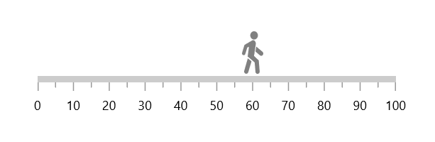
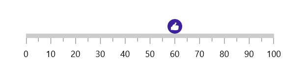

# Content Pointer in WinUI Linear Gauge (SfLinearGauge)

Highlight values using an image, icon, text, or any other custom view. You can set the custom views using the [`Content`](https://help.syncfusion.com/cr/winui/Syncfusion.UI.Xaml.Gauges.ContentPointer.html#Syncfusion_UI_Xaml_Gauges_ContentPointer_Content) property.





<gauge:SfLinearGauge>
    <gauge:SfLinearGauge.Axis>
        <gauge:LinearAxis>
            <gauge:LinearAxis.MarkerPointers>
                <gauge:ContentPointer Value="60">
                    <gauge:ContentPointer.Content>
                        <Grid Background="Orange"
                              BorderBrush="Black"
                              BorderThickness="1"
                              CornerRadius="4">
                            <TextBlock Text="60"
                                       Margin="2" />
                        </Grid>
                    </gauge:ContentPointer.Content>
                </gauge:ContentPointer>
            </gauge:LinearAxis.MarkerPointers>
        </gauge:LinearAxis>
    </gauge:SfLinearGauge.Axis>
</gauge:SfLinearGauge>





SfLinearGauge sfLinearGauge = new SfLinearGauge();

ContentPointer contentPointer = new ContentPointer();
contentPointer.Value = 60;
Grid contentPointerRootChild = new Grid
{
    Background = new SolidColorBrush(Colors.Orange),
    BorderBrush = new SolidColorBrush(Colors.Black),
    BorderThickness = new Thickness { Bottom = 1, Left = 1, Right = 1, Top = 1 },
    CornerRadius = new CornerRadius { BottomLeft = 4, BottomRight = 4, TopLeft = 4, TopRight = 4 }
};
contentPointerRootChild.Children.Add(new TextBlock
{
    Text = "60",
    Margin = new Thickness { Bottom = 2, Left = 2, Right = 2, Top = 2 }
});

contentPointer.Content = contentPointerRootChild;
sfLinearGauge.Axis.MarkerPointers.Add(contentPointer);

this.Content = sfLinearGauge;





## Position customization

The content pointer can be moved near or far from its actual position in X or Y direction using the [`OffsetPoint`](https://help.syncfusion.com/cr/winui/Syncfusion.UI.Xaml.Gauges.LinearMarkerPointer.html#Syncfusion_UI_Xaml_Gauges_LinearMarkerPointer_OffsetPoint) property. 

To move the pointer inside of the axis, provide positive values.

To move the pointer outside of the axis, provide negative values.





<gauge:SfLinearGauge>
    <gauge:SfLinearGauge.Axis>
        <gauge:LinearAxis>
            <gauge:LinearAxis.MarkerPointers>
                <gauge:ContentPointer Value="60"
                                      OffsetPoint="0,-25">
                    <gauge:ContentPointer.Content>
                        <Path Data="M41.8985 10.0861C41.8985 15.6565 37.3759 20.1722 31.7971 20.1722C26.2181 
                              20.1722 21.6956 15.6565 21.6956 10.0861C21.6956 4.51575 26.2181 0 31.7971 0C37.3759 0 41.8985 4.51575 
                              41.8985 10.0861ZM44.0872 71.1554L46.4467 97.9785C46.7136 101.013 44.4753 103.693 41.4376 103.976C38.3846 
                              104.26 35.6801 102.016 35.4005 98.9675L33.2938 75.9912L14.8898 61.6219L18.3492 37.8574L13.9211 39.3773L8.80121 
                              55.2664C6.44879 61.2075 -1.41333 58.0297 0.221863 52.6412L6.24353 33.9355C6.37518 33.5266 6.66077 33.1846 
                              7.03998 32.9816L27.6204 21.9684C29.1678 21.4158 33.1066 22.2446 34.4262 24.5935C36.3635 27.7714 36.4912 
                              29.3267 36.1997 32.3308L31.6333 60.2402L44.0872 71.1554ZM35.4304 49.7396L37.5335 37.3048L53.8769 50.0315C56.2781 
                              51.9014 56.7065 55.3606 54.8339 57.7582C52.9509 60.1688 49.4615 60.5859 47.0618 58.6873L38.2899 51.7466L35.4304 
                              49.7396ZM15.2275 65.905L25.0744 73.4241L16.4453 99.8877C15.486 102.83 12.3094 104.428 9.37012 103.448C6.49725 
                              102.489 4.91473 99.4172 5.80444 96.5261L15.2275 65.905Z"
                              Height="40"
                              Width="20"
                              Stretch="Fill"
                              Fill="Gray">
                        </Path>
                    </gauge:ContentPointer.Content>
                </gauge:ContentPointer>
            </gauge:LinearAxis.MarkerPointers>
        </gauge:LinearAxis>
    </gauge:SfLinearGauge.Axis>
</gauge:SfLinearGauge>





string data = "M41.8985 10.0861C41.8985 15.6565 37.3759 20.1722 31.7971 20.1722C26.2181 20.1722 21.6956 15.6565 " +
"21.6956 10.0861C21.6956 4.51575 26.2181 0 31.7971 0C37.3759 0 41.8985 4.51575 41.8985 10.0861ZM44.0872 71.1554L46.4467 " +
"97.9785C46.7136 101.013 44.4753 103.693 41.4376 103.976C38.3846 104.26 35.6801 102.016 35.4005 98.9675L33.2938 " +
"75.9912L14.8898 61.6219L18.3492 37.8574L13.9211 39.3773L8.80121 55.2664C6.44879 61.2075 -1.41333 58.0297 0.221863 " +
"52.6412L6.24353 33.9355C6.37518 33.5266 6.66077 33.1846 7.03998 32.9816L27.6204 21.9684C29.1678 21.4158 33.1066 22.2446 " +
"34.4262 24.5935C36.3635 27.7714 36.4912 29.3267 36.1997 32.3308L31.6333 60.2402L44.0872 71.1554ZM35.4304 49.7396L37.5335 " +
"37.3048L53.8769 50.0315C56.2781 51.9014 56.7065 55.3606 54.8339 57.7582C52.9509 60.1688 49.4615 60.5859 47.0618 58.6873L38.2899 " +
"51.7466L35.4304 49.7396ZM15.2275 65.905L25.0744 73.4241L16.4453 99.8877C15.486 102.83 12.3094 104.428 9.37012 103.448C6.49725 " +
"102.489 4.91473 99.4172 5.80444 96.5261L15.2275 65.905Z";
Geometry geometry = (Geometry)XamlReader.Load(
    "<Geometry xmlns='http://schemas.microsoft.com/winfx/2006/xaml/presentation'>"
    + data + "</Geometry>");

SfLinearGauge sfLinearGauge = new SfLinearGauge();

ContentPointer contentPointer = new ContentPointer();
contentPointer.Value = 60;
contentPointer.OffsetPoint = new Point(0, -25);
contentPointer.Content = new Path
{
    Data = geometry,
    Stretch = Stretch.Fill,
    Fill = new SolidColorBrush(Colors.Gray),
    Width = 20,
    Height = 40,
};
sfLinearGauge.Axis.MarkerPointers.Add(contentPointer);

this.Content = sfLinearGauge;





**Content pointer alignment**

You can change the horizontal or vertical position of the content pointer either start, end or center by using the [`HorizontalAnchor`](https://help.syncfusion.com/cr/winui/Syncfusion.UI.Xaml.Gauges.LinearMarkerPointer.html#Syncfusion_UI_Xaml_Gauges_LinearMarkerPointer_HorizontalAnchor) and [`VerticalAnchor`](https://help.syncfusion.com/cr/winui/Syncfusion.UI.Xaml.Gauges.LinearMarkerPointer.html#Syncfusion_UI_Xaml_Gauges_LinearMarkerPointer_VerticalAnchor) properties. The default value of [`HorizontalAnchor`](https://help.syncfusion.com/cr/winui/Syncfusion.UI.Xaml.Gauges.LinearMarkerPointer.html#Syncfusion_UI_Xaml_Gauges_LinearMarkerPointer_HorizontalAnchor) and [`VerticalAnchor`](https://help.syncfusion.com/cr/winui/Syncfusion.UI.Xaml.Gauges.LinearMarkerPointer.html#Syncfusion_UI_Xaml_Gauges_LinearMarkerPointer_VerticalAnchor) properties are Center.





<gauge:SfLinearGauge>
    <gauge:SfLinearGauge.Axis>
        <gauge:LinearAxis>
            <gauge:LinearAxis.MarkerPointers>
                <gauge:ContentPointer Value="60"
                                      VerticalAnchor="End"
                                      OffsetPoint="0,-3">
                    <gauge:ContentPointer.Content>
                        <Image Source="Assets/Thumbs-Up.png"
                               Height="20"
                               Width="20" />
                    </gauge:ContentPointer.Content>
                </gauge:ContentPointer>
            </gauge:LinearAxis.MarkerPointers>
        </gauge:LinearAxis>
    </gauge:SfLinearGauge.Axis>
</gauge:SfLinearGauge>





SfLinearGauge sfLinearGauge = new SfLinearGauge();

ContentPointer contentPointer = new ContentPointer();
contentPointer.Value = 60;
contentPointer.VerticalAnchor = GaugeAnchor.End;
contentPointer.OffsetPoint = new Point(0, -3);
BitmapImage bitmapImage = new BitmapImage { UriSource = new Uri("ms-appx:///WinUIReUnion/Assets/Thumbs-Up.png", UriKind.Absolute) };
Image image = new Image { Source = bitmapImage };
contentPointer.Content = image;
sfLinearGauge.Axis.MarkerPointers.Add(contentPointer);

this.Content = sfLinearGauge;





