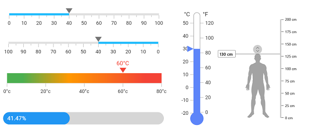

# WinUI Linear Gauge Overview

The WinUI Linear Gauge control is a multipurpose data visualization control that displays numerical values on a linear scale horizontally or vertically. 

## Key Features

* **Orientation** - The Linear Gauge can be oriented vertically or horizontally.
* **Axis** - The Linear Gauge axis is a scale where a set of values is plotted. Axis elements, such as labels, major ticks, and minor ticks, can be customized.
* **Ranges** - The Linear Gauge range is a visual element that helps you quickly visualize where a range falls on the axis track. Multiple ranges with different styles can be added to a gauge.
* **Pointers** - The Linear Gauge pointer is used to indicate a specific value on the axis. The control has three types of pointers: shape marker pointer, content marker pointer, and bar pointer. All the pointers can be customized as needed. You can add multiple pointers in a single gauge. 
* **Pointer animation** - The Linear Gauge can animate the pointer in a visually appealing way when the pointer moves from one value to another.
* **Pointer interaction** - The Linear Gauge provides an option to drag a pointer from one value to another to change the value at runtime.

N> You can get the samples in the [GitHub](https://github.com/syncfusion/winui-demos/tree/master/lineargauge) link. 