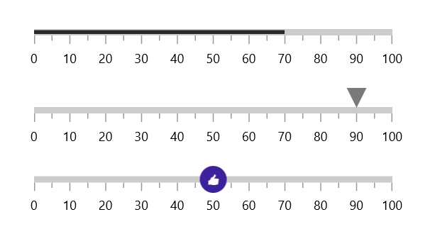

# Pointers in WinUI Linear Gauge

 The pointer is used to indicate values on an axis. The Linear Gauge control has three types of pointers:

[`bar pointer`](https://help.syncfusion.com/cr/winui/Syncfusion.UI.Xaml.Gauges.BarPointer.html)
[`Shape Pointer`](https://help.syncfusion.com/winui/linear-gauge/shape-pointer)
[`Content pointer`](https://help.syncfusion.com/winui/linear-gauge/content-pointer)

All the pointers can be customized as needed. You can add multiple pointers to the gauge to point multiple values on the same scale. The value of the pointer is set using the [`Value`](https://help.syncfusion.com/cr/winui/Syncfusion.UI.Xaml.Gauges.GaugePointer.html#Syncfusion_UI_Xaml_Gauges_GaugePointer_Value) property.

## Multiple pointers

In addition to the default pointer, you can add n number of pointers to an axis by adding in the [`BarPointers`](https://help.syncfusion.com/cr/winui/Syncfusion.UI.Xaml.Gauges.LinearAxis.html#Syncfusion_UI_Xaml_Gauges_LinearAxis_BarPointers) and [`MarkerPointers`](https://help.syncfusion.com/cr/winui/Syncfusion.UI.Xaml.Gauges.LinearAxis.html#Syncfusion_UI_Xaml_Gauges_LinearAxis_MarkerPointers) properties.





<gauge:SfLinearGauge>
    <gauge:SfLinearGauge.Axis>
        <gauge:LinearAxis Interval="10">

            <gauge:LinearAxis.BarPointers>
                <gauge:BarPointer Value="90" />
            </gauge:LinearAxis.BarPointers>

            <gauge:LinearAxis.MarkerPointers>
                <gauge:ShapePointer Value="90"
                                    VerticalAnchor="End"
                                    OffsetPoint="0,-3" />

                <gauge:ContentPointer Value="90"
                                      VerticalAnchor="End"
                                      OffsetPoint="0,-23">
                    <gauge:ContentPointer.Content>
                        <TextBlock Text="90%" />
                    </gauge:ContentPointer.Content>
                </gauge:ContentPointer>

            </gauge:LinearAxis.MarkerPointers>
        </gauge:LinearAxis>
    </gauge:SfLinearGauge.Axis>
</gauge:SfLinearGauge>





SfLinearGauge sfLinearGauge = new SfLinearGauge();
sfLinearGauge.Axis.Interval = 10;

BarPointer barPointer1 = new BarPointer();
barPointer1.Value = 90;
sfLinearGauge.Axis.BarPointers.Add(barPointer1);

ShapePointer shapePointer1 = new ShapePointer();
shapePointer1.Value = 90;
shapePointer1.VerticalAnchor = GaugeAnchor.End;
shapePointer1.OffsetPoint = new Point(0, -3);
sfLinearGauge.Axis.MarkerPointers.Add(shapePointer1);

ContentPointer contentPointer1 = new ContentPointer();
contentPointer1.Value = 90;
contentPointer1.VerticalAnchor = GaugeAnchor.End;
contentPointer1.OffsetPoint = new Point(0, -23);
contentPointer1.Content = new TextBlock { Text = "90%" };
sfLinearGauge.Axis.MarkerPointers.Add(contentPointer1);

this.Content = sfLinearGauge;





## Pointer dragging

Shape pointer can be dragged over the scale value. It can be achieved by clicking and dragging the pointer. To enable or disable the pointer drag, use the [`IsInteractive`](https://help.syncfusion.com/cr/winui/Syncfusion.UI.Xaml.Gauges.ShapePointer.html#Syncfusion_UI_Xaml_Gauges_ShapePointer_IsInteractive) property.





<gauge:SfLinearGauge>
    <gauge:SfLinearGauge.Axis>
        <gauge:LinearAxis ShowTicks="False"
                          AxisLineStroke="CornflowerBlue"
                          AxisLineStrokeThickness="30">
            <gauge:LinearAxis.MarkerPointers>
                <gauge:ShapePointer Value="30"
                                    IsInteractive="True"
                                    OffsetPoint="0,-15"
                                    VerticalAnchor="End"
                                    Fill="Indigo" />
            </gauge:LinearAxis.MarkerPointers>
        </gauge:LinearAxis>
    </gauge:SfLinearGauge.Axis>
</gauge:SfLinearGauge>





SfLinearGauge sfLinearGauge = new SfLinearGauge();
sfLinearGauge.Axis.ShowTicks = false;
sfLinearGauge.Axis.AxisLineStrokeThickness = 30;
sfLinearGauge.Axis.AxisLineStroke = new SolidColorBrush(Colors.CornflowerBlue);

ShapePointer shapePointer1 = new ShapePointer();
shapePointer1.Value = 30;
shapePointer1.IsInteractive = true;
shapePointer1.VerticalAnchor = GaugeAnchor.End;
shapePointer1.OffsetPoint = new Point(0, -15);
shapePointer1.Fill = new SolidColorBrush(Colors.Indigo);
sfLinearGauge.Axis.MarkerPointers.Add(shapePointer1);

this.Content = sfLinearGauge;





## Event

[`ValueChangeStarted`](https://help.syncfusion.com/cr/winui/Syncfusion.UI.Xaml.Gauges.GaugePointer.html#Syncfusion_UI_Xaml_Gauges_GaugePointer_ValueChangeStarted) - Occurs whenever the pointer starts to drag.

[`ValueChanging`](https://help.syncfusion.com/cr/winui/Syncfusion.UI.Xaml.Gauges.GaugePointer.html#Syncfusion_UI_Xaml_Gauges_GaugePointer_ValueChanging) - Occurs before the current drag value gets updated as pointer value. The [`Cancel`](https://help.syncfusion.com/cr/winui/Syncfusion.UI.Xaml.Gauges.ValueChangingEventArgs.html#Syncfusion_UI_Xaml_Gauges_ValueChangingEventArgs_Cancel) argument of [`ValueChangingEventArgs`](https://help.syncfusion.com/cr/winui/Syncfusion.UI.Xaml.Gauges.ValueChangingEventArgs.html) allows to restrict the update of current drag value as pointer value.

[`ValueChanged`](https://help.syncfusion.com/cr/winui/Syncfusion.UI.Xaml.Gauges.GaugePointer.html#Syncfusion_UI_Xaml_Gauges_GaugePointer_ValueChanged) - Occurs whenever the pointer value is changed while dragging.

[`ValueChangeCompleted`](https://help.syncfusion.com/cr/winui/Syncfusion.UI.Xaml.Gauges.GaugePointer.html#Syncfusion_UI_Xaml_Gauges_GaugePointer_ValueChangeCompleted) - Occurs once the dragging of the pointer gets completed.





<gauge:SfLinearGauge>
    <gauge:SfLinearGauge.Axis>
        <gauge:LinearAxis ShowTicks="False"
                          AxisLineStroke="CornflowerBlue"
                          AxisLineStrokeThickness="30">
            <gauge:LinearAxis.MarkerPointers>
                <gauge:ShapePointer Value="30"
                                    IsInteractive="True"
                                    OffsetPoint="0,-15"
                                    VerticalAnchor="End"
                                    Fill="Indigo"
                                    ValueChanging="ShapePointer_ValueChanging"
                                    ValueChanged="ShapePointer_ValueChanged"/>
            </gauge:LinearAxis.MarkerPointers>
        </gauge:LinearAxis>
    </gauge:SfLinearGauge.Axis>
</gauge:SfLinearGauge>





private void ShapePointer_ValueChanging(object sender, ValueChangingEventArgs e)
{
    if (e.NewValue > 60)
    {
        e.Cancel = true;
    }
}

private void ShapePointer_ValueChanged(object sender, ValueChangedEventArgs e)
{

}





N> `ValueChanged` event is exist for all pointers, other events available only for `ShapePointer`.

