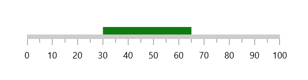
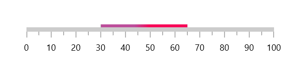
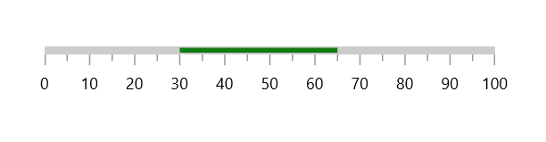
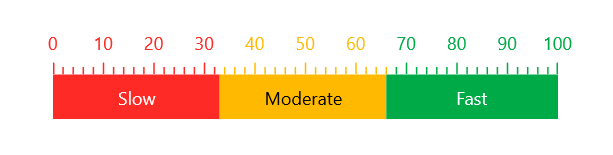

# Linear Range in the  WinUI Linear Gauge (SfLinearGauge)

Linear gauge range is a visual element that helps to quickly visualize where a value falls on the axis.

**Setting start and end value**

The start and end values of ranges are set using the `StartValue` and `EndValue` properties.





<gauge:SfLinearGauge>
    <gauge:SfLinearGauge.Axis>
        <gauge:LinearAxis>
            <gauge:LinearAxis.Ranges>
                <gauge:LinearGaugeRange StartValue="30"
                                        EndValue="65" />
            </gauge:LinearAxis.Ranges>
        </gauge:LinearAxis>
    </gauge:SfLinearGauge.Axis>
</gauge:SfLinearGauge>





SfLinearGauge sfLinearGauge = new SfLinearGauge();
LinearGaugeRange gaugeRange = new LinearGaugeRange();
gaugeRange.StartValue = 30;
gaugeRange.EndValue = 65;
sfLinearGauge.Axis.Ranges.Add(gaugeRange);
this.Content = sfLinearGauge;





## Range customization

The following properties are used for the range customization:

* `Background` – Specifies the color for the range.

* `StartWidth` – Specifies the start width of the range.

* `MidWidth` – Specifies the start width of the range.

* `EndWidth` – Specifies the end width of the range.

* `GradientStops` - Specifies the gradient for the range.

**Equal range width**

Range width can be controlled by `StartWidth`, `MidWidth` and `EndWidth` properties of the range.





<gauge:SfLinearGauge>
    <gauge:SfLinearGauge.Axis>
        <gauge:LinearAxis>
            <gauge:LinearAxis.Ranges>
                <gauge:LinearGaugeRange StartValue="30"
                                        EndValue="65"
                                        StartWidth="10"
                                        EndWidth="10" />
            </gauge:LinearAxis.Ranges>
        </gauge:LinearAxis>
    </gauge:SfLinearGauge.Axis>
</gauge:SfLinearGauge>





SfLinearGauge sfLinearGauge = new SfLinearGauge();
LinearGaugeRange gaugeRange = new LinearGaugeRange();
gaugeRange.StartValue = 30;
gaugeRange.EndValue = 65;
gaugeRange.StartWidth = 10;
gaugeRange.EndWidth = 10;
sfLinearGauge.Axis.Ranges.Add(gaugeRange);
this.Content = sfLinearGauge;





N> The `MidWidth` is not considered until change its default value.

**Different range width**

By setting different values to `StartWidth`, `MidWidth` and `EndWidth` property, you can create different width ranges. 





<gauge:SfLinearGauge>
    <gauge:SfLinearGauge.Axis>
        <gauge:LinearAxis>
            <gauge:LinearAxis.Ranges>
                <gauge:LinearGaugeRange StartValue="10"
                                        EndValue="90"
                                        StartWidth="0"
                                        MidWidth="40"
                                        EndWidth="10" />
            </gauge:LinearAxis.Ranges>
        </gauge:LinearAxis>
    </gauge:SfLinearGauge.Axis>
</gauge:SfLinearGauge>





SfLinearGauge sfLinearGauge = new SfLinearGauge();
LinearGaugeRange gaugeRange = new LinearGaugeRange();
gaugeRange.StartValue = 10;
gaugeRange.EndValue = 90;
gaugeRange.StartWidth = 0;
gaugeRange.MidWidth = 40;
gaugeRange.EndWidth = 10;
sfLinearGauge.Axis.Ranges.Add(gaugeRange);
this.Content = sfLinearGauge;





**Setting gradient brush to the range**

 The `GradientStops` property of `range` allows you to specify the smooth color transition to the pointer by specifying the different colors based on provided axis value.





<gauge:SfLinearGauge>
    <gauge:SfLinearGauge.Axis>
        <gauge:LinearAxis>
            <gauge:LinearAxis.Ranges>
                <gauge:LinearGaugeRange StartValue="30"
                                        EndValue="65">
                    <gauge:LinearGaugeRange.GradientStops>
                        <gauge:GaugeGradientStop Value="39"
                                                 Color="#FFBC4E9C" />
                        <gauge:GaugeGradientStop Value="56"
                                                 Color="#FFF80759" />
                    </gauge:LinearGaugeRange.GradientStops>
                </gauge:LinearGaugeRange>
            </gauge:LinearAxis.Ranges>
        </gauge:LinearAxis>
    </gauge:SfLinearGauge.Axis>
</gauge:SfLinearGauge>





SfLinearGauge sfLinearGauge = new SfLinearGauge();
LinearGaugeRange gaugeRange = new LinearGaugeRange();
gaugeRange.StartValue = 30;
gaugeRange.EndValue = 65;

GaugeGradientStop gaugeGradientStop1 = new GaugeGradientStop();
gaugeGradientStop1.Value = 39;
gaugeGradientStop1.Color = Color.FromArgb(255, 188, 78, 156);
gaugeRange.GradientStops.Add(gaugeGradientStop1);

GaugeGradientStop gaugeGradientStop2 = new GaugeGradientStop();
gaugeGradientStop2.Value = 56;
gaugeGradientStop2.Color = Color.FromArgb(255, 248, 7, 89);
gaugeRange.GradientStops.Add(gaugeGradientStop2);

sfLinearGauge.Axis.Ranges.Add(gaugeRange);
this.Content = sfLinearGauge;





**Range placement**

The linear axis allows to position the labels either inside or outside or center of the axis line using the `RangePlacement` property. By default, range positioned outside the axis line.





<gauge:SfLinearGauge>
    <gauge:SfLinearGauge.Axis>
        <gauge:LinearAxis>
            <gauge:LinearAxis.Ranges>
                <gauge:LinearGaugeRange StartValue="30"
                                        EndValue="65"
                                        RangePosition="Cross" />
            </gauge:LinearAxis.Ranges>
        </gauge:LinearAxis>
    </gauge:SfLinearGauge.Axis>
</gauge:SfLinearGauge>





SfLinearGauge sfLinearGauge = new SfLinearGauge();
LinearGaugeRange gaugeRange1 = new LinearGaugeRange();
gaugeRange1.StartValue = 30;
gaugeRange1.EndValue = 65;
gaugeRange1.RangePosition = GaugeElementPosition.Cross;
sfLinearGauge.Axis.Ranges.Add(gaugeRange1);
this.Content = sfLinearGauge;





## Setting range color to axis elements

You can set range color to axis labels and ticks using the `UseRangeColorForAxis` property of axis.





<gauge:SfLinearGauge>
    <gauge:SfLinearGauge.Axis>
        <gauge:LinearAxis ShowAxisLine="False"
                          Interval="10"
                          MinorTicksPerInterval="4"
                          LabelPosition="Outside"
                          TickPosition="Outside"
                          UseRangeColorForAxis="True">
            <gauge:LinearAxis.Ranges>
                <gauge:LinearGaugeRange EndValue="33"
                                        Background="#FFBC5A34"
                                        RangePosition="Inside" />
                <gauge:LinearGaugeRange StartValue="33"
                                        EndValue="66"
                                        Background="#FF3F7BAB"
                                        RangePosition="Inside" />
                <gauge:LinearGaugeRange StartValue="66"
                                        EndValue="100"
                                        Background="#FFB75772"
                                        RangePosition="Inside" />
            </gauge:LinearAxis.Ranges>
        </gauge:LinearAxis>
    </gauge:SfLinearGauge.Axis>
</gauge:SfLinearGauge>





SfLinearGauge sfLinearGauge = new SfLinearGauge();
sfLinearGauge.Axis.ShowAxisLine = false;
sfLinearGauge.Axis.Interval = 10;
sfLinearGauge.Axis.MinorTicksPerInterval = 4;
sfLinearGauge.Axis.LabelPosition = GaugeLabelsPosition.Outside;
sfLinearGauge.Axis.TickPosition = GaugeElementPosition.Outside;
sfLinearGauge.Axis.UseRangeColorForAxis = true;

LinearGaugeRange gaugeRange1 = new LinearGaugeRange();
gaugeRange1.EndValue = 33;
gaugeRange1.RangePosition = GaugeElementPosition.Inside;
gaugeRange1.Background = new SolidColorBrush(Color.FromArgb(0xFF, 0xBC, 0x5A, 0x34));
sfLinearGauge.Axis.Ranges.Add(gaugeRange1);

LinearGaugeRange gaugeRange2 = new LinearGaugeRange();
gaugeRange2.StartValue = 33;
gaugeRange2.EndValue = 66;
gaugeRange2.RangePosition = GaugeElementPosition.Inside;
gaugeRange2.Background = new SolidColorBrush(Color.FromArgb(0xFF, 0x3F, 0x7B, 0xAB));
sfLinearGauge.Axis.Ranges.Add(gaugeRange2);

LinearGaugeRange gaugeRange3 = new LinearGaugeRange();
gaugeRange3.StartValue = 66;
gaugeRange3.EndValue = 100;
gaugeRange3.RangePosition = GaugeElementPosition.Inside;
gaugeRange3.Background = new SolidColorBrush(Color.FromArgb(0xFF, 0xB7, 0x57, 0x72));
sfLinearGauge.Axis.Ranges.Add(gaugeRange3);

this.Content = sfLinearGauge;





## Range child content support

Range allows you to add any content as its child using the `Child` property.





<gauge:SfLinearGauge>
    <gauge:SfLinearGauge.Axis>
        <gauge:LinearAxis ShowAxisLine="False"
                          Interval="10"
                          MinorTicksPerInterval="4"
                          LabelPosition="Outside"
                          TickPosition="Outside"
                          UseRangeColorForAxis="True">
            <gauge:LinearAxis.Ranges>
                <gauge:LinearGaugeRange EndValue="33"
                                        StartWidth="30"
                                        EndWidth="30"
                                        Background="#FFFE2A25"
                                        RangePosition="Inside">
                    <gauge:LinearGaugeRange.Child>
                        <TextBlock Text="Slow"
                                   Foreground="White"
                                   HorizontalAlignment="Center"
                                   VerticalAlignment="Center" />
                    </gauge:LinearGaugeRange.Child>
                </gauge:LinearGaugeRange>
                <gauge:LinearGaugeRange StartValue="33"
                                        EndValue="66"
                                        StartWidth="30"
                                        EndWidth="30"
                                        Background="#FFFFBA00"
                                        RangePosition="Inside">
                    <gauge:LinearGaugeRange.Child>
                        <TextBlock Text="Moderate"
                                   HorizontalAlignment="Center"
                                   VerticalAlignment="Center" />
                    </gauge:LinearGaugeRange.Child>
                </gauge:LinearGaugeRange>
                <gauge:LinearGaugeRange StartValue="66"
                                        EndValue="100"
                                        StartWidth="30"
                                        EndWidth="30"
                                        Background="#FF00AB47"
                                        RangePosition="Inside">
                    <gauge:LinearGaugeRange.Child>
                        <TextBlock Text="Fast"
                                   Foreground="White"
                                   HorizontalAlignment="Center"
                                   VerticalAlignment="Center" />
                    </gauge:LinearGaugeRange.Child>
                </gauge:LinearGaugeRange>
            </gauge:LinearAxis.Ranges>
        </gauge:LinearAxis>
    </gauge:SfLinearGauge.Axis>
</gauge:SfLinearGauge>





SfLinearGauge sfLinearGauge = new SfLinearGauge();
sfLinearGauge.Axis.ShowAxisLine = false;
sfLinearGauge.Axis.Interval = 10;
sfLinearGauge.Axis.MinorTicksPerInterval = 4;
sfLinearGauge.Axis.LabelPosition = GaugeLabelsPosition.Outside;
sfLinearGauge.Axis.TickPosition = GaugeElementPosition.Outside;
sfLinearGauge.Axis.UseRangeColorForAxis = true;

LinearGaugeRange gaugeRange1 = new LinearGaugeRange();
gaugeRange1.EndValue = 33;
gaugeRange1.StartWidth = 30;
gaugeRange1.EndWidth = 30;
gaugeRange1.RangePosition = GaugeElementPosition.Inside;
gaugeRange1.Background = new SolidColorBrush(Color.FromArgb(0xFF, 0xFE, 0x2A, 0x27));

TextBlock range1Child = new TextBlock();
range1Child.Text = "Show";
range1Child.Foreground = new SolidColorBrush(Microsoft.UI.Colors.White);
range1Child.HorizontalAlignment = HorizontalAlignment.Center;
range1Child.VerticalAlignment = VerticalAlignment.Center;
gaugeRange1.Child = range1Child;
sfLinearGauge.Axis.Ranges.Add(gaugeRange1);

LinearGaugeRange gaugeRange2 = new LinearGaugeRange();
gaugeRange2.StartValue = 33;
gaugeRange2.EndValue = 66;
gaugeRange2.StartWidth = 30;
gaugeRange2.EndWidth = 30;
gaugeRange2.RangePosition = GaugeElementPosition.Inside;
gaugeRange2.Background = new SolidColorBrush(Color.FromArgb(0xFF, 0xFF, 0xBA, 0x00));

TextBlock range2Child = new TextBlock();
range2Child.Text = "Moderate";
range2Child.HorizontalAlignment = HorizontalAlignment.Center;
range2Child.VerticalAlignment = VerticalAlignment.Center;
gaugeRange2.Child = range2Child;
sfLinearGauge.Axis.Ranges.Add(gaugeRange2);

LinearGaugeRange gaugeRange3 = new LinearGaugeRange();
gaugeRange3.StartValue = 66;
gaugeRange3.EndValue = 100;
gaugeRange3.StartWidth = 30;
gaugeRange3.EndWidth = 30;
gaugeRange3.RangePosition = GaugeElementPosition.Inside;
gaugeRange3.Background = new SolidColorBrush(Color.FromArgb(0xFF, 0x00, 0xAB, 0x47));

TextBlock range3Child = new TextBlock();
range3Child.Text = "Fast";
range3Child.Foreground = new SolidColorBrush(Microsoft.UI.Colors.White);
range3Child.HorizontalAlignment = HorizontalAlignment.Center;
range3Child.VerticalAlignment = VerticalAlignment.Center;
gaugeRange3.Child = range3Child;
sfLinearGauge.Axis.Ranges.Add(gaugeRange3);

this.Content = sfLinearGauge;





