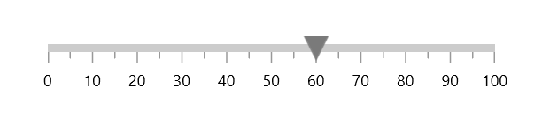
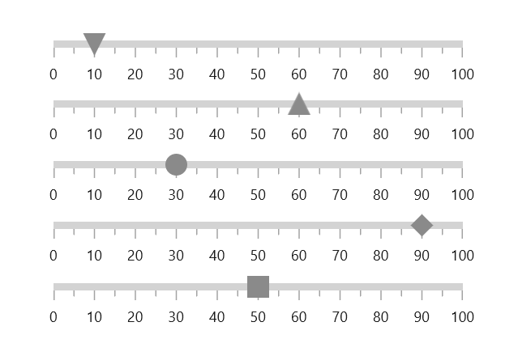
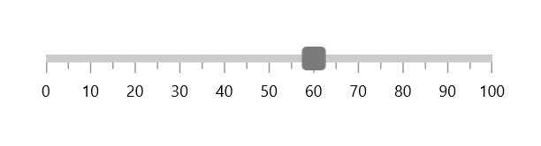
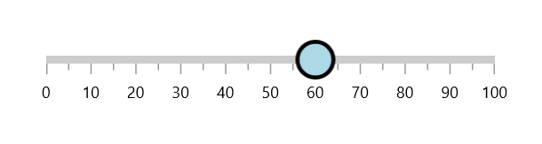
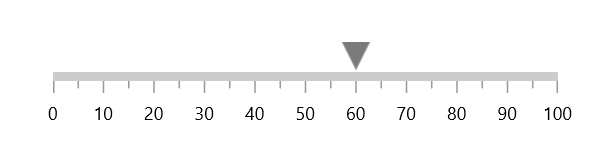

# Shape Pointer in WinUI Linear Gauge

Indicate current values by using the different types of shape pointers. You can change the shape type using the [`ShapeType`](https://help.syncfusion.com/cr/winui/Syncfusion.UI.Xaml.Gauges.GaugeShapeType.html) property.





<gauge:SfLinearGauge>
    <gauge:SfLinearGauge.Axis>
        <gauge:LinearAxis>
            <gauge:LinearAxis.MarkerPointers>
                <gauge:ShapePointer Value="60" />
            </gauge:LinearAxis.MarkerPointers>
        </gauge:LinearAxis>
    </gauge:SfLinearGauge.Axis>
</gauge:SfLinearGauge>





SfLinearGauge sfLinearGauge = new SfLinearGauge();

ShapePointer shapePointer = new ShapePointer();
shapePointer.Value = 60;
sfLinearGauge.Axis.MarkerPointers.Add(shapePointer);

this.Content = sfLinearGauge;





Gauge supports the following types of shape pointer:

* Circle
* Diamond
* Inverted triangle
* Triangle

## Custom shape pointer

You can add customized shapes to denote the current pointer value instead of in-built shape. It can be achieved by providing required shape in [`ShapeTemplate`](https://help.syncfusion.com/cr/winui/Syncfusion.UI.Xaml.Gauges.ShapePointer.html#Syncfusion_UI_Xaml_Gauges_ShapePointer_ShapeTemplate) property.





<Page.Resources>
    <DataTemplate x:Key="CustomShapePointer">
        <Grid>
            <Rectangle Fill="{Binding Fill}"
                       Stroke="{Binding Stroke}"
                       StrokeThickness="{Binding SrokeThickness}"
                       Width="{Binding ShapeHeight}"
                       Height="{Binding ShapeHeight}"
                       RadiusX="3"
                       RadiusY="3" />
        </Grid>
    </DataTemplate>
</Page.Resources>

<gauge:SfLinearGauge>
    <gauge:SfLinearGauge.Axis>
        <gauge:LinearAxis>
            <gauge:LinearAxis.MarkerPointers>
                <gauge:ShapePointer Value="60" 
                                    ShapeTemplate="{StaticResource CustomShapePointer}"/>
            </gauge:LinearAxis.MarkerPointers>
        </gauge:LinearAxis>
    </gauge:SfLinearGauge.Axis>
</gauge:SfLinearGauge>





SfLinearGauge sfLinearGauge = new SfLinearGauge();

ShapePointer shapePointer = new ShapePointer();
shapePointer.Value = 60;
shapePointer.ShapeTemplate = this.Resources["CustomShapePointer"] as DataTemplate;
sfLinearGauge.Axis.MarkerPointers.Add(shapePointer);

this.Content = sfLinearGauge;





## Shape customization

The shape pointer can be customized using the following properties:

* [`Fill`](https://help.syncfusion.com/cr/winui/Syncfusion.UI.Xaml.Gauges.ShapePointer.html#Syncfusion_UI_Xaml_Gauges_ShapePointer_Fill) – Allows to customize the shape color.
* [`Stroke`](https://help.syncfusion.com/cr/winui/Syncfusion.UI.Xaml.Gauges.ShapePointer.html#Syncfusion_UI_Xaml_Gauges_ShapePointer_Stroke) – Allows to specify the border color for the shape.
* [`StrokeThickness`](https://help.syncfusion.com/cr/winui/Syncfusion.UI.Xaml.Gauges.ShapePointer.html#Syncfusion_UI_Xaml_Gauges_ShapePointer_StrokeThickness) –  Allows to specify the border width of the shape.
* [`ShapeHeight`](https://help.syncfusion.com/cr/winui/Syncfusion.UI.Xaml.Gauges.ShapePointer.html#Syncfusion_UI_Xaml_Gauges_ShapePointer_ShapeHeight) – Allows to specify the shape height.
* [`ShapeWidth`](https://help.syncfusion.com/cr/winui/Syncfusion.UI.Xaml.Gauges.ShapePointer.html#Syncfusion_UI_Xaml_Gauges_ShapePointer_ShapeWidth) – Allows to specify the shape width.





<gauge:SfLinearGauge>
    <gauge:SfLinearGauge.Axis>
        <gauge:LinearAxis>
            <gauge:LinearAxis.MarkerPointers>
                <gauge:ShapePointer Value="60"
                                    ShapeHeight="30"
                                    ShapeWidth="30"
                                    Fill="LightBlue"
                                    Stroke="Black"
                                    StrokeThickness="3"
                                    ShapeType="Circle" />
            </gauge:LinearAxis.MarkerPointers>
        </gauge:LinearAxis>
    </gauge:SfLinearGauge.Axis>
</gauge:SfLinearGauge>





SfLinearGauge sfLinearGauge = new SfLinearGauge();

ShapePointer shapePointer = new ShapePointer();
shapePointer.Value = 60;
shapePointer.ShapeHeight = 30;
shapePointer.ShapeWidth = 30;
shapePointer.Fill = new SolidColorBrush(Colors.LightBlue);
shapePointer.Stroke = new SolidColorBrush(Colors.Black);
shapePointer.StrokeThickness = 3;
shapePointer.ShapeType = GaugeShapeType.Circle;
sfLinearGauge.Axis.MarkerPointers.Add(shapePointer);

this.Content = sfLinearGauge;





## Shape position customization

The shape pointer can be moved near or far from its actual position in X or Y direction using the [`OffsetPoint`](https://help.syncfusion.com/cr/winui/Syncfusion.UI.Xaml.Gauges.LinearMarkerPointer.html#Syncfusion_UI_Xaml_Gauges_LinearMarkerPointer_OffsetPoint) property. 

To move the pointer inside of the axis, provide positive values.

To move the pointer outside of the axis, provide negative values.





<gauge:SfLinearGauge>
    <gauge:SfLinearGauge.Axis>
        <gauge:LinearAxis>
            <gauge:LinearAxis.MarkerPointers>
                <gauge:ShapePointer Value="60"
                                    OffsetPoint="0,-25"/>
            </gauge:LinearAxis.MarkerPointers>
        </gauge:LinearAxis>
    </gauge:SfLinearGauge.Axis>
</gauge:SfLinearGauge>





SfLinearGauge sfLinearGauge = new SfLinearGauge();

ShapePointer shapePointer = new ShapePointer();
shapePointer.Value = 60;
shapePointer.OffsetPoint = new Point(0, -25);
sfLinearGauge.Axis.MarkerPointers.Add(shapePointer);

this.Content = sfLinearGauge;





### Shape pointer alignment

You can change the horizontal or vertical position of the shape pointer either start, end or center by using the [`HorizontalAnchor`](https://help.syncfusion.com/cr/winui/Syncfusion.UI.Xaml.Gauges.LinearMarkerPointer.html#Syncfusion_UI_Xaml_Gauges_LinearMarkerPointer_HorizontalAnchor) and [`VerticalAnchor`](https://help.syncfusion.com/cr/winui/Syncfusion.UI.Xaml.Gauges.LinearMarkerPointer.html#Syncfusion_UI_Xaml_Gauges_LinearMarkerPointer_VerticalAnchor) properties. The default value of [`HorizontalAnchor`](https://help.syncfusion.com/cr/winui/Syncfusion.UI.Xaml.Gauges.LinearMarkerPointer.html#Syncfusion_UI_Xaml_Gauges_LinearMarkerPointer_HorizontalAnchor) and [`VerticalAnchor`](https://help.syncfusion.com/cr/winui/Syncfusion.UI.Xaml.Gauges.LinearMarkerPointer.html#Syncfusion_UI_Xaml_Gauges_LinearMarkerPointer_VerticalAnchor) properties are center.





<gauge:SfLinearGauge>
    <gauge:SfLinearGauge.Axis>
        <gauge:LinearAxis>
            <gauge:LinearAxis.MarkerPointers>
                <gauge:ShapePointer Value="60"
                                    VerticalAnchor="End"
                                    OffsetPoint="0,-5" />
            </gauge:LinearAxis.MarkerPointers>
        </gauge:LinearAxis>
    </gauge:SfLinearGauge.Axis>
</gauge:SfLinearGauge>





SfLinearGauge sfLinearGauge = new SfLinearGauge();

ShapePointer shapePointer = new ShapePointer();
shapePointer.Value = 60;
shapePointer.VerticalAnchor = GaugeAnchor.End;
shapePointer.OffsetPoint = new Point(0, -5);
sfLinearGauge.Axis.MarkerPointers.Add(shapePointer);

this.Content = sfLinearGauge;





