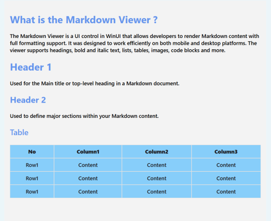

# Customize Appearance in WinUI SfMarkdownViewer

The [SfMarkdownViewer](https://help.syncfusion.com/cr/winui/Syncfusion.UI.Xaml.Markdown.SfMarkdownViewer.html) control in WinUI provides a powerful styling system through the [MarkdownStyleSettings](https://help.syncfusion.com/cr/winui/Syncfusion.UI.Xaml.Markdown.SfMarkdownViewer.html) class. This allows developers to customize the visual presentation of Markdown content with precision and flexibility.

## Customization with MarkdownStyleSettings

The appearance of headings and body content in [SfMarkdownViewer](https://help.syncfusion.com/cr/winui/Syncfusion.UI.Xaml.Markdown.SfMarkdownViewer.html) can be customized using the [MarkdownStyleSettings](https://help.syncfusion.com/cr/winui/Syncfusion.UI.Xaml.Markdown.SfMarkdownViewer.html) class.

* [H1Style](https://help.syncfusion.com/cr/winui/Syncfusion.UI.Xaml.Markdown.SfMarkdownViewer.html), [H2Style](https://help.syncfusion.com/cr/winui/Syncfusion.UI.Xaml.Markdown.SfMarkdownViewer.html), [H3Style](https://help.syncfusion.com/cr/winui/Syncfusion.UI.Xaml.Markdown.SfMarkdownViewer.html), [H4Style](https://help.syncfusion.com/cr/winui/Syncfusion.UI.Xaml.Markdown.SfMarkdownViewer.html), [H5Style](https://help.syncfusion.com/cr/winui/Syncfusion.UI.Xaml.Markdown.SfMarkdownViewer.html), [H6Style](https://help.syncfusion.com/cr/winui/Syncfusion.UI.Xaml.Markdown.SfMarkdownViewer.html) – Gets or sets the style for H1 to H6 heading elements respectively.

* [ParagraphStyle](https://help.syncfusion.com/cr/winui/Syncfusion.UI.Xaml.Markdown.SfMarkdownViewer.html) – Gets or sets the style for paragraph elements.

* [TableStyle](https://help.syncfusion.com/cr/winui/Syncfusion.UI.Xaml.Markdown.SfMarkdownViewer.html) – Gets or sets the style for table elements, including headers and data rows.

* [LinkStyle](https://help.syncfusion.com/cr/winui/Syncfusion.UI.Xaml.Markdown.SfMarkdownViewer.html) – Gets or sets the style for hyperlink elements.

* [MermaidStyle](https://help.syncfusion.com/cr/winui/Syncfusion.UI.Xaml.Markdown.SfMarkdownViewer.html) – Gets or sets the style for rendering Mermaid diagram content.

* [ListStyle](https://help.syncfusion.com/cr/winui/Syncfusion.UI.Xaml.Markdown.SfMarkdownViewer.html) – Gets or sets the style for ordered and unordered list elements.

* [InlineQuoteStyle](https://help.syncfusion.com/cr/winui/Syncfusion.UI.Xaml.Markdown.SfMarkdownViewer.html) – Gets or sets the style for inline quote (blockquote within text) elements.

* [CodeBlockStyle](https://help.syncfusion.com/cr/winui/Syncfusion.UI.Xaml.Markdown.SfMarkdownViewer.html) – Gets or sets the style for code block elements.

* [ThematicStyle](https://help.syncfusion.com/cr/winui/Syncfusion.UI.Xaml.Markdown.SfMarkdownViewer.html) – Gets or sets the style for thematic break (horizontal rule) elements.

* [BlockQuoteStyle](https://help.syncfusion.com/cr/winui/Syncfusion.UI.Xaml.Markdown.SfMarkdownViewer.html) – Gets or sets the style for block quote elements.

## Add MarkdownStyleSettings to the SfMarkdownViewer

 


<Grid>
    <syncfusion:SfMarkdownViewer x:Name="markdownviewer" Height="550" MaxWidth="900" Source={Binding MarkdownContent}>
        <syncfusion:SfMarkdownViewer.Settings>
            <syncfusion:MarkdownStyleSettings>
                <syncfusion:MarkdownStyleSettings.InlineQuoteStyle>
                    <syncfusion:InlineQuoteSettings Background="LightSkyBlue" >
                    </syncfusion:InlineQuoteSettings>
                </syncfusion:MarkdownStyleSettings.InlineQuoteStyle>
                <syncfusion:MarkdownStyleSettings.ParagraphStyle>
                    <syncfusion:ParagraphSettings FontStyle="Italic"/>
                </syncfusion:MarkdownStyleSettings.ParagraphStyle>
                <syncfusion:MarkdownStyleSettings.H1Style>
                    <syncfusion:HeaderSettings FontStyle="Normal" Foreground="CornflowerBlue"></syncfusion:HeaderSettings>
                </syncfusion:MarkdownStyleSettings.H1Style>
                <syncfusion:MarkdownStyleSettings.H2Style>
                    <syncfusion:HeaderSettings FontStyle="Normal" Foreground="CornflowerBlue"></syncfusion:HeaderSettings>
                </syncfusion:MarkdownStyleSettings.H2Style>
                <syncfusion:MarkdownStyleSettings.H3Style>
                    <syncfusion:HeaderSettings FontStyle="Normal" Foreground="Chocolate"></syncfusion:HeaderSettings>
                </syncfusion:MarkdownStyleSettings.H3Style>
                <syncfusion:MarkdownStyleSettings.H4Style>
                    <syncfusion:HeaderSettings FontStyle="Normal" Foreground="DarkKhaki"></syncfusion:HeaderSettings>
                </syncfusion:MarkdownStyleSettings.H4Style>
                <syncfusion:MarkdownStyleSettings.H6Style>
                    <syncfusion:HeaderSettings FontStyle="Italic" Foreground="#64748B"></syncfusion:HeaderSettings>
                </syncfusion:MarkdownStyleSettings.H6Style>
            </syncfusion:MarkdownStyleSettings>
        </syncfusion:SfMarkdownViewer.Settings>
    </syncfusion:SfMarkdownViewer>
</Grid>








The following output shows how these style settings enhance the appearance of rendered Markdown content:

