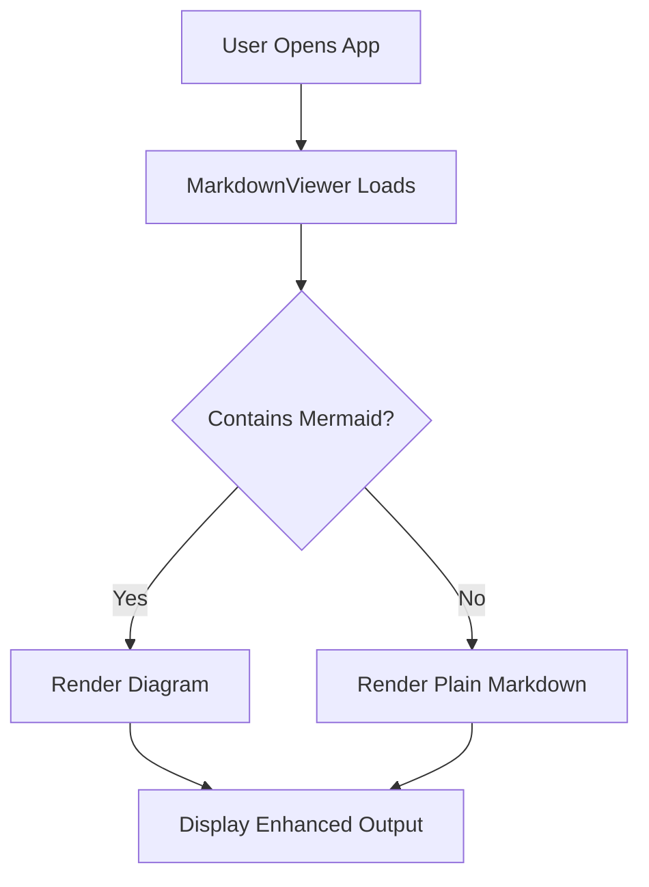

# Mermaid Diagram Support in WinUI Markdown Viewer
 
The `SfMarkdownViewer` control supports embedding Mermaid diagrams directly in Markdown content using simple text syntax. Mermaid code blocks defined in the `Source` property are automatically interpreted and rendered as visual diagrams.

## Rendering Mermaid Diagrams
 
Mermaid diagrams are created using fenced code blocks marked with the `mermaid` language inside Markdown content. When the viewer encounters these blocks, it converts the diagram definition into a graphical representation.

The following XAML and C# examples demonstrate how to assign Markdown content containing Mermaid syntax to the `SfMarkdownViewer` control using the `Source` property

 


<Grid>
    <syncfusion:SfMarkdownViewer>
        <syncfusion:SfMarkdownViewer.Source>
            <x:String xml:space="preserve">
                <![CDATA[

# Mermaid Flowchart

Mermaid flowcharts let you describe processes and decision trees in plain text. The viewer renders them into clear, interactive diagrams. 

---

                ]]>
            </x:String>
        </syncfusion:SfMarkdownViewer.Source>
    </syncfusion:SfMarkdownViewer>
</Grid>





namespace MarkdownViewerGettingStarted
{
    public partial class MainWindow : Window
    {
        public MainWindow()
        {
            InitializeComponent();
            SfMarkdownViewer markdownViewer = new SfMarkdownViewer();
            markdownViewer.Source =
@"
# Mermaid Flowchart

Mermaid flowcharts let you describe processes and decision trees in plain text. The viewer renders them into clear, interactive diagrams. 

---

            ";
            Content = markdownViewer;
        }
    }
}




