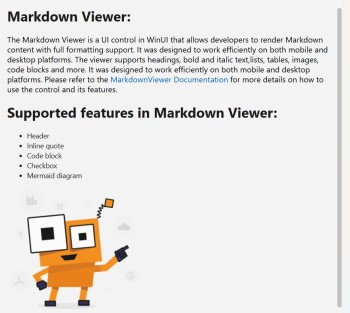

# Overview of WinUI Markdown Viewer (SfMarkdownViewer)

The [WinUI MarkdownViewer](https://help.syncfusion.com/cr/winui/Syncfusion.UI.Xaml.Markdown.SfMarkdownViewer.html) is a UI control that converts Markdown input into a fully formatted visual representation without requiring external rendering engines or manual formatting. It provides a flexible way to display rich Markdown content within WinUI applications, making it ideal for presenting documentation, release notes, help content, and other Markdown‑based information.

## Key Features

* **Markdown rendering** – Converts Markdown syntax such as headings, lists, links, images, tables, code blocks, block quotes, and more into styled, readable content.

* **Multiple content sources** – Supports loading Markdown from a string, file, or URL.

* **Hyperlink navigation** – Supports clickable links that open external URLs or trigger in-app navigation.

