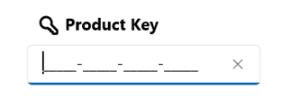

# Customization in WinUI Masked TextBox

This section explains the header, header template, and description of Masked TextBox.

## Header

The [Header](https://help.syncfusion.com/cr/winui/Syncfusion.UI.Xaml.Editors.SfMaskedTextBox.html#Syncfusion_UI_Xaml_Editors_SfMaskedTextBox_Header) property is used to display the title for the Masked TextBox control.




<syncfusion:SfMaskedTextBox Width="200"
                            MaskType="Simple"
                            Header="Product key"
                            Mask=">AAAAA-AAAAA-AAAAA-AAAAA" />




SfMaskedTextBox maskedTextBox = new SfMaskedTextBox();
maskedTextBox.Width = "200";
maskedTextBox.MaskType = MaskedTextBoxMaskType.Simple;
maskedTextBox.Header = "Product key";
maskedTextBox.Mask = ">AAAAA-AAAAA-AAAAA-AAAAA";




## Header template

By using the [HeaderTemplate](https://help.syncfusion.com/cr/winui/Syncfusion.UI.Xaml.Editors.SfMaskedTextBox.html#Syncfusion_UI_Xaml_Editors_SfMaskedTextBox_HeaderTemplate) property, you can customize the appearance of control's header. 




<syncfusion:SfMaskedTextBox Width="200" MaskType="Simple" Mask=">AAAAA-AAAAA-AAAAA-AAAAA">
    <syncfusion:SfMaskedTextBox.HeaderTemplate>
        <DataTemplate>
            <StackPanel Orientation="Horizontal">
                <Path Fill="Black" 
                        Data="M22.311 20.7506C22.311 17.5746 19.7364 15 16.5604 15C13.3845 15 10.8099 17.5746 10.8099 20.7506C10.8099 23.9265 13.3845 26.5011 16.5604 26.5011C16.8898 26.5011 17.2133 26.4733 17.5286 26.4198C17.7169 27.0177 18.2757 27.4512 18.9357 27.4512H19.3609V27.8764C19.3609 28.6911 20.0213 29.3515 20.836 29.3515H21.2611V29.7766C21.2611 30.5913 21.9215 31.2517 22.7362 31.2517H25.5249C26.3396 31.2517 27 30.5913 27 29.7766V27.5981C27 27.2069 26.8446 26.8317 26.568 26.5551L22.144 22.1311C22.2532 21.688 22.311 21.2254 22.311 20.7506ZM16.5604 17C18.6318 17 20.311 18.6792 20.311 20.7506C20.311 21.1292 20.2552 21.493 20.1521 21.8352C20.0027 22.3307 20.1036 22.9192 20.5208 23.3364L25 27.8156V29.2517H23.2611V28.8265C23.2611 28.0119 22.6007 27.3515 21.7861 27.3515H21.3609V26.9263C21.3609 26.1116 20.7005 25.4512 19.8858 25.4512H19.4147C19.1998 24.5974 18.2731 24.1788 17.5206 24.3773C17.2152 24.4579 16.8936 24.5011 16.5604 24.5011C14.4891 24.5011 12.8099 22.8219 12.8099 20.7506C12.8099 18.6792 14.4891 17 16.5604 17Z"/>
                <TextBlock Text="Product Key" Margin="5,12,0,0"/>
            </StackPanel>
        </DataTemplate>
    </syncfusion:SfMaskedTextBox.HeaderTemplate>
</syncfusion:SfMaskedTextBox>




## Description

The [Description](https://help.syncfusion.com/cr/winui/Syncfusion.UI.Xaml.Editors.SfMaskedTextBox.html#Syncfusion_UI_Xaml_Editors_SfMaskedTextBox_Description) support is used to display the content beneath the control as well as to provide guidance on the input that the control expects.




<syncfusion:SfMaskedTextBox Width="200"
                            MaskType="Simple"
                            Description="Plaese enter a valid product key"
                            Mask=">AAAAA-AAAAA-AAAAA-AAAAA" />




SfMaskedTextBox maskedTextBox = new SfMaskedTextBox();
maskedTextBox.Width = "200";
maskedTextBox.MaskType = MaskedTextBoxMaskType.Simple;
maskedTextBox.Description = "Plaese enter a valid product key";
maskedTextBox.Mask = ">AAAAA-AAAAA-AAAAA-AAAAA";




