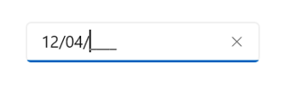

# Getting Started with WinUI SfMaskedTextBox

This section explains the steps required to add the WinUI MaskedTextBox control and covers the basic features needed to get started with Syncfusion `MaskedTextBox` control.

## Creating an application with WinUI MaskedTextBox control

1. Create a [WinUI 3 desktop app for C# and .NET 5](https://docs.microsoft.com/en-us/windows/apps/winui/winui3/get-started-winui3-for-desktop).
2. Add reference to [Syncfusion.Editors.WinUI](https://www.nuget.org/packages/Syncfusion.Editors.WinUI) NuGet. 
3. Import the control namespace `Syncfusion.UI.Xaml.Editors` in XAML or C# code.
4. Initialize the `MaskedTextBox` control.

## Initialize MaskedTextBox control using Simple mask




<Page
    x:Class="GettingStarted.MainPage"
    xmlns="http://schemas.microsoft.com/winfx/2006/xaml/presentation"
    xmlns:x="http://schemas.microsoft.com/winfx/2006/xaml"
    xmlns:local="using:GettingStarted"
    xmlns:d="http://schemas.microsoft.com/expression/blend/2008"
    xmlns:mc="http://schemas.openxmlformats.org/markup-compatibility/2006"
    xmlns:syncfusion="using:Syncfusion.UI.Xaml.Editors"
    mc:Ignorable="d"
    Background="{ThemeResource ApplicationPageBackgroundThemeBrush}">
    <Grid>
        <!--Adding SfMaskedTextBox control with Simple mask.-->
        <syncfusion:SfMaskedTextBox x:Name="sfMaskedTextBox"
                                    MaskType="Simple"
                                    Mask="00/00/0000" />
    </Grid>
</Page>




// Creating an instance of the MaskedTextBox control.
SfMaskedTextBox maskedTextBox = new SfMaskedTextBox();
maskedTextBox.MaskType = MaskedTextBoxMaskType.Simple;
sfMaskedText.Mask = "00/00/0000";




## Initialize MaskedTextBox control using RegEx mask




<Page
    x:Class="GettingStarted.MainPage"
    xmlns="http://schemas.microsoft.com/winfx/2006/xaml/presentation"
    xmlns:x="http://schemas.microsoft.com/winfx/2006/xaml"
    xmlns:local="using:GettingStarted"
    xmlns:d="http://schemas.microsoft.com/expression/blend/2008"
    xmlns:mc="http://schemas.openxmlformats.org/markup-compatibility/2006"
    xmlns:syncfusion="using:Syncfusion.UI.Xaml.Editors"
    mc:Ignorable="d"
    Background="{ThemeResource ApplicationPageBackgroundThemeBrush}">
    <Grid>
        <!--Adding SfMaskedTextBox control with RegEx mask type.-->
        <syncfusion:SfMaskedTextBox x:Name="sfMaskedTextBox"
                                    MaskType="RegEx"
                                    Mask="[A-Za-z0-9._%-]+@[A-Za-z0-9]+.[A-Za-z]{2,3}" />
    </Grid>
</Page>




// Creating an instance of the MaskedTextBox control.
SfMaskedTextBox maskedTextBox = new SfMaskedTextBox();
maskedTextBox.MaskType = MaskedTextBoxMaskType.RegEx;
sfMaskedText.Mask = "[A-Za-z0-9._%-]+@[A-Za-z0-9]+.[A-Za-z]{2,3}";




