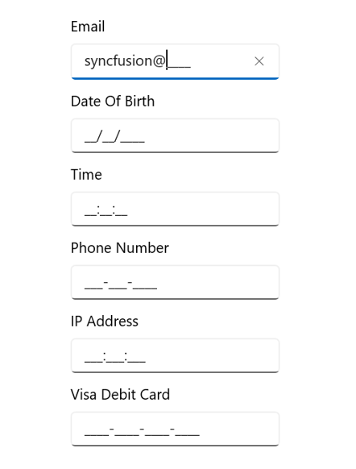

# WinUI Masked TextBox Overview

The [WinUI Masked TextBox](https://www.syncfusion.com/winui-controls/masked-textbox) is an advanced version of the input control that restricts input of certain characters, text, and numbers by using a mask pattern. This control is used to create a template for providing information such as telephone numbers, email IDs, IP addresses, product keys, and so on.

## Key features

* `MaskType`: The input can be masked with a fixed or variable length by setting the mask type to simple or regex, respectively.
* `PromptChar`: Customize the prompt character used to indicate the absence of input. The default value is `_`.
* `Value`: Enter values in the control. The format of the value can be controlled using the `ValueMaskFormat` property.
* `ValueMaskFormat`: Format the value using mask format values such as prompt, literals, and both.
* `Error Indication`: Indicates errors or other information by displaying an icon and showing additional details when hovering the cursor over the icon.
